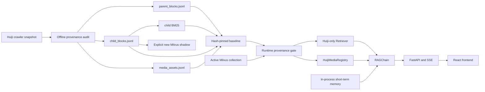

# 1999Search 架构

## 当前架构

RAG 只接受 `Huiji crawler` 来源。`config/provenance/huiji-dev.v1.json` 固定 raw snapshot、processed artifacts、BM25 与活动 Milvus collection 的身份；启动前 verifier 负责 fail-closed。

## 模块职责

| 模块 | 职责 |
|---|---|
| `config/` | 单一运行配置和已安装 provenance baseline |
| `src/huiji_rag/` | crawler snapshot 规范化、artifact 构建、审计和严格 MinIO 操作 |
| `src/rag/query_plan.py` | 实体解析、意图与多意图规划 |
| `src/rag/retriever.py` | structured/BM25/dense 融合、ownership、预算和展开 |
| `src/assets/huiji_registry.py` | 当前媒体绑定和语音分页 |
| `src/rag/vectorstore.py` | 活动 collection 查询与 create-new shadow 构建 |
| `src/rag/chain.py` | 路由、检索、引用、媒体与回答生成 |
| `src/rag/conversation.py` | 非持久化的短期对话投影 |
| `backend/` | health-only 启动门禁、HTTP、SSE 与媒体接口 |
| `frontend/react-app/` | 当前交互界面 |

## 运行时不变量

1. `huiji.enabled` 必须为 `true`，`huiji.source_mode` 必须为 `huiji_crawler`。
2. 缺失或空 Huiji child artifact 是初始化错误，不触发替代语料检索。
3. RAGChain 始终使用 `HuijiMediaRegistry`。
4. 活动 collection 只读；构建只能针对不存在的新 shadow 名称。
5. MinIO `a-bucket` 由 Milvus 管理，业务清理不得修改。
6. 会话记忆只在当前后端进程内保存，不作为事实证据。

## 历史架构

早期本地 Markdown/Obsidian 语料链路已经退休，相关运行入口、资产 registry、文档 loader 和 destructive build API 均已移除。历史证据仍可保留在 `eval/**` 与旧 specs 中，但不属于可执行图，也不是当前故障回滚方案。

## 启动顺序

1. 启动 Milvus、MinIO 和 MySQL。
2. 运行 `scripts/verify_huiji_runtime.py`。
3. verifier 通过后加载 `MilvusVectorstore`、`Retriever` 与 `RAGChain`。
4. 启动 FastAPI；失败时只开放健康诊断，问答与媒体接口返回 503。
5. 前端在后端健康后启动。

索引重建与 baseline 安装使用 [huiji-rag-runbook.md](huiji-rag-runbook.md) 的独立离线流程。
