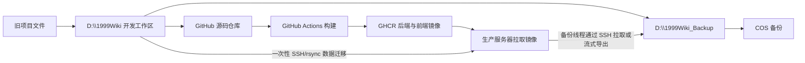

# 1999Wiki 项目迁移、容器发布与蓝绿部署规范（初稿）

> 状态：Draft / 初稿（本地迁移基线准备完成）  
> 版本：v0.3  
> 日期：2026-07-23  
> 目标仓库：`git@github.com:DDomelette/1999Wiki.git`  
> 本地工作区：`D:\1999Wiki`  
> 旧项目来源：`D:\PycharmProjects\nlp\LangChain\1999Search`  

## 1. 文档目的

本规范定义 1999Wiki 从旧工作区迁移到独立 Git 仓库、构建并发布 Docker 镜像、在云服务器上执行蓝绿部署与快速回滚的初步方案。

本轮规范重点固定以下不随前端迭代轻易变化的边界：

1. `D:\1999Wiki` 成为唯一有效开发工作区。
2. 新 GitHub 仓库成为唯一有效源码仓库。
3. 后端和前端分别构建不可变 GHCR 镜像。
4. 服务器只运行程序，不承担源码开发、镜像构建或 COS 备份任务。
5. 运行所需的数据库、向量数据和媒体常驻服务器本地持久卷。
6. COS 仅作为服务器外部的备份目标，服务器不主动访问 COS。
7. 大版本采用蓝绿方式发布，支持新旧应用短暂并存、原子切换和快速回退。
8. 备份流程由独立线程维护，本规范只定义部署与备份流程之间的最小衔接契约。

RAG、Wiki 与当前前端迭代已经形成可运行基线。本规范仍为初稿，但后续调整必须以本轮完整迁移副本、活动构建清单和测试结果为基准，不再回到旧目录直接修改。

## 2. 术语与约束级别

- **必须**：上线前不可省略的要求。
- **应当**：默认执行；只有明确证据支持时才可偏离。
- **可以**：实现方式可选。
- **待定**：尚未最终确认，后续通过实现或测试收敛。
- **基础设施层**：MySQL、MinIO、etcd、Milvus 及其持久数据。
- **应用层**：1999Wiki Backend 和 Frontend。
- **槽位**：蓝绿部署中的 `blue` 或 `green` 应用运行环境。
- **发布版本**：由一个 Git commit、两个镜像摘要和一份部署清单共同定义的不可变版本。

## 3. 已确认决策

### 3.1 开发与源码

- 日常开发只在 `D:\1999Wiki` 进行。
- 旧项目的 Git 状态不再使用，不迁移旧 `.git` 历史。
- 旧项目仅作为一次性的文件迁移来源。
- 当前目标仓库已经存在初始提交 `a3b1541`，内容仅为初始 README。
- 源码迁移完成后必须产生新的迁移提交；正式镜像标签应使用该提交的短 SHA，而不是继续复用仅含 README 的 `a3b1541`。
- 开发过程中按需提交并推送 GitHub；大版本发布以已推送的确定 commit 为输入。

### 3.2 本地快照与 COS

- 本地快照目标为 `D:\1999Wiki_Backup`。
- 本地快照和 COS 上传由独立备份线程负责。
- 服务器不安装 COSCLI，不保存 COS SecretID/SecretKey，不挂载 COS，也不从 COS 拉取启动数据。
- 原始爬虫数据直接由本地备份流程上传 COS，不进入生产服务器。
- 服务器运行数据的外部备份由备份线程通过 SSH 拉取或流式导出到本地后，再上传 COS。

### 3.3 服务器角色

- 服务器只运行生产程序。
- 服务器不克隆开发源码，不运行测试，不构建镜像。
- 服务器不安装 Node.js、npm、conda、Playwright、Codex CLI 或其他开发工具。
- 服务器允许访问 GHCR 以拉取镜像；私有镜像使用仅含 `read:packages` 权限的凭据。
- 服务器通过 SSH 接受部署、切换、回滚和只读诊断操作。

### 3.4 运行数据

- 线上媒体常驻服务器，以减小终端访问延迟并避免 COS 流量消耗。
- MySQL、Milvus、etcd、MinIO 和 RAG 运行产物均使用独立持久目录，不进入应用镜像。
- 原始爬虫素材、浏览器 profile、历史迁移副本和评估现场不进入服务器。
- Milvus Standalone 在当前低访问量、低数据量场景下按实测结果上线，不因官方建议配置直接否决。
- Attu 不属于默认生产服务。

## 4. 当前基线

### 4.1 服务器

| 项目 | 当前值 |
|---|---|
| 操作系统 | Ubuntu 24.04.4 LTS |
| CPU | 4 核 AMD EPYC |
| 可见内存 | 约 3.6 GiB |
| Swap | 约 1.9 GiB |
| 系统盘 | 40 GB |
| 当前可用磁盘 | 约 28 GB |
| Docker | 已安装 |
| Docker Compose | 已安装 |
| 入口网关 | 宿主机 Caddy，当前监听 80 |
| 防火墙 | 开放 22、80、443 |
| 当前业务容器 | 无 |

### 4.2 当前有效数据规模

2026-07-23 对完整副本和在线服务重新盘点后的基线如下：

| 数据 | 实测值 | 迁移归属 |
|---|---:|---|
| 完整旧项目副本 | 43.481 GB，179,230 个文件 | 仅本地工作区与本地/COS 备份 |
| `data/huiji/res1999` 原始爬虫源 | 约 21 GB | COS 备份，不上服务器 |
| `data/processed/huiji` 全部处理产物 | 约 1.97 GB | 本地/COS；服务器只取活动运行闭包 |
| 活动构建 `crawler-v3-20260721t051246z` | 约 335 MB；其中运行必要闭包约 213 MB | 服务器本地只读目录 |
| `reverse1999-assets` | 21,306 对象，4,810,943,653 bytes（约 4.48 GiB） | 服务器 MinIO 常驻 |
| Milvus `a-bucket` | 244 对象，466,775,335 bytes（约 445 MiB） | 由 Milvus 备份/恢复流程管理 |
| MySQL 逻辑数据 | 约 140.72 MiB | 服务器 MySQL 常驻 |
| `frontend/react-app/public` | 17 个生产引用文件，约 168.21 MiB | 作为前端壳层资源进入 Git/Frontend 镜像；MP4 使用 Git LFS |
| `infra/milvus/volumes` | 约 16.59 GB | 含 3 份 MinIO 历史/切换副本，不得整体照搬生产 |
| 当前 Git 可跟踪基线 | 768 文件，工作区约 181.76 MiB | 其中 `pv.mp4` 约 111.51 MiB 使用 Git LFS |

当前活动数据身份：

- RAG build：`crawler-v3-20260721t051246z`。
- 活动 Milvus collection：`text_child_bge_m3_shadow_crawler_v3_20260721t051246z`，14,630 行。
- 回滚 collection：`text_child_bge_m3_v3`，16,010 行；观察期前不得删除。
- MySQL：7,456 页面、4 个 Wiki 分类、19,132 媒体资源、19,400 媒体绑定、17,527 媒体链接。
- 活动 schema：`evb.media-asset/v3`；activation epoch：`1`。

原始爬虫素材、历史评测现场、重复 MinIO 目录和浏览器 profile 不进入服务器。生产容量估算必须按“逻辑有效数据”计算，不能把本地 16.59 GB 的历史卷目录直接当作生产必需量。

### 4.3 本轮完整搬迁记录与基线验证

本轮采用“完整副本优先”迁移：

- 来源：`D:\PycharmProjects\nlp\LangChain\1999Search`。
- 目标：`D:\1999Wiki`。
- 复制结果：179,229 个文件实际复制、0 失败、43.481 GB；目标原有 `.git` 与 Codex spec 作为 extra 保留。
- 旧项目中不存在 `.git`，因此没有旧历史混入新仓库。
- 为得到一致的基础设施卷快照，复制前仅停止旧项目 MySQL、MinIO、etcd、Milvus、Attu；复制后全部恢复。
- Milvus 首次随 etcd 同时恢复时出现一次 etcd 连接超时退出；etcd 健康后单独重启即恢复。生产 Compose 必须补健康依赖和自动重启策略。

迁移后从 `D:\1999Wiki` 得到的验证结果：

- 活动指针声明的 `build_manifest.json` 哈希通过。
- 清单内 16 个活动制品全部通过声明 SHA256 校验，且与来源副本逐文件一致。
- `scripts/verify_huiji_runtime.py`：`status=pass`。
- Python：`1360 passed, 2 skipped`。
- Frontend：49 个测试文件、235 个测试全部通过。
- Frontend：TypeScript 与 Vite production build 成功；当前仅有单 chunk 大于 500 kB 的性能提示。
- 临时从新目录启动 Backend 成功：`/health`、`/api/wiki/health`、`/categories`、`/api/wiki/pages?limit=1` 均返回 200。
- Backend 实测加载 14,630 条向量；Wiki health 返回 7,456 页面和上述媒体计数。
- `pip check` 无断裂依赖，但 `requirements.txt` 与实际环境发生版本漂移，例如声明 `markdown-it-py==2.2.0`、实际运行版本为 `4.2.0`；容器化前必须锁定可复现依赖。

## 5. 总体工作流



关键约束：

- `Server -> COS` 的主动访问链路不存在。
- `Server -> GHCR` 仅用于拉取不可变镜像。
- 大文件运行数据通过本地到服务器的一次性或增量 SSH 传输完成。
- 应用升级只更新应用镜像，不重复传输媒体与数据库。

## 6. 目标仓库结构

以下结构是容器化后的目标结构，不代表完整迁移副本当前已经修剪完成；部署入口和职责边界必须保持稳定。

```text
1999Wiki/
├─ backend/                         # FastAPI 入口与 API
├─ src/                             # RAG、Wiki、存储与业务模块
├─ config/                          # 配置模型与非敏感默认值
├─ frontend/
│  └─ react-app/                    # 当前 React 前端，结构待迭代
├─ infra/
│  ├─ docker/
│  │  ├─ Dockerfile.backend
│  │  ├─ Dockerfile.frontend
│  │  ├─ compose.infra.yml
│  │  ├─ compose.app.yml
│  │  └─ frontend.Caddyfile
│  ├─ mysql/
│  │  └─ migrations/
│  └─ milvus/
│     └─ milvus.yaml
├─ deploy/
│  ├─ scripts/
│  │  ├─ deploy.sh
│  │  ├─ switch.sh
│  │  ├─ rollback.sh
│  │  ├─ cleanup.sh
│  │  └─ smoke-test.sh
│  └─ caddy/
│     └─ 1999wiki.caddy
├─ requirements/
│  ├─ runtime.txt
│  ├─ dev.txt
│  └─ lock.txt
├─ tests/
├─ docs/
│  └─ codex/specs/
├─ .github/workflows/
│  └─ release-images.yml
├─ .dockerignore
├─ .env.example
└─ README.md
```

## 7. 源码迁移规范

### 7.1 迁移方式

- 必须保留 `D:\1999Wiki\.git`，不得用旧项目目录覆盖目标仓库根目录。
- 不得复制旧项目或旧父仓库的 `.git`。
- 第一阶段必须先把旧项目完整复制到 `D:\1999Wiki`，不在旧目录执行修剪、重命名、配置改造或容器化修改。
- 完整复制不得使用会删除目标 extra 文件的 `/MIR`；本轮使用 `/E /COPY:DAT /DCOPY:DAT /XJ /R:2 /W:2 /MT:16`，并显式排除来源 `.git`。
- 复制运行中的数据库卷前必须停止本项目对应基础设施服务；不得停止或修改不属于本项目的容器。
- 完成复制后必须先恢复旧环境并确认健康，再开始目标目录校验。
- 第二阶段所有修剪和修改只在 `D:\1999Wiki` 中进行，使每一步都能由新 Git 仓库记录和回退。
- 旧目录在新工作区验收和首个有效源码提交完成前保持只读回退源，不得主动清理。

### 7.2 完整本地副本应包含的内容

- 旧项目全部源码、文档、测试、脚本和配置。
- 当前本地 `.env`、`.local` 与 credential 文件，仅用于迁移后本地验收；必须继续被 Git 忽略。
- 原始爬虫数据、处理产物、活动 RAG build 和全部评测证据。
- MySQL、MinIO、etcd、Milvus 本地卷的停机一致副本。
- Frontend 源码、`public` 资源、`node_modules` 与已有构建结果。
- 旧备份、日志、设计参考和历史迁移现场。

完整副本的目的不是把上述内容全部提交或部署，而是先消除“在唯一旧源码上直接删改”的不可恢复风险。

### 7.3 本地保留但不应进入 Git 的内容

- `.env`
- `.local/` 与 credential/profile
- `data/huiji/`、`data/processed/`、`data/external/`
- `backups/`
- `vectorstore/`
- `infra/milvus/volumes/`
- 所有 `node_modules/`、`dist/`、`.vitest/`
- 已从 `frontend/react-app/public/` 删除且无生产引用的 495 个旧资源；剩余 17 个必要资源必须跟踪，不能继续被整体忽略
- `frontend/react-app/test-results/`、`playwright-report/`
- `eval/` 生成证据；仅保留稳定评测输入白名单
- `logs/`、`*.log`、`recovery-*.txt`
- `.pytest_cache/`、`.ruff_cache/`、`__pycache__/`
- 浏览器 profile、Cookie、缓存和临时日志
- 本地私钥、Codex 认证文件、COS 凭据

本轮 `.gitignore` 已建立上述边界，但“被忽略”不等于“已删除”。后续修剪必须分批提交，不得一次性删除 43 GB 副本后再判断用途。

### 7.4 迁移提交门禁

首次源码迁移提交前必须完成：

1. Git 忽略规则检查。
2. 密钥和敏感文件扫描。
3. Windows 绝对路径扫描；当前生产代码命中仅为 Windows 爬虫对 Edge 默认安装路径的兼容探测，必须与服务器运行镜像隔离。
4. `127.0.0.1:9002`、`127.0.0.1:19600` 等本地地址清点并改成容器环境变量。
5. 后端测试。
6. 前端测试与生产构建。
7. Docker build context 大小检查。
8. `git status` 人工复核。

本轮安全扫描结果：Git 候选中没有超过 100 MiB 的文件、没有大小写冲突；3 个敏感模式命中均为诊断文件名或测试占位值，没有发现真实密钥。正式提交前仍必须在 staged 内容上再次扫描。

### 7.5 容器化前必须解决的代码与配置阻断项

1. `config/settings.yaml` 仍固定使用 `http://127.0.0.1:19600`、`127.0.0.1:9002` 和 `http://127.0.0.1:9002`；当前配置加载器只支持 MySQL 和凭据的环境覆盖，必须增加 Milvus URI、MinIO 内部 endpoint、媒体 public base URL 等覆盖项。
2. 活动媒体制品与 MySQL 现有媒体 URL 包含 `http://127.0.0.1:9002/...`。生产传输层必须由 `object_key` 结合正式媒体基址生成 URL，不得修改已被清单哈希固定的活动制品来“就地替换字符串”。
3. `backend/main.py::_count_by_category` 对每个分类执行 `limit=100000`，超过 Milvus 2.5 的 16,384 查询窗口。当前 `/categories` 会返回 200，但连续写错误日志并把真实计数降级为 0；必须改为 count/分批聚合并增加真实 Milvus 集成测试。
4. Python 依赖不可复现：当前单一 `requirements.txt` 混合运行、开发、浏览器和 UI 依赖，且本地环境与声明版本漂移。必须拆分 runtime/dev 并生成锁文件。
5. 完整 Compose 恢复时 Milvus 可能早于 etcd 可连接而退出。生产配置必须使用健康依赖、合理启动探针和 `restart: unless-stopped`，并完成整机重启演练。
6. **已完成**：`frontend/react-app/public` 已按生产引用清点并删除 495 个未引用文件（约 451.21 MiB），保留 17 个必要壳层资源（约 168.21 MiB）。其中 111.51 MiB 的 `videos/pv.mp4` 使用 Git LFS，其他资源使用普通 Git；干净 checkout 必须能取得 LFS 对象并完成前端构建。

## 8. 镜像规范

### 8.1 镜像名称

固定仓库名：

```text
ghcr.io/ddomelette/1999wiki-backend
ghcr.io/ddomelette/1999wiki-frontend
```

固定标签格式：

```text
sha-<7位Git短SHA>
```

当前仓库 HEAD 对应的格式示例：

```text
ghcr.io/ddomelette/1999wiki-backend:sha-a3b1541
ghcr.io/ddomelette/1999wiki-frontend:sha-a3b1541
```

`a3b1541` 仅对应当前初始 README 提交。正式迁移版本必须使用实际迁移提交的 SHA。

### 8.2 不可变性

- 同一个 `sha-xxxxxxx` 标签不得覆盖推送不同内容。
- 生产 Compose 必须引用 SHA 标签，不得只引用 `latest`。
- 发布清单必须记录镜像 digest。
- 回滚必须按旧 SHA 或旧 digest 执行。

### 8.3 Backend 镜像

Backend 镜像应使用多阶段构建并只包含：

- Backend、`src`、必要 config。
- 生产 Python 依赖。
- 必要数据库 migration。
- 健康检查客户端。

构建输入必须来自锁定的 Python 3.11 runtime 依赖；不得依赖开发机 Conda 环境中“碰巧已安装”的版本。

不得包含：

- tests、eval 运行结果、Playwright、Streamlit、Gradio。
- 原始数据、媒体、MySQL/Milvus/MinIO 数据。
- `.env` 和凭据。
- 本地虚拟环境。

生产初始配置使用单 Uvicorn worker，避免在蓝绿并存时重复放大 RAG/BM25 内存。

### 8.4 Frontend 镜像

Frontend 镜像应使用 Node 构建阶段和轻量静态运行阶段。

运行镜像只包含：

- React 生产构建产物。
- SPA fallback 配置。
- API/SSE 反向代理配置。
- 必要字体、图标、Logo、背景和占位图。

不得包含：

- `node_modules` 构建目录。
- 角色立绘、语音、视频等批量媒体。
- 测试结果、Playwright 浏览器和开发服务器日志。

当前构建命令已经验证为 `npm run build`（`tsc && vite build`）。在 GitHub Actions 启用前，必须先完成 `public` 使用清单；CI 从 Git checkout 构建的结果不能依赖工作区中被 `.gitignore` 排除的本地媒体。

## 9. GitHub Actions 与 GHCR

### 9.1 触发策略

大版本镜像发布默认采用手动触发 `workflow_dispatch`。后续可以增加 Git tag 触发，但普通开发 push 不应自动部署生产服务器。

### 9.2 构建流程

1. 检出明确 commit。
2. 计算 7 位短 SHA。
3. 安装锁定依赖；Frontend 使用 `npm ci`，Backend 使用固定 Python 版本与哈希/版本锁。
4. 运行后端测试。
5. 运行前端测试与生产构建。
6. 构建 Backend 镜像。
7. 构建 Frontend 镜像。
8. 推送两个 `sha-<short-sha>` 标签到 GHCR。
9. 读取并记录两个镜像 digest。
10. 输出发布清单供服务器部署使用。

### 9.3 发布清单

每次大版本至少记录：

```text
release_sha=<full git sha>
image_tag=sha-<short sha>
backend_image=ghcr.io/ddomelette/1999wiki-backend:<tag>
backend_digest=sha256:<digest>
frontend_image=ghcr.io/ddomelette/1999wiki-frontend:<tag>
frontend_digest=sha256:<digest>
built_at=<utc timestamp>
```

## 10. 服务器目录规范

```text
/opt/1999wiki/
├─ infra/
│  └─ compose.infra.yml
├─ app/
│  └─ compose.app.yml
├─ releases/
│  ├─ sha-old/
│  │  ├─ release.env
│  │  └─ release.manifest
│  └─ sha-new/
│     ├─ release.env
│     └─ release.manifest
├─ deploy/
│  ├─ deploy.sh
│  ├─ switch.sh
│  ├─ rollback.sh
│  ├─ cleanup.sh
│  └─ smoke-test.sh
└─ state/
   ├─ active-slot
   └─ active-release

/etc/1999wiki/
├─ app.env
├─ mysql.env
├─ minio.env
└─ ghcr.env

/srv/1999wiki/
├─ mysql/
├─ milvus/
├─ etcd/
├─ minio/
├─ rag-artifacts/
└─ import-staging/
```

权限要求：

- `/etc/1999wiki/*.env` 必须限制为部署账户或 root 可读。
- `/srv/1999wiki` 必须按容器 UID/GID 设置最小可用权限。
- 发布脚本不得在日志中输出任何完整凭据。

## 11. 基础设施层

`compose.infra.yml` 管理长期服务：

- MySQL
- MinIO
- etcd
- Milvus Standalone

基础设施层独立于应用发布生命周期：

- Backend/Frontend 发布不重建基础设施容器。
- 删除旧应用版本不得删除基础设施 volume 或 bind mount。
- `docker compose down -v` 不得用于生产部署或回滚流程。
- Attu 默认不启动；需要时仅通过 SSH 隧道或本机环回地址临时启用。

### 11.1 MinIO bucket

```text
a-bucket                 # Milvus 私有对象数据
reverse1999-assets       # 网站媒体
```

- `a-bucket` 必须保持私有。
- `reverse1999-assets` 通过 Caddy 提供受控公网读取。
- MinIO Console 不得暴露公网。
- 应禁止应用启动时无条件修改备份相关 bucket ACL。
- 媒体和 Milvus 数据必须通过对象级迁移或一致性备份迁移，不直接复制运行中的不一致目录。
- 当前两个 bucket 均未启用 versioning；迁移目标是保留当前对象、内容哈希和自定义元数据，不声称保留不存在的版本历史。
- `reverse1999-assets` 的迁移必须输出源/目标对象数、总字节数、对象键清单哈希和媒体抽样结果；bucket policy/config 另行导出并恢复。
- `a-bucket` 不作为普通媒体 bucket 手工搬运，优先由 Milvus Backup 统一保护 collection 与对象存储一致性。

### 11.2 Milvus

- 部署模式为 Standalone。
- 只保留并加载生产需要的 collection。
- 历史 collection 应在确认无回滚需要后清理。
- 向量 schema 或构建版本发生破坏性变化时，应创建新 collection，而不是原地覆盖。
- 冷启动健康检查应允许 Milvus 充分恢复；具体超时待实测确定。
- 初迁使用与源端同为 2.5 系列的目标 Milvus，并采用 [Milvus Backup 官方流程](https://milvus.io/docs/milvus_backup_overview.md) 备份和恢复活动 collection 与回滚 collection；不得把正在运行的 `a-bucket`/etcd 目录直接打包冒充逻辑备份。

## 12. 应用层与蓝绿槽位

### 12.1 槽位设计

| 槽位 | Frontend 宿主机端口 | Backend 诊断端口 | 用途 |
|---|---:|---:|---|
| blue | `127.0.0.1:18080` | `127.0.0.1:18000`（暂定） | 当前或候选版本 |
| green | `127.0.0.1:18081` | `127.0.0.1:18001`（暂定） | 当前或候选版本 |

Backend 可以仅对 Frontend 所在 Docker 网络开放；是否保留宿主机诊断端口由部署实现阶段决定。

### 12.2 共享关系

- Blue 和 Green 共享同一套 MySQL、Milvus、MinIO 和 RAG 数据。
- Blue 和 Green 不共享应用容器文件系统。
- Frontend 必须代理到同槽位 Backend，避免新前端误连旧后端或反之。
- 两个 Backend 均使用单 worker。

### 12.3 Caddy 切换

宿主机 Caddy 只代理到当前活动 Frontend 槽位：

```text
活动 blue：Caddy -> 127.0.0.1:18080
活动 green：Caddy -> 127.0.0.1:18081
```

切换必须执行：

1. 生成候选配置。
2. `caddy validate`。
3. 原子替换活动 upstream 配置。
4. `caddy reload`。
5. 从公网入口再次验证首页、API、SSE 和媒体。

## 13. 大版本部署流程

### 13.1 前置条件

- 目标源码 commit 已推送 GitHub。
- Backend 和 Frontend 镜像已推送 GHCR。
- 镜像 digest 已记录。
- 服务器磁盘、内存和 Docker 状态通过预检。
- 当前活动槽位与旧版本清晰可辨。
- 如包含潜在破坏性数据迁移，备份线程已确认可恢复点。

### 13.2 部署步骤

1. 确定空闲槽位。
2. 在服务器创建新发布目录和 `release.env`。
3. 使用只读 GHCR 凭据拉取两个新镜像。
4. 启动候选 Backend 和 Frontend。
5. 等待容器 healthcheck 通过。
6. 执行基础设施连通性检查。
7. 执行候选槽位冒烟测试。
8. 检查内存、swap、磁盘和容器重启次数。
9. 验证并切换 Caddy upstream。
10. 从正式入口执行切换后冒烟测试。
11. 写入 `active-slot` 和 `active-release`。
12. 停止旧应用容器，但暂不删除旧容器和旧镜像。
13. 进入观察期。

### 13.3 冒烟测试

至少覆盖：

- Frontend 首页返回 200。
- SPA 深层路由刷新可用。
- Backend `/health` 正常。
- MySQL 查询成功。
- Milvus collection 可查询且文档数合理。
- MinIO 随机媒体对象可读取。
- Wiki 列表与详情 API 正常。
- RAG 普通问答正常。
- SSE 流式响应可完整结束。
- 图片、语音等关键媒体可从正式域名访问。

## 14. 回滚流程

观察期内旧应用容器和镜像必须保留。

发现阻断性问题时：

1. 确认旧槽位镜像和配置仍存在。
2. 启动旧 Backend 和 Frontend（如已停止）。
3. 对旧槽位执行快速健康检查。
4. 验证 Caddy 旧 upstream 配置。
5. 切回旧槽位。
6. 从正式入口验证。
7. 停止新槽位。
8. 保留新版本日志与发布清单用于诊断。

回滚目标应在分钟级完成，不依赖重新构建镜像或从 COS 恢复数据。

## 15. 验收后清理

观察期通过后：

1. 删除旧应用容器。
2. 删除旧发布目录。
3. 删除旧应用镜像及不再引用的 layer。
4. 保留当前发布镜像。
5. 保留发布清单和部署日志摘要。
6. 不删除任何 MySQL、MinIO、Milvus 或 etcd 数据。
7. 不执行无范围限制的 `docker system prune -a`。

观察期长度和保留上一版镜像的额外宽限期属于待定项。

## 16. 数据兼容与回滚安全

### 16.1 MySQL migration

容器回滚不等于数据回滚。为了保证旧 Backend 在观察期仍可工作：

- migration 应优先采用 expand/contract 模式。
- 新版本可以新增表、字段和索引。
- 观察期内不得删除旧字段、旧表或改变旧字段语义。
- 字段重命名应拆成“新增字段 -> 双写/回填 -> 切换读取 -> 后续版本删除旧字段”。
- contract 阶段应在旧应用版本彻底退出后单独执行。
- 无法保持向后兼容的 migration 必须绑定备份线程确认的恢复点和专门回滚方案。

### 16.2 Milvus collection

- schema、embedding 模型、维度或索引策略发生不兼容变化时使用新 collection 名。
- 旧 collection 在观察期内不得删除。
- 新旧 Backend 通过各自发布环境变量指向对应 collection。
- 新版验收通过后，再按明确清单删除旧 collection。

示例：

```text
旧版：text_child_bge_m3_v3
新版：text_child_bge_m3_v4
```

### 16.3 媒体对象

- 媒体应使用稳定对象键或内容寻址键。
- 新版本不得原地覆盖仍被旧版本引用且语义不同的对象。
- 删除旧媒体必须晚于旧版本退出和引用审计。
- 数据库中应优先保存 object key，不应永久保存 `127.0.0.1` 等环境地址。

## 17. 运行数据迁移

服务器不访问 COS，因此初次数据迁移采用本地到服务器的直接传输。

建议迁移交付物：

```text
1999wiki-media-inventory-<date>.json
1999wiki-media-seed-<date>.tar.zst
1999wiki-rag-runtime-crawler-v3-20260721t051246z.tar.zst
1999wiki-mysql-<date>.sql.zst
1999wiki-milvus-backup-<date>.tar.zst
1999wiki-data-release-<date>.manifest.json
```

数据边界：

- Media：迁移 `reverse1999-assets` 的 21,306 个有效对象。已确认的 17 个 Frontend 壳层资源随 Frontend 镜像交付，不重复导入 MinIO。
- MySQL：使用一致性逻辑导出，例如 InnoDB 场景下的 `mysqldump --single-transaction`；恢复后核对本规范 4.2 的表计数和活动 build 身份。
- Milvus：使用 Milvus Backup 迁移活动 14,630 行 collection 和仍需回滚的 16,010 行 collection，并验证 schema、索引、row count 与抽样查询。
- RAG artifacts：只迁移活动指针、清单及 Backend 运行实际读取的约 213 MiB 闭包；全量诊断和历史 build 留在本地/COS。
- etcd：跟随 Milvus Backup/目标 Milvus 恢复策略，不单独恢复来源机器正在运行的原始目录。

传输与恢复要求：

1. 每个迁移包必须生成 SHA256。
2. 大文件传输必须支持断点续传，优先使用 `rsync --partial`。
3. 上传到 `/srv/1999wiki/import-staging/`。
4. 目标恢复使用新建空目录/空 bucket/空数据库，不覆盖来源工作区数据。
5. 恢复前停止对应写入服务；恢复期间不启动应用写入流量。
6. 恢复后校验对象数、总字节数、对象键清单哈希、MySQL 行数、collection 行数和抽样媒体哈希。
7. 从正式 Caddy 媒体 URL 抽样图片、语音和视频；不得只验证 MinIO 内网 endpoint。
8. 验证通过后删除 staging 中的迁移包。
9. 不把迁移包作为服务器长期备份；完整包由本地备份线程进入 COS。

## 18. 资源控制与运行门禁

### 18.1 资源原则

- 服务器不进行 Docker build。
- Attu 默认关闭。
- Backend 单 worker。
- Blue/Green 双 Backend 只在预检和切换窗口短暂并存。
- 切换成功后立即停止旧应用容器，但在观察期内不删除。
- Docker 日志必须配置大小和文件数轮转。
- 不在服务器保留长期全量备份。

### 18.2 部署前门禁

暂定门禁：

- 根分区剩余空间不低于 10 GB。
- Docker daemon 正常。
- MySQL、MinIO、etcd、Milvus 当前健康。
- 无已知 OOM 或持续异常重启。
- Swap 没有持续快速增长。
- 拉取新镜像后仍满足磁盘下限。
- 容器网络配置中不存在作为服务间地址的 `127.0.0.1:19600` 或 `127.0.0.1:9002`。
- 对外返回的媒体 URL 使用正式域名/Caddy 路由，不返回浏览器不可达的容器内地址。
- `/categories` 在真实 Milvus 上不产生超窗口 RPC 错误，且分类计数不因异常降级为 0。
- 整套 infra 执行 `docker compose up -d` 和服务器重启后，Milvus 无需人工二次启动即可健康。
- CI 用干净 checkout 能构建两张镜像，不依赖本地 `.env`、忽略文件或 Conda 环境。

具体内存阈值需在第一次完整部署和 24 小时低流量运行观察后确定。

### 18.3 Milvus 实测验收

Milvus 上线不以官方建议内存作为唯一判断，而以当前数据集实测为准：

- 冷启动后可正常加载生产 collection。
- 普通查询和 RAG 查询无 OOM。
- 容器不异常重启。
- Swap 不持续增长。
- 与 MySQL、MinIO、Backend 共存时响应延迟可接受。
- 服务器重启后可以自动恢复。
- 在 Blue/Green 双 Backend 短暂并存时记录峰值 RSS、page cache、swap 和响应延迟；旧槽位停止后再次记录稳定值。

若未通过，优先优化加载 collection、索引和内存配置；扩容或更换向量服务属于后续兜底方案。

## 19. 网络与安全

- 公网只开放 SSH、HTTP 和 HTTPS。
- MySQL、Milvus、etcd、MinIO Console 不暴露公网。
- MinIO 媒体读取通过 Caddy 暴露，不直接开放管理端口。
- Backend 只允许来自 Frontend/内部网络或环回地址的访问。
- GHCR 使用只读 token；构建使用 GitHub Actions 自带最小权限 token。
- 生产密钥不得进入 Git、镜像、发布清单或日志。
- 部署脚本不得打印 `docker inspect` 中的完整环境变量。
- 服务器不保存 COS 凭据，不安装 Codex CLI。

## 20. 与备份线程的边界

备份线程负责：

- `D:\1999Wiki_Backup` 快照。
- COS 上传与生命周期。
- 源码、原始数据和运行数据备份。
- 恢复点管理和备份完整性验证。

本部署流程负责：

- 在需要破坏性数据操作时，检查备份线程是否已经确认恢复点。
- 提供可供备份线程调用的只读导出入口或 SSH 命令。
- 不自行修改备份目录结构、COS 策略或备份保留规则。

待定义的最小衔接接口：

- 人工确认；或
- 本地备份线程生成带 release SHA 的完成标记；或
- 部署脚本接收显式 `--backup-checkpoint` 参数。

初稿阶段默认采用人工确认，后续再决定是否自动化。

## 21. 验收标准

### 21.1 仓库迁移

- `D:\1999Wiki` 已包含旧项目完整本地副本和新仓库 `.git`，旧目录不再承接开发修改。
- 新 Git 历史不包含旧 `.git`；staged/committed 内容不包含运行数据、批量媒体、真实密钥、卷和本地备份。
- 活动制品清单与来源 SHA256 一致。
- 新仓库全量 Python 测试、Frontend 测试和 production build 通过。
- 首次有效源码提交前，7.5 的阻断项要么完成，要么拆成明确、不可发布的后续提交；不得把当前副本误标记为可生产部署。
- 修剪完成后 Git 工作区可解释，迁移提交已推送目标 GitHub 仓库。

### 21.2 镜像发布

- Backend 和 Frontend 镜像均可由全新环境构建。
- 镜像使用 `sha-<short-sha>` 标签。
- GHCR 可拉取且 digest 已记录。
- 镜像不包含批量媒体、数据库数据和密钥。

### 21.3 服务器部署

- 服务器不需要源码、Node、Codex CLI 或 COS 凭据。
- `docker compose pull` 可以获得指定版本。
- 基础设施数据在应用容器删除后仍保留。
- Blue/Green 候选槽位可以并存完成检查。
- Caddy 可以在两个槽位之间切换。
- 回滚演练成功且不需要重新构建镜像。
- 服务器重启后基础设施和活动版本可以恢复。

### 21.4 业务验证

- Wiki 页面、搜索、RAG、SSE 和媒体均可访问。
- `/categories` 在真实 Milvus 上返回可信计数且无超窗口错误。
- MySQL、Milvus、MinIO 数据完整。
- 线上媒体从服务器读取，不经过 COS。
- 低访问量运行观察期内无 OOM、异常重启或磁盘快速增长。

## 22. 实施阶段

### 阶段 0：规范与清单

- 状态：已完成本轮扫描，本文更新至 v0.2 初稿。
- 已得到完整本地数据清单、Git 排除清单、服务器基线与容器化阻断清单。

### 阶段 1：项目迁移

- 状态：完整副本已落地，修剪尚未开始。
- 下一步在 `D:\1999Wiki` 分提交清理旧 prototype、生成物和重复文档；每批删除前确认没有生产引用。
- 修复配置环境覆盖、媒体 public URL、Milvus 分类计数与依赖锁。
- 完成 staged 密钥扫描和干净 checkout 回归后，建立新仓库首个有效源码提交。

### 阶段 2：容器化

- 创建 Backend/Frontend Dockerfile。
- 创建 `.dockerignore`。
- 创建基础设施和应用 Compose。
- 本地完成构建、启动和数据持久性验证。

### 阶段 3：GHCR 发布

- 创建 GitHub Actions 工作流。
- 推送第一组 SHA 镜像。
- 验证私有或公开 package 的服务器拉取策略。

### 阶段 4：服务器基础设施与数据迁移

- 创建服务器目录、权限和环境文件。
- 启动 MySQL、MinIO、etcd、Milvus。
- 直接传输并恢复媒体、MySQL、Milvus 和 RAG 产物。

### 阶段 5：蓝绿部署

- 部署首个活动槽位。
- 部署第二槽位进行切换和回滚演练。
- 接入宿主机 Caddy。

### 阶段 6：正式发布

- 执行正式冒烟测试。
- 进入观察期。
- 验收后清理旧应用版本。

## 23. 前端与静态资源收敛项

当前 React/Vite 基线已经通过测试与构建；以下部署细节仍需在容器化阶段收敛：

1. 前端最终目录结构和构建命令。
2. React 路由和 SPA fallback 规则。
3. `/api`、`/api/wiki`、`/api/media` 的最终反向代理语义。
4. SSE 路径、超时和代理缓冲设置。
5. UI 固定资源白名单。
6. 角色立绘、语音和其他媒体的最终 URL 生成方式。
7. Frontend 容器使用 Caddy 还是 Nginx。
8. 正式域名、媒体域名和证书切换方式。
9. Frontend/Backend healthcheck 的最终端点。
10. **已收敛**：`public` 仅保留 17 个生产引用资源并随 Frontend 镜像交付；`pv.mp4` 使用 Git LFS。CI checkout 必须启用 LFS。

无论前端如何调整，以下原则不变：

- 批量媒体不进入 Frontend 镜像。
- Frontend 镜像必须可独立按 Git SHA 构建和回滚。
- Blue Frontend 连接 Blue Backend，Green Frontend 连接 Green Backend。
- 正式流量切换由宿主机 Caddy 完成。

## 24. 其他待定项

- 大版本观察期时长。
- 验收后是否额外保留上一版镜像一段宽限期。
- GHCR package 使用公开还是私有访问。
- `reverse1999-assets` 对象级迁移的最终命令和自定义 metadata 验证实现。
- Milvus 冷启动健康检查超时。
- Milvus、MySQL 和 Backend 的实际资源参数。
- 备份线程与部署脚本的自动化确认接口。
- 正式域名和 Caddy 配置结构。
- 当前 `kimi_web`、历史前端 preview、历史 docs/eval 中哪些保留进 Git、哪些仅留本地/COS；必须以引用扫描和 Git 分批提交决定。

## 25. 变更记录

| 版本 | 日期 | 状态 | 说明 |
|---|---|---|---|
| v0.1 | 2026-07-17 | Draft | 固化项目迁移、GHCR 镜像、服务器本地数据、蓝绿发布和职责边界；前端细节保留待定。 |
| v0.2 | 2026-07-23 | Draft | 按用户决策改为完整副本优先；记录 43.481 GB 搬迁、活动数据身份、全量测试结果、Git 安全边界及 6 项容器化阻断项。 |
| v0.3 | 2026-07-23 | Draft | 记录 Frontend public 清理结果：删除 495 个未引用文件，保留并跟踪 17 个生产资源，超 100 MiB 的 MP4 改由 Git LFS 管理。 |
