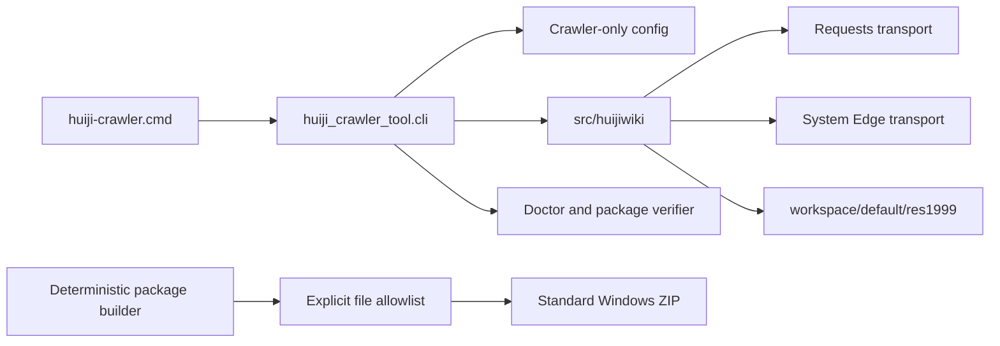

# Windows Huiji Crawler P1 Portable Tool Design

日期：2026-07-20  
状态：实现与专项验收已完成；最终完整测试复验被并发 wiki v3 中间态阻断  
父级优先级：P1  
本规格完成后下一阶段：Windows DPAPI 凭据生命周期

## 1. 背景与目标

现有灰机 Wiki crawler 已经从 `D:\1999WIKI_ROBOT` 解耦，并使用项目内配置、凭据和输出路径。但它仍位于完整 `1999Search` 工作树中，启动器依赖既有 Conda 环境，配置加载器包含 RAG、MinIO、Milvus 和 Wiki 等无关模块，尚不能作为独立 Windows 工具发布。

本阶段目标是生成一个 crawler-only 标准工具包。目标机器安装受支持的 Windows x64 Python 后，可通过一次性 `pip` 安装使用。工具包不携带 Python 运行时、抓取数据或任何秘密。

本阶段不是最终离线交付。自包含 Python、DPAPI、多账号和计划任务由后续两个 P2 规格负责。

## 2. 总体架构



`src/huijiwiki` 保持唯一 crawler 业务实现。新增 `src/huiji_crawler_tool` 只承担工具入口、独立配置、运行目录、程序发现、诊断和 package verification。现有项目脚本改为兼容包装器，不维护第二套参数和路径逻辑。

## 3. 工具入口与兼容层

### 3.1 模块职责

统一 CLI 提供 crawl、credential、doctor 和 verify-package 命令。旧脚本在兼容期内只负责参数翻译并调用统一 CLI。

### 3.2 当前必须满足

- **CLI-P0-01：** 提供 `huiji-crawler.cmd`，从启动器真实路径定位工具根，不依赖当前工作目录。
- **CLI-P0-02：** 提供 `crawl`、`credential import`、`credential refresh`、`credential status`、`doctor` 和 `verify-package` 子命令。
- **CLI-P0-03：** `scripts/crawl_huiji_res1999.py`、`scripts/import_huiji_credentials.py` 和 `scripts/refresh_huiji_credentials.py` 只作为兼容包装器；参数语义与统一 CLI 一致。
- **CLI-P0-04：** 工具是 CLI 与 `.cmd` 启动器，不创建 GUI、托盘程序或后台常驻进程。
- **CLI-P0-05：** 所有命令使用稳定退出码，错误输出给出项目内恢复命令且不输出秘密。

### 3.3 后续扩展

- P2 凭据阶段增加命名账号、schedule 和 DPAPI 命令。
- P2 离线阶段使相同启动器优先使用包内 Python。

### 3.4 关键契约

- 兼容包装器不得重新引入 `robot_root`、旧 GUI 默认路径或单独的 Cookie 加载规则。
- CLI 参数解析只允许存在一份权威实现。
- 正常命令不得动态导入工具根外的 Python 源码。

## 4. Crawler-only 配置与路径

### 4.1 模块职责

从完整项目配置中提取 crawler 必需的非敏感设置，并对所有工具拥有的路径执行真实路径 containment。

### 4.2 当前必须满足

- **CONFIG-P0-01：** 新配置文件为 `config/crawler.yaml`，不读取 RAG 的 `config/settings.yaml`。
- **CONFIG-P0-02：** 配置优先级固定为 `CLI > HUIJI_CRAWLER_* 环境变量 > crawler.yaml > 内建默认值`。
- **CONFIG-P0-03：** 工具根、`.local`、`.venv`、workspace、日志、状态库和 profile 必须解析在工具根内。
- **CONFIG-P0-04：** 外部绝对路径、`..`、symlink 或 junction 越界必须在读取、目录创建或浏览器启动前停止。
- **CONFIG-P0-05：** Edge executable 是唯一允许位于工具根外的文件依赖，只能来自显式参数、环境覆盖或已登记的系统安装候选。
- **CONFIG-P0-06：** 默认抓取输出为 `workspace/default/res1999`；工具包本身不包含该目录内容。
- **CONFIG-P0-07：** 配置、诊断和错误信息不得包含 Cookie 值、完整 header 或凭据文件内容。

### 4.3 后续扩展

- P2 凭据阶段将 `default` 扩展为命名账号并按账号隔离 workspace。
- P2 离线阶段增加包内 Python runtime 发现。

### 4.4 关键契约

- URL、loopback DevTools endpoint 和系统程序不是项目数据路径。
- 用户可移动整个工具目录，但不能只把 workspace 指向任意外部目录绕过边界。
- 打包 staging 使用同一 containment 实现，不实现字符串前缀判断。

## 5. Canonical 凭据与旧格式迁移

### 5.1 模块职责

将稳态凭据格式从旧 GUI pickle、行格式和无版本 JSON 收束为带 schema version 的 canonical JSON。旧格式解析只存在于显式迁移器。

### 5.2 Canonical 模型

```json
{
  "schema_version": "huiji_credential.v2",
  "expected_user": "POTATO BOT",
  "cookies": [
    {
      "name": "huiji_session",
      "value": "<private>",
      "domain": ".huijiwiki.com",
      "path": "/",
      "expires": null,
      "secure": true,
      "http_only": true
    }
  ]
}
```

### 5.3 当前必须满足

- **CREDENTIAL-P0-01：** 正式 CookieLoader 只接受 `huiji_credential.v2`，不得调用 pickle。
- **CREDENTIAL-P0-02：** legacy decoder 位于单独迁移模块，只有 `credential import --legacy-source <path>` 可调用。
- **CREDENTIAL-P0-03：** 导入源可位于工具根外，但目标固定为工具内 `.local/accounts/default/credential.json`；源文件永不修改或删除。
- **CREDENTIAL-P0-04：** 导入验证结构、Cookie 非空、size、SHA-256 和 Cookie 名称集合；不同目标默认停止，显式 replace 才能原子替换。
- **CREDENTIAL-P0-05：** Browser/Edge 刷新直接生成 canonical JSON，不经过旧格式中间文件。
- **CREDENTIAL-P0-06：** canonical JSON 属于私有运行状态，不进入 Git、标准包、日志、evidence 或测试快照。
- **CREDENTIAL-P0-07：** 迁移和刷新采用临时文件、flush、fsync、回读解析和原子替换；失败保持原目标不变。

### 5.4 后续扩展

P2 凭据阶段使用 DPAPI 加密同一 canonical payload，并删除稳态明文 backend。canonical 数据模型保持不变。

### 5.5 关键契约

- pickle 兼容只用于迁移，不是故障回滚路径。
- 迁移报告只含路径、hash、size、Cookie 名称和数量。
- 本阶段产生的明文 canonical 文件必须位于 `.local`，并在 DPAPI 阶段迁移后从工具运行目录移除。

## 6. 标准包构建模块

### 6.1 模块职责

根据显式 allowlist 创建 crawler-only staging，生成可审计、可重复的标准 Windows ZIP。

### 6.2 当前必须满足

- **PACKAGE-P0-01：** 文件白名单保存于 `packaging/huiji-crawler/files.v1.yaml`，新增文件默认不进入包。
- **PACKAGE-P0-02：** 包只包含 crawler 源码、工具层、非敏感配置、启动器、依赖锁、manifest、SBOM、许可证和使用文档。
- **PACKAGE-P0-03：** `data`、`.local`、`.env`、`eval`、数据库、向量库、Docker volume、RAG、后端、前端、日志、`.pyc` 和浏览器 profile 无条件禁止进入 staging。
- **PACKAGE-P0-04：** 直接依赖保存于 `requirements-crawler.in`，完整传递依赖及发行文件 hash 保存于 `requirements-crawler.lock.txt`。
- **PACKAGE-P0-05：** `install.cmd` 校验 Windows x64 Python、创建包内 `.venv`、使用 `--require-hashes` 安装并执行 import 与 CLI smoke。
- **PACKAGE-P0-06：** ZIP 文件顺序、内部路径和时间戳固定；相同输入必须产生相同 tree hash。
- **PACKAGE-P0-07：** `package-manifest.v1.json` 记录每个不可变文件的 path、role、size 和 SHA-256；detached hash 固定 manifest 本身。
- **PACKAGE-P0-08：** 生成 CycloneDX SBOM、第三方许可证清单、build receipt、ZIP SHA-256 和文件体积报告。
- **PACKAGE-P0-09：** staging 中出现秘密、原项目绝对路径或白名单外文件时停止，不生成可发布 ZIP。
- **PACKAGE-P0-10：** 体积以功能正确为优先；参考目标只告警。仅当标准 ZIP 超过 50 MiB 或发现明显误打包内容时阻断。

### 6.3 后续扩展

P2 离线阶段从同一 staging source hash 构建自包含包，并把标准包和离线包做 tree diff。

### 6.4 关键契约

- 不直接复制当前 Conda 或 venv 目录。
- wheelhouse 可作为构建缓存，但不进入标准 ZIP。
- 标准包安装可以访问 pip 源；运行 crawler 仍需访问灰机 Wiki。

## 7. 程序发现与路径审计

### 7.1 模块职责

统一发现 Python 和 Edge，并使用结构化解析减少外部路径审计误报。

### 7.2 当前必须满足

- **DISCOVERY-P0-01：** 标准包只接受 Windows x64 CPython `>=3.12.0,<3.13`；拒绝 32 位、其他 minor version 和未知实现。
- **DISCOVERY-P0-02：** Python 发现顺序、版本范围和命中路径写入脱敏 doctor 报告。
- **DISCOVERY-P0-03：** Edge 发现支持显式参数、环境覆盖和精确系统候选；profile 与 output 不因 executable 位于系统目录而放宽。
- **AUDIT-P0-01：** Python 文件使用 AST、PowerShell 使用 PowerShell parser、YAML/JSON 使用结构化解析识别路径语义；无法解析时 fail closed 或进入明确的文本 fallback 诊断。
- **AUDIT-P0-02：** drive path、UNC、`file://`、symlink 和 junction 逃逸测试覆盖生产入口。
- **AUDIT-P0-03：** HTTP(S) URL、loopback endpoint 和文档中的非可执行历史记录不得被误判为运行依赖。
- **AUDIT-P0-04：** allowlist 只允许精确系统 executable 和诊断 sentinel；宽泛、重复或陈旧条目使验收失败。

### 7.3 后续扩展

P2 离线阶段使 Python 发现优先返回包内 runtime，并在空 PATH 下验收。

## 8. 数据流与错误处理

```text
launcher
  -> locate tool root
  -> verify critical manifest entries
  -> load crawler-only config
  -> resolve and guard paths
  -> load canonical private credential
  -> verify expected account
  -> execute read-only crawl
  -> write workspace state and artifacts
```

稳定退出码：

```text
0 success
2 credential/session/challenge
3 config/path violation
4 package/dependency integrity
5 network/API failure
6 account mismatch
7 runtime lock conflict
8 Windows/Python/Edge environment failure
```

任何前置门禁失败都不得启动 Edge、访问灰机 API 或创建 workspace 抓取文件。

## 9. 测试与真实验收

### 9.1 自动测试

- CLI 子命令、兼容包装器和稳定退出码。
- 配置优先级、外部路径、`..`、symlink 和 junction 逃逸。
- canonical JSON、legacy-only decoder、冲突停止和原子写失败。
- allowlist、secret scan、deterministic ZIP 和 manifest 校验。
- 标准包安装失败不留下成功标记。
- 当前 `1999Search` 完整 Python 测试保持通过。

### 9.2 包级验收

标准 ZIP 分别解压到普通路径、带空格路径、中文路径和不同盘符路径。每个位置至少执行：

```text
verify-package
install
doctor
credential status
无真实凭据 crawl fail-closed smoke
```

至少一个隔离目录使用真实 Edge 刷新和真实 Requests dry-run。验收期间禁止访问 `D:\1999WIKI_ROBOT`，并要求 blocked access 为零。

### 9.3 完成门槛

以下条件同时满足才可声明 P1 完成：

1. `CLI-P0-*`、`CONFIG-P0-*`、`CREDENTIAL-P0-*`、`PACKAGE-P0-*`、`DISCOVERY-P0-*` 和 `AUDIT-P0-*` 全部通过。
2. 标准包只含白名单 crawler 文件，秘密和可再生数据计数为零。
3. relocation smoke 和至少一次真实 transport 验收通过。
4. 完整测试、路径审计、秘密审计和 package manifest 校验通过。
5. 当前旧凭据源未被修改或删除。

## 10. 与旧方案的关系

保留：

- `src/huijiwiki` crawler 业务逻辑和只读 API 门禁。
- Requests、Browser 和 Edge 三种 transport。
- expected-user 校验、断点续爬和结构化输出。

废弃：

- 完整项目 `requirements.txt` 作为 crawler 安装清单。
- RAG `config/settings.yaml` 作为 crawler 配置。
- 正式 CookieLoader 中的 pickle、行格式和无版本 JSON fallback。
- Conda `1999wiki` 作为唯一启动路径。

本阶段不做：

- DPAPI、多账号、计划任务和自动提醒。
- 嵌入式 Python、自包含离线 ZIP和运行时更新。
- Linux、Docker、GUI、私有凭据包和抓取数据包。
