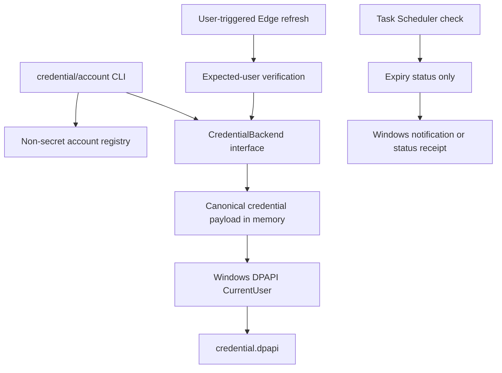

# Windows Huiji Crawler P2 Credential Lifecycle Design

日期：2026-07-20  
状态：书面规格已完成并通过自审，待用户审阅  
父级优先级：P2-A  
前置条件：Windows crawler P1 标准工具包验收通过

## 1. 背景与目标

P1 将稳态凭据统一为 canonical JSON，但明文仍位于 `.local`。本阶段把 canonical payload 迁移到 Windows DPAPI CurrentUser 密文，增加命名账号、账号级 Edge profile、并发锁、过期检查和用户显式安装的 Windows 计划任务。

目标是消除工具运行目录内的稳态明文 Cookie，同时保持目标机器重新登录、人工 Cloudflare 验证和 fail-closed 恢复路径。凭据不跨 Windows 用户或机器迁移，不进入任何工具包。

## 2. 总体架构



DPAPI 是唯一稳态 backend。旧明文 JSON 和 GUI pickle 只允许作为显式迁移源，不作为正常 crawl fallback。

## 3. DPAPI 凭据后端

### 3.1 模块职责

将 canonical payload 加密为当前 Windows 用户绑定的密文，并提供原子安装、解密、检查和迁移接口。

### 3.2 当前必须满足

- **DPAPI-P0-01：** 使用 Windows `CryptProtectData` 与 `CryptUnprotectData` 的 CurrentUser 作用域，不使用 machine-wide 密钥。
- **DPAPI-P0-02：** DPAPI additional entropy 由固定应用标识、schema version 和规范化账号名派生；entropy 不是秘密，但不同账号不得互换密文。
- **DPAPI-P0-03：** `credential.dpapi` 使用版本化 envelope，记录 backend、schema、账号、创建时间、ciphertext 和非敏感 payload hash；不记录 Cookie 值。
- **DPAPI-P0-04：** 写入流程为临时文件、flush、fsync、DPAPI 解密回读、canonical 解析、账号一致性校验和原子替换。
- **DPAPI-P0-05：** Windows 用户不符、密文损坏、entropy 不符或 schema 未知时 fail closed，保留原文件并提示重新认证。
- **DPAPI-P0-06：** Cookie 明文只存在于当前进程内存，不写入环境变量、命令行、日志、状态文件、计划任务或 crash receipt。
- **DPAPI-P0-07：** P1 本地 canonical 明文迁移成功后，先生成并验证 DPAPI 密文，再删除工具根内的明文目标；外部显式迁移源保持不变。
- **DPAPI-P0-08：** DPAPI backend 不提供导出明文凭据或跨机器恢复命令。

### 3.3 后续扩展

可在未来增加组织级 secrets manager backend，但不得改变 canonical payload 或降低 CurrentUser backend 的门禁。

### 3.4 关键契约

- 目标机器或 Windows 用户改变时必须重新登录。
- 工具更新不得重写 credential blob。
- 密文 hash 只能证明 blob 未漂移，不能替代解密和账号验证。

## 4. 命名账号与运行隔离

### 4.1 模块职责

为每个灰机账号提供独立的非敏感配置、DPAPI 凭据、Edge profile、状态和 workspace。

### 4.2 当前必须满足

- **ACCOUNT-P0-01：** `default` 为默认账号，CLI 使用 `--account <name>` 选择；账号名必须匹配受限 ASCII 规则并经过规范化。
- **ACCOUNT-P0-02：** 每个账号目录包含 `account.json`、`credential.dpapi`、`edge_profile` 和 `credential-status.v1.json`，不得共享 credential 或 Edge profile。
- **ACCOUNT-P0-03：** `account.json` 只保存 expected_user、创建时间和非敏感选项。
- **ACCOUNT-P0-04：** 刷新在写入前调用灰机账号验证；实际账号与 expected_user 不一致时保持原密文不变。
- **ACCOUNT-P0-05：** 默认 workspace 为 `workspace/<account>/res1999`，不同账号不共享 SQLite 状态库或日志。
- **ACCOUNT-P0-06：** 同一账号的凭据变更使用账号锁；同一 workspace 的 full crawl 使用 workspace 锁。锁使用 Windows `msvcrt.locking` 和同目录非秘密 metadata 文件实现，不依赖第三方服务。
- **ACCOUNT-P0-07：** 锁 metadata 只记录规范化账号、PID、进程创建时间和命令类别。冲突时报告这些字段；不得自动终止进程或强制删除锁。
- **ACCOUNT-P0-08：** `account remove` 要求账号名二次确认，只删除认证状态和 profile，不删除 workspace 抓取数据。
- **ACCOUNT-P0-09：** 所有账号操作都经过项目根 containment；junction 或 symlink 不得将账号目录指向工具根外。

### 4.3 后续扩展

未来可增加显式 workspace 共享策略，但必须先解决并发状态和来源审计，不在当前阶段实现。

## 5. 刷新、检查与计划任务

### 5.1 模块职责

提供用户主动刷新、机器可读过期状态以及用户显式安装的 Windows 定期检查任务。

### 5.2 当前必须满足

- **ROTATION-P0-01：** `credential refresh` 仅由用户主动调用，使用该账号的项目内 Edge profile，并在成功校验 expected_user 后原子替换 DPAPI 密文。
- **ROTATION-P0-02：** 正常 crawl 和后台检查不得自动打开浏览器、刷新 Cookie 或改写 credential。
- **ROTATION-P0-03：** `credential check --all` 输出每个账号的 `healthy`、`expiring`、`expired`、`missing`、`unreadable` 或 `account_verification_required` 状态，不输出 Cookie 值。
- **ROTATION-P0-04：** 过期阈值为非敏感可配置项；报告列出最早相关过期时间和 Cookie 名称，不写完整 Cookie header。
- **ROTATION-P0-05：** `schedule install`、`schedule status` 和 `schedule remove` 通过 Windows `schtasks.exe` 管理当前登录用户的任务计划；任务仅在该用户登录时运行，安装必须由用户显式执行且不要求管理员权限。
- **ROTATION-P0-06：** 计划任务参数只包含工具路径、账号选择和 `credential check`；不得包含 Cookie、密文或 expected_user 以外的账号秘密。
- **ROTATION-P0-07：** 临近过期或已过期时，交互桌面可用则通过 Windows `MessageBoxW` 发出简短通知；无交互桌面或通知失败时写 canonical 状态 receipt 并返回稳定非零码。该通知不是 GUI 管理程序，不提供凭据编辑能力。
- **ROTATION-P0-08：** 工具目录移动后，doctor 必须识别计划任务中的陈旧路径并提示重新安装，不静默修改任务。
- **ROTATION-P0-09：** 任务安装、覆盖和移除均输出当前任务定义 hash 和脱敏 receipt；不同定义默认停止，显式 replace 才能覆盖。

### 5.3 后续扩展

不建设无人值守浏览器登录。未来若灰机提供正式 token 轮换 API，必须另写设计并保持 expected-user 门禁。

## 6. 数据流

### 6.1 首次账号创建

```text
account add
  -> validate account name and expected_user
  -> create non-secret account.json
  -> user runs credential refresh
  -> launch isolated Edge profile
  -> verify expected_user
  -> collect Huiji cookies in memory
  -> canonicalize
  -> DPAPI protect
  -> atomic credential.dpapi install
```

### 6.2 Requests crawl

```text
select account
  -> acquire workspace lock
  -> read DPAPI envelope
  -> DPAPI unprotect
  -> parse canonical payload
  -> verify local expected_user metadata
  -> run account verification request
  -> execute read-only crawl
```

### 6.3 定期检查

```text
Task Scheduler
  -> credential check --all --notify
  -> decrypt locally
  -> compute expiry states
  -> notify or write status
  -> never launch Edge and never refresh
```

## 7. 错误处理与恢复

- DPAPI 失败：退出码 2，保留密文，提示当前 Windows 用户重新认证。
- 账号不符：退出码 6，不改密文或 account metadata。
- 锁冲突：退出码 7，不删除锁；陈旧锁只能由显式诊断流程确认原 PID 不存在后处理。
- 通知失败：不影响状态检查结果，但 receipt 标记 notification unavailable。
- 计划任务定义漂移：status 返回不一致并要求显式 replace。
- P1 明文迁移失败：明文文件保持，DPAPI 目标不激活；不得留下半写密文。

## 8. 测试与真实验收

### 8.1 自动测试

- DPAPI round-trip、错误 entropy、损坏 blob 和原子替换失败。
- canonical 明文迁移后工具根明文目标不存在。
- 账号名、目录逃逸、账号不符和 profile 隔离。
- 账号锁、workspace 锁和陈旧锁诊断。
- 计划任务命令构造、定义 hash、冲突停止和陈旧工具路径。
- 所有日志、异常和 receipt 的 secret scan。

### 8.2 真实验收

- 使用当前 Windows 用户创建至少一个真实账号 profile。
- 使用项目内 Edge profile 完成 expected-user 验证和 DPAPI 写入。
- 在禁止访问 `D:\1999WIKI_ROBOT` 时完成 Requests dry-run，blocked access 为零。
- 安装、查询和移除一次真实 Windows 计划任务，证明任务不自动启动 Edge。
- 扫描工具根，确认 canonical Cookie 值未出现在 DPAPI blob 之外的任何文件。

### 8.3 完成门槛

只有同时满足以下条件才可声明 P2-A 完成：

1. `DPAPI-P0-*`、`ACCOUNT-P0-*` 和 `ROTATION-P0-*` 全部通过。
2. 稳态 runtime 不再读取 P1 明文 backend 或 legacy pickle。
3. 真实 Edge 刷新、Requests dry-run、计划任务和 forbidden-root 验收通过。
4. 多账号与并发锁测试通过。
5. 工具根秘密审计为零明文泄漏。

## 9. 与旧方案的关系

保留：

- P1 canonical payload、CLI、配置和 package manifest。
- 用户主动 Edge 登录、expected-user 校验和 Requests fail-closed。

废弃：

- `.local/accounts/<account>/credential.json` 稳态明文文件。
- 单一全局 credential 和共享 Edge profile。
- Cookie 过期后依赖旧 GUI 或复制外部 `config.dat`。

本阶段不做：

- 凭据跨机器、跨 Windows 用户导出。
- 后台自动登录、自动 Cloudflare 验证或无人值守刷新。
- Linux keyring、Docker secrets、GUI 和集中式 secrets manager。
