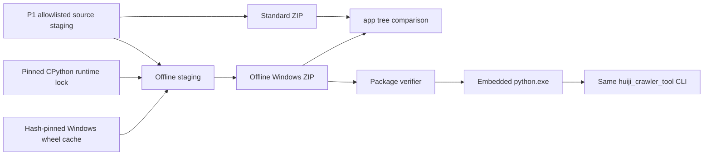

# Windows Huiji Crawler P2 Offline Distribution Design

日期：2026-07-20  
状态：书面规格已获用户批准，待 P2-A 验收通过后编写 implementation plan
父级优先级：P2-B  
前置条件：P1 标准工具包与 P2-A DPAPI 凭据生命周期验收通过

## 1. 背景与目标

标准包要求目标机器预装受支持的 Windows x64 Python，并在首次安装时从 pip 源获取依赖。本阶段生成自包含离线 ZIP，使目标机器只需 Windows x64 和 Microsoft Edge 即可启动工具，不要求 Python、Conda、Docker 或在线 pip 安装。

当前支持矩阵为 Windows 10 22H2 x64 与 Windows 11 x64。更早版本、Windows on ARM 和 32 位 Windows 不进入验收范围。

“离线”只指工具安装和依赖准备不需要网络。执行真实 crawl 仍需访问灰机 Wiki；Edge 登录仍可能需要用户完成 Cloudflare 验证。

## 2. 总体架构



标准包与离线包从完全相同的 source staging hash 派生。离线包只增加 `runtime/` 和离线启动分支，不允许修改 `app/`。

## 3. 嵌入式 Python runtime

### 3.1 模块职责

获取、验证并组装固定版本的官方 Windows x64 embeddable CPython 和 crawler 依赖。

### 3.2 当前必须满足

- **RUNTIME-P0-01：** `python-runtime.lock.json` 固定 CPython 完整版本、架构、官方 HTTPS URL、archive size 和 SHA-256。
- **RUNTIME-P0-02：** runtime 下载只允许 Python 官方登记主机；hash 或 size 不一致立即停止。
- **RUNTIME-P0-03：** 构建不得复制当前 Conda、系统 Python 或现有 venv。
- **RUNTIME-P0-04：** 依赖只能来自 `requirements-crawler.lock.txt` 对应的 Windows x64 wheels；禁止源码构建和未锁定 transitive dependency。
- **RUNTIME-P0-05：** 构建期 wheel cache 位于 package 外，不重复放入最终 ZIP；最终 runtime 包含已安装依赖和必要 metadata。
- **RUNTIME-P0-06：** Playwright 只包含 Python package 和连接系统 Edge 所需 driver，不下载或打包 Chromium、Firefox、WebKit 浏览器。
- **RUNTIME-P0-07：** 离线启动器只调用 `runtime/python.exe`，不得回退到 PATH、Conda、py launcher 或系统注册表 Python。
- **RUNTIME-P0-08：** 嵌入式 runtime 的 import path 明确列出标准库、package app 和 site-packages；当前目录不得隐式覆盖标准库模块。
- **RUNTIME-P0-09：** Python 和依赖许可证、版本、hash 与文件来源进入 SBOM 和 build receipt。

### 3.3 后续扩展

未来可升级固定 Python 版本，但每次升级都必须作为新 package version 构建并执行完整 relocation acceptance；不得原地下载更新 runtime。

### 3.4 关键契约

- 离线包不包含 Edge；Edge 是受支持的 Windows 系统依赖。
- runtime 目录是不可变 package 内容，不保存 Cookie、profile、日志或抓取数据。
- 包内 Python 不提供通用交互环境或任意 pip 安装入口。

## 4. 双包一致性与构建证据

### 4.1 模块职责

证明标准包和离线包运行同一份 crawler 源码，并生成可重现、可审计的发布证据。

### 4.2 当前必须满足

- **BUILD-P0-01：** 标准包与离线包的 `app/`、默认配置、CLI、manifest schema 和文档 tree hash 完全一致。
- **BUILD-P0-02：** `package-diff.v1.json` 只允许离线包新增 `runtime/`、离线 runtime metadata 和启动器选择标记。
- **BUILD-P0-03：** ZIP 文件顺序、内部路径、时间戳和压缩参数固定；相同锁文件和源码输入产生相同 tree hash。
- **BUILD-P0-04：** 构建 receipt 记录 source tree hash、Python lock hash、dependency lock hash、SBOM hash、两个 ZIP hash、文件计数和体积分类。
- **BUILD-P0-05：** detached `checksums.sha256` 覆盖所有发布物；发布目录不得包含未登记文件。
- **BUILD-P0-06：** package verifier 检查 manifest schema、detached hash、文件缺失、额外不可变文件、size 和 SHA-256。
- **BUILD-P0-07：** 构建必须执行 secret scan、绝对路径 scan、zip-slip path scan 和 Windows 保留文件名检查。
- **BUILD-P0-08：** 当前版本体积和相对上一版本增量写入报告。参考目标为标准 ZIP 5 MiB、离线 ZIP 90 MiB、离线解压 200 MiB，仅产生 warning。
- **BUILD-P0-09：** 只有标准 ZIP 超过 50 MiB、离线 ZIP 超过 500 MiB、离线解压超过 1 GiB 或发现明显禁止内容时才因体积停止。

### 4.3 后续扩展

如未来具备 Authenticode 证书，可在 detached hash 之后增加签名；当前阶段不伪造自签名信任链，也不把签名作为可用性前置条件。

## 5. 启动、安装与诊断

### 5.1 模块职责

使用户解压后通过同一 `.cmd` 入口运行，并在没有系统 Python/Conda 的环境中完成诊断。

### 5.2 当前必须满足

- **LAUNCH-P0-01：** `huiji-crawler.cmd` 先验证 package variant；offline variant 只调用包内 Python，standard variant 只调用已安装 `.venv`。
- **LAUNCH-P0-02：** offline variant 不执行 install、不调用 pip、不修改 runtime。
- **LAUNCH-P0-03：** `doctor` 检查 Windows 版本、x64、包完整性、嵌入式 Python、依赖 import、Edge、loopback CDP、账号状态、workspace 可写性和计划任务路径。
- **LAUNCH-P0-04：** `verify-package` 可在无网络、无凭据、无 Edge 会话时完成全包校验。
- **LAUNCH-P0-05：** 未安装 Edge 时 doctor 返回退出码 8 和官方系统依赖说明；不得自动下载浏览器。
- **LAUNCH-P0-06：** `.cmd` 参数传递必须正确处理空格、中文、`&` 等 Windows shell 边界，不使用字符串拼接执行用户输入。
- **LAUNCH-P0-07：** 工具首次运行只创建必要的 `.local` 和 workspace 父目录，不自动创建账号、启动 Edge、安装计划任务或访问网络。

### 5.3 关键契约

- 标准包与离线包使用相同用户命令和退出码。
- runtime 验证失败时要求重新解压完整 ZIP，不从网络修复单个 DLL 或 package。
- 系统 Python 的存在与否不得改变 offline variant 行为。

## 6. 安全更新与状态保留

### 6.1 模块职责

在不覆盖 `.local` 和 workspace 的前提下安装新版本的不可变程序文件，并在失败时保持旧版本可运行。

### 6.2 当前必须满足

- **UPDATE-P0-01：** 更新只接受已通过 detached checksum 和完整 manifest 校验的新 package。
- **UPDATE-P0-02：** 新版本先解压到同一文件系统的隔离 staging，完成 package verify 和 offline smoke 后才进入替换。
- **UPDATE-P0-03：** 更新只替换 `app`、`runtime`、默认配置、启动器和 manifest；`.local`、workspace 和用户非敏感覆盖配置不得进入替换集合。
- **UPDATE-P0-04：** 替换失败时继续使用旧版本，不留下新旧 app/runtime 混合目录。
- **UPDATE-P0-05：** 更新不迁移或重新加密 DPAPI 凭据；同一 Windows 用户继续使用原 blob。
- **UPDATE-P0-06：** 如配置或 schema 需要迁移，必须先生成可回滚的新版本状态并验证；不得就地破坏旧状态。
- **UPDATE-P0-07：** 工具不自动检查、下载或安装网络更新。版本更新由用户显式提供 package。

### 6.3 后续扩展

未来可增加受签名 release feed，但必须另写信任和回滚设计。

## 7. 数据流与错误处理

### 7.1 构建

```text
allowlisted source
  -> source tree hash
  -> standard ZIP
  -> verify pinned Python archive
  -> verify/download locked wheel cache
  -> assemble embedded runtime
  -> offline ZIP
  -> app tree diff
  -> secret/path/manifest/SBOM checks
  -> release receipt
```

### 7.2 运行

```text
huiji-crawler.cmd
  -> identify offline variant
  -> verify critical package files
  -> runtime/python.exe -m huiji_crawler_tool
  -> existing CLI/config/DPAPI/crawler flow
```

错误原则：

- Python archive 或 wheel hash 不符：构建停止，不使用缓存文件。
- runtime import 失败：退出码 4 或 8，不回退系统 Python。
- package manifest 漂移：退出码 4，不访问凭据或网络。
- 更新 staging 失败：清理本次 staging，保留旧版本；不删除 `.local` 或 workspace。
- SBOM 或许可证生成失败：构建不产生可发布状态。

## 8. 测试与真实验收

### 8.1 自动测试

- Python runtime lock schema、下载 host、size 和 SHA-256。
- wheel-only、hash-pinned dependency resolution。
- 标准与离线 `app` tree diff。
- deterministic ZIP、manifest、detached hash 和额外文件检测。
- shell 参数转义、空 PATH、错误系统 Python 干扰和 runtime import。
- 更新成功、替换失败、schema migration 失败和状态保留。
- package secret/path scan 和体积分类。

### 8.2 Relocation matrix

标准包和离线包分别解压到：

1. 普通临时目录。
2. 含空格目录。
3. 含中文目录。
4. 与源码工作树不同盘符的目录。

每个离线目录在临时清空 Python、Conda 和 py launcher PATH 后执行：

```text
verify-package
doctor
account list
credential status
无凭据 crawl fail-closed smoke
```

至少一个离线目录完成真实 Edge 刷新和 Requests dry-run。工具根禁止访问 `D:\1999WIKI_ROBOT`，blocked access 必须为零。

### 8.3 断网验收

阻断包构建源、pip 源和 Python 下载主机后，已构建离线包必须仍可完成：

- package verify；
- doctor 中与网络无关的全部检查；
- CLI help、账号状态和本地 fail-closed smoke；
- DPAPI 本地解密检查。

断网验收不声称可以完成真实 Wiki crawl。

### 8.4 完成门槛

只有同时满足以下条件才可声明 P2-B 完成：

1. `RUNTIME-P0-*`、`BUILD-P0-*`、`LAUNCH-P0-*` 和 `UPDATE-P0-*` 全部通过。
2. 标准包与离线包 app tree hash 完全一致。
3. 空 PATH、断网和 relocation matrix 验收通过。
4. 真实离线包 Edge 刷新和 Requests dry-run通过。
5. package secret scan、路径审计、SBOM、许可证和完整测试通过。
6. 两个包均不含 Cookie、profile、抓取数据或原项目绝对路径。

## 9. 与旧方案的关系

保留：

- P1 crawler-only source staging、CLI、配置和依赖锁。
- P2-A DPAPI、命名账号、计划任务和 workspace 隔离。
- 系统 Edge 作为唯一浏览器依赖。

废弃：

- Conda `1999wiki` 作为正式离线运行前置条件。
- 目标机在线 pip 安装作为唯一部署方式。
- 复制完整项目、复制 venv 或复制开发机 site-packages 的分发方式。

本阶段不做：

- Linux、Docker、GUI、浏览器二进制打包和自动网络更新。
- 私密运行状态打包、Cookie 跨机器导出或共享 Windows 用户凭据。
- 在线安装器、MSI、注册表安装和 Windows service。
