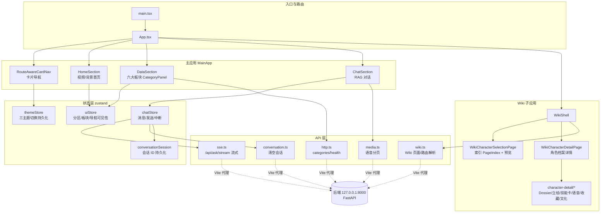

# 1999Search 前端架构文档

> 生成时间：2026-07-17 · 基于只读源码分析（未修改任何代码）
> 范围：`frontend/react-app`（主力前端），附其余三套历史形态说明

---

## 1. 前端形态总览

项目下共存 4 套前端，当前仅 `react-app` 在活跃迭代：

| 形态 | 位置 | 说明 |
|---|---|---|
| **React + Vite（主力）** | `frontend/react-app/` | React 18 + TS + Vite 5，正在迭代 Wiki 角色详情页 |
| 静态 HTML | `frontend/html/` | `index.html / app.js / style.css` 旧版原型 |
| Gradio | `frontend/gradio_app.py` | Python 快速原型 |
| Streamlit | `frontend/streamlit_app.py` | Python 快速原型 |

## 2. 技术栈

| 类别 | 选型 |
|---|---|
| 框架 | React 18.3 + TypeScript 5.5 + Vite 5.4 |
| 状态管理 | zustand 4.5（chat / theme / ui 三个 store） |
| 动效 | framer-motion 11、GSAP 3.15、ogl（WebGL）、自研 reactbits 组件 |
| 图标 | lucide-react |
| 单元测试 | Vitest 2 + jsdom + Testing Library（与源码 colocated） |
| E2E 测试 | Playwright 1.61（`e2e/` 4 个 spec） |
| 路由 | 无 react-router，`App.tsx` 手写 pathname 分发 + History API |

## 3. 入口与路由

`main.tsx` → `App.tsx`，按 `window.location.pathname` 三分发：

```
/                      → MainApp（滚动捕捉单页：Home / Data / Chat）
/wiki, /wiki/...       → WikiShell（Wiki 子应用，内部再分 selection / detail 两种 location）
/__motion-preview      → MotionPreview（仅 DEV 环境，动效调试页）
```

`App.tsx` 监听 `popstate` 维护 pathname；Wiki 内部通过 `wikiRoutes.ts`
（`parseWikiLocation / pushWikiDetail / replaceWikiLocation`）管理
`character-selection` ↔ `detail` 的跳转与历史状态恢复。

## 4. 整体分层架构



## 5. 主应用（`/`）：滚动捕捉单页

`MainApp` 用三个全屏 `snap-section` 组成单页，配合三个全局 hooks：

| Hook | 职责 |
|---|---|
| `useScrollSpy` | 滚动监听，同步 `uiStore.currentSection` |
| `useWheelSnapNavigation` | 滚轮整屏翻页（带锁定期防连跳） |
| `useTopNavTrigger` | 顶部悬停 700ms 唤出导航（`HOVER_REVEAL_DELAY_MS`） |

- **HomeSection** — 视频背景（`/videos/pv.mp4`，失败回退全局背景图）+ framer-motion 标题入场
- **DataSection** — 内嵌滚动容器渲染 6 个 `CategoryPanel`；元数据来自 `/api/categories`，失败回退 `fallbackCategories.ts`
- **ChatSection** — 消息列表（`MessageBubble` + `MarkdownContent` + `StreamingText`）+ `ChatInput` + `CategorySelect`，媒体面板（图片/视频/语音）挂在消息资产上

导航为 `RouteAwareCardNav`（mode = `main` | `wiki`），配置在 `navigationConfig.ts`，
已取代已删除的旧 `Sidebar.tsx` / `TopNav.tsx`。

## 6. Wiki 子应用（`/wiki`）

`WikiShell` 是状态中枢（429 行），管理分类、分页列表（cursor，每页 30）、
选中页、预览、详情加载，并带请求序号防竞态与 `WikiErrorBoundary` 错误边界。

```mermaid
graph LR
    subgraph selection 模式
        PI[PageIndex<br/>可搜索档案索引] --> PRE[角色预览卡]
        PI --> SUM[Personnel Preview 摘要]
    end
    subgraph detail 模式
        CVM[characterDetailViewModel<br/>视图模型装配] --> WCD[WikiCharacterDetailPage]
        WCD --> DESK[DesktopCharacterDossier]
        WCD --> MOB[MobileCharacterDossier]
        DESK --> BLK[PortraitStage 立绘舞台<br/>SkillCards 技能卡<br/>VoiceRecords 语音<br/>Collection 收藏<br/>Culture 文化<br/>DossierBlocks 档案块]
    end
    subgraph 通用详情（非 character 类型）
        GEN[WikiReaderHero + StructuredContentRenderer + PageInfo]
    end
```

- **路由解析**：详情页先 `fetchWikiPageByRoute`，404 时用 `resolverHint`
  经 `/api/wiki/routes/resolve` 二次解析（entity_id → title 兜底）
- **历史状态**：选择状态（分类/搜索词/选中项/滚动位置）存入 `history.state`，
  返回时可完整还原；最近浏览经 `recentWiki.ts` 持久化到 localStorage
- **视图模型分层**：`wikiViewModel`（通用页）→ `characterDetailViewModel`（角色页
  16 个 ViewModel 接口），UI 组件只消费装配好的 VM
- **motion profile**：`wikiMotionProfiles.ts` 按分类给出动效配置

## 7. 状态管理

| Store | 关键状态 | 说明 |
|---|---|---|
| `chatStore` | `messages / sending / routeOptions{expanded, freeSupplement} / abortController` | `send()` 经 `streamAsk` SSE 流式追加 assistant 消息；支持中断与清空 |
| `uiStore` | `currentSection / currentCategory / categoriesMeta / topNavVisible` | 主应用 UI 中枢 |
| `themeStore` | `storm-dark / manuscript-gold / cold-archive` | 三主题轮转，`migrateTheme` 兼容旧值，persist 持久化 |
| `conversationSession` | localStorage `rag.conversation_id` | 会话 ID 生命周期管理（非 zustand，单例类） |

## 8. API 层与后端代理

| 模块 | 端点 | 用途 |
|---|---|---|
| `http.ts` | `GET /api/categories`、`GET /api/category/:key/docs`、`GET /health` | 板块元数据/文档/健康检查 |
| `sse.ts` | `POST /api/ask/stream` | RAG 问答 SSE 流（meta → delta → done） |
| `conversation.ts` | `/api/conversations/:id` | 清空会话 |
| `media.ts` | `GET /api/media/voice/page?cursor=` | 语音分页（`VoicePageError`） |
| `wiki.ts` | `/api/wiki/health`、`/categories`、`/pages`、`/pages/:id`、`/pages/by-route`、`/routes/resolve` | Wiki 全套（`WikiApiError`） |

Vite 代理（`vite.config.ts`）：

- `/api/media`、`/api/wiki` → 原样转发（wiki 可经 `VITE_WIKI_API_TARGET` 独立指向）
- 其余 `/api/*` → 去掉 `/api` 前缀转发到 `VITE_RAG_API_TARGET || VITE_API_TARGET || http://127.0.0.1:8000`
- `/health` 同目标；dev server 固定 `127.0.0.1:5173`（strictPort）

## 9. 主题与样式

- 三套主题：**storm-dark**（风暴暗色）、**manuscript-gold**（手稿金）、**cold-archive**（冷档案），通过 CSS 变量切换
- `styles/`：`global.css`、`themes.css`（约 20 个语义变量：`--bg-base`、`--accent-gold`、`--font-display` 等）、`fonts.css`（自托管字体，`public/fonts`）、`archival.css`、`decorative.css`
- Wiki 各页面有独立 CSS（如 `WikiCharacterDetailPage.css`）并配 CSS 契约测试

## 10. 动效体系

| 层 | 内容 |
|---|---|
| 自研 reactbits | `CardNav`、`AnimatedList`、`AnimatedContent`、`ScrollReveal`、`CircularGallery`（ogl WebGL 画廊） |
| 策略与诊断 | `motionPolicy.ts`（动效降级策略）、`motionDiagnostics.ts`（运行时诊断采集） |
| 调试页 | `/__motion-preview` → `components/dev/MotionPreview.tsx`（仅 DEV） |

## 11. 媒体资源

- 静态资源：`public/{videos, images, covers, fonts}`
- 映射模块：`media/assets.ts`（首页视频/全局背景/板块封面）、`characterStandees.ts`（角色立绘）、`psychubeCovers.ts`（心相封面）、`storyCovers.ts`（剧情封面）

## 12. 测试体系

| 层 | 工具 | 现状 |
|---|---|---|
| 单元/组件 | Vitest + jsdom + Testing Library，`test-setup.ts` 全局配置 | 几乎每个模块/组件都有 colocated 测试（含 CSS 契约测试如 `WikiCharacterDetailPage.css.test.ts`） |
| E2E | Playwright（`playwright.config.ts`） | 4 个 spec：会话记忆、Wiki 档案化、角色详情视觉、Wiki reactbits |

## 13. 当前迭代状态（2026-07-17 快照）

- **活跃热点**：Wiki 角色详情页——`character-detail/` 目录、`characterDetailViewModel.ts`、`WikiCharacterDetailPage.css`（最近 HMR 于当日 01:48）
- **导航迁移进行中**：旧 `Sidebar.tsx`/`TopNav.tsx` 已删除（未提交），CardNav 体系全面接管
- **大量未提交改动**：`App.tsx`、`ChatSection`、`MessageBubble`、`chatStore`、`themes.css` 等约 30+ 文件处于 modified 状态
- **运行中的服务**：Vite dev `http://127.0.0.1:5173`（200）、后端 `127.0.0.1:8000/health`（200）

## 14. 目录速查

```
frontend/react-app/src/
├── App.tsx                    # 路由分发（/ 、/wiki、/__motion-preview）
├── main.tsx
├── api/                       # http / sse / wiki / media / conversation
├── components/
│   ├── sections/              # Home / Data / Chat 三大分区 + CategoryPanel
│   ├── chat/                  # 消息、输入、Markdown、媒体面板（图/视/音）
│   ├── navigation/            # RouteAwareCardNav、配置、最近浏览
│   ├── wiki/                  # WikiShell、选择页、详情页、VM、路由
│   │   ├── character-detail/  # 桌面/移动档案、立绘、技能卡、语音、收藏、文化
│   │   └── templates/
│   ├── animations/reactbits/  # CardNav/CircularGallery/ScrollReveal 等
│   ├── ui/                    # 滚动条、主题切换、分类选择等通用件
│   └── dev/MotionPreview.tsx
├── store/                     # chatStore / uiStore / themeStore (zustand)
├── hooks/                     # ScrollSpy / TopNavTrigger / WheelSnap / CategoryData
├── session/                   # conversationSession（会话 ID 持久化）
├── media/                     # 静态资源映射
├── motion/                    # 动效策略与诊断
├── styles/                    # 全局/主题/字体/档案风/装饰 CSS
├── constants/                 # layout（导航高度、唤出延迟）
├── data/                      # fallbackCategories
└── types/                     # 通用类型 + wiki 类型
```

---

*本文档为只读分析产物，存放于 `docs/kimi/`，与正在迭代的代码无冲突。*
