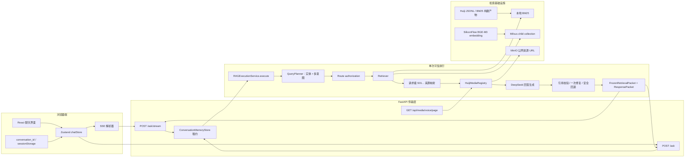
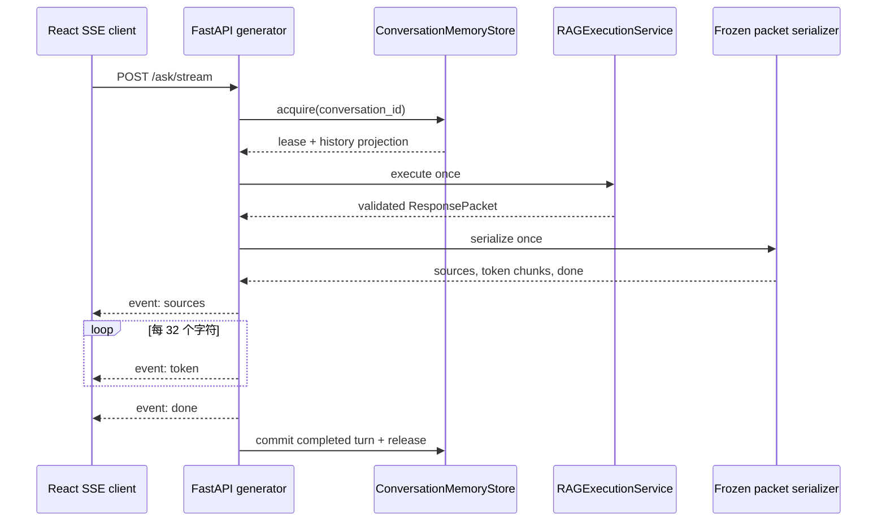

# 1999Search RAG 问答链路分析

> 文档类型：项目现状理解 / 架构分析
>
> 快照日期：2026-07-20
>
> 分析对象：`1999Search` 当前工作区中的生产问答链路
>
> 状态口径：代码事实优先，spec 用于判断目标差距

## 1. 先说结论

当前 RAG 问答链路已经形成了完整的线上闭环：React 前端提交问题，FastAPI 获取会话租约，查询规划器识别实体与多意图，检索器执行结构化取数和 BM25/Milvus 混合检索，结果经过归属约束、预算分配、媒体绑定后生成请求级来源编号，回答模型产出草稿，再经过引用校验/修复，最终冻结成同一份响应包供同步 JSON 或 SSE 序列化。

但按照最新可信执行管线 spec 的完成标准，当前状态仍应判断为：**主体已实现，P0 真实全链路验收未通过**，不能宣布整条链路完成。主要依据是：

- 2026-07-17 在当前工作区运行的两组聚焦测试共 **368 项通过**，说明主要模块契约已有较强自动化覆盖。
- 最新保存的真实全链路报告仍为 **SEV-1 / accepted=false**；主要失败包括无依据陈述、意图丢失、媒体类型不符、阶段 span 不完整，以及一次记忆绝对门禁失败。
- SSE 已与同步接口共享同一个冻结后的响应包，但它是“**回答全部生成并校验完成后，再按 32 字符切片发送**”，不是模型 token 级实时流式输出。
- 会话存储具备租约、TTL、LRU、并发隔离与完成后提交机制；不过当前历史实体锚点没有排除 `ungrounded` 轮次，和 spec 的信任边界存在缺口。
- 可观测性已经有阶段耗时和几个关键时间点，但 span 属性完整度和 `model_first_token_ms` 的真实语义仍未达到最新 spec。

因此，对维护者最准确的心智模型不是“一个普通的向量检索 + LLM”，而是：**以实体 owner、意图策略、来源映射、引用验证和冻结响应为核心信任边界的检索执行管线；部分边界仍在收口和真实验收中。**

## 2. 分析范围与证据优先级

### 2.1 本文覆盖

- React 聊天页到 FastAPI 的同步与 SSE 请求。
- 单轮执行服务、会话记忆、查询规划、路由授权。
- 结构化检索、BM25、Milvus 稠密检索、融合、扩展与预算分配。
- 来源编号、回答生成、引用校验/修复、安全回退。
- Huiji 媒体挂载与语音分页。
- 冻结数据契约、传输序列化、追踪和全链路评测。
- 现有代码和当前 spec 的一致性、风险与调试入口。

离线 Huiji 数据构建和 Milvus 入库只作为线上链路的上游边界说明，不在本文展开其抓取、清洗和构建算法。

### 2.2 证据优先级

发生冲突时，本文按以下顺序判断：

1. **当前运行时代码和配置**：回答“现在实际会怎样执行”。
2. **自动化测试与真实评测报告**：回答“哪些契约已被验证”。
3. **最新有效 spec**：回答“目标应该是什么、还有什么差距”。
4. **较早设计稿和计划**：只用于理解演进背景，不推定已经实现。

主要目标契约是 [2026-07-15 可信执行管线 V2 spec](../superpowers/specs/2026-07-15-rag-trustworthy-execution-pipeline-v2-design.md)，并结合父子块混合检索、多意图、短期记忆和全链路评测 spec。较早的 [2026-06-25 RAG 设计稿](../superpowers/specs/2026-06-25-1999search-rag-design.md) 已在文件中标为过时，不作为当前实现基线。

### 2.3 状态标签

| 标签 | 含义 |
|---|---|
| 已实现 | 当前生产路径存在对应代码，并有聚焦自动化验证 |
| 部分实现 | 主体代码存在，但契约、失败边界或真实证据不完整 |
| 未完成验收 | 不能按 spec 的 P0 完成定义宣布通过，通常仍有真实数据门禁失败 |
| 设计漂移 | 当前实际行为与 spec、字段名称或旧文档表达不一致 |

## 3. 系统边界与整体架构

这张图中有三个特别重要的边界：

1. `RAGExecutionService` 才是同步与 SSE 共用的生产执行核心；`RAGChain` 中仍保留的 `_ask_v1`、旧 `ask`/流式辅助逻辑不是当前 FastAPI 入口的主路径。
2. `ResponsePacket` 在回答与引用验证之后被冻结；传输层只能投影和分片，不能再重跑检索或修改回答。
3. Huiji 媒体不是回答知识证据。媒体必须同时满足 owner、最终来源和安全 URL 约束，引用证据仍来自 `source_map`。

## 4. 上游数据与运行配置

线上链路依赖两类预先构建的数据：

| 数据 | 当前用途 | 主要位置 |
|---|---|---|
| `parent_blocks.jsonl` | 实体词典、父块和分层扩展 | `data/processed/huiji/dev/` |
| `child_blocks.jsonl` | BM25 文档、child/parent/owner 元数据 | `data/processed/huiji/dev/` |
| `media_assets.jsonl` | 图片、视频、语音的实体和来源绑定 | `data/processed/huiji/dev/` |
| `indexes/child_text_bm25.json` | 本地稀疏检索 | 同一构建目录 |
| Milvus collection | child 稠密向量检索 | `text_child_bge_m3_v3` |

路径契约由 [`src/huiji_rag/io.py`](../../src/huiji_rag/io.py) 的 `build_paths` 统一组装。当前 `dev` 构建中三个主要 JSONL 文件均存在；最新真实评测预检记录的 Milvus 行数为 16,010。

当前默认运行配置见 [`config/settings.yaml`](../../config/settings.yaml)：

- embedding：SiliconFlow OpenAI-compatible API，模型 `BAAI/bge-m3`。
- 生产 RAG 模型：DeepSeek `deepseek-v4-flash`，通过 `thinking.type=disabled` 显式关闭思考模式。
- Milvus：数据库 `reverse1999_rag`，collection `text_child_bge_m3_v3`。
- 稀疏和稠密候选默认各 40，融合后候选 60，最终上下文字符预算 9,000。
- reranker 默认关闭；配置的模型为 `BAAI/bge-reranker-v2-m3`。
- Huiji 数据与媒体注册表默认开启；语音首页默认 8 条，单页最多 20 条。

API key 和 MinIO 凭证由 [`config/config.py`](../../config/config.py) 接受环境变量覆盖，配置对象使用进程级缓存。服务启动时会尝试加载 Milvus、Retriever 和 RAGChain；加载失败不会阻止进程启动，但问答接口会返回 503。

## 5. 两条请求路径

### 5.1 同步 `/ask`

同步入口位于 [`backend/main.py`](../../backend/main.py)：

1. `_ensure_loaded()` 确保向量库、检索器和链路已经初始化。
2. 以 `conversation_id` 从 `ConversationMemoryStore` 获取独占租约和只读历史投影。
3. 构造 `AskExecutionInput`，把问题、分类、路由开关、动作和记忆状态交给 `RAGChain.execute()`。
4. 执行服务返回经过验证的 `ResponsePacket`。
5. `response_packet_to_public_dict()` 只投影允许公开的字段，并用 `AskResponse` 再次校验。
6. 仅当响应可提交时构造 `ConversationTurn`；随后标记可见、完成时间并释放租约。

同步入口没有把所有异常转换成自定义 JSON。未被核心链路吸收的异常会交给 FastAPI 默认异常处理，因此客户端通常得到 500。

### 5.2 SSE `/ask/stream`

SSE 入口由 [`backend/sse.py`](../../backend/sse.py) 的 `rag_stream_generator()` 实现：

这里的“流式”需要准确理解：

- 回答模型使用同步 `.invoke()`；完整回答生成后才标记 `model_first_token_ms`。
- 引用验证/修复和响应冻结发生在任何用户可见 token 之前。
- 序列化器再把最终回答按 32 个字符分片为 `token` 事件。
- 事件固定为 `sources -> token* -> done`；拼接 token 必须精确等于冻结包中的答案。
- 客户端在 `done` 前断开时，该轮不会提交到会话记忆。

这个设计优先保证“用户看见的每个字符都来自已经校验的答案”，代价是首个可见 token 会等待完整模型回答和引用校验，因此它不是低延迟的模型原生流。

### 5.3 前端的实际调用

[`frontend/react-app/src/store/chatStore.ts`](../../frontend/react-app/src/store/chatStore.ts) 负责消息状态、终止请求、动作重试和服务端会话清理；[`frontend/react-app/src/api/sse.ts`](../../frontend/react-app/src/api/sse.ts) 负责解析 SSE。

前端请求 `/api/ask/stream`，Vite 代理在 [`frontend/react-app/vite.config.ts`](../../frontend/react-app/vite.config.ts) 中去掉 `/api` 前缀，最终到达后端 `/ask/stream`。`conversation_id` 保存在 `sessionStorage` 并通过 `BroadcastChannel` 协调；清空对话时会终止当前请求、调用服务端 DELETE，再旋转新的会话 ID。

## 6. 单次执行的阶段拆解

### 6.1 查询规划：把自然语言变成检索计划

[`src/rag/query_plan.py`](../../src/rag/query_plan.py) 的 `QueryPlanner` 输出 `QueryPlan`，核心字段包括：

- 原始问题、规范化问题和上下文改写方式。
- 实体名称、`entity_type`、`entity_id`、别名与解析方式。
- 主意图、次意图和保持顺序的多意图列表。
- 结构化、稀疏、稠密和媒体查询。
- packet policy、层级、目标 parent、拟议路由和规划状态。

规划采用“确定性规则 + 可选 LLM”组合：

- 显式关键词先识别意图，LLM 不能删除用户明确表达的意图。
- `EntityLexicon` 使用 `(entity_type, entity_id)` 作为 owner 身份；同名多 owner 时保持未解析，而不是猜测。
- 当前问题中的明确实体优先于历史实体。
- 只有被判定为上下文追问且分类兼容时，才可使用历史实体锚点。
- 规划 LLM 最多尝试两次；无 key、超时、解析失败或 schema 不合法时进入确定性 fallback。
- 传给规划器的历史只有问题、独立问题和意图摘要，不把旧回答当事实证据。

### 6.2 路由授权：用户控制能力，不替检索结果作假

[`src/rag/route_policy.py`](../../src/rag/route_policy.py) 将“拟议路由”“用户授权”和“检索结果”分开。简化后的决策如下：

| 条件 | 最终行为 | grounding |
|---|---|---|
| 正常/扩展检索且找到来源 | `rag_grounded` 或 `expanded_rag` | grounded |
| 用户仅开启 `free_supplement`，且检索非空 | 仍使用 RAG，不跳过证据 | grounded |
| 用户开启 `free_supplement`，且检索为空 | 允许 `llm_general` | ungrounded |
| 用户执行“强制自由补充”动作 | 可直接走 `llm_general` | ungrounded |
| 检索执行失败 | 保持 grounded 路由语义，返回固定失败说明 | none |

因此，“自由补充”是明确授权后的退路，不是检索效果不好时自动绕过 RAG 的隐式开关。

### 6.3 检索：多意图、owner 约束和确定性预算

[`src/rag/retriever.py`](../../src/rag/retriever.py) 的 Huiji 主路径大致按以下顺序执行：

1. 根据所有请求意图组合 packet policy。
2. 对适合的意图执行结构化精确取数。
3. 计算动态候选数：不低于配置值，通常为所需来源数的 4 倍，上限 100。
4. 分别取得本地 BM25 与 Milvus 稠密结果。
5. 在融合前后应用 owner/目标 parent 约束。
6. 用加权 RRF 合并候选，并增加实体、意图匹配奖励和质量惩罚。
7. 可选 rerank；当前默认不启用。
8. 在 policy 允许范围内扩展 sibling 或 parent section。
9. [`src/rag/retrieval_budget.py`](../../src/rag/retrieval_budget.py) 先满足各意图配额，再在来源数和字符预算内稳定分配。
10. 输出覆盖不足诊断和可继续展开的 action。

owner 约束是这里最关键的防串实体机制：一旦实体解析为明确 `(entity_type, entity_id)`，缺 owner、owner 不匹配或目标 parent 不匹配的结果都会被过滤；最终来源还会再次断言所有权一致。对于必须有实体 owner 的意图，如果实体未解析，系统宁愿返回空和 coverage shortfall，也不做全局补齐。

BM25 和 dense 融合由 [`src/rag/hybrid.py`](../../src/rag/hybrid.py) 实现，默认权重分别为 1.2 和 1.0。最终上下文不是简单 top-k 拼接，而是受“意图覆盖、最大来源数、字符预算、层级 policy”共同约束。

### 6.4 来源映射：引用 ID 是请求级能力

检索和预算分配完成后，[`src/rag/citations.py`](../../src/rag/citations.py) 才按最终稳定顺序分配 `S01`、`S02`……：

- ID 只在本次请求内有效，不能跨轮复用。
- prompt 上下文以 `[Snn]` 作为证据块头。
- 对外 source 同时带 citation ID、标题、片段、child/parent/owner 等元数据。
- 历史回答中的 `[Snn]` 会被中和，防止旧轮编号伪装成本轮证据。

这个顺序避免了“先编号、后排序/裁剪”造成回答引用与 UI 来源错位。

### 6.5 媒体绑定：附件不是自由搜索结果

[`src/assets/huiji_registry.py`](../../src/assets/huiji_registry.py) 的 `HuijiMediaRegistry` 只允许挂载同时满足以下条件的媒体：

- 资源标记为可用且不是公共兜底项。
- URL 是允许公开的 HTTP(S) 地址。
- owner 与已解析实体一致。
- child 或 parent 与本轮最终来源集合存在绑定。
- 类型属于请求意图和 packet policy 允许的集合。

语音分页由 [`src/assets/voice_pagination.py`](../../src/assets/voice_pagination.py) 管理。游标是带 build version 的不透明进程内状态；分页接口不重新检索、不调用 LLM。构建版本变化返回 409，无效游标返回 400，服务不可用返回 503。

### 6.6 回答生成：历史可帮助理解，但不是知识证据

[`src/rag/execution.py`](../../src/rag/execution.py) 的 `RAGExecutionService` 只执行一次检索，然后按结果进入不同分支：

- **检索失败**：返回固定不可用说明，不调用回答 LLM。
- **缺少回答 API key**：返回固定配置说明。
- **空检索 + 已授权自由补充**：调用 LLM，按 ungrounded 模式校验，禁止引用本轮来源 ID。
- **空检索 + 未授权自由补充**：返回“资料不足/请明确实体”类固定说明。
- **有来源**：把当前证据和标记为“非证据”的历史传给 DeepSeek，失败最多重试一次。

回答草稿在引用验证前还会经过确定性后处理，包括原始结构化值保护、媒体/语音范围修正、限定词保留、无依据归因中和、答案范围修正和覆盖不足披露。prompt 的核心约束定义在 [`src/rag/prompts.py`](../../src/rag/prompts.py)：只根据证据回答、事实附近给出 `[Snn]`、历史不可作为事实来源、不可擅自补单位或解释原始字段。

### 6.7 引用校验与安全回退

grounded 回答必须引用当前 `source_map` 中存在的 ID。校验流程为：

1. 确定性格式规范化。
2. 检查引用是否存在、是否需要引用、是否出现畸形 S-like 标记。
3. 如配置了修复器，最多进行一次 LLM 引用修复。
4. 再次校验；仍不合格则返回引用安全回退答案。

ungrounded 回答不得携带 `[Snn]`，系统会移除 S-like token。只有“校验有效且不是 citation safe fallback”的 grounded 回答，才会成为可提交的 grounded 轮次。

## 7. 核心数据契约与不可变边界

| 契约 | 产生位置 | 作用 |
|---|---|---|
| `AskExecutionInput` | API/SSE 入口 | 冻结本次问题、分类、路由授权、动作和记忆摘要 |
| `QueryPlan` | `QueryPlanner` | 统一承载实体、意图、查询、policy 和规划状态 |
| `RouteAuthorization` | 路由策略 | 表达用户究竟授权了哪些扩展或自由回答能力 |
| `RouteDecision` | 检索结果之后 | 固化最终路由、outcome 和原因 |
| `SourceRef` | 来源映射阶段 | 绑定请求级 citation ID 与 owner/source 元数据 |
| `FrozenRetrievalPacket` | 执行服务 | 冻结计划、路由、来源、媒体、诊断和动作 |
| `CitationValidation` | 引用校验 | 记录有效性、已用引用和警告 |
| `ResponsePacket` | 执行服务 | 冻结检索包、最终答案、grounding 和轮次结果 |
| `ConversationTurn` | 响应完成后 | 仅保存可提交轮次所需的截断字段 |

这些核心 dataclass 定义在 [`src/rag/contracts.py`](../../src/rag/contracts.py)，嵌套可变值会递归冻结。对外传输由 [`src/rag/serializers.py`](../../src/rag/serializers.py) 采用白名单投影，而不是直接序列化内部对象。同步 JSON 和 SSE 均从同一 `ResponsePacket` 产生，这是当前“检索只执行一次、两种传输不漂移”的关键保证。

## 8. 会话记忆的边界

[`src/rag/conversation.py`](../../src/rag/conversation.py) 实现进程内短期记忆：

- 每个会话最多 6 轮，TTL 30 分钟，最多 4,096 个会话。
- 单个问题、回答、存储总量和投影总量都有字符上限。
- 每个 `conversation_id` 使用独占异步锁和 generation compare-and-set。
- 同一会话的并发请求串行，不同会话可以并行。
- clear 会使进行中的旧租约失效，防止清空后旧请求反向写回。
- release 幂等；只有完成且可提交的 grounded/ungrounded 轮次进入历史。
- SSE 在 `done` 之前断开时不提交。
- 存储不持久化，进程重启即丢失。

历史只用于两件事：帮助 planner 把安全的追问改写成独立问题，以及给 answer LLM 提供对话连贯性。历史助手回答会加“非证据”前缀，旧引用 ID 会失效。

当前有一个重要信任边界缺口：`ConversationProjection.last_entity_ref` 会从最近轮次取实体，但没有过滤 `grounding_mode`；而成功的自由补充轮次可以以 `ungrounded` 状态写入并带实体。这意味着未落地到证据的轮次有机会成为下一轮实体锚点，与最新 spec 中“ungrounded 不得锚定后续实体事实”的目标不完全一致。

## 9. 失败、降级与客户端表现

| 失败点 | 当前行为 | 判断 |
|---|---|---|
| 启动时 Milvus/embedding/索引加载失败 | 服务保持启动，`/health` 为 error；问答返回 503 | 已实现的启动降级 |
| 规划 LLM 不可用、超时或输出非法 | 最多两次尝试后使用确定性 fallback | 已实现 |
| 明确 owner 无法解析 | owner-required 意图返回空与 shortfall，不全局补齐 | 已实现的安全失败 |
| 已识别的检索执行错误 | 固定检索失败回答，无来源、无回答 LLM | 已实现；有隔离探针证据 |
| 其他未归一化检索异常 | 可能继续向 API 层传播 | 部分实现 |
| 回答 LLM 两次均失败 | 包内返回异常类型和校验失败警告，不提交轮次 | 已实现，但错误文案契约需收口 |
| 引用两阶段校验仍失败 | 使用 citation-safe fallback，不提交 grounded 轮次 | 已实现 |
| SSE 核心执行抛异常 | 发 `error` 事件并释放租约 | 已实现，但当前会拼入原始异常文本 |
| 客户端在 SSE `done` 前断开 | 不提交会话轮次 | 已实现 |
| 语音游标无效/构建变化/服务不可用 | 分别返回 400/409/503 | 已实现 |

需要注意两处公开错误信息：`planning_error` 会保存规划异常的 `str(exc)`，SSE error 也会包含 `str(exc)`。虽然公共 schema 有递归 sanitizer、trace 属性有白名单，但这两个自由文本路径仍可能暴露上游 URL、本地路径或服务返回细节，应统一改成稳定错误码和安全文案。

## 10. 可观测性与性能语义

[`src/rag/tracing.py`](../../src/rag/tracing.py) 使用单调时钟记录阶段 span，并只允许白名单标量属性。公共 timing 包含：

- `model_first_token_ms`
- `validated_ready_ms`
- `visible_first_token_ms`
- `completed_ms`
- 各阶段累计 `stage_ms`
- error stage 和 instrumentation warning

当前实现有两处需要防止误读：

1. `model_first_token_ms` 在同步 `.invoke()` 完整返回后才记录，实际更接近“模型完整响应返回时间”，并不是真正的模型首 token。
2. `visible_first_token_ms` 对 SSE 有明确含义；同步 `/ask` 则是在整个响应准备好后标记。两者可用于比较“何时可见”，但不能等同原生流式 TTFT。

追踪初始化失败会降级为 `NullTrace`，不阻断业务；然而单个 span 的非法属性或记录异常并未普遍 fail-open。最新真实评测也确认部分必需阶段/属性尚未完整上报。

## 11. spec 对齐矩阵

以下判断遵循 [spec 与 plan 审阅指南](../specs-and-plans-review-guide.md) 的原则：代码、自动化测试和真实数据验收必须同时满足，P0 才能宣称完成。

| 模块 | 当前代码事实 | 自动化/真实证据 | 状态 |
|---|---|---|---|
| 查询规划与实体解析 | 规则 + LLM、owner 身份、歧义拒绝、历史安全改写均已存在 | 聚焦测试通过；真实评测仍有 2 个 intent loss 聚类 | 部分实现 |
| 多意图混合检索 | 结构化 + BM25 + dense + RRF + owner gate + 分层扩展 + 预算分配 | 聚焦测试通过；M2=97.75，SEV-2，检索 P95 略超门槛 | 部分实现 |
| 路由授权与失败分类 | 授权、outcome、最终路由分离；检索失败不调用回答模型 | 单测通过；同步/SSE 隔离失败探针通过 | 已实现 |
| 来源映射与引用闭环 | 最终排序后分配 S-ID；一次修复；安全回退；历史引用失效 | 单测通过；M3=96.74，但出现 `ANSWER.UNGROUNDED_CLAIM` | 未完成验收 |
| 执行冻结与传输一致性 | 检索一次，冻结一次，同步/SSE 共用序列化来源 | 契约和 SSE 测试通过 | 已实现 |
| SSE 可见性边界 | 校验后才对用户发 token | 测试通过；但不是模型原生流，TTFT 指标语义漂移 | 设计漂移 |
| 短期会话记忆 | 租约、TTL/LRU、并发隔离、clear 失效、完成后提交 | 单测/API/SSE 测试通过；真实评测一次 memory absolute gate 失败 | 部分实现 |
| Huiji 媒体与语音分页 | owner + source 绑定、安全 URL、类型 policy、游标分页 | 单测通过；M4=96.85，SEV-2，存在 unexpected type/缺页问题 | 部分实现 |
| 可观测性 | 单调时钟、阶段 span、公开 timing、属性白名单 | 单测通过；M5=97.55，SEV-2，span 不完整 | 部分实现 |
| 全链路评测门禁 | evaluator、快照比较、隔离探针和模块评分已具备 | 最新保存报告为 SEV-1、accepted=false | 未完成验收 |
| 公共数据安全 | 白名单 serializer、schema 校验、递归 sanitizer、trace 属性限制 | 单测覆盖主要路径；仍有两个原始异常文本出口 | 部分实现 |

## 12. 当前发现与优先级

下面的 ID 是本文的稳定发现编号，不代表已经进入实施计划。

### FINDING-P0-01：真实全链路门禁仍为 SEV-1

最新保存报告中，M3 出现 `ANSWER.UNGROUNDED_CLAIM`，全局 `accepted=false`。按现有 spec 的 P0 定义，不能仅凭单测通过宣布可信执行管线完成。应优先复现两个无依据陈述案例，判断根因位于检索覆盖、prompt、确定性后处理、引用 validator 还是 judge 口径。

### FINDING-P0-02：ungrounded 轮次可能成为历史实体锚点

成功自由补充轮次允许提交为 `ungrounded`；`last_entity_ref` 取历史实体时未按 grounding 过滤。后续代词追问可能继承一个未经证据落地的实体上下文。建议让实体锚点只来自 grounded 轮次，或显式区分“对话实体”与“事实可信实体”。

### FINDING-P1-01：首 token 指标名称与实现语义不一致

当前回答模型是同步调用，`model_first_token_ms` 实际在完整响应返回后标记。这个字段会误导性能分析和门禁判断。应改名为模型完成时间，或接入模型原生流并在第一个模型 chunk 到达时记录。

### FINDING-P1-02：必需 span 与属性仍不完整

最新 M5 报告包含 `RELY.STAGE_SPAN_INCOMPLETE`；实际代码中部分 span 只记录阶段名或少量候选数，尚未完整覆盖 spec 要求的 route/retrieval/source/citation 属性。应先对照 V2 spec 建立必需 span/属性清单，再补充不含 prompt、路径和正文的安全字段。

### FINDING-P1-03：原始异常文本存在公开出口

`planning_error` 和 SSE `error.message` 可能携带 `str(exc)`。建议内部日志保留异常类和关联 trace ID，对客户端只返回稳定 code、stage 和安全文案。

### FINDING-P1-04：非 S 形式的方括号标签校验偏宽松

当前 validator 重点拒绝未知/畸形 S-like 引用；普通 `[标题]` 一类方括号会被保留。如果答案同时含一个合法 `[Snn]`，这类标题式标签未必导致整体校验失败。最新 spec 强调只有请求级 source ID 才是有效引用，因此需要确认“保留普通方括号文本”和“拒绝伪引用标签”之间的精确规则。

### FINDING-P2-01：可选 reranker 的稳定排序契约不够显式

默认 reranker 关闭，所以当前主路径不受影响；启用后排序主要按 score，依赖 Python 稳定排序继承输入顺序，没有把稳定 source/child ID 写成明确次级键。若将 reranker 打开，应补充相同分数的确定性 tie-break 测试。

### FINDING-P2-02：最新评测指针不是可靠真源

评测目录中 `current-v2-root.txt` 仍指向较早运行，而按目录时间更新的最新保存运行是 `trust-v2-final-20260716-042747/...`。自动化或人工分析若只读指针，可能引用过期结论。应让评测完成流程原子更新指针，或用显式 run manifest 选择报告。

## 13. 最新验证证据

### 13.1 本次聚焦测试

2026-07-17 在当前工作区、`1999wiki` conda 环境运行：

- 核心 RAG、路由、引用、记忆、SSE、媒体等测试：**246 passed**。
- 全链路 evaluator 单元测试：**122 passed**。
- 合计：**368 passed**。

这些测试证明当前工作区中的模块契约和主要传输路径可运行，但不替代真实 Milvus、embedding、LLM、judge 和媒体服务组合下的门禁。

### 13.2 最新保存的真实全链路运行

证据文件：[evaluation_report.v2.md](../../eval/rag_full_chain/trust-v2-final-20260716-042747/20260715T204125Z-a10e3a81/evaluation_report.v2.md)

| 项目 | 结果 |
|---|---|
| 全局结果 | SEV-1，`accepted=false` |
| 用例数 | 59 |
| snapshot 比较 | 相等 |
| M1 | PASS |
| M2 检索 | 97.75，SEV-2 |
| M3 回答/引用 | 96.74，SEV-1 |
| M4 媒体 | 96.85，SEV-2 |
| M5 可靠性 | 97.55，SEV-2 |
| 隔离检索失败探针 | 同步与 SSE 均通过；无来源、无回答 LLM、HTTP 200 |
| 预检 | Milvus、LLM、MinIO 可用；doc_count=16,010 |

报告中的主要聚类为：2 个无依据陈述、2 个意图丢失、2 个阶段 span 不完整、2 个答案质量低于门槛、1 个记忆绝对门禁失败，以及媒体类型/语音分页异常。

性能上，检索 P95 为 5,121.56 ms，略高于 5,000 ms 目标；可见首 token P95 为 24,341.39 ms，高于 15,000 ms 目标；总耗时 P95 为 24,454.82 ms，仍低于 45,000 ms 上限。planner LLM P95 约 15.43 s，是当前主要延迟来源，dense P95 约 4.98 s，answer P95 约 8.72 s。

这份报告是“最新保存的真实证据”，不等于 2026-07-17 当前未提交工作区的重新验收结果；本次没有重新调用外部 LLM/judge 跑一轮完整评测。

## 14. 调试入口

| 现象 | 首查位置 | 建议观察 |
|---|---|---|
| 服务启动后问答 503 | `backend/main.py::_ensure_loaded`、`/health`、`src/rag/vectorstore.py` | Milvus URI、collection、embedding key、doc_count |
| 实体串线或同名角色错误 | `entity_lexicon.py`、`ownership.py`、`QueryPlan` | entity_type、entity_id、resolution_mode、owner filter |
| 用户问多个内容但只回答一个 | `query_plan.py`、`packet_policy.py`、`retrieval_budget.py` | requested_intents、per-intent quota、coverage_shortfall |
| 检索结果为空 | `Retriever.search` 和 route diagnostics | structured 命中、BM25/dense 候选、owner gate、candidate_k |
| 回答引用错位 | `citations.py`、`serializers.py` | source_map 最终顺序、S-ID、used citation IDs |
| SSE 与同步结果不一致 | `execution.py`、`serializers.py`、`backend/sse.py` | 是否复用同一 packet、token 拼接是否等于 answer |
| 追问继承了错误实体 | `conversation.py`、`query_plan.py` | lease projection、grounding_mode、last_entity_ref、rewrite_mode |
| 图片/语音属于别的实体 | `huiji_registry.py`、`voice_pagination.py` | owner、child/parent binding、allowed type、build version |
| 首 token 很慢 | `timing.stage_ms`、planner/dense/answer span | 注意当前模型首 token 字段其实是完整 invoke 返回时间 |
| 真实评测和单测结论冲突 | evaluator report、run manifest、snapshot | 是否读取最新 run、服务/模型/数据构建版本是否一致 |

建议优先运行与现象最接近的测试文件，而不是一开始就跑全套：

- 规划/实体：`tests/test_query_plan.py`
- 检索/预算/owner：`tests/test_retriever.py`、`tests/test_retrieval_budget.py`、`tests/test_entity_ownership.py`
- 路由/引用/冻结契约：`tests/test_route_policy.py`、`tests/test_citations.py`、`tests/test_rag_contracts.py`、`tests/test_rag_execution.py`
- 记忆/API/SSE：`tests/test_conversation_memory.py`、`tests/test_conversation_api.py`、`tests/test_sse.py`
- 媒体：`tests/test_huiji_media_registry.py`
- 追踪与评测：`tests/test_rag_tracing.py` 以及 `tests/rag_eval/`

## 15. 代码导航地图

| 关注点 | 入口 |
|---|---|
| FastAPI 同步、SSE、健康检查、清会话 | [`backend/main.py`](../../backend/main.py) |
| SSE 事件生成和断连提交规则 | [`backend/sse.py`](../../backend/sse.py) |
| 公共请求/响应 schema 与 sanitizer | [`backend/schemas.py`](../../backend/schemas.py) |
| 生产链路编排 | [`src/rag/chain.py`](../../src/rag/chain.py) |
| 单次执行、答案分支、冻结响应 | [`src/rag/execution.py`](../../src/rag/execution.py) |
| 不可变内部契约 | [`src/rag/contracts.py`](../../src/rag/contracts.py) |
| 同步/SSE 公共序列化 | [`src/rag/serializers.py`](../../src/rag/serializers.py) |
| 查询规划 | [`src/rag/query_plan.py`](../../src/rag/query_plan.py) |
| 实体词典 | [`src/rag/entity_lexicon.py`](../../src/rag/entity_lexicon.py) |
| 检索主流程 | [`src/rag/retriever.py`](../../src/rag/retriever.py) |
| BM25/dense 融合与可选 rerank | [`src/rag/hybrid.py`](../../src/rag/hybrid.py) |
| owner 约束 | [`src/rag/ownership.py`](../../src/rag/ownership.py) |
| packet policy | [`src/rag/packet_policy.py`](../../src/rag/packet_policy.py) |
| 意图预算 | [`src/rag/retrieval_budget.py`](../../src/rag/retrieval_budget.py) |
| 分层扩展 | [`src/rag/layered_expansion.py`](../../src/rag/layered_expansion.py) |
| prompt | [`src/rag/prompts.py`](../../src/rag/prompts.py) |
| 来源编号与引用验证 | [`src/rag/citations.py`](../../src/rag/citations.py) |
| 会话记忆 | [`src/rag/conversation.py`](../../src/rag/conversation.py) |
| 阶段追踪 | [`src/rag/tracing.py`](../../src/rag/tracing.py) |
| Milvus 适配与 embedding | [`src/rag/vectorstore.py`](../../src/rag/vectorstore.py)、[`src/rag/embeddings.py`](../../src/rag/embeddings.py) |
| 媒体注册表与语音分页 | [`src/assets/huiji_registry.py`](../../src/assets/huiji_registry.py)、[`src/assets/voice_pagination.py`](../../src/assets/voice_pagination.py) |

## 16. 术语表

| 术语 | 本项目中的含义 |
|---|---|
| owner | 实体稳定身份 `(entity_type, entity_id)`，用于防止同名或跨实体污染 |
| intent | 用户本轮请求的内容类型，如 profile、skill、voice、media |
| packet policy | 某意图允许取哪些 section、层级、媒体类型和多少来源 |
| structured retrieval | 按实体和结构字段精确取数，不依赖相似度排序 |
| BM25 | 本地稀疏关键词检索 |
| dense retrieval | 对查询做 embedding 后在 Milvus 搜索 child 向量 |
| RRF | Reciprocal Rank Fusion，用排名而不是原始分数融合多路候选 |
| source map | 最终来源到请求级 `S01...` 引用 ID 的稳定映射 |
| grounded | 回答中的知识事实必须由本轮来源支撑并通过引用校验 |
| ungrounded | 用户显式授权的通用回答，不得伪装成本轮 RAG 证据 |
| frozen packet | 回答校验完成后不可再变更的内部响应对象 |
| coverage shortfall | 某些已请求意图没有足够来源时的结构化缺口记录 |
| conversation lease | 同一会话串行执行、完成后条件提交的并发控制凭证 |
| visible TTFT | 客户端首次看到回答字符的时间；当前不等同模型原生首 token |

## 17. 阅读这条链路时最容易产生的三个误解

1. **误解：SSE 会边生成边把模型 token 发给前端。** 事实是先完整生成、校验、冻结，再切片发送。
2. **误解：历史回答可以补足当前检索证据。** 事实是历史只用于改写和连贯性，不能成为当前事实来源。
3. **误解：计划文件里有任务就等于代码还没实现，或单测通过就等于 spec 已完成。** 计划勾选状态、代码存在、聚焦测试和真实全链路验收是四种不同证据，必须分别判断。

---

本文描述的是 2026-07-20 当前工作区快照。后续若可信执行 V2 的 P0 风险被修复并通过新的真实评测，应优先更新第 1、11、12、13 节，而不是只修改结论中的状态词。
