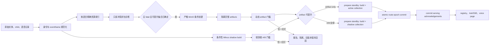
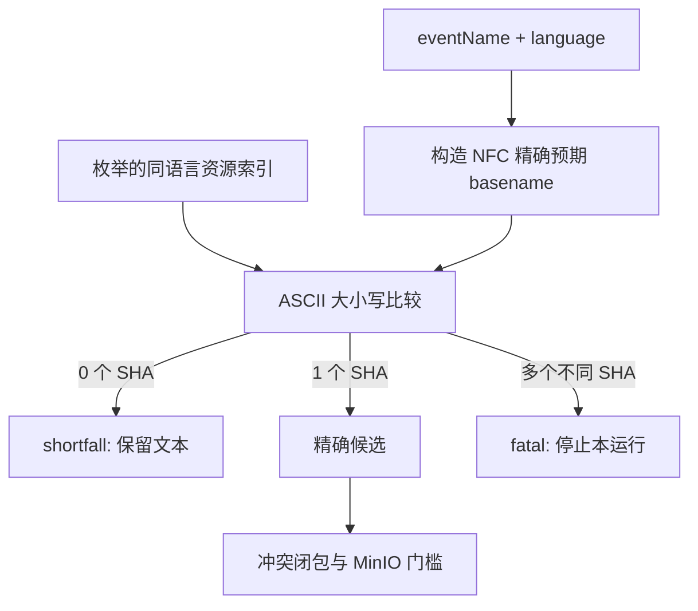
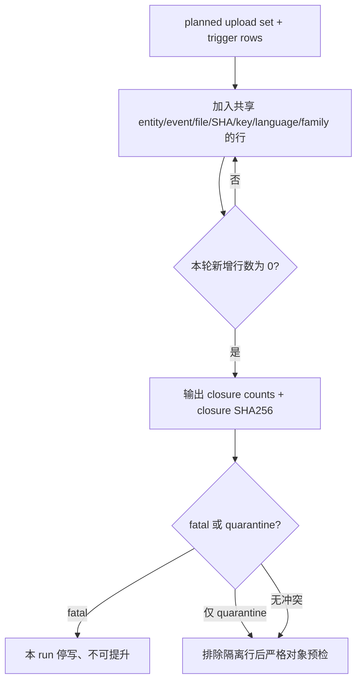
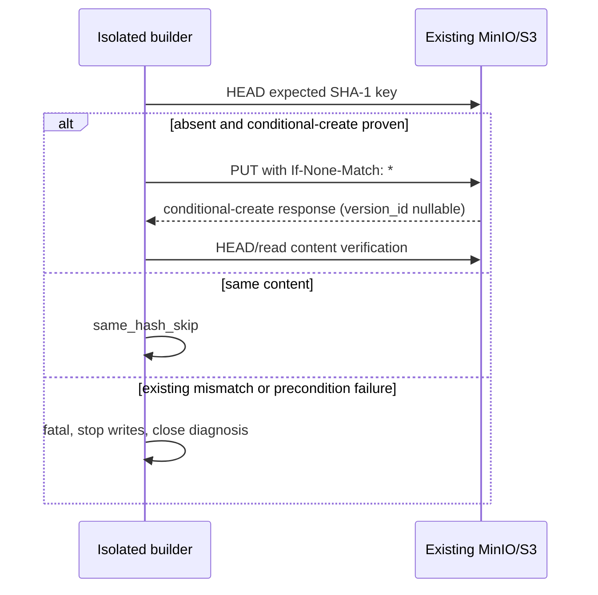
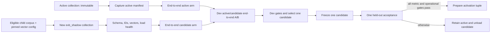
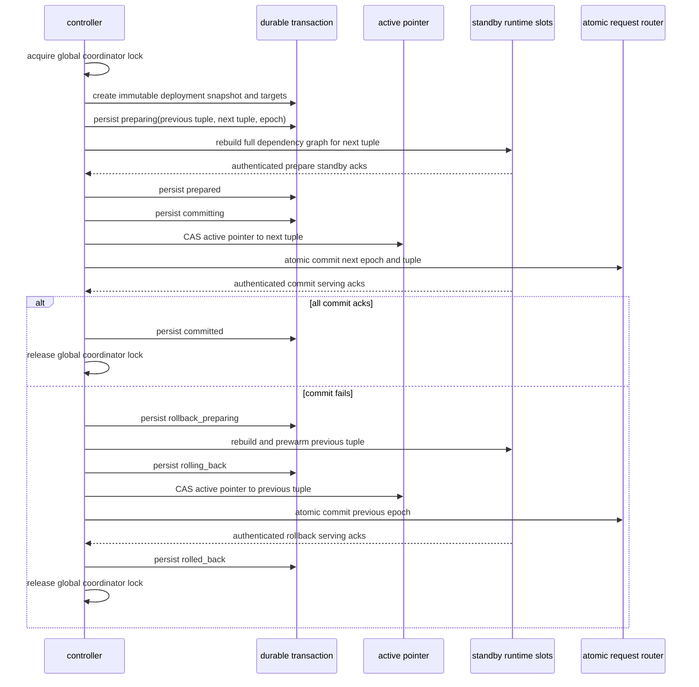

# eventName 语音绑定恢复设计

日期：2026-07-11  
状态：已批准设计。后续 implementation plan 只能执行本文件的 P0 条目。  
范围：`1999Search` 的语音媒体恢复、MinIO 加法补齐、隔离 artifact 构建、运行时 registry
与既有多意图语音分页兼容。

## 1. 背景、事实与目标

丢失的 builder 字节码曾把 audio ID 的末两位用于猜测基础 `mainvoc` 或
`fightingvoc` 文件名。它把 audio ID 错当作命名事实，并忽略源记录的 `eventName` 与皮肤
语境。该逻辑能产生看似可用的音频 URL，却会把正确资源绑定到错误 child、事件或皮肤。

本恢复以源记录的 `eventName` 为唯一命名权威：audio ID 只用于识别已由非媒体数据投影
确定的 child。所有资源绑定必须由语言、精确预期文件名和内容证据决定；任何猜名均不
产生关联。

### 1.1 历史取证观察

下列数值来自一次历史 evidence 快照，描述旧产物的错误分布，不是本次或未来构建的
硬编码期望值：6800 条候选关联、104 个实体、367 个跨 child 媒体 ID；其中 exact 为
3292，correct resource present but missing attachment 为 2176，disjoint wrong 为 188，
partial/extra 为 43，guessed attachment without exact resource 为 60，neither 为 1041。

- `EVB-BASELINE-P0-01`：历史证据必须固定保存为
  `data/processed/huiji/evidence/eventname_voice_binding_baseline.v1.json`。该文件的
  `schema_version` 必须为 `evb.baseline/v1`，并包含 `source_inventory_sha256`、
  `captured_at`、`observations`、六类计数、`entity_count`、`cross_child_media_id_count`、
  `milvus_observation` 和 `classification_schema`。
- `EVB-BASELINE-P0-02`：每个恢复 build 的 `build_manifest.json` 必须记录上述 evidence
  文件的规范 JSON SHA-256、路径和 schema version。历史 6800、104、367、16010 只能在
  baseline report 中作为 observation 显示；门槛必须从本运行的 before inventory 派生。
- `EVB-BASELINE-P0-03`：新 build 的报告必须重新计算六类分类。2176 类“正确资源存在但
  缺少关联”只能在精确绑定、对象验证和冲突门槛均通过时恢复为 exact；否则必须报告为
  shortfall、quarantined 或 fatal，绝不保留猜测关联。
- `EVB-BASELINE-P0-04`：当前真实 media artifact inventory 观察到 15758 个 media ID，
  且 15758 个均匹配 `media:sha1:<40hex>`。该观察必须写入 baseline evidence；每次 build
  的 before/after media ID 规则由 capture inventory 动态验证，不能把 15758 写成门槛常量。

### 1.2 目标与非目标

- `EVB-SCOPE-P0-01`：恢复可维护源码模块；`.pyc` 只可作为离线取证证据，不能被 import、
  执行、反编译后作为生产源码，或被 runtime 消费。
- `EVB-SCOPE-P0-02`：每次恢复在新的隔离 build 中生成完整 artifact 集；当前 `dev`
  build、其 manifest 和其 registry 均不可就地修改。
- `EVB-SCOPE-P0-03`：当前 active Milvus collection 不可变：不得对其 insert、upsert、
  delete、drop、load 配置、alias、schema 或 index 作任何变更。仅第 8 节定义的全新 shadow
  collection 可被创建、写入、load 和评估；16010 是历史 observation，不是测试中写死的
  预期行数。
- `EVB-SCOPE-P0-04`：不实现皮肤筛选 UI。精确的皮肤 eventName 绑定是 P0；皮肤筛选 UI
  只在第 14 节以 P2 Deferred 保留。

## 2. 术语、语言和文件名协议

### 2.1 规范身份

`canonical_parent_id` 与 `canonical_child_id` 只能由现有非媒体 parent/child 投影得到。
媒体文件名、媒体 ID、旧 registry、`.pyc` 行为和 MinIO 对象都不得改变该投影。

- `EVB-IDENT-P0-01`：audio ID 仅可关联至其规范 child 身份；不得依据末两位、数值、
  格式或任何片段推断文件名、命名族、语言、皮肤或 eventName。
- `EVB-IDENT-P0-02`：每条语音候选必须含 `entity_id`、`canonical_parent_id`、
  `canonical_child_id`、audio ID、`language`、原始 `eventName` 和 build version。
- `EVB-IDENT-P0-03`：规范绑定键固定为
  `(entity_id, canonical_parent_id, canonical_child_id, language, expected_filename_key)`。

### 2.2 语言别名和精确文件名

运行时支持的语言别名必须归一到如下 canonical language 与 filename prefix：

| 输入别名 | canonical language | filename prefix |
| --- | --- | --- |
| `zh`, `cn`, `zh-cn` | `zh` | `Zh` |
| `en`, `en-us` | `en` | `En` |
| `jp`, `ja`, `ja-jp` | `jp` | `Jp` |
| `kr`, `ko`, `ko-kr` | `kr` | `Kr` |
| `tw`, `zh-tw`, `zh_hant`, `zh-hant` | `zh-hant` | `Tw` |

- `EVB-NAME-P0-01`：先对 raw `eventName` 和资源 basename 执行 Unicode NFC；随后把语言
  别名归一。`eventName` 必须是 basename，不能含 `/`、`\\`、NUL、`..` 段或 `.mp3`
  扩展名。
- `EVB-NAME-P0-02`：预期文件名必须精确构造为
  `canonical_prefix + "_" + raw_eventName + ".mp3"`，其中 prefix 分别是 `Zh`、`En`、
  `Jp`、`Kr`、`Tw`，扩展名必须恰为小写 `.mp3`。
- `EVB-NAME-P0-03`：匹配键只对 ASCII `A-Z` 作 `a-z` 转换，其他 Unicode 码点不改变。
  比较前后的 basename 必须完整相等；禁止 Unicode casefold、去扩展名、后缀、标题、
  转写文本、子串、模糊匹配及命名族 fallback。
- `EVB-NAME-P0-04`：`naming_family` 仅用于诊断闭包，定义为 NFC raw eventName 在第一个
  ASCII `_` 前的非空片段；没有 `_` 时为整个 raw eventName。它绝不参与资源绑定。
- `EVB-NAME-P0-05`：`zh-hant` 与 `zh` 是不同语言分区。当前 manifest 没有 `Tw` 精确资源时，
  该记录必须是 shortfall；不得借用 `Zh` 资源、SHA、object key 或 URL。

## 3. 总体架构与隔离边界



`data/processed/huiji/dev` 是当前开发 artifact，不可由恢复过程写入、覆盖、重命名或删除。
新 build 的根目录固定为 `data/processed/huiji/{build_version}`，其中 `{build_version}` 必须
是本次构建生成的唯一值。所有写入先落入该新目录；唯一允许影响运行时的动作是第 9 节
定义的活跃版本指针 CAS。

- `EVB-BUILD-P0-01`：新 build 必须生成完整 parent、child、BM25、media artifact 和
  报告集合，不得在 `dev` 中修改任一 artifact。
- `EVB-BUILD-P0-02`：parent/child 的 canonical 非媒体投影必须与 before artifact 完全
  等价：按稳定 parent/child 主键排序后，投影记录的规范 JSON SHA-256 必须相等。
- `EVB-BUILD-P0-03`：本恢复授权在隔离新 build 中重建完整 artifact 集，因为当前 builder
  源码已丢失；它不授权原地重建或修改任何现役 artifact。

## 4. 精确索引、绑定和短缺模块

资源索引按 canonical language 分区，记录枚举得到的 basename、资源路径、SHA-1、
SHA-256、大小、mime 和来源清单身份。构建器只能在索引中查找已经枚举的资源，不能由
eventName 拼接本地路径。



- `EVB-BIND-P0-01`：`eventName` 是文件名唯一权威，且 exact match 只能来自同语言、NFC、
  完整 basename 和 ASCII 不区分大小写的全等比较。
- `EVB-BIND-P0-02`：零个精确 SHA 命中必须分类为 `MISSING_EXACT_RESOURCE` shortfall。
  文本 child 保留为检索 source，媒体不进入 playable 集合，也不产生空播放器。
- `EVB-BIND-P0-03`：一个 exact key 命中多个 distinct SHA 必须分类为
  `DUPLICATE_EVENTNAME_SHA` fatal，并按照第 6 节执行停止和闭包诊断。
- `EVB-BIND-P0-04`：语言是绑定键的一部分。不同语言不得借用资源、SHA、对象 key、
  URL 或可播放状态。
- `EVB-BIND-P0-05`：皮肤记录通过其自身 raw eventName 计算精确文件名；基础语音的
  eventName、audio ID 或命名族不能作为皮肤绑定证据。
- `EVB-BIND-P0-06`：每个 exact 候选必须保存来源资源 stable ID、basename、语言、
  `source_sha1`、`content_sha256`、预期 filename key 和匹配证据。

## 5. 版本化 media_assets artifact 模块

### 5.1 固定路径和文件集合

运行时媒体 artifact 的唯一路径为：

```text
data/processed/huiji/{build_version}/runtime/media_assets.v2.jsonl
data/processed/huiji/{build_version}/runtime/media_assets.v2.schema.json
data/processed/huiji/{build_version}/runtime/media_assets.v2.manifest.json
data/processed/huiji/{build_version}/diagnostic/binding_inventory.v1.jsonl
```

`media_assets.v2.manifest.json` 的 `schema_version` 必须是 `evb.media-assets-manifest/v2`，
并包含 artifact SHA-256、行数、schema SHA-256、build version、baseline evidence SHA-256、
前一 build version、`artifact_schema_version=evb.media-asset/v2` 和 runtime projection 行数。
JSONL 的每一行必须满足 `evb.media-asset/v2`。

### 5.2 完整 schema 契约

- `EVB-ARTIFACT-P0-01`：每一行必须使用并保留当前 registry 的精确 `MediaAsset` 字段名：
  `media_id`、`entity_id`、`entity_name`、`parent_id`、`child_id`、`asset_type`、`mime`、
  `filename`、`title`、`source_url`、`url`、`object_key`、`is_available`、`is_common`、
  `attach_policy`、`search_text`、`content_hash`、`panel_group`、`sort_order`、`duration_ms`、
  `quality_flags`、`local_relpath`、`sha1`。
- `EVB-ARTIFACT-P0-02`：v2 每行还必须包含新增 `event_name`、`language`、`source_sha1`、
  `content_sha256`、`binding_status`、`artifact_schema_version` 和内部 `binding_key`。
  `binding_status` 只能是 `exact`、`shortfall`、`quarantined`、`fatal` 或 `not_applicable`。
- `EVB-ARTIFACT-P0-12`：离线 diagnostic `binding_inventory.v1.jsonl` 的 schema 必须为
  `evb.binding-inventory/v1`。它必须保存每个 exact、shortfall、quarantined 与 fatal binding
  的完整 v2 内部字段、诊断分类、closure SHA-256 和来源证据；它不是 runtime 输入。
- `EVB-ARTIFACT-P0-13`：`runtime/media_assets.v2.jsonl` 只允许 `binding_status=exact` 的
  voice 行和 `binding_status=not_applicable` 的 non-voice 行。该文件中的 shortfall、
  quarantined 和 fatal 行数必须各为零；它们只能存在于 offline diagnostic inventory。
- `EVB-ARTIFACT-P0-03`：`local_relpath`、`sha1`、`source_sha1`、`content_sha256`、
  `binding_key`、完整 `quality_flags` 和内部 `object_key` 是 offline/internal 字段。它们不得
  出现在公开 voice API、SSE、cursor 或浏览器响应。
- `EVB-ARTIFACT-P0-04`：公开/API media payload 只可使用既有安全字段
  `media_id`、`entity_id`、`entity_name`、`parent_id`、`child_id`、`asset_type`、`mime`、
  `filename`、`title`、`url`、`is_available`、`is_common`、`attach_policy`、`search_text`、
  `panel_group`、`sort_order`、`duration_ms`。`url` 必须为安全 HTTP(S) MinIO URL；
  `source_url` 仅限 offline/internal，永不进入公开/API payload。
- `EVB-ARTIFACT-P0-05`：非 voice 资产必须逐字段保留既有行为和 attach policy。新增 voice
  字段对非 voice 行为填 `event_name=null`、`language=null`、`binding_status=not_applicable`，
  不得改变其 media_id、对象 key 或 runtime 展示。
- `EVB-ARTIFACT-P0-06`：voice 的 `media_id` 必须保持 `media:sha1:{sha1}`。同一 source SHA
  出现于多个 child 的全部关联必须 quarantine，保证任一 build 的 playable voice media_id
  在全 artifact 内唯一。

### 5.3 可播放定义

- `EVB-ARTIFACT-P0-07`：可播放语言关联必须同时满足 `binding_status=exact`、无 fatal 或
  quarantine quality flag、精确 eventName 证据、对象 SHA 校验成功及安全 HTTP(S) MinIO URL。
  少任一条件即为文本 shortfall 或隔离，不可播放。
- `EVB-ARTIFACT-P0-08`：runtime registry 只能消费已提升 build 的这三个 runtime artifact
  文件，不能读取原始资源目录、`.pyc`、旧 `dev` artifact 或诊断临时文件。
- `EVB-ARTIFACT-P0-09`：首轮 rollout 必须提供 `evb.media-asset/v1_legacy` adapter。adapter
  读取 configured dev 的既有 `media_assets.jsonl`，保留字段 `media_id`、`entity_id`、
  `entity_name`、`parent_id`、`child_id`、`asset_type`、`mime`、`filename`、`title`、
  `source_url`、`url`、`object_key`、`is_available`、`is_common`、`attach_policy`、
  `search_text`、`content_hash`、`panel_group`、`sort_order`、`duration_ms`、`quality_flags`、
  `local_relpath`、`sha1` 和 media ID，填入 `event_name=null`、`language=null`、
  `source_sha1=sha1`、`content_sha256=null`、`binding_status=not_applicable`、
  `artifact_schema_version=evb.media-asset/v1_legacy`，并输出与 v2 runtime reader 相同的字段
  接口；adapter 只用于 bootstrap，不能生成新 voice 绑定。
- `EVB-ARTIFACT-P0-10`：已恢复源码中 `media.py` 的 `media:{sha1[:16]}` helper 是 restored-
  source drift，不是协议权威。P0 必须在构建前修正或移除其调用，确保所有 legacy adapter、
  v2 artifact 和 runtime 均保留 `media:sha1:{sha1}` 的完整 40 位 SHA-1 media ID。
- `EVB-ARTIFACT-P0-11`：迁移顺序固定为：先以 v1 legacy adapter bootstrap generation 0，
  再构建隔离 v2 artifact，最后只通过已确认的 active pointer 切换到 v2。切换后 runtime
  只读 v2；adapter 仅可在指针指向 legacy dev 的 bootstrap/rollback 状态读取 v1，不能把 v1
  与 v2 行混合为同一 runtime projection。
- `EVB-ARTIFACT-P0-14`：voice v2 行的 `entity_id` 与 `entity_name` 只能来自同一隔离 build
  的 canonical non-media parent/entity projection。builder 必须先从 parent rows 构造 typed
  `EntityNameDirectory(entries, conflicts)`；唯一、非空记录进入 `entries`，冲突记录从 runtime
  entries 排除并完整保留在 `conflicts`。该 directory 以显式参数传入 runtime projection；不得从 legacy
  media attachment、audio ID、文件名、标题、URL 或角色特例反推。一个 canonical entity ID
  对应多个非空名称、exact binding 找不到目录项、或名称为空时，该 binding 保留在 diagnostic
  inventory 并分别带 `entity_name_exclusion:missing_or_blank` 或
  `entity_name_exclusion:conflicting_canonical_names` cause，但不得进入 runtime projection。canonical
  entity 记录中的 `entity_id` 是 v2 输出权威；不得把内部 `char:{id}` root 形式泄漏为不兼容的
  legacy entity ID。

## 6. 确定性冲突、隔离和诊断闭包模块

### 6.1 冲突分类顺序

对每个 binding key 先执行精确匹配，再按以下顺序分类。该顺序是确定性的：

`text_sha256` 定义为语音记录 transcript 经 Unicode NFC、换行统一为 LF 后的 UTF-8
字节 SHA-256；不删除首尾空白、不折叠空白、不翻译、不转写。缺少 transcript 的记录使用
空字符串的 SHA-256，且报告必须标注 `transcript_missing=true`。

1. 零个 exact SHA：`MISSING_EXACT_RESOURCE` shortfall。
2. 多个 distinct SHA：`DUPLICATE_EVENTNAME_SHA` fatal。
3. 一个 SHA 且该 SHA 对应不同 eventName、不同 `text_sha256`：
   `SAME_SHA_DIFFERENT_TEXT` quarantine。
4. 一个 SHA 出现在多个 canonical child：`CROSS_CHILD_MEDIA_ID` 是触发器；对这些行执行
   第 2、3 条分类。若不满足 fatal，全部受影响行归为 `QUARANTINED_SHARED_MEDIA_ID`。
5. 一个 source SHA 出现在多个 distinct binding key：全部受影响行归为
   `QUARANTINED_SHARED_MEDIA_ID`，包括同 child 的不同 eventName 或不同语言；该规则保证
   playable voice media_id 全局唯一。
6. 已有 MinIO key 的内容哈希与预期 SHA 不同：`MINIO_KEY_HASH_MISMATCH` fatal。
7. 条件创建前后对象 version/ETag/hash 变化：`UPLOAD_CONCURRENCY_CONFLICT` fatal。

- `EVB-DIAG-P0-01`：fatal 一经发现，当前 run 必须立即停止后续 MinIO 写入、artifact
  promotion 和指针 CAS；已上传的加法对象不得删除。
- `EVB-DIAG-P0-02`：quarantine 一经发现，当前 run 必须完成只读闭包诊断，并把所有
  quarantined 行保留在 diagnostic/offline report。闭包完整且无 unresolved fatal 时，当前
  run 可提升仅含 exact、runtime consumable 行的投影；runtime media artifact 的 quarantined
  行数必须为零。quarantine 行不得被写入 runtime projection 或被 runtime 消费。
- `EVB-DIAG-P0-03`：不得只抛出异常。每次 fatal 或 quarantine 必须产生可解析诊断
  artifact，记录触发规则、第一次命中、停写点、未执行变更和所有受影响 binding keys。

### 6.2 扩展闭包

闭包初始节点是 planned upload set 与触发冲突的行。每轮从已访问行加入完整数据集里共享
任一以下值的全部行：`entity_id`、raw `eventName`、预期 filename、`source_sha1`、
MinIO object key、canonical language、`naming_family`。重复执行该规则，直至一轮不再新增
行；最大范围是完整 voice corpus，不存在较小的任意截断阈值。

- `EVB-DIAG-P0-04`：闭包终止条件只能是“新增节点数为零”。诊断器必须记录每轮新增数、
  visited row/entity/child/language/eventName/SHA/key/family counts、完整语音 corpus 总行数和
  按稳定 binding key 排序的 `closure_sha256`。
- `EVB-DIAG-P0-05`：闭包报告必须列出 planned upload set、受影响实体、命名族、语言、
  文件名前缀、完整 voice corpus 是否已访问、根因分类和每个 quarantine/fatal 关联。
- `EVB-DIAG-P0-06`：跨 child 媒体 ID 不能仅报告第一个 child。报告必须列出该 SHA 的每个
  canonical child、eventName、文本摘要哈希、语言和最终分类。



## 7. 严格 MinIO 对象协议模块

### 7.1 保持 SHA-1 key 协议

bucket 名必须取运行环境中既有、预先存在的 `MINIO_MEDIA_BUCKET`；build manifest 必须
记录其精确值和 before bucket inventory 哈希。流程不得创建该 bucket。对象 prefix 固定为
`reverse1999`，voice extension/suffix 固定为 `.mp3`，对象 key 必须严格保持：

```text
reverse1999/{asset_type}/{sha1[:2]}/{sha1}{suffix}
media_id = media:sha1:{sha1}
```

对 voice 行，`asset_type` 必须为既有 registry 的 voice asset type，`suffix` 必须为 `.mp3`。
SHA-256 是附加内容验证元数据 `content_sha256`，不是 object-key 迁移，也不是 media_id
迁移。

- `EVB-STORE-P0-01`：预检必须对每个预期 key 记录大小、SHA-1、SHA-256、HTTP readback
  结果、应用请求/操作 audit ID 和 pre/post inventory。server version ID 与 server access audit
  是可空可选字段；不得要求或修改 bucket versioning。
- `EVB-STORE-P0-02`：本地资源只有在其 SHA-1、SHA-256、大小和预期 key 均通过验证后才
  有资格上传。正确本地资源但 MinIO 不存在时必须在可提升 build 中上传。
- `EVB-STORE-P0-03`：已存在同 key 且 SHA-1 与 SHA-256 均相同必须 `same_hash_skip`；
  任一哈希不同必须 `MINIO_KEY_HASH_MISMATCH` fatal。

### 7.2 可证明的条件创建

- `EVB-STORE-P0-04`：上传缺失对象必须使用低层 S3 API 的 `PutObject` 请求头
  `If-None-Match: *`，或经集成测试证明等价的服务端 write-once primitive。客户端必须在
  响应中识别 precondition failure，并将其转为并发冲突诊断。
- `EVB-STORE-P0-05`：如果已安装 SDK、代理或 MinIO server 不能证明它会把
  `If-None-Match: *` 原样执行为原子条件创建，P0 upload 必须阻断，且不得执行普通 PUT、
  先 HEAD 后 PUT、overwrite 重试或任何客户端锁替代。
- `EVB-STORE-P0-06`：不得构造或调用可变更 bucket setup 的通用 helper。strict uploader
  只允许读取对象元数据、执行可证明的条件创建、读取回验和生成报告；禁止 overwrite、
  delete、clear、bucket create、policy/lifecycle/versioning/ACL 修改。
- `EVB-STORE-P0-07`：条件创建成功后必须记录可空 `version_id`、条件创建响应、ETag、大小、
  SHA-1、SHA-256、HTTP readback 和强制的应用 audit ID。回读与本地预期不一致、或同一 key
  状态已变化，必须分类为 fatal 并停止本 run 的全部后续写入。
- `EVB-STORE-P0-08`：`minio_report` 必须逐对象列出 `uploaded`、`same_hash_skip`、
  `missing_local`、`hash_mismatch`、`conditional_create_unsupported`、
  `concurrency_conflict` 或 `not_attempted_after_stop`，并包含强制的应用请求/操作 audit ID、
  pre/post SHA-1、SHA-256、大小和 HTTP readback 证据；version ID 与 server audit ID 可为 null。
- `EVB-STORE-P0-09`：conditional-create capability 与应用请求/操作 audit capability 必须在
  任一 mutation 前通过 capability preflight。任一能力不可用即记录失败并终止 P0 upload；
  不得以缺少 server version ID 或 server access audit 为由修改 bucket 配置。



## 8. BM25、Milvus 与跨规范优先级

本文件与
`docs/superpowers/specs/2026-07-07-huiji-rag-closed-loop-recovery-design.md` 的关系如下：
本文件只为“当前 builder 源码已丢失的 eventName 绑定恢复”授权新隔离目录中的完整
artifact 重建，且只覆盖其禁止 artifact rebuild 的限制；第 8.2 节仅为 isolated shadow
collection 创建、评估和激活覆盖其 no-Milvus-write 限制，不覆盖 active collection 的
不可变边界、非媒体父子数据边界、HTTP URL、RAG 运行时约束或 rollback。

- `EVB-PARITY-P0-01`：新 build 必须重新生成 BM25 文件，因为它属于完整隔离 artifact 集；
  但 BM25 的语义 corpus 必须与 before child corpus 等价。按 child primary key 排序后，
  `child_id`、规范 parent、文本字段、检索文本字段和语义过滤字段的规范 JSON SHA-256
  必须相等。
- `EVB-PARITY-P0-02`：允许 BM25 二进制文件、时间戳或索引内部布局不同；不允许 child
  主键集合、每条 child 文本、检索文本、语义字段或 canonical parent/child 投影不同。

### 8.1 Active collection 不可变边界

- `EVB-VECTOR-P0-01`：active collection 的 before inventory 必须动态记录 collection name、
  schema、index、load state、行数、主键集合和全量规范 payload fingerprint；after inventory
  必须完全相等。对 active collection 的 insert、upsert、delete、drop、schema/index 修改、
  alias 修改和任何 current helper 的 delete-existing 路径均为 P0 失败。
- `EVB-VECTOR-P0-23`：候选 collection name registry 固定为
  `data/processed/huiji/vector/collection_name_registry.v1.jsonl`，schema 为
  `evb.collection-name-registry/v1`，其独立排他锁为
  `data/processed/huiji/vector/collection_name_registry.v1.lock`。reserve 必须在持锁下按精确
  collection name CAS 唯一成功；每条 append-only 记录必须含递增 `sequence`、
  `previous_record_sha256`、本条规范 JSON `record_sha256`、名称、experiment/candidate ID、
  完整 experiment/candidate/vector-treatment hashes、owner-token hash、操作、结果和时间。append 必须 flush/fsync，POSIX fsync 父目录，Windows
  使用同等耐久操作；历史出现过的名称永不复用，多 controller 竞争中只有一个 reserve 可成功。
  `record_sha256` 必须等于移除本字段后的记录以 UTF-8 编码、键确定排序、紧凑分隔符 canonical
  JSON 计算的 SHA-256；`previous_record_sha256` 必须等于前一完整记录的 `record_sha256`，
  genesis 值固定为 64 个 `0`。正常验证、tail recovery 与故障注入必须使用同一算法。
- `EVB-VECTOR-P0-24`：名称分配与 reserve 必须是同一 registry-lock append 动作。controller
  在持锁下取得唯一递增 reserve `sequence`，生成至少 128-bit CSPRNG nonce 的 32 位小写 hex，
  并构造 exact collection name `evb_shadow_{sequence}_{nonce32hex}`。该名称满足 Milvus grammar
  与长度限制；sequence 保证唯一，nonce 防猜测，hash 碰撞不参与命名唯一性。reserve record 必须
  同时保存 experiment/candidate/full treatment hashes 作为归属验证；历史名称永不复用。controller
  在 reserve 后对该精确名称执行 create；`AlreadyExists`、超时、未知响应或任意不确定结果均必须
  立即停止，不得 reuse、clear、overwrite、drop、delete 或以同名重试。
- `EVB-VECTOR-P0-25`：本设计要求专用 append-only shadow builder。它不得调用
  `ensure_huiji_collection()`、`build_huiji_vectorstore()`、`_delete_existing_entities()` 或
  任何 delete-existing helper/path；当前 active 和任意已存在 collection 均不得 delete、drop
  或 overwrite。
- `EVB-VECTOR-P0-32`：registry 尾部半行或损坏恢复只允许在持有 registry lock 时执行：先验证
  最后一条完整记录的 hash chain，再把损坏尾部复制到
  `data/processed/huiji/vector/forensics/collection_name_registry_tail.{recovery_id}.bin`，其中
  `recovery_id` 匹配 `^[a-z0-9][a-z0-9_-]{0,63}$`，截断到最后完整记录并将恢复动作 append 到
  审计记录。中间记录损坏、重复 reserve、sequence 不连续或 hash chain 断裂均为红灯，禁止 create
  与 promotion。
- `EVB-VECTOR-P0-03`：artifact promotion 与 collection promotion 独立。eventName artifact
  可在 canonical vector input corpus 等价、artifact 门槛通过且 candidate 未证明更好时提升，
  并保留当前 active collection；只有通过第 8.3 节全部 A/B 门槛的 shadow collection 才可
  随 activation tuple 一同提升。

### 8.2 Re-vectorization eligibility、专用 builder 与 manifest

- `EVB-VECTOR-P0-04`：只有显式请求 A/B，或 vector input、embedding model、embedding config
  fingerprint 任一与 active collection manifest 不同，才允许启动 re-vectorization。未满足
  该条件时不得创建 candidate collection。
- `EVB-VECTOR-P0-05`：create 前输入 inventory 与完整 vector treatment config 必须作为
  `EVB-VECTOR-P0-07` intent manifest 的可重建字段。字段必须
  固定并哈希按 child primary key 排序的 eligible child corpus、每行精确 `text` 与 `search_text`
  选择、embedding model ID/version/dimension/normalization、metric、index params、search params、
  batch size、batch concurrency、embedding client code hash、vector builder code hash、配置文件
  hash 和输入 artifact manifest hash。该 vector treatment config fingerprint 不得包含 collection
  name、owner token、intent manifest SHA 或 finalized manifest SHA。任一字段改变即为不同 candidate
  config，不得描述为未定义的 model drift。
- `EVB-VECTOR-P0-06`：`experiment_id` 与 `candidate_id` 必须匹配
  `^[a-z0-9][a-z0-9_-]{0,63}$`，拒绝路径分隔符、冒号、点、`..`、控制字符和不匹配字符。每个
  candidate 的唯一根目录是
  `data/processed/huiji/vector/experiments/{experiment_id}/candidates/{candidate_id}/`；所有解析
  路径必须验证 containment，不能写入或读取 experiment root 以外的位置。
- `EVB-VECTOR-P0-07`：create 前 controller 必须在 candidate 根目录生成不可变
  `intent_manifest.v1.json`，schema 为 `evb.collection-intent-manifest/v1`。它必须固定 exact
  collection name、owner token hash、input build version、input artifact manifest SHA-256、完整
  vector treatment config 的全部 `EVB-VECTOR-P0-05` 字段及其 fingerprint、experiment manifest
  SHA-256、experiment canonical SHA-256、candidate treatment canonical SHA-256、query-label manifest
  SHA-256、split/template partition SHA-256、candidate ID、experiment ID、registry reserve sequence、
  registry record SHA-256、128-bit nonce 和创建时间。intent manifest 写入后不得修改。
- `EVB-VECTOR-P0-08`：create 后 controller 必须以 intent manifest 验证服务端 collection
  identity、schema、exact collection name、owner token hash 和 append-only reserve 记录一致；
  不一致即停止 candidate 写入并标记 fatal。
- `EVB-VECTOR-P0-09`：只有 build 和 A/B 完成后，controller 才能在同一 candidate 根目录一次性
  生成不可变 `collection_manifest.v1.json`，schema 为 `evb.collection-manifest/v1`。它必须引用
  intent manifest SHA-256，并包含实际 schema/payload/vector/index/search/row/primary-key/build
  verification/evaluation fingerprints、服务端 collection identity、owner token hash、input build
  与 artifact manifest SHA-256、embedding model/config 和最终验证时间。pointer 只能引用被选中
  candidate 的 finalized collection manifest，不能引用 intent 或中间文件。
- `EVB-VECTOR-P0-26`：shadow build 必须写入所有 eligible child rows，并验证 candidate schema、
  primary keys、动态 row count、全量 payload fingerprint、每个向量维度、所有浮点值 finite、
  零 missing ID 和零 duplicate ID。current collection 必须在 candidate build 全程保持 online。
- `EVB-VECTOR-P0-27`：权限必须采用双主体。trusted controller 只可依据 append-only registry
  的精确名称 create 新 collection，并只向 builder 授予该精确 collection 的 Insert、Index、
  Load、Read；builder 不得拥有 Create、Delete、Drop 或 Alias 权限。controller 也不得 delete、
  drop 或复用名称。
- `EVB-VECTOR-P0-28`：不得假设 Milvus 原生支持前缀 RBAC。若 SDK/RBAC 不能证明
  `EVB-VECTOR-P0-27` 的精确 collection 授权，策略代理必须作为 P0 部署在 controller/builder
  与 Milvus 之间（`policy proxy`），并以精确 allowlist 强制该权限；无原生证明且无代理即阻断
  candidate build。
- `EVB-VECTOR-P0-29`：candidate build/load 前必须执行容量 preflight，记录 active 的 p95
  latency、错误率、CPU、GPU、内存、队列深度和连接数基线，并验证候选所需资源留量。评估中
  active latency/error 任一超过第 8.3 节阈值时，立即停止 candidate，release/unload candidate，
  保持 active 服务。
- `EVB-VECTOR-P0-30`：任何 candidate build 错误、部分行、model/API 错误、schema/ID/向量
  验证失败、权限/容量失败或 benchmark 红灯，必须停止该 candidate 的后续写入并
  release/unload candidate；collection 保留、不删除，current service 不受影响，且不得激活。
- `EVB-VECTOR-P0-33`：独立 lifecycle principal 或 trusted controller 必须只对 exact candidate
  collection 拥有 Release/Unload 权限，并显式拒绝 Delete、Drop、Alias 与其他 collection。
  `policy proxy` 的精确 allowlist 也必须覆盖 Release/Unload。release/unload 失败时立即停止
  新 candidate、隔离资源并报警、记录结果且不得提升；old active collection 不得被 release。

### 8.3 冻结实验、端到端 A/B 与 collection 晋升

- `EVB-VECTOR-P0-13`：query-label manifest 路径固定为
  `data/processed/huiji/vector/experiments/{experiment_id}/query_label_manifest.v1.jsonl`，伴随文件为
  `data/processed/huiji/vector/experiments/{experiment_id}/query_label_manifest.v1.manifest.json`。
  JSONL schema 为 `evb.query-label-manifest/v1`，sidecar schema 为
  `evb.query-label-manifest-meta/v1`，并记录 JSONL SHA-256、行数、输入 artifact SHA、curated
  evaluator SHA、label generator code/config hash 和生成时间。每行必须含 query ID、entity ID、intent、template cluster ID、
  expected child IDs、exact artifact provenance、curated evaluator provenance、人工或规则标签
  来源；标签仅由 exact artifacts 与既有 curated huiji evaluator 生成。
- `EVB-VECTOR-P0-14`：A/B treatment 是完整 vector tuple：collection、query embedding
  model/config、metric、index params 和 search params。两臂共享原始 query、冻结 QueryPlan、
  BM25、RRF、reranker、allocator、budget、cursor、超时和响应裁剪；每一臂必须用本臂 tuple
  生成 query embedding，禁止把 active embedding 复用于 candidate。
- `EVB-VECTOR-P0-15`：评估必须覆盖所有 eligible entities 的 structured skill、voice、
  skill+voice 查询及既有 single-intent regression set。query-label split 按 entity 分组，且相同
  template cluster 与近重复模板不得跨 dev/tuning 和 held-out；实体、角色、媒体数量和样本数
  不得硬编码。
- `EVB-VECTOR-P0-16`：多个候选必须在任何评估前以
  `data/processed/huiji/vector/experiments/{experiment_id}/candidate_registry.v1.json` 预注册
  experiment ID、candidate ID、config fingerprint、collection name、dev split、held-out split 和
  seed。dev/tuning 只用于在通过 dev 门槛的候选中选择唯一候选；选定后冻结该 candidate，held-out
  acceptance 只运行一次。不得按 held-out 分数重新选优或尝试另一 candidate；每个未选中 candidate
  必须 release/unload 且保留 collection，不得 delete/drop。
- `EVB-VECTOR-P0-31`：experiment 根目录必须一次性生成不可变 `experiment_manifest.v1.json`，
  schema 为 `evb.vector-experiment-manifest/v1`。它必须固定 experiment ID、schema/provenance、
  query-label manifest SHA-256、entity-group split SHA-256、template partition SHA-256、seed、
  input build/artifact SHA-256 和创建时间。同一 experiment 的全部 candidate intent manifest
  必须引用完全相同的 experiment/query-label/split/template/seed 证据；下一轮必须使用新的
  experiment ID 和新的不可变 held-out/split 证据，旧证据不得覆盖。
- `EVB-VECTOR-P0-17`：clustered bootstrap 的重采样单位必须是 entity，种子来自 input manifest
  SHA-256。`min_effective_entity_count = max(12, ceil(0.20 * eligible_entity_count))`；held-out
  有效实体数低于该值即 inconclusive。以 2000 次 deterministic entity-cluster bootstrap 计算
  Recall@20 差值，至少 80% 重采样差值必须大于零，否则 power inconclusive 且不得提升。
- `EVB-VECTOR-P0-18`：primary metric 是 intent-balanced macro Recall@20。冻结 candidate 的
  held-out primary 指标必须绝对提升至少 `0.01`，且 2000 次 paired clustered bootstrap 95% CI
  下界大于 `0`。nDCG@20 和 MRR@20 各自不得下降超过 `0.005`；wrong-entity leak 必须为零；
  每个 multi-intent hard coverage gate 必须为 `100%`；所有既有 evaluator threshold 必须通过。
- `EVB-VECTOR-P0-19`：性能测量必须在相同 hardware/resource-state fingerprint 下进行：每臂
  先执行 3 个 warmup round，再按 `active,candidate,candidate,active` 的交错顺序执行 5 个
  measured round。以 entity-cluster bootstrap 计算 p95 latency regression 的 95% CI，上界不得
  超过 `20%`。error denominator 是全部 measured query execution；error 类别为 timeout、
  transport、HTTP 5xx、retriever exception、invalid response。error-rate 差值 95% CI 上界不得
  大于 `0`。报告必须含 embedding 总时间、每行时间、请求数和估算成本。
- `EVB-VECTOR-P0-20`：held-out 失败、CI inconclusive、容量红灯或运营红灯时，本轮保留 current
  collection 并 release/unload candidate；不得尝试另一个 candidate。下一轮必须使用新的
  experiment ID、全新预注册 candidate 和新的独立 held-out split；不得复用本轮 held-out。
- `EVB-VECTOR-P0-21`：candidate collection 必须在 activation prepare 前完成 load、预热和
  health check。只有 `EVB-VECTOR-P0-13` 至 `EVB-VECTOR-P0-20` 全绿的冻结 candidate 才能进入
  第 9 节 activation transaction。
- `EVB-VECTOR-P0-22`：每个 candidate 必须产生 `vector_build_report.json` 和
  `vector_ab_report.json`，包含名称 registry、权限/容量 preflight、manifest、build 验证、
  query-label provenance、dev/held-out 指标、bootstrap/power、性能/成本、release/unload、
  选择结果和不可提升原因。



本文件与
`docs/superpowers/specs/2026-07-10-multi-intent-rag-and-voice-pagination-design.md` 的关系如下：
它只为隔离 EVB recovery 和 strict additive MinIO upload 覆盖该规范的 no-artifact-rebuild 与
no-MinIO-mutation 限制；第 8.2 节另为 isolated shadow collection 创建、评估和 promotion
覆盖其 no-Milvus-write 限制。它不覆盖 active collection 不可变、分页、多意图、HTTP URL、
短缺语义或 rollback contracts，且必须满足其中的 `MEDIA-P0-03`、`MEDIA-P0-04`、`MEDIA-P0-05`、
`MEDIA-P0-06`、`MEDIA-P0-07`、`MEDIA-P0-08`、`MEDIA-P0-09`、`MEDIA-P0-10`、
`MEDIA-P0-11`、`MEDIA-P0-12`、`API-P0-02`、`API-P0-03`、`API-P0-04`。

- `EVB-PAGE-P0-01`：voice line ID 必须等于 canonical `child_id`，语言关联为 variants。
  title 必须按 predecessor `MEDIA-P0-04`：中文 transcript、任一可用 transcript、稳定
  filename title 的顺序回退。
- `EVB-PAGE-P0-02`：排序必须按 predecessor `MEDIA-P0-05` 的 parent、voice line 数字序号
  和既有稳定 sort order；首屏 page size 固定 8，服务端仅接受 1 至 20。
- `EVB-PAGE-P0-03`：`VoicePanelPage` envelope 必须作为 Ask/SSE 的 `media_panels` 返回，
  且含 `lines`、`page_size`、`total_lines`、`has_more` 和 `next_cursor`。顶层
  `media/assets` 只能保留当前页 compatibility variants；`MessageBubble` 必须消费
  `media_panels`，不得重复渲染同一 compatibility variant。后页只经只读 voice page API。
- `EVB-PAGE-P0-04`：每个 cursor 绑定 build version、entity、voice parent 和最后 voice
  line。重复请求同一 cursor 必须返回相同结果；当前活跃 build 与 cursor build 不同时
  必须返回 HTTP 409；非法 cursor 必须返回 HTTP 400。
- `EVB-PAGE-P0-05`：全页遍历中 voice_line_id 和 playable media_id 必须各自全局唯一，
  首页 top-level assets 与 voice panel 不得重复渲染同一音频。重复 source SHA 一律 quarantine，
  因而不能通过重复 playable ID 逃避此规则。

## 9. 活跃 build 指针、运行时确认与回滚模块

### 9.1 指针文件与 schema

活跃指针固定在 processed root，不能存于 `settings.yaml`：

```text
data/processed/huiji/active_build.v1.json
data/processed/huiji/active_build.v1.lock
data/processed/huiji/activation_coordinator.v1.lock
data/processed/huiji/activation/transactions/{transaction_id}/journal.v1.json
data/processed/huiji/activation/transactions/{transaction_id}/journal.v1.lock
data/processed/huiji/activation/transactions/{transaction_id}/deployment_inventory_snapshot.v1.json
data/processed/huiji/activation/transactions/{transaction_id}/activation_targets.v1.json
data/processed/huiji/deployment_inventory.v1.json
```

指针 JSON 的 `schema_version` 必须为 `evb.active-build/v1`，且只包含：

```json
{
  "schema_version": "evb.active-build/v1",
  "generation": 42,
  "build_version": "immutable build version",
  "previous_build_version": "previous immutable build version or null",
  "build_manifest_sha256": "64 lowercase hex",
  "milvus_collection_name": "active or promoted shadow collection",
  "collection_schema_fingerprint": "64 lowercase hex",
  "collection_manifest_sha256": "64 lowercase hex",
  "embedding_model_id": "pinned embedding model/version identity",
  "embedding_config_fingerprint": "64 lowercase hex",
  "artifact_schema_version": "evb.media-asset/v1_legacy or evb.media-asset/v2",
  "deployment_inventory_sha256": "64 lowercase hex",
  "activation_epoch": 42,
  "activation_id": "unique activation identity",
  "activated_at_utc": "RFC3339 UTC"
}
```

CAS 请求必须额外提供 expected previous activation tuple 的全部字段、`expected_generation` 和
待激活的完整 build/collection activation tuple；它们不是任意配置字段。

`journal.v1.json` 的 schema 必须为 `evb.activation-transaction/v1`，并持久化
`transaction_id`、`previous_activation_tuple`、`next_activation_tuple`、previous/next epoch、
`state`、deployment inventory snapshot 路径与 SHA-256、activation targets 路径与 SHA-256、
target set SHA-256、prepare/commit/rollback ack 摘要和状态更新时间。`state` 只能为
`preparing`、`prepared`、`committing`、`committed`、`rollback_preparing`、`rolling_back`、
`rolled_back`、`aborted` 或 `conflict`；previous activation tuple 必须含 pointer 中全部 build、collection、
schema、manifest、model、config 和 artifact schema 字段。

全局 `deployment_inventory.v1.json` 只是 deployment config 的输入，不能作为 transaction 的
可变目标清单。每个 transaction 必须 create-new immutable
`deployment_inventory_snapshot.v1.json`，schema 为 `evb.deployment-inventory-snapshot/v1`，其中
保存输入 inventory SHA-256、非空无重复且按 `target_instance_id` 排序的 `instances` 数组、每个
实例的预期 `process_start_nonce`、配置 SHA-256 和 snapshot 时间。
`activation_targets.v1.json` 的 schema 必须为 `evb.activation-targets/v1`，并且只包含完整 next
activation tuple、`activation_epoch`、`transaction_id`、deployment inventory snapshot SHA-256 与
非空无重复、按 `target_instance_id` 排序的 `targets` 数组；每个 target 必须含
`target_instance_id`、预期 `process_start_nonce` 和 controller 签发的 256-bit `challenge_nonce`。
其 target instance set、process nonce 与 snapshot SHA-256 必须和 transaction snapshot 完全相等。
这两个文件必须 create-new、immutable；重试必须使用新 transaction ID。本地单进程部署必须写入
一个稳定 instance ID。每个 acknowledgement 必须持久化为
`data/processed/huiji/activation/transactions/{transaction_id}/acks/{activation_epoch}/{phase}/
{target_instance_id}.v1.json`，其
schema 为 `evb.activation-ack/v1`，字段为 `target_instance_id`、`activation_id`、`transaction_id`、
`phase=prepare|commit|rollback_prepare|rollback_commit`、`activation_epoch`、
`process_start_nonce`、`challenge_nonce`、`build_version`、`build_manifest_sha256`、
`milvus_collection_name`、`collection_schema_fingerprint`、`collection_manifest_sha256`、
`embedding_model_id`、`embedding_config_fingerprint`、`acknowledged_at_utc`、
`deployment_inventory_snapshot_sha256`、`activation_targets_sha256`、`health_status=healthy`、
`traffic_status=standby|serving` 和 `payload_hmac_sha256`。HMAC 的 canonical payload 顺序固定为 target
instance ID、process nonce、challenge nonce、activation ID、transaction ID、phase、epoch、build
version、build manifest SHA、collection name、collection schema fingerprint、collection manifest
SHA、model ID、config fingerprint、deployment inventory snapshot SHA、activation targets SHA、
acknowledged-at、health status 和 traffic status，使用逐实例 secret 的 HMAC-SHA256。ack 还必须
引用 deployment inventory snapshot SHA-256 和 activation targets SHA-256。
secret 只能经文件外的部署密钥通道交付，不能写入 inventory、activation、ack 或报告。

### 9.2 写入协议

- `EVB-POINTER-P0-01`：指针 writer 必须持有 `active_build.v1.lock` 的单写者排他锁，读取
  当前指针并验证 `build_version`、`build_manifest_sha256`、`milvus_collection_name`、
  `collection_schema_fingerprint`、`collection_manifest_sha256`、`embedding_model_id`、
  `embedding_config_fingerprint` 均等于 expected previous activation tuple，且
  `generation == expected_generation`。任一不等即 CAS 冲突，禁止替换文件。
- `EVB-POINTER-P0-02`：lock 必须是持久 lock file 上的 OS-released advisory lock：Windows
  使用 `msvcrt.locking`，POSIX 使用 `fcntl.flock`。取得锁后才写 owner metadata；不允许
  stale-lock breaking，因为进程死亡时内核释放该锁。
- `EVB-POINTER-P0-03`：writer 必须在 `active_build.v1.json` 所在目录创建唯一临时文件，
  以 UTF-8 写入完整 JSON 并 flush。POSIX 必须 `fsync(temp)`、`rename/replace`、`fsync(parent
  directory)`；Windows 必须以 `MoveFileExW` 或 `ReplaceFileW` 的 `MOVEFILE_WRITE_THROUGH`
  等价流程替换，并以 `FlushFileBuffers` 等价调用完成文件刷盘。不得跨目录 rename，也不得
  修改 `settings.yaml`。
- `EVB-POINTER-P0-04`：启动前 capability preflight 必须验证当前 OS 能执行上述锁和耐久
  replacement；任一能力不可证明时阻断 promotion，不得退化为普通 rename 或内存锁。
- `EVB-POINTER-P0-05`：reader 不获取 writer 锁；它只能读取完整 JSON 并校验 schema、
  manifest SHA、generation 和目标 manifest。reader 遇到 `FileNotFoundError`、
  `PermissionError` 或 JSON decode error 时，必须在 20、40、80、160、320 毫秒后重试，
  五次仍失败即返回明确不可用状态，不能选择任意 build。
- `EVB-POINTER-P0-06`：并发 reader 在 replacement 前看到旧完整指针，或在替换后看到新
  完整指针；它不得看到或接受部分 JSON。任何不完整或不匹配 manifest 的指针都不得加载。

### 9.3 运行时边界、确认和崩溃处理

当前 registry 仅在进程加载时读取 artifact，因此指针切换不会自动重载进程。

- `EVB-POINTER-P0-07`：bootstrap 必须在持锁状态验证 configured dev build、其 v1 legacy
  artifact、pinned before inventory 和 manifest hash，然后创建 generation 0 指针指向 dev，
  `artifact_schema_version=evb.media-asset/v1_legacy`，并捕获当前 collection name、collection
  schema fingerprint、manifest SHA-256、embedding model ID 和 config fingerprint。registry 在
  bootstrap 前可临时回退到 configured dev；generation 0 已创建且 acknowledged 后，回退必须永久禁用。
- `EVB-POINTER-P0-08`：activation 是 prepare/commit 两阶段 transaction。prepare 阶段所有
  实例必须在不接流量的 standby slot 重建完整
  runtime dependency graph，包括 media registry、vectorstore、retriever、reranker、chain 和
  cursor state；不得只 reload media registry。
- `EVB-POINTER-P0-09`：每个请求在请求入口原子绑定一个 `activation_epoch` 与完整 activation
  tuple，并在该请求结束前只使用这一 tuple。standby slot 只能服务 `traffic_status=standby` 的
  prepare health check；同一 epoch 禁止混合 build 或 collection。
- `EVB-POINTER-P0-10`：controller 将 transaction durable 写为 `preparing` 后，所有 target
  必须对 next tuple 发出经认证 `phase=prepare`、`traffic_status=standby` ack。60 秒内每 2 秒
  检查一次、最多 30 次；任何 missing、stale、extra、duplicate、认证失败或 tuple 不同的 ack
  都使 transaction `aborted`，router 保持旧 epoch，standby candidate release/unload。
- `EVB-POINTER-P0-11`：forward write-ahead 顺序固定为：全部 prepare ack 验证后，controller
  按 `journal lock -> active pointer lock` 获取锁，强校验 `collection_manifest.v1.json` 的
  collection identity、schema fingerprint、owner-token hash、input build version 和 input artifact
  manifest SHA 与 next build manifest 的关联；先以 `prepared->committing` journal CAS 耐久写入，
  再 CAS active pointer 到 next tuple 并耐久写入，随后由部署路由/请求入口原子 commit next epoch，
  再收集 commit ack，最后以 journal CAS 写入 `committed`。journal 与 pointer 是两个文件，
  不得宣称跨文件原子；恢复必须使用第 9.3 节组合状态。router commit 后，所有新请求进入 next
  epoch，已开始请求保留其原 epoch，禁止同一 generation 的 build/collection 混合。active pointer
  CAS 出现 expected-tuple 外部修改冲突时，journal 必须转为 `conflict`，停止本 transaction 的
  pointer/router 写入，不得把 pointer/router 恢复为本 transaction previous tuple，直到人工或
  权威状态恢复程序完成裁决。
- `EVB-POINTER-P0-12`：每个 target 必须在 router commit 后对实际流量发出经认证
  `phase=commit`、`traffic_status=serving` ack，证明它正以 next tuple 服务请求。全部 commit
  ack 验证通过前 transaction 不得标记 `committed`；commit 失败时 router 必须保持或恢复旧 epoch。
- `EVB-POINTER-P0-13`：rollback write-ahead 顺序固定为：先 durable 写入
  `rollback_preparing`，在 standby slot 重建并预热完整 previous tuple，收齐 `rollback_prepare`
  ack；然后按 `journal lock -> active pointer lock` 获取锁，先以
  `rollback_preparing->rolling_back` journal CAS 耐久写入，再以完整 next tuple CAS 把 active
  pointer 写回 previous tuple 并耐久写入，随后由 router 原子 commit previous epoch，再收齐
  `rollback_commit`、`traffic_status=serving` ack，最后 journal CAS 写入 `rolled_back`。只有这些
  旧 tuple ack 都成功后才可确认旧流量恢复。rollback pointer CAS 的 expected tuple 若被外部修改，
  journal 必须转为 `conflict` 并停止，不得回滚其他 transaction 的 pointer/router。
- `EVB-POINTER-P0-14`：每个 journal state 允许的 pointer/router 组合固定为：`preparing`、
  `prepared`、`aborted` 为 `(previous, previous)`；`committing` 只允许 `(previous, previous)`、
  `(next, previous)` 或 `(next, next)`；`committed` 为 `(next, next)`；
  `rollback_preparing` 只允许 `(next, previous)` 或 `(next, next)`；`rolling_back` 只允许
  `(next, previous)`、`(next, next)`、`(previous, next)` 或 `(previous, previous)`；
  `rolled_back` 为 `(previous, previous)`。`conflict` 不允许 controller 声明任何目标组合；
  journal 必须记录观测到的实际 pointer tuple 与 router epoch 后停止自动写入。
  `prepared` 但 pointer 为 next、或任一未列组合均是 invariant breach：停止新 promotion、
  隔离 standby。若实际 pointer/router 都可证明属于本 transaction，则按第 9.3 节执行 rollback；
  若任一值不属于本 transaction 的 previous/next tuple 或 epoch，则转为 `conflict`，保持观测到的
  权威 router 状态，不得简单 abort 或自动恢复 previous router epoch。
- `EVB-POINTER-P0-15`：crash recovery 必须在持锁下重新验证 journal、snapshot、targets 和全部
  引用 ack 的路径/SHA/HMAC，再按组合恢复：`committing` 的 `(previous, previous)` 继续 pointer
  CAS，`(next, previous)` 继续 router commit，`(next, next)` 继续收 commit ack 或 rollback；
  `rollback_preparing` 重做 old standby prepare，`rolling_back` 的 `(next,previous)` 或
  `(next,next)` 继续 pointer CAS、`(previous,next)` 继续 router old-epoch commit、
  `(previous,previous)` 继续收 rollback ack；
  其他组合按 invariant breach 处理；含外部 tuple/epoch 的组合转为 `conflict`。`conflict` 状态
  只允许读取、报警和等待人工/权威状态恢复，不得自动改写 pointer/router。恢复不得猜测任一实例
  当前 dependency graph。
- `EVB-POINTER-P0-16`：`build_version` 与 `target_instance_id` 必须匹配
  `^[a-z0-9][a-z0-9_-]{0,63}$`。包含路径分隔符、冒号、点、`..`、控制字符或不匹配字符的
  值必须拒绝；每次读写 build、ack、manifest、pointer 或 report 前，解析路径必须确认位于
  固定 processed root 或固定 runtime root 之内。
- `EVB-POINTER-P0-17`：standby loader 必须按 next tuple 的 `artifact_schema_version` 分支：
  generation 0 的 `evb.media-asset/v1_legacy` 只能由 legacy adapter 读取 configured dev
  legacy artifact；后续 `evb.media-asset/v2` 只能读取
  `runtime/media_assets.v2.jsonl`。loader 不得把 generation 0 当作 v2 文件，也不得以 v2
  reader 推断 legacy 路径。
- `EVB-POINTER-P0-18`：controller 必须验证每个 ack 的认证 target identity、预期 process
  start nonce、controller-issued challenge nonce、HMAC-SHA256、transaction ID、phase、epoch、
  traffic status、activation ID、build version 和 build/collection manifest SHA-256、collection
  name/schema fingerprint、model/config fingerprint。任何 forged、missing、stale、extra 或 duplicate ack 文件均不得成为
  acknowledgement，并触发 rollback；公开报告必须只记录验证结果和脱敏 challenge hash，
  不得记录 per-instance secret、完整 MAC 或完整 challenge。
- `EVB-POINTER-P0-19`：journal 的每个状态推进必须持有 `journal.v1.lock` 排他锁，并以
  `expected_state` 与单调 `journal_version` CAS。writer 必须在同目录写临时 JSON、flush/fsync，
  POSIX `os.replace` 后 fsync 父目录，Windows 使用 `MoveFileExW`/`ReplaceFileW` 的
  `MOVEFILE_WRITE_THROUGH` 与 `FlushFileBuffers` 等价操作。合法迁移仅为
  `preparing->prepared|aborted`、`prepared->committing|aborted`、
  `committing->committed|rollback_preparing`、`rollback_preparing->rolling_back`、
  `rolling_back->rolled_back`，以及任一非终态 `->conflict`；其他迁移为红灯。任何同时涉及
  coordinator、journal 与 active pointer 的操作必须按
  `activation_coordinator.v1.lock -> journal.v1.lock -> active_build.v1.lock` 顺序获取，禁止反向
  获取以避免死锁。
- `EVB-POINTER-P0-20`：journal 必须记录每个 ack 的不可变相对路径、SHA-256、target、epoch、
  phase、tuple fingerprint、HMAC 验证结果和接收时间。crash recovery 必须重新读取每个引用 ack，
  验证路径、SHA-256、phase、完整 canonical HMAC payload 和 transaction state；缺失、覆盖、
  hash/HMAC 不符或额外 ack 都不得由内存状态弥补，必须按 `EVB-POINTER-P0-14` rollback/abort。
- `EVB-POINTER-P0-21`：`transaction_id` 必须匹配
  `^[a-z0-9][a-z0-9_-]{0,63}$`；`phase` 只能是 `prepare`、`commit`、`rollback_prepare` 或
  `rollback_commit`；`activation_epoch` 必须是大于零的十进制整数。每次 journal/ack 读写前必须
  验证这些值和 resolved containment；ack 必须以 create-new 方式写入，既有同路径文件、路径
  穿越或覆盖尝试均为红灯。
- `EVB-POINTER-P0-22`：`activation_coordinator.v1.lock` 必须是 processed root 下的
  OS-released advisory 排他锁，Windows 使用 `msvcrt.locking`，POSIX 使用 `fcntl.flock`。每个
  activation transaction 从 create `preparing` 到 `committed`、`aborted`、`rolled_back` 或
  `conflict` 的完整生命周期都必须持有该锁；同一时刻只允许一个 transaction 推进或恢复。进程
  崩溃后 OS 释放锁；新 controller 取得锁后必须先扫描唯一未终态 transaction，按第 9.3 节恢复至
  终态，才可创建新 transaction。若发现多个未终态 transaction，或 active pointer generation/
  epoch 在 coordinator 锁内仍发生外部修改，所有相关 journal 必须标记 `conflict` 并停止，绝不
  自动回滚 pointer/router 到任一 transaction 的 previous tuple。



## 10. 运行时 registry 与公开 API 边界

- `EVB-RUNTIME-P0-01`：registry 只消费当前 active build 的版本化 runtime artifact，拒绝
  任意 `fatal` 或 `quarantine` quality flag；拒绝不允许降级为文件名推断。
- `EVB-RUNTIME-P0-02`：runtime 不得从 audio ID、eventName 片段、标题、文本、URL、
  filename 或 object key 推断另一资源。它只使用 artifact 中已经验证的 exact 关联。
- `EVB-RUNTIME-P0-03`：runtime 必须记录按 build version 分组的 `playable_exact`、
  `text_only_shortfall`、`quarantine_rejected`、`unsafe_url_rejected` 和
  `cursor_build_mismatch_409` 计数。
- `EVB-RUNTIME-P0-04`：公开 runtime payload 不得暴露 `object_key`、`sha1`、`sha256`、
  `source_sha1`、`content_sha256`、`source_url`、`local_relpath`、`content_hash` 或完整
  quality flags。它仅使用既有公开媒体兼容字段和安全 URL；内部 artifact 仍保留全部字段。
- `EVB-RUNTIME-P0-05`：任何 API、SSE、cursor、健康响应和公开日志都不得出现 `D:\\`、
  `C:\\`、`file://`、`local_relpath`、存储凭据、secret、session token 或 bucket 管理配置。

## 11. 动态硬门槛矩阵

门槛同时需要自动化测试和真实数据验证。角色名、实体 ID、媒体 ID、角色专属数量和历史
观察值都不得作为测试硬编码。所有 before/after 比较以本次运行 capture 的 inventory 为准。

| ID | 自动化与故障注入 | 真实数据证据 | 红灯动作 |
| --- | --- | --- | --- |
| `EVB-GATE-P0-01` | 构造同 audio 尾号、不同 eventName 反例 | 重算六类分类并关联 baseline hash | 停止写入和 promotion |
| `EVB-GATE-P0-02` | 覆盖 NFC、ASCII 大小写、后缀/标题/子串反例 | 每个 playable 行有唯一同语言精确文件 | 停止写入和 promotion |
| `EVB-GATE-P0-03` | 覆盖零匹配、短缺文本和空播放器禁止 | 动态抽样 shortfall entity 无跨 child 借用 | 停止写入和 promotion |
| `EVB-GATE-P0-04` | 覆盖多 SHA、异文本共享 SHA、跨 child SHA | 闭包报告含 visited counts 与 closure hash | 停止写入和 promotion |
| `EVB-GATE-P0-05` | SDK/server 条件创建能力集成测试 | before/after MinIO inventory 仅含允许新增 key | 阻断 P0 upload 和 promotion |
| `EVB-GATE-P0-06` | 拦截普通 PUT、overwrite、delete、bucket 管理调用 | MinIO version IDs、audit events、对象 SHA 全量对账 | 停止写入和 promotion |
| `EVB-GATE-P0-07` | 禁止 helper/delete path、registry 多 controller reserve/损坏尾部/AlreadyExists/chain 规则故障注入 | active/已有 collection 零写入零删除；统一 canonical-record hash chain、intent-before-create/final-after-evaluation、owner/identity/schema 验证一致 | 停止 candidate 写入和 collection promotion |
| `EVB-GATE-P0-08` | 构造全局 coordinator、transaction snapshot/targets create-new、immutable ack、journal state CAS、prepare/commit/rollback crash 点、router epoch 与并发 reader | 单一 transaction 生命周期锁、snapshot/targets/ack SHA-HMAC、write-ahead 组合状态、外部 CAS conflict 和 crash recovery 记录可判定 | 保持旧 epoch、rollback 或 conflict 停止 |
| `EVB-GATE-P0-09` | standby dependency graph、prepare/commit ack、请求 epoch 固定和混合 tuple 故障注入 | 全部 target prepare 后才 commit，commit ack 证明 serving；无同 epoch 混合 | rollback 或保持旧版本 |
| `EVB-GATE-P0-10` | page size 8、边界 1/20、重放和 409 测试 | 动态样本完成首屏及所有 cursor 遍历 | 不切换版本 |
| `EVB-GATE-P0-11` | API/SSE/path/credential 泄漏扫描 | 浏览器与服务响应扫描公开字段 | 不切换版本 |
| `EVB-GATE-P0-12` | non-voice 行回归测试与 BM25 semantic parity 测试 | parent/child 投影和 child corpus 指纹相等 | 不切换版本 |

- `EVB-GATE-P0-13`：动态抽样必须使用本次 input manifest SHA-256 作为确定性种子，从
  artifact 推导 eligible、shortfall、quarantine、多语言、皮肤 eventName 和 voice line
  分位样本。报告必须列出选择规则、稳定 ID、计算值和种子。
- `EVB-GATE-P0-14`：MinIO before/after inventory 必须包含 bucket、policy 摘要、object key、
  version ID、ETag、大小、SHA-1、SHA-256 和 audit event ID。允许的差异只能是预检缺失且
  条件创建成功的 SHA-1 key 新对象。
- `EVB-GATE-P0-15`：active Milvus before/after inventory 必须包含 collection 名、schema、
  index、动态行数、排序主键和全量行 payload fingerprint。所有字段必须完全相等；candidate
  inventory 必须满足 `EVB-VECTOR-P0-26` 的独立完整性验证。
- `EVB-GATE-P0-16`：v1 legacy adapter、generation 0 bootstrap、永久禁用 fallback、完整
  40 位 SHA-1 media ID、v2 exact field names 和 runtime projection 零 quarantine 行必须同时
  通过自动化与真实 dev inventory 验证。
- `EVB-GATE-P0-17`：activation target set、deployment inventory SHA、ack 身份、process
  start nonce、challenge、HMAC、transaction-scoped snapshot/targets、prepare/commit epoch、
  60 秒/30 次确认和 rollback transaction 必须通过故障注入与真实部署验证。
- `EVB-GATE-P0-18`：对每个 re-vectorization candidate，必须验证新名称 preflight、active
  collection 零写入、专用 append-only builder、双主体/策略代理权限、candidate build 全量行/
  向量完整性、容量 preflight 和 candidate load health check；任一红灯保留当前 collection。
- `EVB-GATE-P0-19`：对 candidate activation 和 rollback，必须验证 pointer 的 build/collection
  activation tuple 原子 CAS、完整 previous tuple、runtime prepare/commit ack 的
  collection/schema/model/config fields，以及旧和 shadow collection 均未自动删除。
- `EVB-GATE-P0-20`：query-label manifest schema/provenance/SHA、entity-group split、template
  cluster 隔离、冻结单 candidate、held-out 单次运行、clustered bootstrap 有效实体数与 power
  必须通过；任一 inconclusive 或 held-out 失败均不允许替换 collection。
- `EVB-GATE-P0-21`：必须验证完整 vector tuple A/B、每臂 query embedding、Recall/nDCG/MRR/
  wrong-entity/coverage、相同资源状态的交错性能轮次、p95 CI、error-rate CI 和 active 现网
  resource-isolation。候选引起 active 退化时必须停止并 unload candidate。
- `EVB-GATE-P0-22`：必须验证 experiment 根目录不可变、同 experiment candidate 的
  query-label/split/template/seed SHA 完全相等、intent-before-create/final-after-evaluation 顺序、
  frozen candidate held-out 单次运行，以及失败/未选 candidate 的 exact release/unload 权限与结果。
- `EVB-GATE-P0-23`：必须对 `prepared`、`committing`、`rollback_preparing`、`rolling_back`
  的每个允许 pointer/router 组合和每个禁止组合注入崩溃，验证 write-ahead 恢复、锁顺序、
  prepared-pointer-next invariant breach、旧 epoch 保持或回滚、以及 journal/ack 完整性。
- `EVB-GATE-P0-24`：必须并发启动多个 controller，验证只有一个 coordinator transaction 可
  推进、OS crash release 后先恢复唯一未终态 journal、外部 pointer generation/epoch 修改导致
  `conflict` 而非自动回滚其他 transaction，并验证 sequence+nonce collection name 从不复用。

## 12. 报告与安全规则

- `EVB-OBS-P0-01`：每个 build 必须写出 `binding_report.jsonl`、`diagnostic_report.json`、
  `minio_report.json`、`inventory_before.json`、`inventory_after.json`、
  `vector_build_report.json`、`vector_ab_report.json`、`promotion_report.json` 和
  `build_manifest.json`；每个报告都必须含 schema version、build version、输入 manifest
  SHA-256、experiment/candidate ID、intent/final collection manifest SHA、query-label/split/template
  SHA、collection activation tuple、transaction snapshot/targets/journal/ack SHA、transaction
  ID/state、coordinator lock audit、observed pointer/router epoch 和生成时间。
- `EVB-OBS-P0-02`：诊断报告必须包含六类分类、baseline evidence SHA、闭包 counts、
  closure SHA、停止点、未执行写入、fatal/quarantine 集合和 fresh-run 可提升集合。
- `EVB-SEC-P0-01`：本地资源路径必须在预配置资源根内。解析后的绝对路径、realpath、
  symlink 或 junction 目标任一越出该根时，记录非法路径并拒绝该候选。
- `EVB-SEC-P0-02`：公开报告只可输出稳定 ID、计数、哈希前缀和脱敏对象 key；离线报告可
  含 `local_relpath`，但绝对路径和凭据永不得持久化。
- `EVB-SEC-P0-03`：测试必须扫描所有公开 artifact/API/SSE/log 输出，断言不含本地路径、
  access key、secret、session token 或 bucket 管理配置。
- `EVB-SEC-P0-04`：candidate builder 的 Milvus credentials、网络策略和 capability preflight
  必须共同证明 `EVB-VECTOR-P0-27`、`EVB-VECTOR-P0-28` 与 `EVB-VECTOR-P0-33` 的双主体与
  lifecycle 最小权限；报告只能记录 controller/builder/lifecycle/代理授权结果、collection 名和
  脱敏 audit identity，不能记录数据库凭据、owner token、token 或实例 secret。
- `EVB-SEC-P0-05`：experiment/candidate/transaction/phase/epoch 路径、registry lock、journal
  lock、coordinator lock、intent/final manifest 和 immutable ack 的写入必须执行其相应的 grammar、containment、
  create-new、CAS 或 hash-chain 校验；任何失败均不得转化为覆盖、复用或删除操作。

## 13. 提升完成定义

`EVB-PROMOTE-P0-01`：artifact promotion 只有在 artifact/MinIO/pointer 适用门槛全绿、无
unresolved fatal、quarantine 闭包完整、runtime media artifact 的 quarantined 行数为零、完整
artifact 已验证且全部 authoritative runtime health acknowledgement 已收到时才可成功。没有
eligible candidate 或 candidate 未通过 A/B 时，CAS 必须保留 current `milvus_collection_name`
及其 manifest/schema/model/config tuple，并仍通过第 9 节 prepare/commit transaction 激活
新的 artifact build。

`EVB-PROMOTE-P0-02`：collection promotion 只有在 `EVB-VECTOR-P0-01`、
`EVB-VECTOR-P0-03` 至 `EVB-VECTOR-P0-09`、`EVB-VECTOR-P0-13` 至
`EVB-VECTOR-P0-33` 与 `EVB-GATE-P0-18` 至
`EVB-GATE-P0-24` 全绿时才可选择 candidate。含
fatal 的 build 永不提升；含 quarantine 的 build 只能提升其零隔离 runtime projection。加法
上传对象与未选中的 shadow collection 均保持未引用，不删除；报告、before inventory 和失败
原因必须保留。旧 activation tuple 继续服务，或在 ack 失败时通过 `EVB-POINTER-P0-13` 回滚。

## 14. Deferred

下列条目明确不进入后续 P0-only implementation plan：

- `EVB-BIND-P1-01`：经审计外部权威源支持的人工作业修复与签名流程；仍须提供精确
  eventName 证据。
- `EVB-OBS-P1-01`：跨 build 的短缺、隔离和对象补齐趋势仪表板。
- `EVB-RUNTIME-P1-01`：用户语言偏好排序；不得改变 exact 关联集合。
- `EVB-UI-P2-01`：可靠皮肤/语音包标注完成后的皮肤筛选 UI。
- `EVB-STORE-P2-01`：独立对象存储审计服务；不得放宽 strict uploader 写入边界。
- `EVB-VECTOR-P2-01`：由人工审批和审计记录驱动的 old/shadow collection cleanup；不得由
  EVB build、promotion、failure handling 或 rollback 自动执行 delete/drop；P0 failure 与
  unselected handling 只允许 release/unload。

P1/P2 只在本节 Deferred 出现，后续计划不得把它们列入执行步骤。
