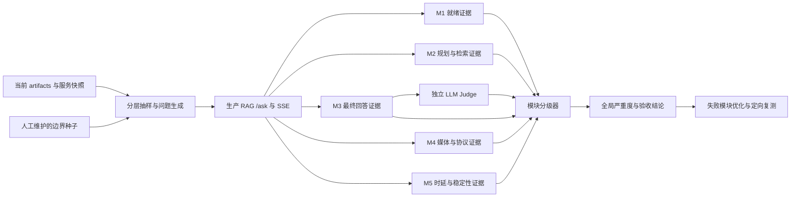

# RAG 全链路分级评估设计

日期：2026-07-13  
状态：待用户评审  
适用范围：`1999Search` 的查询规划、混合检索、上下文分配、回答生成、来源输出、媒体挂载、语音分页和运行可靠性

## 1. 背景与目标

当前仓库已有 `scripts/evaluate_huiji_rag.py`、`eval/queries_core.jsonl` 和多意图语音评估器，但核心评估集只有 9 个问题，主要覆盖两个角色。现有门禁可以发现实体、意图、本地路径和语音自动泄漏问题，却不能回答以下系统级问题：

- 服务和依赖是否完整可用，还是链路根本无法执行。
- 查询规划、检索、回答生成、媒体挂载中究竟是哪一层退化。
- 最终回答是否由检索证据支持，是否遗漏用户明确要求的内容。
- 模糊表达、错别字、复合问题和不可回答问题是否得到与难度相称的处理。
- 问题属于阻断上线的错误、可用但退化的警告，还是只需记录的优化提醒。

本设计建立一个模块化、分级式、可重复的 RAG 全链路评估体系。报告首先给出系统严重度和模块状态，再提供原始指标用于定位；不要求使用者逐项阅读分散的指标后自行判断系统是否可用。

### 1.1 设计依据

本设计采用以下行业通用概念，但不依赖特定云评估产品：

- 事件严重度使用 OpenTelemetry Logs Data Model 的 `INFO / WARN / ERROR / FATAL` 语义及对应 `SeverityNumber` 范围。
- 软件质量域参考 ISO/IEC 25010:2023 的功能适合性、可靠性、性能效率、安全性和可维护性思想。
- RAG 质量域采用检索质量、groundedness、回答相关性和回答完整性；检索过程与最终回答分别评估。
- 自动规则、独立 LLM judge 和有限人工复核共同构成证据，符合生成式 AI 测试、评估、验证与确认的分层思路。

参考资料：

- OpenTelemetry Logs Data Model: <https://opentelemetry.io/docs/specs/otel/logs/data-model/>
- ISO/IEC 25010:2023: <https://www.iso.org/standard/78176.html>
- Microsoft Foundry RAG evaluators: <https://learn.microsoft.com/en-us/azure/foundry/concepts/evaluation-evaluators/rag-evaluators>
- NIST AI RMF Generative AI Profile: <https://nvlpubs.nist.gov/nistpubs/ai/NIST.AI.600-1.pdf>

### 1.2 目标

- 用一个全局等级回答“当前系统是否可用”。
- 用五个模块状态回答“问题位于哪一层”。
- 对直接问题、复合问题、噪声问题和边界问题采用不同质量目标。
- 保持不可妥协的安全与数据一致性门禁，不允许难度分抵消严重错误。
- 从当前 artifacts 动态抽样和派生期望，禁止为某个角色写死数量或特例。
- 生成机器可读证据和面向审阅者的简明报告。
- 为未达标模块提供固定的优化入口和复测范围。

### 1.3 非目标

- 本轮不建立持续在线监控平台或可视化仪表盘。
- 本轮不把所有可能的自然语言现象拆成独立评分器。
- 本轮不以单次 LLM judge 结果替代确定性门禁。
- 本轮不因评估失败自动重建 Milvus、重写 artifacts、上传 MinIO 或修改生产数据。
- 本轮不把模型文风、措辞偏好等低风险差异升级为硬失败。

## 2. 总体架构

### 2.1 五个评估模块

| 模块 | 名称 | 回答的问题 | 主要输入 | 主要输出 |
|---|---|---|---|---|
| `M1` | 就绪与数据一致性 | 链路是否具备可执行前提 | 健康接口、配置、artifacts、Milvus、MinIO | readiness 状态、数据漂移和阻断原因 |
| `M2` | 查询理解与检索 | 是否理解用户并取回正确证据 | query plan、候选、最终 sources、route debug | 实体/意图/检索/覆盖指标 |
| `M3` | 回答与证据一致性 | 回答是否正确、相关、完整且有依据 | query、context、answer、sources | groundedness、相关性、完整性、引用指标 |
| `M4` | 媒体与响应契约 | 媒体是否正确挂载和分页，输出是否安全 | media、panels、SSE/JSON、artifacts | 绑定、分页、泄漏和协议指标 |
| `M5` | 可靠性与性能 | 链路是否稳定且在合理时间内完成 | 请求时序、错误、重复运行 | 成功率、P50/P95、稳定性指标 |

模块是报告、严重度汇总和优化复测的最小管理单元。模块内部可以包含多个原始指标，但不得把每个原始指标提升为新的顶层模块。

### 2.2 评估数据流



### 2.3 证据优先级

当不同评估器结论冲突时，优先级固定为：

1. 传输安全、集合一致性和确定性集合对比。
2. 基于当前 artifacts 派生的 ground truth 与 qrels。
3. 独立 LLM judge 的结构化评分。
4. 人工复核结论。

人工复核用于处理 judge 分歧和解释边界，不得推翻已确认的本地路径泄漏、跨实体媒体绑定、分页重复、hash/ID 不一致等确定性事实。

## 3. 统一分级制度

### 3.1 系统严重度

严重度遵循事故管理中“数字越小越严重”的习惯；`PASS` 表示没有需要分级的发现。

| 等级 | 状态 | OTel 对应 | 系统含义 | 验收结论 |
|---|---|---|---|---|
| `PASS` | 健康 | 无事件 | 所有 P0 门禁和质量目标均满足 | 通过 |
| `SEV-4` | 提醒 | `INFO` / 9 | 系统健康，存在不影响验收的优化机会或趋势提醒 | 通过 |
| `SEV-3` | 警告 | `WARN` / 13 | 系统可用，质量低于目标但仍高于困难度最低线，缺陷在合理范围 | 有条件通过 |
| `SEV-2` | 错误 | `ERROR` / 17 | 关键能力部分不可用，某模块 P0 质量门禁失败 | 不通过 |
| `SEV-1` | 严重错误 | `ERROR4` / 20 | 链路能运行但结果不可信，出现系统性串线、无依据生成或严重数据错误 | 不通过，禁止发布 |
| `SEV-0` | 致命 | `FATAL` / 21 | 无法完成评估或主要问答路径完全不可执行 | 不通过，先恢复可执行性 |

每个模块独立产生一个等级，全局等级取最严重的模块等级。平均分、总体通过率和困难样本加权均不得降低已产生的严重度。

### 3.2 分级判定原则

- `SEV-0` 只用于链路无法执行，例如后端不可启动、活动 collection 不存在、全部请求失败或评估证据无法生成。
- `SEV-1` 用于“执行成功但不可信任”，例如跨实体串线、本地路径泄漏、明确事实大面积无依据生成、媒体绑定到错误 child。
- `SEV-2` 用于局部功能硬失败，例如某个 P0 intent 无法召回、复合查询稳定丢失一个 intent、语音分页集合不完整、回答最低质量线未达到。
- `SEV-3` 只用于没有硬门禁错误、仍可合理回答，但一个或多个质量目标未达到的情况。
- `SEV-4` 只记录优化机会、接近阈值或非阻断趋势，不得用来包装真实错误。

### 3.3 验收规则

- `PASS` 和 `SEV-4`：全量评估通过。
- `SEV-3`：可标记 `accepted_with_warnings`，必须列出受影响模块和定向优化建议；连续两次同类 `SEV-3` 自动升级为待整改项，但不自动变成 `SEV-2`。
- `SEV-2`、`SEV-1`、`SEV-0`：全量评估失败。
- 任一硬门禁失败时，不再用综合分讨论是否通过，但仍完成不具破坏性的剩余采样，以判断影响范围。

## 4. 问题难度与抽样

### 4.1 难度分层

| 难度 | 定义 | 示例类型 | 质量目标分 | 最低及格分 |
|---|---|---|---:|---:|
| `D1` 标准 | 实体和意图明确，单跳可回答 | 角色介绍、技能、单品、明确媒体请求 | 90 | 85 |
| `D2` 复合 | 多意图、比较、跨段落或需信息整合 | 技能和语音、角色差异、资料综合 | 85 | 78 |
| `D3` 噪声 | 语义模糊、别名、口语、省略、大量错别字 | 名称错写、意图隐含、句式破碎 | 80 | 70 |
| `D4` 边界 | 资料不存在、越界、诱导编造或应澄清 | 不存在角色、无证据事实、知识库外问题 | 90 | 85 |

`D3` 降低的是相关性、完整性等质量分最低线，不降低以下硬门禁：本地路径泄漏、跨实体串线、禁止媒体泄漏、无依据断言、错误引用、分页重复、服务错误和数据写入。

`D4` 不因“难回答”降低拒答标准。正确拒答、说明资料不足或提供失败动作本身就是任务完成。

### 4.2 抽样策略

P0 全量自检使用“动态分层样本 + 固定边界种子”，而不是固定角色清单：

- 动态样本从当前 `parent_blocks`、`child_blocks`、`media_assets` 和活动 Milvus collection 派生。
- 按实体类型、支持的 P0 intent、单意图/多意图、资料量低/中/高、媒体有/无和语言变体覆盖分层。
- 使用确定性 seed 和 pairwise coverage 控制样本规模，避免做所有维度的笛卡尔积。
- 基准规模为不少于 48 个唯一问题：`D1 >= 16`、`D2 >= 12`、`D3 >= 12`、`D4 >= 8`。
- 每个当前支持的 P0 intent 至少出现于一个标准样本和一个复合或噪声样本；若 48 个样本不足以满足覆盖，样本数自动扩大。
- 至少选择 8 个符合条件的实体，并覆盖其可检索文本量或可播放媒体量的低位、中位和高位；期望集合及数量全部从 artifacts 动态计算。
- 至少 10% 的样本进行同配置重复请求，用于检测非预期波动；重复样本不计入 48 个唯一问题。
- 固定边界种子只固定语言现象和错误类型，不固定某个真实角色的技能数、台词数、语言数或 child ID。

### 4.3 评分方法

每个样本按适用模块生成 `0..100` 的质量分。不同场景只计算适用模块，未适用模块不按零分处理。样本最终分为适用模块得分的加权平均：

- 文本问答：`M2 40% + M3 50% + M5 10%`。
- 纯媒体请求：`M2 30% + M4 60% + M5 10%`。
- 文本与媒体复合请求：`M2 30% + M3 30% + M4 30% + M5 10%`。
- 边界/拒答请求：`M2 30% + M3 60% + M5 10%`。

质量分只决定 `PASS / SEV-4 / SEV-3 / SEV-2` 的质量区间；确定性硬门禁可以直接产生 `SEV-1` 或 `SEV-0`。

难度组使用同一聚合规则，避免以总体平均分掩盖某类问题：

| 难度 | 达到最低及格分的样本比例下限 |
|---|---:|
| `D1` | 95% |
| `D2` | 90% |
| `D3` | 85% |
| `D4` | 100% |

- 组平均分达到质量目标，且达到最低及格分的样本比例满足上表：该组为 `PASS`；只有趋势或优化提醒时为 `SEV-4`。
- 组平均分低于质量目标但不低于最低及格分，且及格比例满足上表：该组为 `SEV-3`。
- 组平均分低于最低及格分，或及格比例低于上表：该组为 `SEV-2`。
- 任何样本触发确定性 `SEV-1/SEV-0` 时，直接保留该严重度，不参与上述质量分聚合。

## 5. M1 就绪与数据一致性

### 5.1 模块职责

确认评估面对的是一个可执行、可识别、未在评估期间漂移的数据和服务快照。M1 失败时，不应通过调整 prompt、K 值或 judge 阈值掩盖基础设施问题。

### 5.2 P0 当前必须满足

- `READY-P0-01`：后端、Milvus、MinIO 和回答模型均可访问，活动 collection 与配置一致。
- `READY-P0-02`：评估所需 artifacts 可读，主键、parent/child 引用和媒体引用满足现有完整性契约。
- `READY-P0-03`：评估前后 collection 名、schema、row count 和主键集合指纹一致；评估过程保持只读。
- `READY-P0-04`：每次运行记录配置摘要、模型标识、数据 build version、collection snapshot、随机 seed 和开始/结束时间。

### 5.3 P1 可部分支持

- `READY-P1-01`：记录依赖版本、容器镜像 digest 和远程模型 revision。
- `READY-P1-02`：与上一份基线报告做趋势比较并产生 `SEV-4` 提醒。

### 5.4 P2 未来演进

- `READY-P2-01`：生产影子流量和持续在线漂移监控。

### 5.5 指标、意义与优化入口

| 指标 | 意义 | P0 门禁 | 未达标时的模块级对策 |
|---|---|---|---|
| dependency readiness | 链路能否真实执行 | 必须 100% | 先恢复服务、凭据、网络和活动 collection |
| artifact/index consistency | ground truth 与检索库是否对应 | 不允许未知漂移 | 核对 build version、collection 和构建清单；未查明前不调检索参数 |
| pre/post snapshot equality | 评估是否保持只读 | 必须相等 | 停止评估，定位写入源并扩大检查范围 |

## 6. M2 查询理解与检索

### 6.1 模块职责

同时评估 Stage 0 规划和最终 sources。规划正确但下游未消费、候选正确但预算裁剪丢失，以及最终 sources 正确但排序较差，都必须在 M2 内可区分。

### 6.2 P0 当前必须满足

- `RETR-P0-01`：实体、实体类型、primary intent、secondary intents 和 media intent 与样本期望一致或属于允许的等价集合。
- `RETR-P0-02`：所有明确请求的 intent 均被 packet policy、候选召回和最终上下文消费，不能只存在于 plan 字段。
- `RETR-P0-03`：具有动态 qrels 的样本计算 Recall@K、MRR 和 nDCG@K；多意图样本同时报告 intent coverage 和 shortfall。
- `RETR-P0-04`：不得出现跨实体 sources；无相关资料时必须返回可解释的 failure actions 或正确路由，不能伪造命中。
- `RETR-P0-05`：最终上下文满足 source 数量和字符预算，并保留各请求 intent 的最低覆盖。

### 6.3 P1 可部分支持

- `RETR-P1-01`：对 BM25、dense、structured exact 和 reranker 分别记录贡献与消融结果。
- `RETR-P1-02`：按 query pattern 输出混淆矩阵和趋势。

### 6.4 P2 未来演进

- `RETR-P2-01`：在线点击或用户反馈驱动的检索 qrels。

### 6.5 指标、意义与优化入口

| 指标 | 意义 | 优先级 | 未达标时的模块级对策 |
|---|---|---|---|
| entity accuracy | 是否定位到正确实体 | P0 | 检查 lexicon、别名归一化和 Stage 0 fallback |
| intent exact/F1 | 是否保留单意图和多意图 | P0 | 检查 planner schema、secondary intents 和 policy composition |
| Recall@K | 相关证据是否被召回 | P0 | 检查 qrels、BM25/dense 查询、过滤和 candidate K |
| MRR / nDCG@K | 相关证据是否排在前部 | P0 | 检查融合权重、section bonus 和 reranker；不先扩大最终上下文 |
| intent coverage / shortfall | 预算是否挤掉某个请求意图 | P0 | 检查 quota、source/字符预算和裁剪顺序 |
| cross-entity leak rate | 是否发生来源串线 | P0 硬门禁 | 立即停止参数优化，检查实体过滤和 parent/child 归属 |

## 7. M3 回答与证据一致性

### 7.1 模块职责

评估生产回答模型基于实际 context 生成的最终答案。回答质量不能通过只运行 `retrieve()` 代替。

### 7.2 P0 当前必须满足

- `ANSWER-P0-01`：所有可验证事实声明均由返回 context 支持；groundedness 由独立 judge 评分，并用确定性引用检查补强。
- `ANSWER-P0-02`：回答直接回应用户问题，相关性和任务完成度达到对应难度最低线。
- `ANSWER-P0-03`：明确请求的多个意图均在回答中得到覆盖；资料不足时明确说明缺口，不得用模型常识补齐为知识库事实。
- `ANSWER-P0-04`：引用的来源名必须存在于返回 sources；引用支持率和引用正确率不得通过虚构来源提高。
- `ANSWER-P0-05`：不可回答或越界问题应拒答、澄清或提供现有 failure actions；自由补充必须保留非知识库声明。
- `ANSWER-P0-06`：生产回答模型和 judge 使用独立配置；judge 温度为 0，输出固定 JSON schema，并记录模型、prompt version、原始评分和理由。

### 7.3 P1 可部分支持

- `ANSWER-P1-01`：claim-level groundedness，把具体不受支持的句子写入报告。
- `ANSWER-P1-02`：对 judge 不一致样本执行第二 judge 仲裁。

### 7.4 P2 未来演进

- `ANSWER-P2-01`：长期人工标注集和线上用户满意度闭环。

### 7.5 指标、意义与优化入口

| 指标 | 意义 | 优先级 | 未达标时的模块级对策 |
|---|---|---|---|
| groundedness | 回答事实是否由 context 支持 | P0 硬门禁/质量 | 先核对 M2；检索正确时再改 prompt、context 格式或回答模型 |
| relevance | 是否回答了用户实际问题 | P0 | 检查 query plan、prompt 指令和回答冗余 |
| response completeness | 是否覆盖必要事实和所有明确 intent | P0 | 检查 intent coverage、上下文预算和回答结构 |
| citation validity/support | 引用是否存在且支持对应声明 | P0 | 统一来源标识，增加回答后引用校验，不允许虚构来源 |
| refusal correctness | 无证据时是否诚实处理 | P0 | 检查空检索分支、自由补充标识和不足资料提示 |

## 8. M4 媒体与响应契约

### 8.1 模块职责

评估文本 sources 之外的媒体挂载、语音分页、HTTP/SSE 序列化和安全边界。媒体数量不参与文本 K 的质量补偿。

### 8.2 P0 当前必须满足

- `MEDIA-P0-01`：媒体类型与请求 intent 一致；非语音请求不得自动泄漏语音。
- `MEDIA-P0-02`：媒体 entity、parent、child 和 event/text 绑定与当前 artifacts 一致，不得跨 child 或跨实体挂载。
- `MEDIA-P0-03`：语音按台词分页，每条台词内提供现有语言变体；首屏、后续页和全集集合与 artifacts 精确一致，无重复、遗漏或空播放器行。
- `MEDIA-P0-04`：JSON、SSE、cursor 和 URL 不包含本地路径、文件系统字段或不可回放 URL。
- `MEDIA-P0-05`：同步 `/ask` 与流式 `/ask/stream` 的 sources、route、media 和最终 answer 在语义上保持一致。

### 8.3 P1 可部分支持

- `MEDIA-P1-01`：按媒体体量分层输出首字节和分页加载性能趋势。
- `MEDIA-P1-02`：媒体 URL 的抽样 HEAD/GET 可播放性检查。

### 8.4 P2 未来演进

- `MEDIA-P2-01`：语音皮肤筛选；只有数据具备可靠皮肤标注后才进入实现。

### 8.5 指标、意义与优化入口

| 指标 | 意义 | 优先级 | 未达标时的模块级对策 |
|---|---|---|---|
| media intent precision | 是否只带出请求允许的媒体 | P0 | 检查 media intent union 和 registry policy |
| binding exactness | 媒体是否属于正确 child/event | P0 硬门禁 | 检查构建期 filename/voice number 到 child ID 的绑定，不在分页层掩盖 |
| page/set equality | 分页结果是否完整且不重复 | P0 | 检查稳定排序、cursor、page size 和去重键 |
| local path leak rate | 是否暴露本地路径 | P0 硬门禁 | 阻断验收，检查 schema sanitizer 和 URL 构建 |
| sync/stream parity | 两种接口是否返回同一语义结果 | P0 | 检查共享 retrieve 结果和 SSE done 聚合 |

## 9. M5 可靠性与性能

### 9.1 模块职责

区分“答案质量差”和“链路不稳定”。性能指标以当前本地部署基线为准，并在证据中同时保留绝对值和相对趋势。

### 9.2 P0 当前必须满足

- `RELY-P0-01`：唯一样本请求成功率不低于 98%，不得出现未结构化异常、SSE 无 done、空响应或进程退出。
- `RELY-P0-02`：重复样本的实体、intent、关键 source 集合和媒体集合必须稳定；允许答案措辞变化，但不允许事实结论相反。
- `RELY-P0-03`：分别记录 planning、retrieval、首 token 和总响应时延；P95 必须满足基线门限，超时按失败计入。
- `RELY-P0-04`：单个外部模型失败必须形成结构化错误，不得伪装成正常知识库答案。

P0 初始性能门限：retrieval P95 `<= 5s`、首 token P95 `<= 15s`、完整回答 P95 `<= 45s`。若运行环境与基线硬件不一致，必须同时报告环境差异，但不得在同一次运行中临时改门限。

### 9.3 P1 可部分支持

- `RELY-P1-01`：并发 2、4、8 的容量曲线和错误率。
- `RELY-P1-02`：按外部模型、Milvus、MinIO 拆分 trace 时延。

### 9.4 P2 未来演进

- `RELY-P2-01`：持续压测、SLO burn-rate 告警和自动容量建议。

### 9.5 指标、意义与优化入口

| 指标 | 意义 | 优先级 | 未达标时的模块级对策 |
|---|---|---|---|
| request success rate | 问答是否稳定执行 | P0 | 按 dependency/阶段归类错误，先修异常和超时边界 |
| repeat consistency | 相同输入是否发生路由或证据漂移 | P0 | 固定评估配置，检查 planner、排序 tie-break 和外部状态 |
| retrieval/TTFT/total P95 | 用户等待时间和瓶颈阶段 | P0 | 只优化超标阶段；分别检查模型、检索、序列化和媒体加载 |
| structured failure rate | 错误是否可诊断 | P0 | 统一错误 schema，禁止吞异常或输出伪正常答案 |

## 10. LLM Judge 与人工复核

### 10.1 Judge 契约

独立 judge 每次只接收该样本的 query、生产 answer、实际 context、期望任务和允许的等价答案，不读取生产模型的隐藏推理。输出至少包含：

```json
{
  "schema_version": "rag_judge.v1",
  "groundedness": 1,
  "relevance": 1,
  "completeness": 1,
  "refusal_correctness": 1,
  "unsupported_claims": [],
  "missing_requirements": [],
  "reason": "",
  "passed": false
}
```

四个评分均使用 `1..5` Likert 标度。默认质量及格为 `>= 3`，但 `groundedness=1`、明确虚构来源或确定性证据证明的错误事实直接产生严重事件，不能由其他高分抵消。

### 10.2 人工复核边界

人工复核不作为每次运行的主要执行成本，只覆盖：

- 所有 `SEV-1` 和 `SEV-2` 候选。
- judge 与确定性规则冲突的样本。
- 各难度层随机抽取合计不少于 10% 的样本，用于校准 judge。

人工结论记录为独立 adjudication，不直接改写原始自动评分。若 judge 与人工一致率低于 85%，该次 M3 最高只能为 `SEV-2`，必须先校准 judge 再讨论回答模型优化。

## 11. 报告与证据契约

### 11.1 输出结构

一次评估至少生成：

```text
eval/rag_full_chain/<run_id>/
  run_manifest.v1.json
  sample_manifest.v1.jsonl
  case_results.v1.jsonl
  module_summary.v1.json
  evaluation_report.v1.md
  pre_snapshot.v1.json
  post_snapshot.v1.json
```

- `run_manifest` 固定运行配置和依赖标识。
- `sample_manifest` 保存问题、难度、期望和期望来源的派生依据。
- `case_results` 保存原始响应、规则结果、judge 结果、时延和事件。
- `module_summary` 是机器可读的五模块状态和全局严重度。
- `evaluation_report` 只呈现全局结论、模块表、主要失败簇和建议动作。
- pre/post snapshot 证明评估没有改变活动数据。

### 11.2 统一事件结构

所有模块使用同一事件结构，避免错误散落为不可聚合字符串：

```json
{
  "event_code": "RETR.CROSS_ENTITY_SOURCE",
  "module": "M2",
  "severity": "SEV-1",
  "severity_text": "ERROR4",
  "severity_number": 20,
  "case_ids": [],
  "observed": {},
  "expected": {},
  "recommended_action": "inspect entity filtering and parent ownership"
}
```

事件代码使用 `<MODULE>.<STABLE_CODE>`，同类样本聚合为一个事件并附带 case IDs，不为每个失败样本创建新的顶层错误类型。

### 11.3 顶层报告格式

报告首页固定为：

1. 全局严重度和验收结论。
2. 五模块状态、得分和最严重事件。
3. 各难度层样本数、目标分、最低线和通过率。
4. 最多五个主要失败簇及影响范围。
5. 推荐的优化顺序和定向复测命令。

详细 case、judge 理由和原始 sources 放在机器可读证据中，不在首页逐项展开。

## 12. 失败后的优化与复测策略

优化按上游到下游执行，禁止通过下游补丁掩盖上游错误：

1. `M1` 失败：先恢复依赖和数据快照一致性，其他质量结果标记为无效。
2. `M2` 失败：修复 planner、实体归一化、policy composition、召回、排序或预算；不得先要求回答模型猜测缺失事实。
3. `M3` 失败且 M2 通过：优化 prompt、context 表达、回答模型、引用和拒答逻辑。
4. `M4` 失败：回到媒体构建与绑定、registry 和分页契约；不得仅增加媒体数量或文本 K。
5. `M5` 失败：定位具体阶段的异常和时延，保持质量门禁不变。

修复后先运行失败模块的定向样本，再运行所有与其有依赖关系的下游模块。只有定向复测通过后才运行完整 48+ 样本验收。

## 13. P0 完成判定

本评估体系可宣称完成，必须同时满足：

- `READY-P0-01..04`、`RETR-P0-01..05`、`ANSWER-P0-01..06`、`MEDIA-P0-01..05`、`RELY-P0-01..04` 均有可执行检查。
- 至少 48 个动态分层唯一问题和 10% 重复样本完成真实 `/ask` 或 `/ask/stream` 调用。
- 生产回答模型和独立 judge 均真实执行；不能用固定 mock 结果代替全量验收。
- 所有期望数量和 ID 从当前 artifacts 派生，不存在真实角色专用分支或写死计数。
- 全局状态为 `PASS`、`SEV-4` 或经明确记录的 `SEV-3 accepted_with_warnings`。
- pre/post snapshot 相等，评估期间未写入 Milvus、MinIO、MySQL 或 processed artifacts。
- 报告能从全局等级下钻到模块、事件簇和 case 证据，并为未达标模块给出确定的优化入口。

## 14. 与现有方案的关系

- 保留 `scripts/evaluate_huiji_rag.py` 的纯函数和核心查询兼容入口，但现有 9 个样本降为 smoke suite，不再代表全链路验收。
- 保留 `scripts/verify_multi_intent_voice.py` 的动态 inventory、分层抽样、分页集合对比和 collection snapshot 能力；新评估器复用其契约，不复制角色专用逻辑。
- 保留 `eval/queries_core.jsonl` 和 `eval/thresholds_core.json` 作为快速回归资产；P0 全量评估使用版本化 run 目录和新阈值配置。
- 现有单元测试继续验证局部函数；真实服务、真实 artifacts、生产回答模型和独立 judge 的证据是全量验收不可替代的组成部分。
