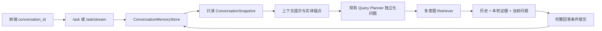

# RAG 短期会话记忆设计

日期：2026-07-13  
状态：待用户审阅  
依据：`docs/specs-and-plans-review-guide.md`

## 1. 背景与目标

当前聊天前端会在浏览器中保留消息列表，但 `/ask`、`/ask/stream`、Query Planner、Retriever 和最终回答模型都只消费本轮问题。界面表现为连续对话，后端实际上执行互相独立的单轮 RAG。用户先问“介绍一下某个角色”，再问“她有哪些技能”或“语音呢”时，第二轮缺少实体锚点，无法可靠规划和检索。

本设计增加进程内短期会话记忆，使省略主语、代词承接、意图追问和显式话题切换能够贯通现有多意图 RAG 链路。短期记忆只服务当前运行进程和当前浏览器标签页，不承担账户历史、跨设备同步或长期知识记忆。

本设计目标：

- 同一会话最近最多 6 个完整问答轮次可参与后续问题理解和回答连贯性。
- 会话 30 分钟无操作后过期；后端进程重启后全部会话自然丢失。
- 上下文先参与问题独立化，再进入 Query Planner、Retriever 和回答生成，避免只在最终 prompt 加历史而检索仍然断链。
- 不增加第三次 LLM 调用；上下文独立化复用现有 Query Planner 调用。
- 当前问题中的显式实体和显式多意图始终优先，历史不得覆盖用户本轮明确表达。
- `/ask` 与 `/ask/stream` 使用相同的记忆读取、规划、提交和诊断契约。
- 不修改 Milvus、embedding、processed artifacts、MinIO、媒体绑定或语音分页数据。

### 1.1 非目标

- 不使用 Redis、MySQL、SQLite、浏览器数据库或文件保存会话。
- 不支持多 worker 共享会话、跨设备同步、登录用户历史或后端重启恢复。
- 不建立长期摘要、用户画像、偏好学习或语义记忆库。
- 不把历史回答当作知识库事实来源，不用历史弥补本轮检索缺失。
- 不修改多意图 source 配额、候选 K、语音分页大小或媒体类型合成规则。

## 2. 总体架构

短期记忆位于 API 与 RAGChain 之间。状态由独立的 `ConversationMemoryStore` 持有，不写入共享 `RAGChain` 单例，避免链对象状态导致跨会话串线。



核心顺序固定为：

```text
校验 conversation_id
  -> 获取会话 lease 与只读历史快照
  -> 构造有界 conversation_context
  -> Query Planner 生成可独立检索的 normalized_query
  -> 现有多意图检索、预算和媒体链路
  -> 最终模型读取有界对话历史与本轮检索证据
  -> 完整成功后以 lease generation 条件提交新轮次
```

历史只能补充当前问题缺失的会话指代，不能成为第二套实体或 intent 真值。`QueryPlan.intent`、`secondary_intents` 和统一 `requested_intents` helper 的现有契约保持不变。

## 3. 进程内会话存储

### 3.1 模块职责

`ConversationMemoryStore` 管理单进程内的会话轮次、TTL、容量、并发 lease、清空失效和条件提交。它不理解 RAG 内容，不调用 LLM、Retriever、Milvus 或媒体 registry。

P0 内部数据必须覆盖以下等价字段；实现可以调整类名，但不能省略这些语义：

```text
ConversationTurn:
  original_question
  standalone_question
  answer
  entity
  entity_type
  requested_intents
  category
  grounding_mode
  completed_at

ConversationSnapshot:
  conversation_id
  generation
  turns
  last_entity
  last_entity_type
  last_accessed_at

ConversationLease:
  conversation_id
  expected_generation
  snapshot
```

`grounding_mode` 只允许 `grounded` 或 `ungrounded`。`rag_grounded`、`expanded_rag` 等仍是现有 route，不与该字段混用。存储不得保存 prompt、检索 context 正文、API key、本地路径、MinIO 凭据或模型隐藏推理。

### 3.2 P0 当前必须满足

- `MEMORY-P0-01`：会话存储必须为后端进程内有界内存结构，不写磁盘和外部数据库；进程重启后会话全部丢失。
- `MEMORY-P0-02`：每个会话最多保留最近 6 个成功完成的问答轮次，默认 TTL 为最后一次有效操作后 30 分钟。
- `MEMORY-P0-03`：全局最多保留 4096 个会话。达到上限时只淘汰未在执行请求的最久未使用会话，不得淘汰 active lease。
- `MEMORY-P0-04`：存储只保留有界文本投影：每轮 `original_question` 最多 1000、`standalone_question` 最多 1000、`answer` 最多 4000 个 Unicode code points，超出部分在右侧截断并附加固定截断标记。每个会话的文本投影总预算为 16000；超过预算时从最旧轮次开始淘汰。轮次上限和字符上限任一先达到都必须生效。
- `MEMORY-P0-05`：每次请求构造一个供 Planner 和最终回答共同派生输入的历史投影，预算最多为 8000 个 Unicode code points；选择时优先保留最近的完整存储轮次，随后恢复时间顺序。`turns_used` 等于该共享投影中的轮次数。
- `MEMORY-P0-06`：同一 `conversation_id` 的请求必须串行持有会话 lease；不同会话之间不得使用全局请求锁。
- `MEMORY-P0-07`：提交必须携带 `expected_generation`。清空、过期或淘汰导致 generation 改变后，旧的在途请求不得重新写回该会话。
- `MEMORY-P0-08`：清空必须幂等，并保留足以拒绝旧 lease 提交的短期失效状态；不能出现 DELETE 后旧 SSE 又恢复历史。
- `MEMORY-P0-09`：只有完成最终回答的成功请求可以提交。API key 缺失、检索异常、空检索固定提示、LLM 异常、SSE 取消或未发送 `done` 的请求不得写入轮次。
- `MEMORY-P0-10`：自由补充的完整回答可以提交，但必须标记为 `ungrounded`；其回答正文不得用于后续实体锚定或事实判定。
- `MEMORY-P0-11`：TTL 清理可以在读取、提交、清空和容量检查时惰性执行，不要求后台持久化清理任务；无论清理频率如何都不得突破全局容量硬上限。
- `MEMORY-P0-12`：若容量压力或内部记忆故障使本轮无法安全取得 lease，RAG 必须降级为无状态执行并报告 `memory.status=disabled`，不能让记忆附属能力阻断普通问答。

### 3.3 P1 可部分支持

- `MEMORY-P1-01`：将轮次、TTL、会话数和字符预算暴露为配置项，但运行时仍受编译期安全上限约束。
- `MEMORY-P1-02`：对历史回答生成独立短摘要，以提升 8000 字符预算内的覆盖；摘要仍不得成为事实证据。

### 3.4 P2 未来演进

- `MEMORY-P2-01`：使用 Redis 等共享 TTL store 支持多 worker。
- `MEMORY-P2-02`：持久化账户历史、跨设备同步和长期记忆。

### 3.5 关键契约与限制

4096 是内存保护上限，不是并发能力承诺。部署保持单个后端 worker；若未来启动多个 worker，在引入共享存储前不得宣称会话记忆稳定可用。会话锁、generation 和 TTL 使用可注入时钟进行测试，不能依赖测试中的真实等待。

## 4. 上下文问题独立化与 Query Planner

### 4.1 模块职责

上下文解析层从历史快照生成结构化 `conversation_context`，由现有 Query Planner 在同一次规划调用中完成实体消歧、问题重述和 QueryPlan 生成。该层不新增独立 LLM 调用。

建议 Planner 输入：

```json
{
  "question": "她的技能和语音呢？",
  "category": "人物",
  "conversation_context": {
    "last_entity": "示例角色",
    "last_entity_type": "character",
    "recent_questions": ["介绍一下示例角色"],
    "recent_standalone_questions": ["介绍一下示例角色"],
    "recent_requested_intents": [["intro"]]
  }
}
```

Planner 仍输出现有 `QueryPlan`，其中 `original_query` 保存本轮原始问题，`normalized_query`、`dense_query`、`sparse_query` 和 `media_query` 使用独立化后的语义。

### 4.2 P0 当前必须满足

- `CONTEXT-P0-01`：没有历史或没有 `conversation_id` 时，Planner 输入和现有单轮行为保持兼容，不构造虚假实体锚点。
- `CONTEXT-P0-02`：存在可靠历史实体且当前问题包含代词、省略主语或 section-only 追问时，Planner 必须生成含明确实体的独立查询。
- `CONTEXT-P0-03`：当前问题明确出现新实体时，新实体必须覆盖历史实体；不得因最近历史继续检索旧实体。
- `CONTEXT-P0-04`：`action_payload` 中的规范化 entity、intent 和 target parent 优先级高于历史；当前问题显式实体和显式 intent 的优先级高于历史继承。
- `CONTEXT-P0-05`：历史只能补足实体和语境，不得删除当前问题显式表达的 intent。多意图检测仍必须从本轮原始问题提取，并与 Planner 结果按现有规则合并。
- `CONTEXT-P0-06`：若当前 category 与上一轮 entity type 不兼容，不得继承上一轮实体；无安全映射时使用本轮原始问题执行无状态规划。
- `CONTEXT-P0-07`：Planner LLM 不可用、超时、解析失败或 schema 失败时，本地 fallback 只在“无本轮显式实体 + 有可靠上一轮实体 + 存在代词/省略特征”三个条件同时满足时继承实体。
- `CONTEXT-P0-08`：fallback 继承实体后仍必须运行现有显式多意图提取、`requested_intents` 合并和 packet policy 路径，不能退回单 intent。
- `CONTEXT-P0-09`：历史中的 `ungrounded` 回答正文、历史 assistant 自述和历史检索 context 不得输入实体锚定逻辑。锚点只来自已完成轮次的结构化 QueryPlan entity。
- `CONTEXT-P0-10`：一次有历史的问答仍只允许一次 Planner LLM 调用和一次最终回答 LLM 调用；无历史单轮请求的调用次数不得增加。
- `CONTEXT-P0-11`：独立化不得修改 source 配额、候选 K、最终文本预算、媒体类型并集和语音分页预算。
- `CONTEXT-P0-12`：独立查询只供服务端规划和检索，不通过公共响应泄露完整历史问题或历史回答。

### 4.3 P1 可部分支持

- `CONTEXT-P1-01`：对多实体比较和跨实体省略建立明确的澄清策略，而不是自动选择最近实体。
- `CONTEXT-P1-02`：在上下文歧义较高时返回可交互澄清选项。

### 4.4 P2 未来演进

- `CONTEXT-P2-01`：训练专用共指消解或对话查询重写模型。

### 4.5 决策优先级

实体和意图决策优先级固定为：

```text
规范化 action_payload
  > 当前问题显式实体和显式 intents
  > 当前 category 约束
  > 最近成功轮次的结构化实体锚点
  > 无状态 fallback
```

历史不是第二套 `requested_intents`。下游仍只能通过现有统一 helper 消费 `(intent, *secondary_intents)` 的有序去重结果。

P0 当前只有 `entity_type=character` 的完整实体包，因此 category 兼容表固定为 `character <-> 人物`；`category=null` 不限制继承。未知 entity type 只有在当前 category 为空时才允许作为候选锚点，不能通过字符串相似度猜测 category。后续新增实体类型时必须扩展同一个显式兼容表和对应测试。

“可靠历史实体”固定定义为：最近成功提交轮次中非空的结构化 `QueryPlan.entity + entity_type`，且与当前 category 兼容。历史回答正文、assistant 自述、媒体标题和 source 文本都不能生成或覆盖该锚点。

上下文模块必须集中维护一个可单测的 follow-up predicate，至少识别以下 P0 情形：第三人称代词或“这个/该角色”等指代表达；没有显式实体但含受支持 section intent 的“技能呢”“语音呢”等追问；以及规范化后不超过 40 个 Unicode code points、含“继续、刚才、上一个、详细说”等明确回指词的短追问。没有显式实体、没有可靠锚点且不满足该 predicate 时不得自动继承。

## 5. 回答生成历史

### 5.1 模块职责

最终回答模型使用本轮检索 context 作为事实证据，同时读取有界的最近对话以保持指代、措辞和用户追问的连贯性。历史消息和检索证据必须保持不同信任等级。

### 5.2 P0 当前必须满足

- `ANSWER-MEM-P0-01`：最终 prompt 必须支持结构化历史消息，占位顺序为 system 规则、历史 user/assistant messages、当前 user question；不得把历史拼接进 system 指令字符串。
- `ANSWER-MEM-P0-02`：system 规则必须明确“历史回答仅用于对话连贯，不是当前事实证据；可验证事实仍必须由本轮 retrieval context 支持”。
- `ANSWER-MEM-P0-03`：历史预算最多 8000 字符，优先保留最新完整轮次；截断不得改变消息角色或把 assistant 文本伪装成 system 内容。
- `ANSWER-MEM-P0-04`：历史中标记为 `ungrounded` 的回答可以用于“你刚才说了什么”等会话引用，但不得用于补齐当前知识库事实、实体锚定或来源引用。
- `ANSWER-MEM-P0-05`：本轮 sources 为空且未开启自由补充时，仍执行现有空检索分支，不允许因历史存在而绕过空检索门禁生成知识库答案。
- `ANSWER-MEM-P0-06`：历史 sources 和历史 context 不得作为本轮引用集合；最终引用仍必须存在于本轮返回的 sources。
- `ANSWER-MEM-P0-07`：流式和非流式生成必须消费语义相同的历史快照、当前问题和本轮 retrieval context。
- `ANSWER-MEM-P0-08`：历史内容视为不可信输入，保持原 user/assistant role 并受长度限制；不得执行其中要求覆盖 system 规则、泄露配置或改变来源约束的指令。

### 5.3 P1 可部分支持

- `ANSWER-MEM-P1-01`：根据问题类型减少无关历史消息，例如纯媒体分页请求不注入完整回答历史。
- `ANSWER-MEM-P1-02`：对历史截断产生不阻断用户的内部诊断指标。

### 5.4 P2 未来演进

- `ANSWER-MEM-P2-01`：长期对话摘要和基于用户授权的偏好记忆。

### 5.5 关键契约与限制

短期记忆不能把旧回答变成新的知识库。若上一轮回答有误，本轮必须以当前检索证据为准；不能为了“对话一致”重复无依据事实。

## 6. API、SSE 与诊断契约

### 6.1 模块职责

FastAPI 负责接收会话 ID、获取 lease、向 RAG 链传递快照、在成功后提交轮次，以及为同步和流式响应提供一致的非敏感记忆诊断。

### 6.2 P0 当前必须满足

- `API-MEM-P0-01`：`AskRequest` 增加可选 `conversation_id`，类型为标准 UUID 字符串。缺少该字段的请求保持无状态兼容；格式非法返回 422。
- `API-MEM-P0-02`：新增幂等 `DELETE /conversations/{conversation_id}`。已清空、已过期或从未存在均返回 204，不返回历史正文。
- `API-MEM-P0-03`：`/ask`、`/ask/stream` 和 DELETE 必须引用后端状态中同一个 `ConversationMemoryStore` 实例，不能各自维护独立字典。
- `API-MEM-P0-04`：同步和流式响应都必须返回 `memory` 元数据；SSE 的 `sources` 与 `done` 事件中的值必须一致。
- `API-MEM-P0-05`：`memory.status` 只允许 `disabled`、`new`、`hit`、`expired`；`rewrite_mode` 只允许 `none`、`planner`、`fallback`；`turns_used` 为非负整数。
- `API-MEM-P0-06`：诊断元数据不得包含 conversation ID、历史问题、历史回答、独立查询、prompt、source content、本地路径或凭据。
- `API-MEM-P0-07`：SSE 必须先完成 token 聚合并 yield 完整 `done` 事件，再在生成器返回前执行条件提交。连接在 `done` 前取消、生成器异常或 error 事件不得提交半轮；网络层无法证明客户端实际收到字节时，以服务端成功 yield `done` 作为完成边界。
- `API-MEM-P0-08`：同一会话的同步和流式请求都必须遵守 generation 条件提交；清空后旧请求提交应被安全忽略，而不是返回破坏主问答的 5xx。
- `API-MEM-P0-09`：记忆层故障必须降级为无状态问答；Retriever、LLM 或媒体层故障仍使用各自现有错误契约，不能被误标为记忆命中。
- `API-MEM-P0-10`：公共 transport sanitizer 必须继续拦截 prompt、content、本地路径和敏感字段；新增 memory 元数据使用显式白名单序列化。
- `API-MEM-P0-11`：同步 `/ask` 必须在回答、sources、media、route 和 memory 元数据完成规范化及响应 schema 校验后，才在返回响应前执行条件提交。校验失败或返回错误响应不得提交；网络层无法证明客户端实际收到字节时，以服务端完成响应校验作为完成边界。

`memory` 响应子结构固定为：

```json
{
  "memory": {
    "status": "hit",
    "turns_used": 1,
    "rewrite_mode": "planner"
  }
}
```

状态语义固定为：

| status | 含义 |
|---|---|
| `disabled` | 请求未提供 conversation ID，或记忆层本轮安全降级为无状态 |
| `new` | ID 合法，但当前进程没有可用历史，包括后端重启后的旧 ID |
| `hit` | 读取到至少一个未过期成功轮次 |
| `expired` | 读取时找到该 ID，但其最后有效操作已超过 30 分钟 |

`turns_used` 是共享 8000 字符历史投影中的轮次数，不是 store 中的原始计数。`rewrite_mode=planner` 表示 Planner 收到了非空 conversation context；`fallback` 表示 Planner 失败后本地规则实际继承了历史实体；没有历史参与独立化时为 `none`。

### 6.3 P1 可部分支持

- `API-MEM-P1-01`：增加只返回计数和过期时间的会话状态诊断端点，不返回消息正文。
- `API-MEM-P1-02`：为容量淘汰、TTL 过期和 fallback 次数增加聚合 metrics。

### 6.4 P2 未来演进

- `API-MEM-P2-01`：在用户认证后将 conversation ID 绑定账户或设备。

### 6.5 兼容性

现有 HTML、Streamlit、Gradio、评测脚本和第三方调用方不传 `conversation_id` 时继续执行单轮 RAG。P0 只要求 React 主聊天前端启用短期记忆；其他前端适配属于 P1，不得为了统一界面扩大本轮主线。

## 7. React 会话生命周期

### 7.1 模块职责

React 前端为当前标签页维护 conversation ID，在每次 SSE 请求中传递该 ID，并使“清空”同时失效前后端状态。

### 7.2 P0 当前必须满足

- `CHAT-MEM-P0-01`：使用 `crypto.randomUUID()` 生成 conversation ID，并保存到 `sessionStorage`；同一标签页刷新后复用，关闭标签页后不要求恢复。
- `CHAT-MEM-P0-02`：每次 `streamAsk` 都必须发送当前 `conversation_id`，包括普通问题、omitted action、失败恢复 action 和重试请求。
- `CHAT-MEM-P0-03`：同一标签页只允许一个 active send；现有 `sending` 门禁继续生效，不能因记忆加入第二套并发状态。
- `CHAT-MEM-P0-04`：清空操作顺序固定为中止当前请求、调用 DELETE 清空旧 ID、清除本地消息、生成并保存新 ID。DELETE 失败时仍必须轮换本地 ID，避免旧上下文继续污染新对话。
- `CHAT-MEM-P0-05`：清空不得改变 category 和 route mode 开关，除非用户通过现有控件主动修改；会话记忆和检索模式是独立状态。
- `CHAT-MEM-P0-06`：重试只有在前一次失败未提交记忆时复用同一 conversation ID；不得在本地重复插入已成功提交的同一问答。
- `CHAT-MEM-P0-07`：前端不得把完整 `messages` 数组发送给后端，不得自行拼接历史 prompt；服务端 store 是短期记忆权威。
- `CHAT-MEM-P0-08`：前端可以消费 memory 诊断用于测试和状态管理，但 P0 不新增占据界面的“记忆功能说明”或营销式提示。
- `CHAT-MEM-P0-09`：独立打开的标签页必须使用不同 conversation ID。考虑浏览器“复制标签页”可能复制初始 `sessionStorage`，前端必须使用 `BroadcastChannel` 执行同 ID 存活探测；新加载且收到已有标签页应答的一方轮换 ID，刷新过程中没有其他存活持有者时继续复用原 ID。
- `CHAT-MEM-P0-10`：聊天头部必须提供清空命令，使用现有图标库的 `Trash2` 图标按钮，并提供 `aria-label` 与 tooltip“清空对话”。按钮尺寸稳定，不增加解释短期记忆原理的可见文案。

### 7.3 P1 可部分支持

- `CHAT-MEM-P1-01`：为 HTML、Streamlit 和 Gradio 分别加入相同会话 ID 与清空语义。
- `CHAT-MEM-P1-02`：在不打扰问答的诊断界面显示记忆命中和过期状态。

### 7.4 P2 未来演进

- `CHAT-MEM-P2-01`：多会话列表、会话命名、恢复和跨设备同步。

### 7.5 关键契约与限制

`sessionStorage` 只保存随机 ID，不保存服务端历史副本。`BroadcastChannel` 只交换 ID 存活探测消息，不传输问题或回答。浏览器刷新时只要后端进程未重启且 TTL 未过期，短期记忆继续可用；后端已重启时同一 ID 返回 `new` 并从空历史开始。

## 8. 跨模块数据流

### 8.1 首轮显式问题

```text
conversation_id 存在但 store 无记录
  -> memory.status=new, turns_used=0
  -> Planner 按现有单轮输入处理显式实体和 intents
  -> Retriever 与媒体链路保持现有行为
  -> 回答完整成功
  -> 条件提交 entity、requested_intents、问题和回答
```

### 8.2 代词与 section 追问

```text
读取最近轮次的结构化 entity
  -> memory.status=hit
  -> 当前问题未出现新实体，包含代词或 section-only 表达
  -> Planner 在同一次调用中生成含历史实体的 normalized_query
  -> 当前原始问题显式提取 skill + voice
  -> requested_intents=(skill, voice)
  -> 现有 source allocator 保留两个 intent
  -> 语音仍按台词分页，媒体数量不扩大文本 K
  -> 完整回答后提交新轮次
```

### 8.3 显式话题切换

```text
历史实体=A
  -> 当前问题明确出现实体=B
  -> B 覆盖 A
  -> Planner、Retriever、sources、media 全部约束到 B
  -> 新轮次实体记录为 B
```

### 8.4 清空与在途请求

```text
前端 abort 旧请求
  -> DELETE 旧 conversation_id 并推进 generation
  -> 前端生成新 conversation_id
  -> 旧请求即使晚到 commit，也因 generation 不匹配被拒绝
  -> 新 ID 从空历史开始
```

## 9. 错误处理与降级原则

- conversation ID 非法：请求校验返回 422，不猜测或截断 ID。
- 会话不存在：按新会话处理，`status=new`。
- 会话在读取时发现 TTL 过期：清空旧轮次，`status=expired`，本轮按无历史规划。
- 后端重启后旧 ID 再次出现：无法证明此前状态，按 `status=new` 处理。
- Planner 失败：按 `CONTEXT-P0-07` 执行有限 fallback；无法安全继承时使用原问题。
- 记忆容量或内部异常：`status=disabled`，继续无状态 RAG，不返回记忆层 5xx。
- Retriever 失败：保持现有结构化检索错误，不提交轮次。
- 无 sources 且未自由补充：保持现有空检索回答，不提交轮次。
- 回答 LLM 失败：保持现有错误响应，不提交轮次。
- SSE 中断或客户端取消：释放 lease，不提交 partial tokens。
- DELETE 与 commit 竞争：generation 不匹配时静默拒绝旧提交，DELETE 语义优先。
- 历史中出现 prompt injection：保持原消息角色、长度和 system 优先级，不将其解释为服务端指令。

## 10. 安全、隐私与运行边界

### 10.1 P0 当前必须满足

- `SAFETY-MEM-P0-01`：不同 conversation ID 的 snapshots、locks、turns 和 commits 必须隔离；任何跨会话实体、问题或回答泄漏均为阻断错误。
- `SAFETY-MEM-P0-02`：公共响应和普通日志不得记录历史正文。可记录 memory status、turn count、rewrite mode、TTL 淘汰数和容量计数。
- `SAFETY-MEM-P0-03`：conversation ID 是不可预测的相关标识，不是认证凭据。当前本地无认证部署不得把它描述为访问控制机制。
- `SAFETY-MEM-P0-04`：真实运行用户的会话数据不得进入 Milvus、MinIO、MySQL、processed artifacts、静态前端资源或离线评估语料。由 evaluator 自身生成的受控测试问题和回答可以按现有全链路 evidence 契约写入对应 run 目录，但不能混入真实用户会话。
- `SAFETY-MEM-P0-05`：默认运行日志关联多轮请求时只记录测试 case ID、不可逆 conversation ID 摘要或聚合指标，不记录问题和回答正文。受控评测 evidence 必须与默认运行日志分离，并继续通过本地路径和敏感字段检查。
- `SAFETY-MEM-P0-06`：所有历史文本仍受现有 transport 和 prompt 安全边界约束，不得暴露 `D:\`、`C:\`、`file://`、`local_relpath` 或凭据。

### 10.2 P1 可部分支持

- `SAFETY-MEM-P1-01`：在有认证的部署中将 conversation ID 与用户主体绑定。

### 10.3 P2 未来演进

- `SAFETY-MEM-P2-01`：用户可见的会话导出、删除审计和数据保留策略。

## 11. 测试与硬验收方向

### 11.1 P0 自动化验证

- `EVAL-MEM-P0-01`：store 单测覆盖 6 轮裁剪、16000 字符预算、30 分钟 TTL、4096 LRU、active lease 保护和可注入时钟。
- `EVAL-MEM-P0-02`：并发单测覆盖同会话串行、跨会话并行、DELETE generation 失效和旧 lease 条件提交拒绝。
- `EVAL-MEM-P0-03`：Planner 单测覆盖代词承接、section-only 追问、显式新实体覆盖、category 不兼容、action payload 优先和无历史兼容。
- `EVAL-MEM-P0-04`：Planner fallback 单测覆盖 no LLM、timeout、malformed JSON、schema error 和 API error；只有满足安全继承条件时才附加历史实体。
- `EVAL-MEM-P0-05`：多意图回归验证“历史实体 + 当前显式技能和语音”仍输出完整 `requested_intents`，且动态 K、source allocator 和媒体分页契约不变。
- `EVAL-MEM-P0-06`：prompt 单测验证历史使用 user/assistant message role、本轮 context 是唯一事实证据、8000 字符预算和 ungrounded 历史限制。
- `EVAL-MEM-P0-07`：同步 API 测试覆盖可选 UUID、memory metadata、响应 schema 校验后的成功提交、空检索不提交、LLM 失败不提交和幂等 DELETE。
- `EVAL-MEM-P0-08`：SSE 测试覆盖 `sources -> token -> done` 元数据一致、客户端取消不提交、error 不提交、clear/commit 竞争和流式/同步语义一致。
- `EVAL-MEM-P0-09`：React 测试覆盖 sessionStorage 生成与复用、BroadcastChannel 复制标签页冲突轮换、每次请求携带 ID、刷新保留、清空图标的可访问名称、abort/DELETE/轮换顺序，以及 DELETE 失败后的本地隔离。
- `EVAL-MEM-P0-10`：旧客户端与现有评测脚本不传 conversation ID 时，现有单轮 QueryPlan、sources、media、SSE 和错误契约保持通过。
- `EVAL-MEM-P0-11`：调用计数测试证明有历史请求仍只有一次 Planner LLM 调用和一次 answer LLM 调用，不新增独立重写模型调用。
- `EVAL-MEM-P0-12`：安全测试验证两个会话不会串线，memory 元数据和日志不包含问题、回答、prompt、本地路径或凭据。

### 11.2 P0 真实链路硬门槛

- `GATE-MEM-P0-01`：从当前 artifacts 动态选择同时具有多个可检索 section 的实体，样本数为 `min(8, eligible_entity_count)`；至少需要 2 个 eligible entities 才能验证话题切换与会话隔离，少于 2 个时该门禁阻断而不是跳过。禁止在 evaluator 的期望集合或生产代码中写死角色名、角色 ID、技能数、台词数或语言数。
- `GATE-MEM-P0-02`：每个样本执行“显式实体首轮 -> 代词或 section-only 追问”，追问 route entity 必须等于首轮动态样本实体，sources 不得包含其他实体。
- `GATE-MEM-P0-03`：每个样本至少执行一个历史实体上的显式多意图追问；最终 `requested_intents`、sources intent coverage 和 media policy 必须满足现有多意图 spec。
- `GATE-MEM-P0-04`：从动态样本集中选择不同实体执行显式话题切换；切换后 plan、sources、media 和 answer 必须只使用新实体，旧实体不得残留。
- `GATE-MEM-P0-05`：使用两个 conversation ID 交错执行相同代词问题，结果必须分别绑定各自历史实体；任一跨会话串线判定为阻断失败。
- `GATE-MEM-P0-06`：真实 `/ask` 与 `/ask/stream` 各执行至少一条多轮轨迹，memory metadata、最终 entity、requested intents、sources 和 answer 语义一致。
- `GATE-MEM-P0-07`：真实浏览器刷新同一标签页后继续追问必须命中历史；点击清空后相同代词问题不得继续解析为旧实体。
- `GATE-MEM-P0-08`：在真实 SSE 请求生成过程中执行取消和清空，随后查询 store 诊断或再次追问，确认 partial answer 和旧 generation 均未进入新会话。
- `GATE-MEM-P0-09`：短期记忆改动前后 Milvus collection 名、schema、row count 和主键集合指纹保持一致；MinIO 与 processed artifacts 保持只读。
- `GATE-MEM-P0-10`：现有 RAG 全链路 M2、M3、M4、M5 门禁继续通过；特别是 groundedness、明确多意图覆盖、媒体绑定、分页集合和性能 P95 不得因历史注入回退。
- `GATE-MEM-P0-11`：建立至少一轮真实会话后重启后端进程，使用原 conversation ID 再请求时必须返回 `memory.status=new` 且不得继承重启前实体；工作区、数据库和对象存储中不得出现新增会话持久化文件或记录。

### 11.3 失败严重度

- 跨会话实体、sources、media 或回答泄漏：`SEV-1`，禁止发布。
- 当前显式新实体被历史覆盖：`SEV-1`，结果不可信。
- 代词追问稳定无法继承实体、多意图追问丢失 intent、清空后旧提交恢复：`SEV-2`，P0 不通过。
- 记忆故障导致普通无状态 RAG 不可用：至少 `SEV-2`；主链路完全不可执行时按全链路评估规则升级。
- 单轮质量和接口兼容回退：按现有全链路模块严重度判定，不能用记忆功能分数抵消。

## 12. P0 完成判定

本模块只有同时满足以下条件才可宣称完成：

- `MEMORY-P0-01..12`、`CONTEXT-P0-01..12`、`ANSWER-MEM-P0-01..08`、`API-MEM-P0-01..11`、`CHAT-MEM-P0-01..10` 和 `SAFETY-MEM-P0-01..06` 均有实际实现和自动化检查。
- `EVAL-MEM-P0-01..12` 全部通过，且没有用固定角色计数替代动态期望。
- `GATE-MEM-P0-01..11` 使用当前 artifacts、真实后端、真实 Planner/answer 模型和 React 页面完成验收。
- 同一会话代词承接、section 追问、显式多意图和话题切换均贯通到最终 sources、media 和 answer，而不是只在 API 或 Planner 字段中出现。
- 清空、TTL、容量、SSE 取消和 generation 竞争均不会产生半轮、旧轮恢复或跨会话串线。
- 无 conversation ID 的单轮调用保持兼容，现有多意图、语音分页和全链路评估无回退。
- 实施和验收期间不重建向量、不修改 collection、不写 MinIO、不改 processed artifacts。

P0 主线之外的 P1/P2 条目必须明确标记为未执行，不得以占位接口宣称完成。后续 implementation plan 只包含本 spec 的 P0 条目。

## 13. 与现有方案的关系

本设计扩展现有 Stage 0、RAGChain、FastAPI 和 React 聊天状态，不替换以下契约：

- 保留 `2026-07-04-character-entity-packet-routing-design.md` 的 QueryPlan 多路规划、entity packet、route 和 action payload 优先语义。
- 保留 `2026-07-10-multi-intent-rag-and-voice-pagination-design.md` 的唯一 `requested_intents`、source allocator、候选 K、媒体类型并集和服务端语音分页。
- 保留 `2026-07-13-rag-full-chain-evaluation-design.md` 的动态抽样、M2/M3/M4/M5 分层门禁、真实回答验证和严重度制度。
- 保留现有无状态客户端兼容；React 主聊天成为第一个启用短期记忆的客户端。

本设计明确废止以下做法：

- 只在浏览器显示历史，但后端请求只发送当前问题并声称具有上下文记忆。
- 只把历史交给最终回答模型，而 Query Planner 和 Retriever 仍处理含糊的当前问题。
- 把历史消息直接拼入 system prompt。
- 在 `RAGChain` 单例字段中保存“上一轮实体”并让所有用户共享。
- 使用历史回答内容推断实体事实或代替本轮 retrieval context。
- 为短期记忆新增一次独立 LLM 重写调用。
- 将 conversation ID 当作身份认证或长期数据主键。

## 14. Deferred / Out of Scope

- Redis/MySQL/SQLite 持久化和多 worker 共享。
- 登录账户、跨设备、会话列表、恢复、导出和长期保留。
- HTML、Streamlit 和 Gradio 的 P0 适配。
- 长期摘要、用户偏好、画像、推荐和语义记忆检索。
- 多实体复杂共指、自动澄清 UI 和专用对话重写模型。
- 因短期记忆而调整 Milvus、embedding、candidate K、source 配额、媒体预算或语音分页。
