# Stitch Archival Wiki 与全站视觉重构设计

> **SUPERSEDED SOURCE CONTRACT（2026-07-20）**：本文保留视觉与交互设计历史；其中将 `data/raw`、Obsidian、supplement 表或 Wiki 私有 MinIO 前缀作为正式来源的条款已废止。当前数据来源与媒体身份契约以 `2026-07-20-huiji-wiki-media-v3-compatibility-design.md` 为准。

> 日期：2026-07-13（2026-07-14 锁定 PC 与移动端选人页视觉基线；2026-07-15 锁定 PC 与移动端个人详情页视觉基线）  
> 状态：PC 与移动端选人/档案预览页、PC 与移动端个人详情页均已批准  
> 主要范围：Wiki 专用 `data/raw` 只读补全、项目 MySQL supplement、`:8000/api/wiki/*` 合并读取与 `frontend/react-app/**` 视觉重构  
> 选人界面来源：Stitch 项目 `分类选择界面`（project ID `10795969849586162559`），当前 Desktop `8ff58bcd8ea941f1820a04246a3cc1e1`（原始 Desktop `60d1cf6aae8942a19cab0b0a298d2139`）、Mobile `019774f3c2664e7a8d0fcb4a28d76119`  
> 详情界面来源：Stitch 项目 `个人详情`（project ID `42406691959029568`），Desktop `a1f37efca7104637bf2a23ffe14196c2`、Mobile `446f20871c514bb6baafba2dab6613c6`
> PC 已批准截图：[`assets/2026-07-14-wiki-character-selection-desktop-approved-wide.png`](assets/2026-07-14-wiki-character-selection-desktop-approved-wide.png)，SHA-256 `E1882FFDA2AAC749B915B9933DBC63E4852BB17FB3814DEA3562BEDAAD779873`
> 移动端已批准截图：[`assets/2026-07-14-wiki-character-selection-mobile-approved-top.png`](assets/2026-07-14-wiki-character-selection-mobile-approved-top.png)，SHA-256 `8540D50775D3D53B34E470A89E1D3626F2106AF80A084040D8568CBC45139BD9`；[`assets/2026-07-14-wiki-character-selection-mobile-approved-overview.png`](assets/2026-07-14-wiki-character-selection-mobile-approved-overview.png)，SHA-256 `C40C6352DF31DEDFFE49CD0CE3EA77CBDC5DED2DD94EB14F72AAB85C1A1828C8`
> PC 个人详情页已批准截图：[`assets/2026-07-15-wiki-character-detail-desktop-approved.png`](assets/2026-07-15-wiki-character-detail-desktop-approved.png)，SHA-256 `6E4B9E926494CED2B805EDC0812E983809EC2238C569650227DE9EA1DCD3EE6B`
> 移动端个人详情页已批准截图：以 6.9 节九张连续视觉锚点及其 SHA-256 为权威，覆盖首屏至技术页脚的完整长档案流。

## 1. 背景与目标

当前 React + Vite 前端已经具备三屏主站、独立 `/wiki`、路由感知 Card Nav、Wiki MySQL API、结构化正文渲染和共享 MinIO 媒体消费能力。但 Wiki 的视觉层级、页面比例、媒体舞台和档案信息呈现仍来自早期原型，与最新 Stitch 设计稿不一致；全站各页面也缺少统一、可复用的视觉基础。

数据层还存在一个已确认的内容缺口：`data/processed/huiji/dev` 中 132 个角色实体的 8686 个 child blocks 包含 profile、skill、dossier、culture、item 和 voice，但 `inheritance/传承` 与 `portray/塑造` 均为 0；与此同时，`data/raw/100-UTTU人物合辑/**` 排除索引页后有 104 个真实角色 Markdown，104/104 都包含传承与塑造，并可与 processed 角色及当前 MySQL 132 个 character 行分别做 104 个唯一精确名称匹配。若只重排现有 API 数据，Stitch `个人详情` 中的传承、塑造和完整角色档案必然继续缺失。

选人链路另有一个已复现的 P0 数据可达性缺陷：当前角色分类报告 132 页，但现有 `limit + 1` cursor 实现把额外探测行作为下一页游标并在下一次查询中用 `>` 跳过，完整遍历只能得到 131 个唯一角色；`J`、`6`、`露西` 等真实短词查询还会因对大型 `content_json` 执行复杂排序而触发 MySQL `ERROR 1038`，repository 随后将数据库异常伪装为空结果。选人页重构必须同时修复该读链路，不能只用首屏 mock/前 30 条完成验收。

本设计采用“选人页与详情页分流、共享档案视觉基础”方案：

1. P0 将角色 Wiki 重构为独立选人页与独立详情页：`/wiki/character` 负责检索、筛选、预览和进入详情；稳定详情 route 继续由 Wiki API 提供。
2. P0 分别以两套 Stitch 项目为版式权威，禁止再用一个桌面三栏壳体同时承担选人和完整详情。
3. P0 增加独立 Wiki raw enrichment：只读角色 Markdown，将明确的角色档案字段、传承和塑造写入 Wiki 专用 MySQL supplement，再由 Wiki API 合并返回；不修改 RAG processed artifacts。
4. P0 只让首页、问答页和资料页继承背景、主题令牌、字体、基础面板和 Card Nav，不改写这三个页面的核心布局。
5. P1 再分别重构首页、问答页和资料页，使其进入同一 Archival Noir 设计语言。
6. P0 保留 Card Nav 及其已批准动效；其他既有 ReactBits 动效只有在不妨碍 Stitch 模块树、固定几何和信息可读性时才保留，发生冲突时优先删除、降级或迁移调用点。

本设计不是对 Stitch HTML 的嵌入或照搬。Stitch 画板是视觉层级和版式权威来源，最终实现必须是本项目原生 React 组件、CSS 令牌和现有 API 数据流。

## 2. 非目标与不可突破边界

- 不修改 Milvus collection、向量、检索预算、RAG `_state`、`/ask` 或 `/ask/stream` 输出逻辑。
- 不重建或改写 RAG processed artifacts、active pointer、runtime media registry；`data/raw` 只作为 Wiki 构建时的只读补充源。
- 不扫描 MinIO 对象池反推 Wiki 页面资源，不上传、覆盖、迁移或删除 MinIO 对象。
- 不改变 `/api/wiki/* -> FastAPI :8000 -> project MySQL` 的正式链路。
- 不覆盖 `wiki_pages.content_json`、`wiki_media_links`、`wiki_import_snapshots` 等现有 canonical Wiki 数据；本轮 SQL 写入仅允许落在新增的 Wiki supplement/snapshot 表。
- 浏览器和前端 dev server 不直接读取 `data/raw`，API 不返回 vault 相对路径、绝对磁盘路径或 Obsidian 本地图片引用。
- 不使用 iframe、远程 Stitch 页面、运行时远程 HTML 或运行时 ReactBits 下载作为页面依赖。
- P0 不实现 Live2D 播放器，只保留立绘/Live2D 共用窗口的切换入口、不可用状态与图片 fallback。
- P0 不大改首页、问答页和资料页布局。
- P0 不新增未经确认的 Stitch 专属动效。Card Nav 是唯一发生冲突时优先保留的本地动效；Scroll Reveal、Tilted Card、Circular Gallery、Animated List 等既有调用点若破坏批准布局、主媒体构图或滚动边界，允许在对应页面删除、降级或迁移，并同步修订过时测试。

## 3. 总体架构

### 3.1 展示架构

```text
App
  -> GlobalVisualFoundation
       -> theme tokens
       -> official global background
       -> typography and surface primitives
  -> RouteAwareCardNav
       -> main mode
       -> wiki mode and category controls
  -> route content
       -> Home / Chat / Data（P0 仅继承视觉基础）
       -> WikiRouteSwitch
            -> /wiki/character
                 -> WikiCharacterSelectionPage
                      -> ArchiveSectionRail（页面内功能栏，不是全局 Sidebar）
                      -> WikiRosterStrip（小头像 + 姓名）
                      -> CharacterSceneStage（环境 + 氛围 + 透明立绘 + UI）
                      -> WikiDossierPreview（磨砂资料、紧凑技能、完整档案 CTA）
            -> API canonical route，例如 /wiki/char/:id 或 /wiki/character/:id
                 -> WikiCharacterDetailPage
                      -> WikiProfileAndSkillsColumn
                      -> WikiHeroStage（初始/洞悉/Live2D 共用舞台）
                      -> WikiArchiveContentColumn
                      -> WikiStructuredBody
            -> 其他稳定 Wiki route
                 -> existing page-type detail templates
```

### 3.2 Wiki 数据流

```text
data/processed/huiji/dev/* --既有 importer--> wiki_pages / wiki_media_links
data/raw/100-UTTU人物合辑/**/*.md --Wiki-only enricher--> wiki_page_supplements
                                                        -> wiki_supplement_snapshots
             |                                                  |
             +---------------- project MySQL -------------------+
                                      |
                                      v
GET /api/wiki/categories
GET /api/wiki/pages
GET /api/wiki/pages/{page_id}
GET /api/wiki/pages/by-route
             |
             v
repository merge: canonical content + supplement profile/blocks
             |
             v
existing Wiki API top-level contract
             |
             v
pure WikiViewModel adapter
  -> index item view model
  -> media stage and semantic environment view model
  -> dossier metadata view model
  -> structured body view model
             |
             v
WikiRouteSwitch native React rendering
  -> selection page
  -> character detail page
  -> existing non-character detail templates
```

raw enrichment 是构建时数据职责；React 视图模型适配层仍只整理 API 展示数据，不回写 MySQL，也不让视觉组件理解 MinIO object key、RAG artifact、vault 文件或数据库行结构。角色 raw 解析使用 `python-frontmatter` 读取 YAML，使用显式 Markdown token parser 解析标题与 GFM 表格；不得复用会删除图片/Markdown 语义的 RAG `clean_markdown()`。

路由契约固定如下：

- 只有精确 `/wiki/character` 是角色选人页，不是某个实体的详情页。
- API 返回的 `page.route` 是详情页规范地址。历史数据与测试常见 `/wiki/char/3003`，当前 importer 也可能生成 `/wiki/character/3003`；前端不得把任一模式写死为唯一规范，更不得要求 RAG、MySQL 或既有链接批量改名。
- 对任何深层 `/wiki/**` 地址，先将完整 pathname 交给 `fetchWikiPageByRoute()`。只有 API 明确返回未找到时，才允许用 `resolveWikiRoute()` 按 entity/title 解析一次并归一到其返回 route；不能先按前端命名规则把真实规范 route 误判为别名。
- 选人页的“查看完整档案”必须使用选中条目的 `page.route`，不能在浏览器中拼接或猜测 route。
- 详情 route 可独立加载，不依赖分类或页面列表请求成功；从详情返回选人页时恢复搜索、分类、选中项和滚动位置。

### 3.3 优先级定义

- `P0`：Wiki 视觉重构和全站视觉基础可用所必需，缺失即不能宣称本轮完成。
- `P1`：首页、问答页、资料页的大布局重构，以及 Wiki 更多专属模板；是否执行由后续 plan 决定。
- `P2`：复杂动效、Live2D 播放、关系图谱等未来能力，不进入本轮主线 plan。

## 4. 全站视觉基础模块

### 4.1 模块职责

该模块提供全站共享的背景、主题令牌、字体层级、线框、面板、按钮、状态色和滚动行为。它输出视觉原语，不拥有任何页面业务状态。

### 4.2 P0 当前必须满足

- `VISUAL-P0-01`：默认主题采用 Stitch 的 Archival Noir 方向，核心种子色为深桃花心木/乌木背景 `#1c110b`、铜橙 `#e2610b`、亮铜橙 `#ed6916`、羊皮纸文本 `#f6ded4`。
- `VISUAL-P0-02`：颜色以语义令牌提供，至少覆盖页面背景、面板、主文本、次文本、边线、强调、交互、成功、警告和错误，不允许 Wiki 组件散落硬编码主题色。
- `VISUAL-P0-03`：保留三主题机制与现有持久化能力。默认深色主题达到完整 Stitch 风格；中性和亮色主题在 P0 至少保证内容、边框、焦点和错误状态清晰可读。
- `VISUAL-P0-04`：全站继续使用已确认的重返未来：1999 官方深色星轨背景。首页视频加载完成后可淡入并覆盖背景；视频失败时全局背景继续作为兜底。
- `VISUAL-P0-05`：PC 已批准稿固定使用 Stitch 字体角色：英文标题/档案名使用 `Libre Caslon Text`，编号、元数据、导航与按钮使用 `JetBrains Mono`，图标使用 `Material Symbols Outlined`；中文使用与其协调的 `Noto Serif SC`/项目中文衬线 fallback。正式实现必须把所需字体资产本地化或随应用交付，不依赖运行时访问 Google Fonts 等外部字体服务。
- `VISUAL-P0-06`：面板和控件采用锐利或低圆角几何、1px 铜色/半透明边线和克制的半透明深色表面，不使用旧 Wiki 的大面积浅米色卡片。磨砂/亚克力区域必须有真实共享背景位于其下，并使用半透明表面与 `backdrop-filter`；仅把不透明棕色调浅不能作为亚克力验收通过。
- `VISUAL-P0-07`：全局页面默认允许自然纵向滚动；固定或粘性区域不能造成正文不可达。唯一明确例外是 6.8 节已批准的 PC 个人详情单视口档案工作台：它可在宽屏断点使用受限根舞台和独立资料滚动区，但必须保证全部内容可通过鼠标、触控板、键盘、焦点与辅助技术到达，并在较窄断点改为响应式重排而非整页缩放。
- `VISUAL-P0-08`：所有视觉令牌和基础原语在首页、问答页、资料页和 Wiki 共用，不为 Wiki 复制一套平行主题系统。
- `VISUAL-P0-09`：PC 选人页使用 Stitch Archival Noir 的字体、图标、铜色线框和密度，不以通用深色 Grid/Card 近似替代；批准截图是该页面的视觉权威。

### 4.3 P1 可部分支持

- `VISUAL-P1-01`：将中性和亮色主题进一步调整为与 Archival Noir 同等完成度的档案馆变体。
- `VISUAL-P1-02`：为首页、问答页和资料页建立各自的页面级版式令牌，但继续复用全局视觉基础。

### 4.4 P2 未来演进

- `VISUAL-P2-01`：加入用户可调节的对比度、纹理强度和视觉密度设置。
- `VISUAL-P2-02`：建立可视化主题预览或设计令牌检查页。

### 4.5 关键契约与限制

主题切换只改变语义令牌，不改变 DOM 信息层级、API 请求或路由。未知旧主题值必须迁移到可读默认主题，不能导致空白页面。

## 5. 全局导航模块

### 5.1 模块职责

`RouteAwareCardNav` 是全站唯一主导航控制面，承载主站/Wiki 切换、Wiki 分类、主题切换和当前页面上下文入口。

### 5.2 P0 当前必须满足

- `NAV-P0-01`：继续使用 Card Nav 作为唯一全局主导航，旧全站 Sidebar 和 Wiki CategoryRail 不重新出现。PC 选人页获准使用截图中的页面内 `ArchiveSectionRail`（Dossier/Psychube/Insight/Resonate/Wardrobe）；它只切换当前 Wiki 工作区视图，不承载全局路由、Wiki 分类或主题，因此不属于被禁止的旧全局 Sidebar。
- `NAV-P0-02`：主站模式一级入口显示“WIKI”并进入 `/wiki/character`；Wiki 模式一级入口显示“首页”并进入 `/`。旧 `/wiki` 只作为前端兼容入口归一到 `/wiki/character`。
- `NAV-P0-03`：Wiki 分类名称与数量进入 Wiki 模式的 Card Nav 展开区，分类来源仍是 `/api/wiki/categories`，不能写死为单一“角色”。
- `NAV-P0-04`：主题切换与“首页/WIKI”一级入口固定在 Card Nav 右端，以太阳、月亮、半明半暗等图标表达三种主题；左端只保留菜单与 `REVERSE: 1999` 品牌，不能在两端之间留下一个误占布局列的中间按钮。所有图标必须有可访问名称和键盘焦点。
- `NAV-P0-05`：导航保留现有展开/收起动效，并支持 `prefers-reduced-motion` 的静态降级。
- `NAV-P0-06`：导航在桌面、窄屏和移动端不能遮挡主标题、搜索框或关键操作；展开内容超出视口时必须可达。
- `NAV-P0-07`：PC 视觉基线中 Card Nav 高度为 `64px`；品牌使用 `Libre Caslon Text 24px`，元数据使用 `JetBrains Mono`，菜单与主题图标使用 `Material Symbols Outlined`。仅 Card Nav 可在与 Stitch 静态稿冲突时保留本项目已批准动效。

### 5.3 P1 可部分支持

- `NAV-P1-01`：按首页、问答页、资料页分别补充与页面内容相关的二级入口和锚点。
- `NAV-P1-02`：Wiki 模式增加最近访问、当前实体内锚点和历史返回能力。

### 5.4 P2 未来演进

- `NAV-P2-01`：加入跨页面连续过渡、命令面板或全局实体搜索。

### 5.5 关键契约与限制

导航只改变路由、主题或筛选状态，不承担页面正文渲染。分类变化通过明确回调更新 Wiki 查询条件，不让导航组件直接请求页面详情。

## 6. Wiki 页面分流与 Dossier 布局模块

### 6.1 模块职责

`WikiRouteSwitch` 负责区分选人页、角色详情页和其他 Wiki 详情页；选人页与详情页分别使用独立 React 页面组件和独立响应式布局，但共享主题、导航、视图模型和只读 API。该模块同时管理浏览器历史、返回恢复和滚动容器边界。

### 6.2 P0 当前必须满足

- `SHELL-P0-01`：`/wiki/character` 选人页与角色详情 route 使用两个独立页面组件；不得通过 CSS 隐藏同一三栏 DOM 的部分区域来模拟页面切换。
- `SHELL-P0-02`：选人页宽屏布局遵循 Stitch `分类选择界面` 与 2026-07-14 已批准 PC 截图：页面内档案功能栏、窄角色名册、中部环境舞台和右侧磨砂预览组成四段工作区。右侧允许呈现基本资料、简短简介与三张紧凑技能摘要，必须以“查看完整档案” CTA 进入详情；选人页仍不展开传承、塑造、完整语音列表和档案长文。
- `SHELL-P0-03`：角色详情页宽屏布局遵循 Stitch `个人详情` 与 6.8 节批准截图：左侧悬浮档案列呈现合并 API 的身份、基本资料、技能与文化，中部是足够大的初始/洞悉共用立绘舞台，右侧悬浮档案列呈现真实传承、塑造与语音记录。对已进入 raw supplement 的角色，传承和塑造不是可省略占位；未被 raw 覆盖的新角色才可按“有数据即显示、无数据不留空卡”降级。PC 基线采用单视口档案工作台，左右列分别保证全部内容可达；移动端详情按 6.9 节改为独立的自然纵向档案流，不能缩放或裁切 PC 三簇布局代替。
- `SHELL-P0-04`：中等视口下，选人页保持“索引 + 预览”主次关系；详情页按“媒体优先、信息随后、正文连续”的顺序重排，不能把立绘压缩为头像，也不能出现固定画布裁切。
- `SHELL-P0-05`：移动端仍是两个真实 route：先在选人页筛选并选择，再通过 CTA 进入详情；详情提供明确返回入口，浏览器 Back 同样可返回并恢复选人状态。
- `SHELL-P0-06`：使用 `100dvh`、弹性网格、内容最小宽度和自然高度；浏览器缩放后不能出现控件重叠、正文被裁切或横向页面失控。
- `SHELL-P0-07`：选人列表、预览、详情分别拥有加载、空态、失败和重试状态；一个区域失败不得清空其他已成功数据，状态切换不得造成主要布局大幅跳动。

### 6.3 P1 可部分支持

- `SHELL-P1-01`：为剧情、心相、道具等 page type 建立独立选择/详情布局，同时继续共享 Dossier 视觉与 route 契约。
- `SHELL-P1-02`：支持用户记忆索引列或档案列的折叠状态。

### 6.4 P2 未来演进

- `SHELL-P2-01`：支持可拖拽分栏、工作区保存或多实体并排比较。

### 6.5 关键契约与限制

响应式断点以内容是否可读为依据，不把 Stitch 画板尺寸当成固定页面尺寸。两套项目的 Desktop/Mobile 画板分别约束对应页面的布局意图，最终实现必须覆盖两者之间的连续宽度。

### 6.6 PC 选人页视觉基线（2026-07-14 已批准）

本节是 `/wiki/character` PC 选人/档案预览页的 P0 硬性视觉契约。若本节与本文早期概括、旧 specs、旧原型或通用组件默认样式冲突，以本节和下方批准截图为准；完整角色详情页仍由 Stitch `个人详情` 项目约束，不能直接复用本节四段选人布局。

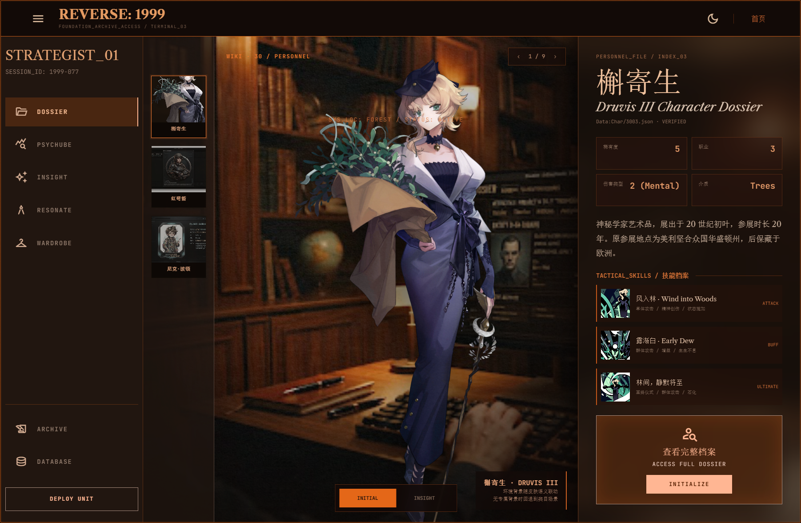

批准截图原始像素为 `1802x1175`，SHA-256 为 `E1882FFDA2AAC749B915B9933DBC63E4852BB17FB3814DEA3562BEDAAD779873`。实现验收使用 CSS 参考视口 `1280x1024`，并在 `1440x900`/实际宽屏复核连续响应式表现；截图像素尺寸不能反推为固定 CSS 画布。

| 区域 | PC 参考尺寸 | 已批准布局契约 |
|---|---:|---|
| Card Nav | 高 `64px` | 菜单与 `REVERSE: 1999` 靠左；主题图标与“首页”靠右；中间不保留空的导航占位列 |
| `ArchiveSectionRail` | 宽 `256px` | 页面内功能栏，显示 `STRATEGIST_01`、会话号、Dossier/Psychube/Insight/Resonate/Wardrobe，底部显示 Archive/Database/Deploy Unit |
| `WikiRosterStrip` | 宽 `128px` | 磨砂窄名册，只放稳定尺寸的小头像与姓名；选中项使用铜橙描边，内容过多时独立纵向滚动 |
| `CharacterSceneStage` | `minmax(0, 1fr)` | 环境背景、氛围层、透明立绘和 UI 叠层；在 `1280px` 总宽时约 `496px`，在 `1440px` 总宽时约 `656px` |
| `WikiDossierPreview` | 宽 `400px` | 深棕磨砂资料栏，展示身份、四格摘要、简介、三张紧凑技能卡与完整档案 CTA；超高内容独立滚动 |

PC 构图必须满足以下规则：

1. 工作区使用 `256px 128px minmax(0, 1fr) 400px` 四段网格；导航以下区域占满剩余 `100dvh`。浏览器缩放时中部舞台先弹性变化，固定侧栏不得挤压文字到不可读或覆盖相邻区域。
2. 环境背景属于“窄名册 + 中部舞台 + 右侧资料栏”的共同底层，而不是只属于立绘容器。`WikiRosterStrip` 与 `WikiDossierPreview` 叠在同一背景之上，才能形成真实亚克力折射/磨砂层次。
3. 主立绘是透明前景图，不进入卡片、不带旧浅色图片底、不使用 Tilted Card；人物占中部舞台的主视觉面积，底部可略超出但不能遮挡右侧资料。
4. 中部保留角色计数、环境状态、初始/洞悉切换与当前角色标识。Live2D 后续仍复用同一舞台；未就绪时显示不可用状态并保留静态立绘。
5. `WikiDossierPreview` 的参考表面为 `rgba(28, 17, 11, 0.70)`，参考磨砂为 `blur(24px) saturate(0.78)`，并带左侧暗投影和细铜色边线。底层环境必须可被隐约感知，不能退化为完全不透明的纯棕面板。
6. “查看完整档案”占满资料栏可用宽度，参考最小高度 `150px`；采用 Stitch 铜橙亚克力而非纯橙色块，参考背景为 `rgba(237, 105, 22, 0.18)`、边框 `#a78b7e`、磨砂 `blur(20px)`，内部包含 `person_search` 图标、中文标题、`ACCESS FULL DOSSIER` 与浅橙 `INITIALIZE` 按钮（`#ffb693`）。
7. 英文标题使用 `Libre Caslon Text`，导航/编号/状态/按钮使用 `JetBrains Mono`，图标使用 `Material Symbols Outlined`；中文标题与正文使用协调的中文衬线 fallback。`伤害类型` 的批准展示值为 `2 (Mental)`，不再显示“精神”。
8. 页面内功能栏图标必须使用正式图标字体或项目图标组件，不使用 `▣`、`⌁` 等临时字符。窄名册使用小头像加姓名，不强制塞入完整立绘或长摘要。
9. Card Nav 是唯一允许在与 Stitch 静态稿冲突时保留本地动效的区域；其他动画、旧模块边界或旧 API 形状若阻碍本节构图，应优先删除/调整，而不是降低本节视觉目标。

### 6.7 移动端选人页视觉基线（2026-07-14 已批准）

本节只约束 `/wiki/character` 移动端选人/档案预览页。移动端完整详情 `/wiki/character/:id` 或 API 返回的等价规范 route 不在本节范围内，仍须以 Stitch `个人详情` Mobile 画板另行设计和批准；不得把本节的上下排布直接当成详情页基线。

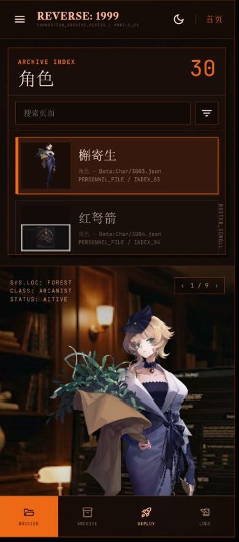

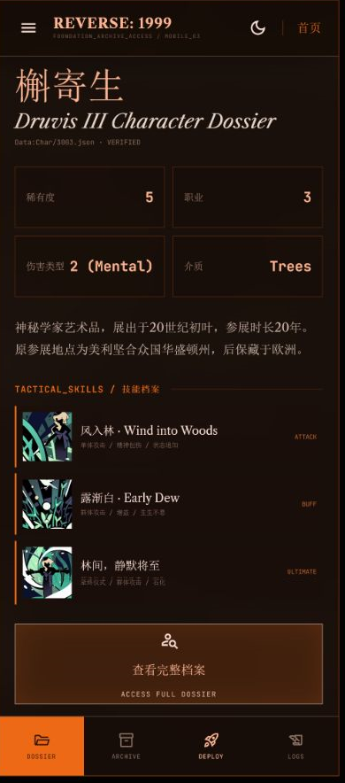

两张批准截图均为 `390x884` CSS 参考视口。首屏截图 SHA-256 为 `8540D50775D3D53B34E470A89E1D3626F2106AF80A084040D8568CBC45139BD9`，概述态截图 SHA-256 为 `C40C6352DF31DEDFFE49CD0CE3EA77CBDC5DED2DD94EB14F72AAB85C1A1828C8`。其视觉来源是 Stitch `分类选择界面` Mobile `019774f3c2664e7a8d0fcb4a28d76119` 的 `780x1768` 画板，但已批准将原稿左右关系改为更适合真实手机浏览的“选人框 -> 环境立绘舞台 -> 档案概述”上下文档流。该改动是明确的移动端构图决策，不是临时降级。

| 区域 | 移动端参考尺寸 | 已批准布局契约 |
|---|---:|---|
| Compact Card Nav | 高 `64px` | 固定在设备框顶部；菜单和品牌靠左，主题图标与“首页”靠右；沿用 Stitch 字体、线框和本项目已批准 Card Nav 动效 |
| `MobileRosterPanel` | 高 `342px`，外边距 `14px` | `ARCHIVE INDEX`、分类名、数量和搜索框固定；角色列表是面板内唯一滚动区，条目只显示可辨认图片、姓名与短元数据 |
| `MobileRosterList` | 可视高约 `203px` | 独立纵向滚动并隐藏滚动条；选中项使用铜橙左线和边框，列表触底后继续滚动必须自然交给全局页面 |
| `MobileCharacterStage` | 高约 `640px` | 环境背景铺满舞台，透明立绘保持约 `91%` 舞台高度；保留环境状态、计数、当前身份和 Initial/Insight 状态，不把立绘放进卡片 |
| `MobileDossierOverview` | 自然内容高度 | 位于舞台之后，由全局页面滚动进入；展示姓名、英文档案标题、四格摘要、简介、三张紧凑技能卡与铜橙亚克力完整档案入口 |
| Mobile Local Nav | 高 `68px` | 固定在设备框底部，显示 Dossier/Archive/Deploy/Logs；正文必须留出底部安全区，不能遮挡技能卡、CTA 或最后一行文本 |

移动端构图必须满足以下规则：

1. 页面顺序固定为 Compact Card Nav、角色选择框、环境立绘舞台、档案概述。角色选择框与立绘舞台上下排列，不恢复 PC 四段网格，也不把名册压成横向头像轮播。
2. `MobileRosterPanel` 内只有角色列表可滚动；标题、数量和搜索框保持稳定。列表滚动条在视觉上隐藏，但鼠标滚轮、触控滑动、键盘和辅助技术仍可访问全部结果。
3. 页面根滚动容器是唯一全局滚动所有者。角色列表未到边界时消费滚动；到达顶部或底部后不得继续 `preventDefault`，后续滚动自然交给全局容器，使用户从选择框继续向下进入舞台与概述。概述区不得再创建第三层纵向滚动。
4. 舞台使用与 PC 相同的共享环境背景与透明角色立绘语义，但按移动端纵向构图重新裁切。主立绘必须足够大且保持透明边缘，不使用旧浅色图片底、独立卡框或 Tilted Card。
5. 概述态延续 PC 预览的信息范围，不在选人页展开传承、塑造、完整语音或档案长文。`伤害类型` 显示值固定为 `2 (Mental)`；技能卡必须包含真实技能图、名称和短标签。
6. “查看完整档案”使用铜橙半透明亚克力表面、图标、中文标题和 `ACCESS FULL DOSSIER`，点击后只导航到 API 返回的规范 route。固定底部导航之上必须有足够 safe padding，批准概述截图中的入口完整可见是硬门槛。
7. 英文标题使用 `Libre Caslon Text`，编号、元数据、按钮和状态使用 `JetBrains Mono`，图标使用 `Material Symbols Outlined`，中文使用协调的衬线 fallback。移动端不能用系统无衬线字体整体替代该层级。
8. `390x884` 是截图回归参考视口，不是固定页面画布。窄于或宽于该尺寸时使用弹性内边距、自然高度和断点连续重排，不能缩放整个页面、裁切正文或产生横向页面滚动。

移动端像素级验收使用两张截图分别锁定两个可观察状态：

- 首屏基线锁定 `64px` Card Nav、`342px` 选择框、独立列表、舞台首屏比例、大立绘、计数/环境叠层和 `68px` 底部导航。
- 概述基线锁定姓名与英文标题、四格摘要、`2 (Mental)`、简介、三张技能卡、完整可见的亚克力 CTA 与不遮挡内容的底部导航。
- 截图差异只能对真实角色文字、真实媒体内容、运行时数量等动态区域设置明确 mask 或独立容差；导航、边界、间距、字体角色、卡片密度、舞台裁切和滚动后停靠位置不得以“响应式”或“数据不同”为由豁免。

### 6.8 PC 个人详情页视觉基线（2026-07-15 已批准）

本节只约束角色规范详情 route（例如 API 返回的 `/wiki/char/3003` 或 `/wiki/character/3003`）在 PC 宽屏下的完整个人详情页。它不约束 `/wiki/character` 选人页；移动端详情由 6.9 节独立约束。若本节与本文早期概括、旧 specs、旧原型、通用 Grid/Card 组件或既有动效调用点冲突，以本节、下方批准截图和 Stitch `个人详情` Desktop `a1f37efca7104637bf2a23ffe14196c2` 为准；Card Nav 是唯一可优先保留的本地动效。


批准截图原始像素为 `1280x951`，SHA-256 为 `6E4B9E926494CED2B805EDC0812E983809EC2238C569650227DE9EA1DCD3EE6B`。该尺寸对应 `1280x1024` 桌面窗口扣除浏览器工具栏后的内容视口，是 PC 像素回归的首要参考状态；同时在 `1440x900` 与 `1920x1080` 验证连续响应式表现。浏览器审稿页为方便完整展示曾使用固定 `1280px` 审稿画布和整体缩放，这只属于设计评审工具，不是生产结构。

| 区域 | PC 参考几何 | 已批准布局契约 |
|---|---:|---|
| Compact Card Nav | 高 `64px`，全宽 | 菜单、品牌与档案终端副标题靠左；主题入口与“首页”靠右；继续使用本项目已批准 Card Nav 交互 |
| `CharacterDetailStage` | `calc(100dvh - 64px)` | 深色档案纹理、扫描线、克制的铜色径向光与竖向姓名水印组成共同底层；不是选人页的室内环境照片，也不是通用三栏卡片底 |
| `ProfileSkillRail` | 左 `40px`、顶 `96px`、宽 `320px`、底部约 `44px` | 悬浮于舞台之上并独立纵向滚动，顺序为身份卡、纸质 `PROFILE_DATA`、三张技能卡、文化档案；滚动条弱化但交互可用 |
| `CharacterPortraitAnchor` | 居中、底部对齐，最大舞台宽 `1400px` | 透明初始/洞悉立绘约占 `95dvh`，是页面第一视觉信号；不放入卡片，不附旧浅色底，不因左右资料增多而缩成头像 |
| `InheritanceVoiceRail` | 右 `40px`、顶 `96px`、宽 `380px`、底部约 `44px` | 悬浮于舞台之上，依次显示传承、塑造与语音档案；传承和塑造保持紧凑，语音区占用剩余高度并独立滚动 |
| `WardrobeControlDeck` | 水平居中、底 `32px` | `WARDROBE / 衣着分卷`、Initial/Insight 分段切换、Udimo 便签与 `DEPLOY UNIT` 组成叠层控制台，不新增独立媒体窗口 |

PC 个人详情构图必须满足以下规则：

1. 页面使用“共同档案舞台 + 左右悬浮资料簇 + 中央透明立绘 + 底部控制台”的 Stitch 模块树，不能退化为三块等高矩形 Grid、统一深色面板或选人页四段网格。左右资料块允许轻微 `-2deg` 到 `3deg` 旋转和层叠，中央立绘保持稳定正向。
2. 左列身份卡使用铜橙左边线和小头像；`PROFILE_DATA` 必须呈现胶带、`VERIFIED` 印章、纸张纹理与字段表；技能区必须使用真实技能图、名称、短描述及 `ATTACK`/`ULTIMATE` 等类型标签；文化档案位于同一左列后续滚动内容中，不以一段未分组长文本替代。
3. 右列传承以 I/II/III 等层级节点展示真实效果，塑造以 LV.1-LV.5 等结构化记录展示，语音档案以可播放记录呈现中英文本、分组名和播放入口。语音数量超过可视区时只滚动语音列表，不让传承与塑造随语音滚出首屏。
4. 中央舞台使用透明角色立绘、柔和暗影与低对比竖向英文名水印，不增加图片外框、浅色底或 Tilted Card。立绘可与左右悬浮块发生受控视觉叠压，但人物脸部、主要轮廓、左右文字和底部切换控件不得互相遮挡。
5. Initial/Insight 切换在同一 `CharacterPortraitAnchor` 内替换静态立绘及与该状态有关的档案语义，不改变舞台尺寸。Live2D 仍沿用“同一舞台、不可另开窗口”的总契约；播放器未就绪时保留不可用语义和图片 fallback，但本次 PC 截图基线不要求新增一个会改变几何的独立 Live2D 面板。
6. 详情页使用 `Libre Caslon Text` 承担英文主标题与档案标题，`JetBrains Mono` 承担字段、元数据、按钮和状态，`Material Symbols Outlined` 承担正式图标，中文使用协调的衬线字体。基本资料中的伤害类型值显示为英文 `Mental`；技能描述中的游戏术语“精神创伤”仍按真实中文数据展示，二者不得混为同一字段。
7. 视觉令牌延续 `#1c110b` 深桃花心木背景、`#e2610b` 铜橙、`#f6ded4` 羊皮纸文本与 `#a78b7e` 弱描边。玻璃面板需要可感知的透明度、底层纹理和 `backdrop-filter`，纸质便签需要与玻璃面板有明确材质差异；不能只用不同深浅的纯棕矩形近似。
8. PC 参考状态是单视口档案工作台：根舞台保持稳定，左列与语音列表分别拥有清晰滚动所有权。隐藏或弱化滚动条不得阻止鼠标滚轮、触控板、键盘、焦点滚动和辅助技术访问全部内容；嵌套滚动到边界时不得吞掉无效滚轮事件。
9. 正式实现必须使用原生 React 组件、真实 Wiki API 数据和响应式 CSS 重建该构图。禁止复制审稿页的整页 `transform: scale()`、固定 `1280px` 画布、iframe、运行时 Stitch HTML、Tailwind CDN 或远程字体依赖。`1280x951` 只用于截图回归；更宽 PC 让中央舞台与外侧留白弹性扩展，更窄视口通过断点重排，而不是缩放整页；进入移动断点后必须切换为 6.9 节批准的移动模块树。
10. 数据来源保持分层：身份、技能、文化、媒体和语音消费合并后的 Wiki API；传承与塑造消费 `data/raw` 只读补全后写入项目 MySQL 的 supplement；图片和音频只使用 API 返回的 HTTP(S) MinIO URL。React 不读取 `data/raw`，不扫描 MinIO，不通过文件名或 object key 推断皮肤关系。
11. 对 raw supplement 已覆盖的角色，身份、基本资料、三技能、传承、塑造、文化与语音是 P0 真实数据验收项，不能使用 Stitch 示例文案、假数组或空占位通过。来源确实缺失的模块整块省略并保持构图平衡，不显示 `undefined`、空表格或虚构内容。
12. 像素级截图差异的硬门槛包括 Card Nav 高度、左右列锚点与宽度、主立绘占比、纸张/玻璃材质、轻微旋转、模块顺序、技能图尺寸、右列密度、底部控制台位置、字体角色和层叠关系。真实文字长度、运行时媒体内容和语音条数可以设置明确 mask 或独立容差；“模块已存在”“组件测试通过”或“数据不同”不能豁免明显的静态几何与材质偏差。

### 6.9 移动端个人详情页视觉基线（2026-07-15 已批准）

本节约束角色规范详情 route 在移动端的完整个人详情页，不约束 `/wiki/character` 选人页。视觉权威依次为本节、下方九张连续批准截图和 Stitch `个人详情` Mobile `446f20871c514bb6baafba2dab6613c6`；若与 PC 6.8 节、旧移动原型、通用卡片组件或既有 ReactBits 调用点冲突，移动断点以本节为准，Card Nav 仍是唯一可优先保留的本地动效。

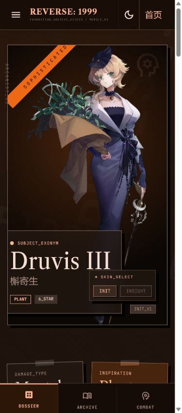

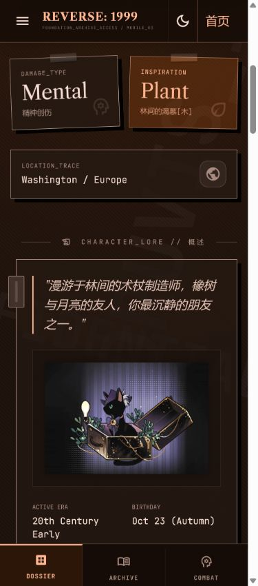

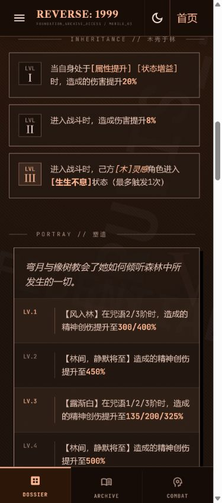

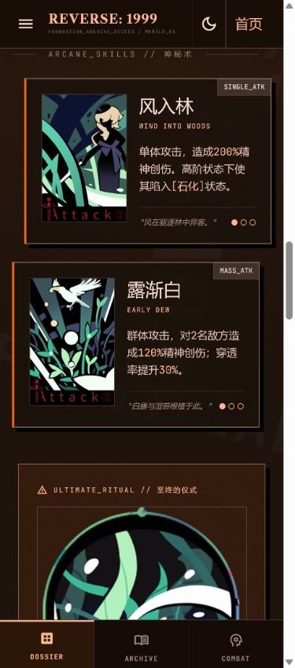

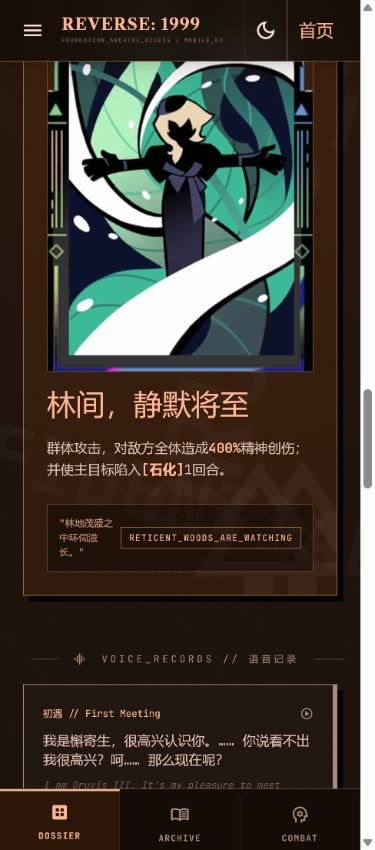

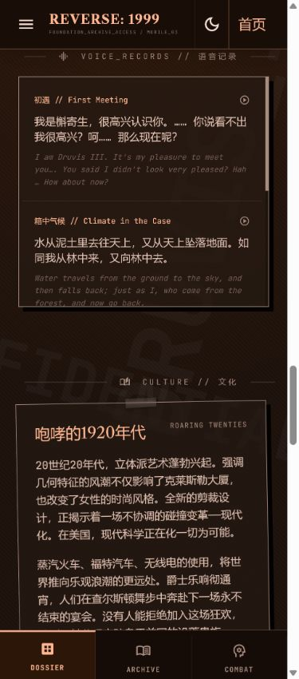

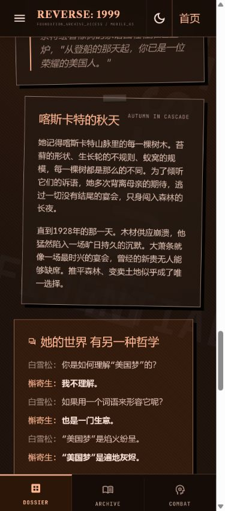

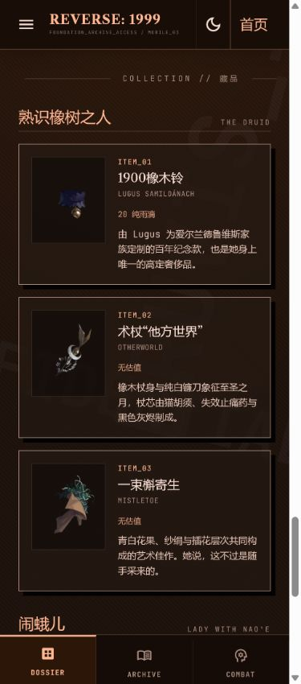

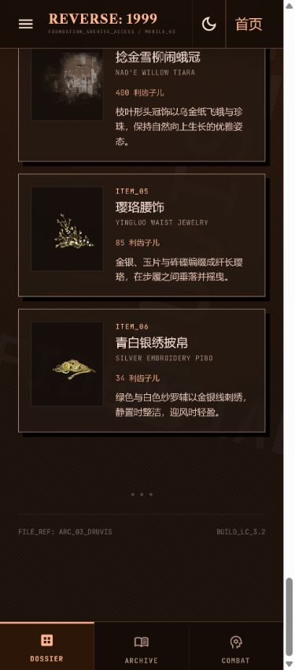

九张批准截图均为 `375x850` 可视区采样，按页面纵向顺序形成有重叠的连续覆盖。生产截图回归以 `375x850` 为首要参考，并在 `360x800`、`390x844`、`412x915` 验证连续响应式表现；任何尺寸都不得通过整页缩放复刻参考图。

| 视觉锚点 | 必须覆盖的模块 | SHA-256 |
|---|---|---|
| `hero` | Card Nav、Initial/Insight 互斥舞台、身份片、底部档案标签 | `C967BC8D01DD9CC4DD08159A307F89C8CB0FAF14432AB17F0B813FA1A0B5F8F1` |
| `summary` | Damage Type、Inspiration、Location、概述、Udimo/档案媒体与基本字段 | `607C12E176D7F9E9B5B350CB3464C7D95C70427D6F40A859FA92129126FD5BC4` |
| `inheritance-portray` | 传承 I/II/III、塑造 LV.1-LV.5 | `919A291E7FBBB6C67D9A24456040D05B1E230FFBB81214EDBA3C1AA5D9B9FD10` |
| `skills` | 两张普通神秘术技能卡、真实技能图与阶次状态 | `C850C42C63430702E96307802BF8D305CF0A8174F81C9DAB7F05775AB27F07C3` |
| `ultimate` | 至终仪式完整大图、说明、档案引语，并与语音区连续衔接 | `6536545B9B9DBB64EDABF573A31493F734FCB0E8E04666808E823A35D4B3ED78` |
| `voice-culture` | 唯一局部滚动的语音记录窗口、文化首段 | `AFBA0564AEB34F933C2C1074E6016CB16F94251A1F8F45B301CAD8B59E933A02` |
| `culture-continuation` | 文化后续纸张、对白/访谈模块 | `528654F90BFB961D2625F7537A43B70F3A137CDB97DD58728A60D19951773B19` |
| `collection-top` | 藏品第一分组与 `Belonging-300301` 至 `300303` | `61E539AF96104C0C0640BDB89F8D1E83E824A10F73CB1077912200DF203F4A85` |
| `collection-footer` | 藏品第二分组、`Belonging-300304` 至 `300306`、技术页脚与 safe padding | `11F12831797C1E1286D5F84C62F2D441C03B48D731247B34618FEE5E87D8FBFE` |

九个锚点是一个完整验收集合，不得只选择首屏或前三张截图宣称移动端详情完成。相邻锚点保留内容重叠，用于证明全局滚动中不存在模块断层、固定栏遮挡或不可达区间。

| 区域 | 移动端参考几何 | 已批准布局契约 |
|---|---:|---|
| Compact Card Nav | 固定顶部、高 `64px` | 菜单与 `REVERSE: 1999` 档案元数据靠左；主题入口与“首页”靠右；保持 Card Nav 交互但收起状态不得遮挡正文 |
| `MobileSubjectHero` | 文档流首段、约高 `600px`、左右 `16px` | 深铜径向舞台、透明大立绘、斜贴 `SOPHISTICATED` 标签、左下身份玻璃片与右下 `SKIN_SELECT` 共同组成封面；不是独立图片卡列表 |
| `MobileProfileSummary` | 两列摘要 + 全宽地点 | `Damage_Type / Mental` 与 `Inspiration / Plant` 使用轻微错位的纸张/玻璃便签，地点轨迹独占下一行；不能压成横向桌面表格 |
| `MobileDossierFlow` | 单列自然高度 | 概述、基本字段、Udimo/档案媒体、香调、传承、塑造、技能、至终仪式、语音、文化和藏品按语义顺序进入同一全局纵向文档流 |
| `MobileVoiceRecords` | 高约 `300px` | 语音记录是正文中唯一获准的嵌套纵向滚动区；中英文本、播放入口和当前记录状态保持可读，滚动到边界后交还全局页面 |
| Mobile Dossier Tabs | 固定底部、高 `64px` | `DOSSIER` 为当前态，`ARCHIVE` 返回角色索引并恢复选人状态，`COMBAT` 可定位技能区；正文底部预留至少 `96px` safe padding |

移动端个人详情构图必须满足以下规则：

1. 页面采用“固定 Card Nav + 单列长档案流 + 固定底部档案标签”的移动模块树，不能把 PC 左右资料簇和中央舞台整体缩放，也不能使用水平拖动画布访问被裁切列。
2. 首屏必须先建立角色封面：透明立绘在深色档案舞台内保持完整主体和足够占比，身份玻璃片与皮肤控件只做受控叠层。人物脸部、姓名、属性标签和切换按钮都必须可读、可点；皮肤控件的交互层级高于身份玻璃片，不能再次被覆盖层截获点击。
3. Initial 与 Insight 是同一 `MobileSubjectHero` 中的互斥状态，不是两张纵向拼接图片。稳定状态下只能有一张立绘 `opacity: 1` 且 `aria-hidden="false"`，另一张必须 `opacity: 0`、`pointer-events: none` 且 `aria-hidden="true"`；切换按钮同步更新 `aria-pressed` 与 `INIT_V1/INSIGHT_V2` 标签，不允许两张人物或无关海报同时可见。状态配对仍来自 Wiki API 明确媒体语义，不在 React 中猜文件名。Live2D 继续共享该舞台；P0 播放器未就绪时入口可放在 Card Nav 展开内容或舞台辅助菜单中，不得为占位新增第二媒体窗口。
4. 摘要字段中的伤害类型值使用英文 `Mental`，下方真实说明可显示“精神创伤”；灵感值使用英文 `Plant`。标题、元数据、中文字段和图标继续使用 6.8 节锁定的字体角色与 Archival Noir 令牌。
5. 全局模块顺序固定为封面 -> 摘要/地点 -> 角色概述与基本资料 -> 传承 -> 塑造 -> 神秘术/至终仪式 -> 语音记录 -> 文化 -> 藏品 -> 技术页脚。传承使用 I/II/III 等真实洞悉节点，塑造使用真实 LV.1-LV.5 档案记录；九张批准截图已连续覆盖全部 P0 模块，不得省略中间区段。
6. 技能与至终仪式使用真实技能图、名称、英文副标题、类型、描述、档案引语和阶次状态；图片嵌入卡片构图，不得退回通用表格或只显示长文本。文化使用多个独立档案片段，藏品使用缩略图与元数据行，不制造统一样式的空卡。槲寄生六件藏品资源由 `resources_manifest.jsonl` 中 `Belonging-300301` 至 `Belonging-300306` 的稳定记录进入统一构建器，构建器以实体 ID、资源 ID 与 manifest 映射写入 Wiki API/媒体索引；React 不得按中文名、拼音、英文名、编号或文件名运行时猜测 URL，也不得扫描 MinIO 反推资源。若共享 MinIO 尚无对象，只允许受控构建/上传步骤按 manifest 校验 SHA-1 后补入并记录，不修改 RAG 的 `media_assets.jsonl`、Milvus 或已有对象。
7. 页面主体由浏览器全局纵向滚动承载。除语音记录外，概述、传承、塑造、技能、文化和藏品都不得创建嵌套纵向滚动；顶部和底部固定栏之间的所有内容必须通过触摸、滚轮、键盘与辅助技术到达。
8. 底部 `ARCHIVE` 是明确返回选人页的入口，浏览器 Back 同样恢复原分类、搜索词、选中角色和名册滚动位置。固定底栏不得遮挡语音、藏品、技术页脚或最后一个可聚焦控件，并需使用 `env(safe-area-inset-bottom)` 处理设备安全区。
9. `375x850` 是像素回归参考，不是固定画布。小于 `360px` 时允许摘要便签改为单列；更宽手机只弹性增加边距和模块宽度，不随视口宽度放大字体，不产生横向页面滚动，也不改变档案模块顺序。
10. 正式实现必须以原生 React 组件、真实 Wiki API、项目内字体与 HTTP(S) MinIO 媒体重建。禁止复制审稿页的 Tailwind CDN、远程 Google 图片、固定审稿画布、整页 `transform: scale()`、iframe 或运行时 Stitch HTML；远程示例媒体必须替换为 API 返回的真实资产或明确 fallback。
11. 移动端截图差异硬门槛包括 `64px` 顶/底导航、首屏立绘占比、斜贴标签、身份片与切换控件层级、摘要便签错位、模块次序、技能图比例、语音窗口高度、文化纸张质感、字体角色和安全区。真实文字长度、媒体内容和条目数量只可设置明确 mask 或独立容差，不能用“响应式”或“数据不同”豁免静态几何、材质与滚动所有权偏差。

## 7. Wiki 索引模块

### 7.1 模块职责

`WikiIndexPanel` 由 Card Nav 展开区中的分类/搜索/完整结果控制面与 PC 常驻 `WikiRosterStrip` 共同组成。分类仍属于 Card Nav，不恢复旧 CategoryRail；`WikiRosterStrip` 只提供当前结果中的紧凑角色选择，条目选择只更新预览，进入完整详情由独立 CTA 完成。

### 7.2 P0 当前必须满足

- `INDEX-P0-01`：PC 常驻名册固定为 `128px` 窄栏，索引项只展示可快速辨认的小头像与名称；类型/ID 等附加短标签仅在空间充足时显示，不显示完整立绘、正文或大段摘要。
- `INDEX-P0-02`：缩略图容器尺寸稳定，图片按头像/主体可辨认的方式裁切；缺图时使用同尺寸档案占位。名册表面使用可辨认的磨砂效果，不能用不透明纯色遮掉共同环境背景。
- `INDEX-P0-03`：选中、悬停、键盘焦点和加载状态使用明确但克制的铜色线框或底色反馈；选择条目只更新大预览与摘要，不自动替换为完整详情 DOM。
- `INDEX-P0-04`：搜索、分类切换和条目选择继续使用现有 Wiki API，不改变查询语义；“查看完整档案”只导航到 API 返回的 `page.route`，直达详情不依赖索引请求成功。
- `INDEX-P0-05`：当前结果数量、空结果和请求失败状态可读；进入详情再返回时恢复分类、搜索词、选中角色和列表滚动位置，列表失败时不清空已加载预览。
- `INDEX-P0-06`：`nextCursor` 视为不透明值；同一分类/查询的逐页读取不得跳项或重复，累计唯一条目数最终等于分类 count。搜索排序必须先在窄列候选集上完成，再关联 `content_json`；真实短词 `J`、`6`、`露西` 必须返回精确标题优先结果。MySQL 查询异常必须成为可重试 API 错误，不能返回 `200 + 空列表` 冒充无结果。

### 7.3 P1 可部分支持

- `INDEX-P1-01`：支持按稀有度、阵营、版本或其他已存在结构化字段排序/筛选。
- `INDEX-P1-02`：为剧情、心相、道具、阵营等分类定制索引图像比例与短标签。

### 7.4 P2 未来演进

- `INDEX-P2-01`：支持虚拟列表、拼音/别名联想和跨分类搜索结果分组。

### 7.5 关键契约与限制

索引项不能为了视觉效果依赖详情 API 才能渲染。缩略图、名称、`route` 和基本标签来自 page list 契约；选中后的增强预览可以渐进请求详情，但请求失败时仍保留 list item 级预览和可重试状态。前端不得解析或拼装 cursor，只负责在分类/查询不变时累积、按 `pageId` 去重并在筛选条件变化时丢弃旧 cursor。数据库排序阶段不得携带大型 `content_json`；cursor 必须绑定当前筛选指纹，避免把旧查询的位置用于新查询。

## 8. Wiki 主媒体舞台模块

### 8.1 模块职责

`WikiHeroStage` 负责展示页面最有辨识度的主媒体。PC 选人预览使用 `CharacterSceneStage` 四层构图（环境背景、氛围层、透明立绘、UI 叠层）；角色详情页继续以足够大的立绘为第一视觉信号，并在同一稳定舞台内切换初始、洞悉与 Live2D 状态。非角色页根据 page type 选择封面、心相图、物品图或通用主媒体。

### 8.2 P0 当前必须满足

- `MEDIA-STAGE-P0-01`：角色主立绘尺寸参考灰机角色页和 Stitch 画板的主体占比，优先展示人物本体，不使用过小头像代替主立绘。
- `MEDIA-STAGE-P0-02`：立绘资源本身保持透明、无旧浅色图片底和装饰卡框，但 PC 选人舞台必须使用已批准的环境背景与氛围叠层。环境层延伸到窄名册和右侧磨砂资料栏下方，透明立绘作为前景合成；“透明舞台”不得再解释为纯色空背景。
- `MEDIA-STAGE-P0-03`：初始立绘、洞悉立绘与 Live2D 使用同一个稳定尺寸舞台和分段切换控件，不创建纵向拼接或彼此覆盖的第二媒体窗口。初始/洞悉在稳定状态下必须互斥可见，控件可点击区域不得被身份卡或其他叠层截获；Live2D 未实现或资源不可用时，入口显示不可用状态，并继续展示当前静态立绘或其他图片 fallback。
- `MEDIA-STAGE-P0-04`：适配器只依据 API 已提供的媒体 role/title/entity/variant 语义建立初始/洞悉静态配对及环境背景关系，不在 React 组件中通过 URL、object key、编号或文件名后缀猜测皮肤。现有 API 无法表达已确认关系时，允许扩展 Wiki 只读 API/视图模型契约后再渲染。存在两张可确认立绘时显示“初始/洞悉”；语义无法确认但有多张可用立绘时只能显示“立绘 1/立绘 2”等中性标签；只有一张时保留单一可用状态。候选顺序为已映射初始/洞悉立绘 -> 未分类 portrait -> 同实体其他高价值图片 -> 稳定档案占位。
- `MEDIA-STAGE-P0-05`：单张图片加载失败只替换该图片，不清空正文、索引或其他媒体。
- `MEDIA-STAGE-P0-06`：浏览器只消费 API 返回的 HTTP(S) URL，不接受 `D:\`、`file://`、容器内部路径或 MinIO 内部 service endpoint。
- `MEDIA-STAGE-P0-07`：角色以外页面至少具备通用主媒体策略；没有专属媒体时不制造空白大框。

### 8.3 P1 可部分支持

- `MEDIA-STAGE-P1-01`：为剧情、心相、道具、阵营和日历等 page type 建立专属媒体选择策略。
- `MEDIA-STAGE-P1-02`：在 P0 初始/洞悉及通用环境映射之上扩展更多命名皮肤/版本，并建立皮肤立绘、专属背景图与未来 Live2D 资源的一一对应映射。

### 8.4 P2 未来演进

- `MEDIA-STAGE-P2-01`：接入正式 Live2D 播放器、资源生命周期和性能降级。
- `MEDIA-STAGE-P2-02`：重新评估 Tilted Card 或其他主媒体动效。

### 8.5 关键契约与限制

Wiki 对共享 MinIO 始终只读。缺失媒体只能产生前端降级或独立修复请求，不能由页面运行时扫描、上传或覆盖对象。

## 9. Wiki 档案信息模块

### 9.1 模块职责

`WikiDossierInfo` 以档案/终端格式呈现页面身份与可追溯信息，并提供关系和路由入口。

### 9.2 P0 当前必须满足

- `DOSSIER-P0-01`：至少呈现来源、分类、page type、page ID、媒体数量、关系数量、链接数量、别名和稳定 Wiki route；缺失字段显示明确的“无”或省略对应行，不显示 `undefined`。
- `DOSSIER-P0-02`：元数据标签与编号使用等宽视觉层级，值保持可选择、可复制和可换行。
- `DOSSIER-P0-03`：已有可解析关系、关键词 link span 或内部路由以蓝色/强调色可点击文本表示，键盘可访问。
- `DOSSIER-P0-04`：右栏在宽屏可独立滚动，滚动条可视觉弱化但不能破坏滚轮、触控板、触摸或键盘滚动。
- `DOSSIER-P0-05`：为未来 RAG 来源跳转保留稳定 route/entity/source 映射展示，不依赖视觉组件内部状态。
- `DOSSIER-P0-06`：PC 选人页右侧 `WikiDossierPreview` 固定为 `400px` 磨砂预览栏，展示标题、英文档案名、来源、四格关键属性、简短简介、三张紧凑技能卡与完整档案 CTA；它不是完整详情正文，CTA 必须导航到 API 返回的规范 route。
- `DOSSIER-P0-07`：预览栏和完整档案入口使用 6.6 节批准的真实亚克力层级；环境背景未延伸到面板底层、`backdrop-filter` 无效或入口退化为单一纯橙矩形时，视觉验收失败。

### 9.3 P1 可部分支持

- `DOSSIER-P1-01`：增加页面内目录、关系分组、最近访问和复制引用操作。
- `DOSSIER-P1-02`：RAG 来源卡片可通过 `source_id/entity_id/title` 解析并进入对应 Wiki route。

### 9.4 P2 未来演进

- `DOSSIER-P2-01`：关系图谱、时间线或多实体差异对比。

### 9.5 关键契约与限制

档案信息用于追溯和导航，不重复整段正文。关系项只能使用 API 已返回的映射，不能在浏览器中通过标题猜测路由。

## 10. Wiki 结构化正文模块

### 10.1 模块职责

`WikiStructuredBody` 将 API 内容转换为可阅读的档案章节、字段表、段落、列表、引用和关联入口，避免把正文作为一整串文本输出。

### 10.2 P0 当前必须满足

- `CONTENT-P0-01`：优先消费 `content_json.blocks`/现有 `content.blocks`；组件按明确 block 类型渲染，不读取或展示隐藏的 raw 调试对象。
- `CONTENT-P0-02`：当 blocks 缺失时，只使用保守 fallback：显式标题、换行、字段分隔和自然段；不得凭空推断稀有度、阵营、技能或人物关系。
- `CONTENT-P0-03`：角色模板至少组织为标题/基本资料、主媒体、技能、传承、塑造、档案正文、语音入口和关联页面；raw supplement 覆盖的角色必须渲染真实传承与塑造表格，不能把它们误判为未来占位。仅对来源确实缺失的其他资料节跳过空卡片。
- `CONTENT-P0-04`：剧情、心相和通用页面至少分别使用现有 `StoryPage`、`PsychubePage`、`GenericWikiPage` 的模板分流能力，并统一进入新的 Dossier 视觉层级。
- `CONTENT-P0-05`：正文图片背景透明、无旧浅色外框；图片说明与来源作为正文元数据呈现，不与图片焊接成装饰卡。
- `CONTENT-P0-06`：关键词 link span 保持可点击，多个 span 不互相覆盖；无法解析的 span 退化为普通文本。
- `CONTENT-P0-07`：单个异常 block 被局部跳过或显示局部错误，不让整个详情页白屏。
- `CONTENT-P0-08`：正文在桌面和移动端保持合理行长、段落间距和标题层级，不使用随视口宽度无限放大的字体。
- `CONTENT-P0-09`：PC 角色详情必须把技能、传承、塑造和语音映射为 6.8 节批准的语义组件：技能图文卡、传承层级节点、塑造等级记录与可播放语音记录。将这些真实结构重新压平成通用表格、单段长文本或统一样式卡片，视为 P0 未完成。

### 10.3 P1 可部分支持

- `CONTENT-P1-01`：为道具、阵营、世界、日历、版本活动等高价值分类建立专属模板。
- `CONTENT-P1-02`：在 6.8 节已锁定的基础技能、传承、塑造和语音组件之上，增加技能阶次对比、语音筛选/连续播放、复杂表格和跨媒体组合等更细语义 block。

### 10.4 P2 未来演进

- `CONTENT-P2-01`：引入可视化关系图、交互时间轴和复杂数据比较组件。
- `CONTENT-P2-02`：重新选择 Scroll Reveal 或其他文字动效，并以章节级而非逐字动画接入。

### 10.5 关键契约与限制

结构化渲染是展示层职责，但语义来源必须是 API 数据。前端 fallback 只改善可读性，不成为第二套数据清洗或知识推断管线。

## 11. Wiki 视图模型适配模块

### 11.1 模块职责

该模块在现有 Wiki API 类型与 Stitch 组件之间建立纯函数映射，隔离媒体选择、字段格式化、缺失值处理和 page type 模板选择。

### 11.2 P0 当前必须满足

- `ADAPTER-P0-01`：适配器输入为 API 已合并 canonical content 与 raw supplement 的 `WikiPageListItem`、`WikiPageDetail` 和分类响应，输出为索引、媒体舞台、档案信息、传承、塑造和正文视图模型。
- `ADAPTER-P0-02`：适配器不得请求网络、修改输入对象或访问 React 状态；同一输入必须产生稳定输出。
- `ADAPTER-P0-03`：媒体角色、HTTP URL、page type、route 和 link span 的 fallback 顺序集中定义，不能分散在多个视觉组件中各自猜测。
- `ADAPTER-P0-04`：角色 supplement 通过既有 `content: dict`/`content.blocks` 承载，不新增破坏性顶层详情字段；`/api/wiki/health` 只允许增加带默认值的 supplement 状态字段。其他不可替代字段仍须先形成独立 API 契约变更并由数据边界审查。

### 11.3 P1 可部分支持

- `ADAPTER-P1-01`：为新增 page type 注册专属适配器，并保持通用 fallback。
- `ADAPTER-P1-02`：支持服务端返回更明确的 section/block schema，但保持旧数据兼容。

### 11.4 P2 未来演进

- `ADAPTER-P2-01`：建立 schema 版本协商和内容迁移工具。

### 11.5 关键契约与限制

适配器不能演变为新的 Wiki builder。数据构建、MySQL 导入和媒体映射仍属于既有后端/数据链路。

## 12. 首页、问答页与资料页模块

### 12.1 模块职责

三个主站页面在 P0 继承全局视觉基础，在 P1 再进行与 Stitch 同风格的大布局重构。

### 12.2 P0 当前必须满足

- `MAIN-P0-01`：首页、问答页和资料页继承全局背景、三主题令牌、字体、基础线框/面板和 Card Nav。
- `MAIN-P0-02`：P0 不改变三屏滚轮导航、问答请求/流式输出、媒体播放、资料页数据和首页视频的核心行为。
- `MAIN-P0-03`：全局视觉替换后，三个页面不能出现低对比文本、不可见控件、旧浅色残留大块或导航遮挡。

### 12.3 P1 可部分支持

- `MAIN-P1-01`：首页按 Stitch 档案序章方向重构信息层级，同时保留视频加载后淡入覆盖背景的行为。
- `MAIN-P1-02`：问答页按档案终端/通信记录方向重构输入区、答案正文、来源、图片和语音区域，不改变 RAG API 与分页语义。
- `MAIN-P1-03`：资料页按档案索引/时间记录方向重构人物资料、图片和日历入口，并保留进入 Wiki 的既有路径。

### 12.4 P2 未来演进

- `MAIN-P2-01`：为三个页面重新选择 Animated List、Circular Gallery、Tilted Card 或其他动效，并分别建立性能和降级标准。

### 12.5 关键契约与限制

P1 是三个独立页面子项目。后续 implementation plan 可以按首页、问答页、资料页拆分执行和验收，不能因 Wiki P0 完成而宣称三个页面的大改已经完成。

## 13. 动效与交互降级模块

### 13.1 模块职责

该模块在布局重构期间约束动效所有权，确保既有交互不因页面重排发生回归，也确保新视觉效果不会拥有数据、路由或滚动状态。

### 13.2 P0 当前必须满足

- `MOTION-P0-01`：Card Nav 继续作为全站导航动效；其展开、收起、键盘与 `prefers-reduced-motion` 行为必须保持现有验收结果。
- `MOTION-P0-02`：新选人页/详情页不要求额外复杂动效。Wiki Scroll Reveal、Tilted Card、问答 Animated List 与 Circular Gallery 不是 Stitch 版式权威；保留时必须服从批准布局，冲突时允许删除、降级或迁移调用点。主立绘在 PC 选人页明确不使用 Tilted Card。行为改变后应更新对应 E2E，不能用旧 E2E 反向阻止已批准设计。
- `MOTION-P0-03`：所有动效继续支持键盘、触摸、能力降级和 `prefers-reduced-motion`；降级只在 reduced-motion、运行能力不足或既有显式安全模式下触发，禁用动画后功能仍完整。

### 13.3 P1 可部分支持

- `MOTION-P1-01`：在 P0 双页面布局和真实数据验收稳定后，允许对选人切换、皮肤切换或详情章节做新的隔离动效试验，但不作为本轮完成条件。

### 13.4 P2 未来演进

- `MOTION-P2-01`：为新增页面区域选择更多 ReactBits 动效，并为每个区域建立独立 fallback、性能预算和视觉验收。

### 13.5 关键契约与限制

动效组件只能包装稳定内容，不拥有数据请求、分页、选中项或路由状态。动效失败必须退化为普通 DOM 内容。

## 14. RAG、MySQL、MinIO 与 API 边界模块

### 14.1 模块职责

该模块确保运行时 Wiki 只读消费稳定链路，并把唯一允许的构建时写入限制在 Wiki 专用 supplement 表；任何 enrichment 都不能扩大到 RAG、canonical Wiki 表或共享媒体写入。

### 14.2 P0 当前必须满足

- `BOUNDARY-P0-01`：浏览器运行时继续通过 `:8000/api/wiki/*` 只读项目 MySQL；不恢复正式 8001 链路。构建时 raw enrichment 是独立命令，不由页面请求触发。
- `BOUNDARY-P0-02`：Wiki 请求不触发 `_ensure_loaded()`、不清理 `get_config()` 缓存、不重置 RAG `_state`。
- `BOUNDARY-P0-03`：Wiki 不读写 Milvus，不重建向量，不改变 `/ask`、SSE 或语音分页契约。
- `BOUNDARY-P0-04`：Wiki 只使用 API/MySQL 已映射的 HTTP 媒体 URL；raw Markdown 中的 Obsidian 图片引用只可作为构建诊断，不能直接成为 URL。不得扫描 MinIO，不上传、删除、移动或覆盖对象。
- `BOUNDARY-P0-05`：API 返回的稳定 `page.route`、page ID、source ID、entity ID 和 title resolve 契约继续保留。精确 `/wiki/character` 只新增选人入口；更深路径由 API 判定是否为规范详情，前端 fallback 不得破坏未来 RAG 来源跳转。
- `BOUNDARY-P0-06`：真实验收同时固定 RAG active snapshot 与 raw 角色目录 digest。外部 RAG/媒体任务改变 active snapshot，或 raw digest 与 `wiki_supplement_snapshots` 不一致时，本轮验收标记为 stale 并重新执行 enrichment 与浏览器验收。

### 14.3 P1 可部分支持

- `BOUNDARY-P1-01`：接入 RAG 来源到 Wiki route 的前端跳转，但仍不修改 RAG 检索和生成链路。
- `BOUNDARY-P1-02`：增加媒体只读覆盖报告或 Wiki 页面缺失媒体报告。

### 14.4 P2 未来演进

- `BOUNDARY-P2-01`：统一资源中心、后台编辑、CDN 或版本化内容发布。

### 14.5 关键契约与限制

本 specs 无权覆盖 RAG、active build、Milvus、runtime media registry 或 MinIO 迁移专项 specs。raw enrichment 只拥有 `wiki_page_supplements`、`wiki_supplement_snapshots` 和 Wiki API 合并读取逻辑；发生越界冲突时，以对应专项契约为准。

## 15. Wiki 原始角色资料与 MySQL 补全模块

### 15.1 模块职责

该模块落实“源数据共用，构建层分流，展示层解耦”：Huiji processed artifacts 继续提供 canonical 实体、route、技能、档案、语音和 MinIO 媒体映射；`data/raw` 只为 Wiki 补充 processed 当前缺失但真实存在的角色字段、传承和塑造。补全发生在离线/显式构建阶段，运行时 API 只合并已入库结果。

截至 2026-07-13 的只读盘点结果是：

| raw 目录 | Markdown 数 | 本轮定位 |
|---|---:|---|
| `100-UTTU人物合辑` | 105 | 1 个索引 + 104 个角色资料页，P0 补全源 |
| `200-相从心生` | 90 | 心相资料，P1 专属模板源 |
| `300-以影像之` | 46 | 剧情/影像资料，P1 专属模板源 |
| `400-箱外世界` | 1 | 世界资料，P1/P2 扩展源 |
| `500-箱外阵营` | 4 | 阵营及非标准人物资料，P1/P2 扩展源 |
| `600-箱中日历` | 506 | 日历资料，P1 专属模板源 |

角色目录排除 `100-UTTU人物合辑.md` 后的 104 个文件均有 frontmatter、传承、塑造、单品与文化；103 个有神秘术，101 个有语音。核心 profile 字段及 `初始立绘`、`本色立绘` 的源语义均为 104/104，`银行彩色相片`、`征集`、`出场章节` 各为 103/104，后面三项必须按可选字段处理而不能伪造。塑造表全部包含表头与 `LV.1` 至 `LV.5`，传承表的洞悉层级会随角色稀有度变化，不能写死为三行。`500-箱外阵营/勿忘我｜Forget Me Not.md` 另有一份角色形态的传承/塑造资料，但当前 processed 中没有可唯一匹配的 canonical character entity；它必须进入 mixed-document 报告并由 `RAW-P1-01` 的阵营/非标准人物规则处理，不能在 P0 中静默丢弃或强绑到剧情页。raw 目录当前只有 Markdown，没有可供浏览器直接访问的二进制图片，因此真实媒体仍以 MySQL `wiki_media_links` 和 MinIO HTTP URL 为准。

### 15.2 P0 当前必须满足

- `RAW-P0-01`：只读扫描 `data/raw/100-UTTU人物合辑/**/*.md`，显式排除目录索引；生成 source count、相对 source key、SHA-256、section count 和 frontmatter 完整度清单。不得修改、移动或规范化原文件。
- `RAW-P0-02`：用 `python-frontmatter` 解析 YAML，用显式 Markdown token parser 解析 `## 传承`、`## 塑造`、段落和 GFM 表格；支持全角/半角冒号、空传承标题、可变洞悉行数、内联图片、粗体、脚注和 Obsidian wikilink。不得用 RAG `clean_markdown()`，也不得用宽泛正则把整篇 Markdown 当普通字符串清洗。
- `RAW-P0-03`：profile 只补充明确白名单字段：`Name`、`exonym`、`aliases`、`人物合辑`、`介质`、`星级`、`属性`、`角色灵感`、`伤害类型`、`传承`、`造像`、`银行彩色相片`、`Udimo`、`征集`、`定位标签`、`香调`、`初始衣着`、`洞悉本色`、`生日`、`出场章节`。`初始立绘`、`本色立绘` 只保留“该变体在源资料中存在”的语义，不把 vault 路径或文件名作为媒体 URL。
- `RAW-P0-04`：实体匹配顺序固定为 NFC/空白标准化后的 `Name == wiki_pages.title`，其次才是唯一 exact exonym/alias；禁止模糊匹配、拼音猜测和 substring 自动绑定。当前快照的 104 个角色文件必须得到 104 个唯一精确匹配；0 匹配或多匹配都进入报告并阻止 apply。
- `RAW-P0-05`：补全数据写入新增 `wiki_page_supplements`，构建回执写入 `wiki_supplement_snapshots`；不得 UPDATE/DELETE `wiki_pages`、`wiki_media_links`、`wiki_import_snapshots`、RAG 表或任何 Milvus/MinIO 数据。表以 `page_id + source_kind` 幂等 upsert，保存 profile JSON、blocks JSON、source digest、schema version 和仅服务端可见的诊断。
- `RAW-P0-06`：API 合并优先级固定为 canonical processed section > raw supplement section > 前端保守 fallback。若 canonical 后续原生提供 `inheritance` 或 `portray`，同 section 的 supplement 自动让位并记录 conflict；补全只能填缺口，不能覆盖 canonical 标题、route、source ID、已有非空字段或媒体链接。
- `RAW-P0-07`：构建器必须提供 `--dry-run`、`--apply`、`--require-complete` 和 JSON report；先完成全量解析/匹配/校验，再在单一事务中写 supplement 与 snapshot。重复执行相同输入时写入计数为 0、数据 digest 不变；任何 P0 文件失败时整批回滚，不允许“成功 103 个”仍标记完成。
- `RAW-P0-08`：`:8000/api/wiki/pages/{id}` 与 `by-route` 返回合并后的 profile/blocks，但不返回 `source_key`、本地路径、原始 frontmatter 或 Obsidian 图片引用；`/api/wiki/health` 以向后兼容字段报告 supplement ready/count/digest/stale。真实槲寄生页面及所有当前匹配角色必须包含 `section=inheritance` 和 `section=portray`，槲寄生内容至少可核对“木秀于林”与 `LV.1` 至 `LV.5`。

### 15.3 P1 可部分支持

- `RAW-P1-01`：为 `200-相从心生`、`300-以影像之`、`400-箱外世界`、`500-箱外阵营`、`600-箱中日历` 分别建立 typed parser、匹配报告和专属模板；不得把 752 个文件用同一个角色 schema 强行导入。
- `RAW-P1-02`：在有可证明映射时，用 raw 的初始/本色语义补充 `wiki_media_links.media_role` 或独立角色媒体映射；仍禁止仅凭 `_p`、数字后缀或相似文件名猜测。

### 15.4 P2 未来演进

- `RAW-P2-01`：增量 source watcher、可视化冲突审查、人工绑定台和版本回滚 UI。
- `RAW-P2-02`：将多个来源的字段级 provenance、更新时间与可信度展示给管理端，而不是普通浏览器页面。

### 15.5 关键技术与合并契约

建议的独立 SQL 结构如下，实际迁移需保持等价约束：

```sql
CREATE TABLE wiki_page_supplements (
  page_id VARCHAR(128) NOT NULL,
  source_kind VARCHAR(32) NOT NULL,
  source_key VARCHAR(512) NOT NULL,
  source_sha256 CHAR(64) NOT NULL,
  schema_version VARCHAR(32) NOT NULL,
  profile_json JSON NOT NULL,
  blocks_json JSON NOT NULL,
  diagnostics_json JSON NOT NULL,
  updated_at_utc DATETIME(6) NOT NULL,
  PRIMARY KEY (page_id, source_kind)
);

CREATE TABLE wiki_supplement_snapshots (
  source_kind VARCHAR(32) NOT NULL PRIMARY KEY,
  source_root_digest CHAR(64) NOT NULL,
  source_count INT NOT NULL,
  matched_count INT NOT NULL,
  supplement_page_count INT NOT NULL,
  supplement_block_count INT NOT NULL,
  canonical_snapshot_sha256 CHAR(64) NOT NULL,
  schema_version VARCHAR(32) NOT NULL,
  built_at_utc DATETIME(6) NOT NULL
);
```

supplement block ID 必须由 `page_id + source_kind + section + ordinal` 稳定生成，不把 source hash 写入 ID；内容变化通过 snapshot/digest 表达，避免更新后产生重复 block。snapshot 同时记录 enrichment 所依赖的 canonical Wiki snapshot SHA-256，`/api/wiki/health` 据此判断 canonical 重导后 supplement 是否 stale；当前 raw 文件是否变化由构建/验收器重新计算 `source_root_digest`，不要求普通页面请求逐文件哈希。raw 内联 Markdown 解析为现有 `heading/facts/list/quote/table/paragraph` block，展示文本可去掉图片标记和格式符，但不能丢失洞悉等级、塑造等级与效果正文。相对 source key 和 diagnostics 仅用于服务端审计，repository 合并前必须剥离。

## 16. 错误处理原则

| 场景 | P0 行为 |
|---|---|
| 分类 API 失败 | Card Nav 保留首页/Wiki/主题入口；已知详情 route 仍可加载 |
| 页面列表失败 | 选人页索引显示局部错误和重试；已加载预览保持可读；直达详情不受影响 |
| 页面列表 SQL/cursor 失败 | API 返回明确 4xx/5xx，前端保留已加载条目并提供重试；不得转换成 `200 + items=[]` |
| 页面详情失败 | 预览或详情区域显示局部错误、返回选人页和重试；导航与其他页面不受影响 |
| 未选择页面 | 选人页显示稳定引导状态，不挂载完整详情组件或空白大面板 |
| 详情别名无法解析 | 显示可返回选人页的局部错误；不在浏览器中猜测规范 route |
| 主媒体失败 | 按既定 fallback 顺序替换，不清空正文 |
| Live2D 未就绪 | 切换入口显示不可用状态，继续显示立绘/图片 |
| 单个正文 block 异常 | 跳过或局部报错，标题、摘要和其他 block 继续渲染 |
| link span 无法解析 | 退化为普通文本，不制造错误链接 |
| 主题值未知 | 迁移/回退到默认 Archival Noir，不白屏 |
| raw 角色文件无法解析 | dry-run 报出相对 source key 与原因；`--require-complete` 阻止 apply，不产生部分 supplement |
| raw 角色无法唯一匹配 MySQL | 标记 unmatched/ambiguous 并整批回滚；禁止模糊绑定或新造 route |
| canonical 与 supplement 同 section 冲突 | canonical 优先，supplement section 不注入；冲突进入 JSON report，P0 验收不得静默忽略 |
| supplement 表缺失或 digest stale | canonical Wiki 仍可读，`supplementReady=false`/`supplementStale=true`；角色页不白屏，但本轮 P0 失败 |
| RAG 初始化失败但 MySQL 可读 | Wiki API 继续可用；Wiki 页面不依赖 RAG ready 状态 |
| MySQL/Wiki API 不可用 | Wiki 显示服务级错误；首页、问答页、资料页继续运行 |

Wiki 详情渲染区域应有局部错误边界。错误恢复不得清空全局主题、路由或最近已成功加载的数据。

## 17. 测试与验收方向

后续 plan 必须把每个 P0 编号转换为“实现位置、自动化测试、真实数据验收、失败表现”。只通过组件单测或生产构建不能宣称完成。

### 17.1 自动化测试方向

- 主题令牌完整性、三主题切换、旧持久化值 fallback。
- `RouteAwareCardNav` 主站/Wiki 文案、分类、主题图标、键盘和 reduced-motion。
- Wiki 视图模型纯函数、媒体选择顺序、缺失字段和 page type fallback。
- raw frontmatter/Markdown token 解析、可变洞悉表、固定五级塑造表、内联图片清理和稳定 block ID。
- 104 个角色文件的全量 exact match/inventory 集成测试、dry-run/apply 幂等、事务回滚和 canonical 表不变审计。
- repository 的 canonical > supplement 合并优先级、API 本地路径剥离和 supplement health 状态。
- 选人页搜索/分类/预览、CTA 使用 API route、浏览器 Back 状态恢复。
- page list cursor 指纹、无漏项/无重复分页、窄列搜索排序、短词精确结果和数据库异常传播。
- API 返回的规范 route 直达、深层 `/wiki/character/:slug` 先直取后 resolver fallback、列表失败但详情保留。
- 角色、剧情、心相和通用模板的结构化渲染。
- 多个 link span、无效 span、异常 block 和媒体失败局部降级。
- 已批准的 PC 选人、移动端选人、PC 详情和移动端详情四种布局，以及各自的 document scroll、左列/语音列、角色列表与移动语音窗口滚动边界。
- PC 详情的技能图文卡、传承层级节点、塑造等级记录、语音记录、纸质基本资料与底部 Wardrobe 控制台组件测试。
- 初始/洞悉立绘互斥切换、按钮不被叠层阻挡、单立绘 fallback 与 Live2D 不可用状态。
- Card Nav、全站仍保留的 ReactBits 调用点及其 reduced-motion 测试继续通过；与批准 PC 布局冲突而被删除/迁移的 Wiki 动效测试必须同步更新，不能保留过时断言阻止视觉重构。
- 首页、问答页、资料页在全局主题替换后的核心行为回归。
- Wiki 请求不触发 RAG 状态或共享媒体写入的后端边界测试。

### 17.2 真实数据与浏览器验收

- 使用真实项目 MySQL、`:8000/api/wiki/*` 和 MinIO HTTP URL，先在 `/wiki/character` 完成选择与预览，再通过 API 返回的 route 打开角色详情；另至少直达一个剧情、一个心相和一个通用页面。
- 按 `nextCursor` 遍历角色分类，累计唯一条目必须等于该分类 API 的实时 count（当前快照为 132），且任意相邻页无跳项/重复；搜索 `J`、`6`、`露西` 时精确标题位于首项，数据库异常不能表现为空结果。
- 固定 raw 角色目录 digest，dry-run 必须报告 `source=104`、`matched=104`、`unmatched=0`、`ambiguous=0`、`inheritance=104`、`portray=104`；若源目录内容已变化，以新 inventory 为基线，但仍要求所有角色源文件被唯一解释，不能沿用旧数字掩盖遗漏。
- apply 后检查 `wiki_page_supplements` 和 `wiki_supplement_snapshots`；重复 apply 必须为 no-op，`wiki_pages`、`wiki_media_links` 与 RAG artifact 哈希不得改变。
- 通过真实槲寄生 route 检查 API 与页面：`profile.inheritanceName=木秀于林`、存在 inheritance 表、存在 `LV.1` 至 `LV.5` 的 portray 表；再抽样低/中/高稀有度角色，验证传承洞悉行数不是写死。
- 角色页必须显示可辨认的大立绘；若该实体没有可用立绘，必须验证明确 fallback，而不是用 mock 图片替代验收。
- PC 选人页先在 CSS 参考视口 `1280x1024` 验证 `64px` Card Nav 与 `256px / 128px / minmax(0,1fr) / 400px` 网格，再在常见桌面 `1440x900` 和宽屏 `2560x1440` 验证中部舞台弹性扩展；移动端选人页在 6.7 节已批准的 `390x884` 参考视口单独验收，并在相邻常见手机宽度复核连续响应式表现；PC 详情页在 `1280x951` 内容视口对照 6.8 节截图，并在 `1440x900`、`1920x1080` 复核舞台和悬浮资料簇；移动端详情页以 6.9 节 `375x850` 为首要参考，并在 `360x800`、`390x844`、`412x915` 验证长文档流、固定栏与安全区。
- 选人页 Desktop 截图必须对照 6.6 节批准截图和 Stitch `分类选择界面` Desktop 画板；移动端选人页截图必须对照 6.7 节两张批准截图和同项目 Mobile 画板；PC 详情截图必须对照 6.8 节批准截图和 Stitch `个人详情` Desktop 画板；移动端详情必须逐一对照 6.9 节从首屏到藏品/技术页脚的九张连续批准截图和 Stitch `个人详情` Mobile 画板。不得用选人页上下布局、PC 详情整体缩放或一个超长通用卡片列表代替移动端详情。
- 验证页面非空、无无意义大块留白、无内容重叠、无不可达操作、无失控横向滚动。
- 验证一般页面整体可纵向滚动；6.8 节 PC 详情参考状态允许根舞台固定为单视口，但左侧档案列与右侧语音列表必须分别可达并具有正确滚动所有权。移动端选人页只允许 `MobileRosterList` 作为嵌套纵向滚动区，并验证列表边界后的滚动自然交给全局页面；概述区不得拥有独立纵向滚动。6.9 节移动端详情使用全局文档滚动，只有 `MobileVoiceRecords` 可局部滚动，语音到达边界后必须把继续滚动交回页面。
- 验证从选人页进入详情后，浏览器 Back 可恢复分类、搜索、选中角色和列表滚动位置；规范 route 可在页面列表失败时独立打开。
- 验证 Card Nav 展开后不遮挡关键内容，分类切换和主题切换均可操作。
- 验证共同环境背景确实位于窄名册、中部透明立绘和右侧磨砂预览下方；主立绘无旧浅色卡框，资料栏能隐约透出底层环境，元数据可换行且长中文标题不溢出。
- 检查浏览器 Network/API 响应，不得出现本地磁盘路径、容器内部路径或 8001 正式请求。
- 执行一次 `/ask` 或 `/ask/stream` smoke test，证明视觉重构未破坏 RAG 主链路。
- 既有 ReactBits E2E 与 reduced-motion E2E 均通过。PC 选人页使用 6.6 节固定参考视口，移动端选人页使用 6.7 节首屏/概述双状态，PC 详情页使用 6.8 节 `1280x951` 截图差异，移动端详情页使用 6.9 节九个连续视觉锚点作为硬门槛：导航高度、区域边界、主立绘占比、纸张/磨砂/亚克力材质、CTA 或控制台尺寸、模块密度、固定栏、安全区和字体角色应达到像素级复刻；真实文字长度、真实媒体内容、时间/计数等动态区域使用明确 mask 或独立容差，不得用“数据不同”豁免静态几何偏差。任一锚点缺失或人工对照明显不同都必须判定失败，不能因组件测试通过而标记视觉通过。

### 17.3 P0 完成判定

P0 只有同时满足以下条件才可宣称完成：

1. 本文所有进入 plan 的 P0 编号逐项通过。
2. 前端完整测试和生产构建通过。
3. 真实 raw Markdown + Wiki supplement MySQL + API + MinIO + React 链路通过。
4. 已锁定的 PC 选人页、移动端选人页、PC 详情页和移动端详情页截图门槛分别通过；四套页面/断点不能互相替代，未被现有视觉基线覆盖的相邻窄屏状态仍需通过连续响应式验收。
5. 首页、问答页、资料页核心行为无回归。
6. raw 源文件、canonical Wiki 表、Milvus、RAG artifacts、active snapshot、RAG `_state` 和共享 MinIO 未被本任务修改；只新增/更新已批准的 supplement 表。
7. 当前 raw 角色 inventory 中的每个资料页都被唯一匹配并补全，或因 inventory 变化触发验收失败；不存在静默遗漏。
8. P1 未执行项明确标注为延期，P2 未进入本轮执行。

## 18. 与现有规格的关系

### 18.1 保留的既有契约

- 保留 `2026-07-08-huiji-wiki-native-8000-mysql-migration-design.md` 的 `:8000` 原生 Wiki、项目 MySQL、独立 Wiki health 和 RAG 生命周期边界。
- 保留 `2026-07-11-reactbits-navigation-wiki-content-design.md` 中 Card Nav 为唯一全局导航、取消旧 Sidebar/CategoryRail、三主题机制、结构化正文、稳定 route、API/RAG/MinIO 边界。ReactBits 动效仅在不与本设计锁定布局冲突时继承；Card Nav 是冲突时唯一优先保留的本地动效。
- 保留“源数据共用，构建层分流，展示层解耦”原则：processed artifacts 与 raw Markdown 都可作为只读源，但分别进入 canonical import 和 Wiki supplement，前端只消费合并 API。
- 保留现有 `WikiShell`、Wiki API 类型、`PageIndex`、`WikiReader`、page type 模板和 `StructuredContentRenderer` 的业务能力；实现时允许为满足新边界重组职责和组件名称。

### 18.2 被本设计取代的视觉规定

- 本设计取代旧 specs 中与 Wiki 浅色卡片、单页三/四列原型、固定画布、旧面板比例和旧 Wiki 主题外观有关的描述。
- 本设计取代与批准截图冲突的 Wiki 页面布局、组件拆分和动效调用点；除 Card Nav 外，既有 ReactBits 行为不能作为降低 Stitch 复刻质量的理由。
- Stitch `分类选择界面` 是角色选人页 P0 视觉层级权威，Stitch `个人详情` 是角色详情页 P0 视觉层级权威；旧原型仅保留数据与交互参考价值。

### 18.3 不覆盖的专项权威

涉及 RAG active build、Milvus、processed artifacts、runtime media registry、MinIO 上传/迁移、语音绑定或媒体修复时，以对应专项 specs/plan 为准。本设计拥有前端主题、导航、Wiki 展示结构、只读媒体呈现，以及 `data/raw -> Wiki supplement MySQL -> API merge` 的有限设计权威。

## 19. 已批准的关键决策

- 新建上位视觉重构 specs，不覆盖或删除旧 specs。
- 采用“选人页与详情页分流、共享档案视觉基础”方案。
- P0 完整重构角色 Wiki 的两个页面，并建立全站视觉基础。
- 首页、问答页和资料页的大布局重构属于 P1。
- 默认主题采用 Stitch Archival Noir；保留三主题机制。
- Card Nav 是唯一全局主导航，Wiki 分类集成到 Card Nav，不恢复旧全局侧边栏；PC 选人页使用已批准的页面内 `ArchiveSectionRail`。
- 精确 `/wiki/character` 是独立选人页；完整详情使用 API 返回的规范 route。`/wiki/char/:id` 与 `/wiki/character/:id` 都可能是数据契约结果，深层地址先直取、未找到后才使用 resolver fallback。
- 选人页遵循 Stitch `分类选择界面`，详情页遵循 Stitch `个人详情`，二者不得复用同一个隐藏分栏壳体冒充页面分流。
- 角色初始立绘、洞悉立绘和 Live2D 共用舞台；P0 使用可确认的静态配对和 Live2D 不可用 fallback，不实现播放器。
- Wiki 正文使用结构化 blocks 和保守 fallback，不输出无格式长字符串。
- `data/raw/100-UTTU人物合辑` 是真实角色补充源，不得遗漏传承和塑造；使用独立 supplement 表，不覆盖 canonical `wiki_pages.content_json`。
- 当前 processed 仍是 route、实体、技能、档案、语音和媒体的 canonical 源；raw 只补明确缺口，冲突时 canonical 优先并报告。
- Card Nav 保留已经落地的动效与 reduced-motion 降级；其他 ReactBits 动效服从 Stitch 布局，冲突时允许删除、降级或迁移，本轮不要求新增 Stitch 专属动效。
- 2026-07-14 批准 PC 选人页截图及 6.6 节四段布局；该截图是后续 PC 实现、截图回归和人工审查的硬基线。
- 2026-07-14 批准移动端选人页首屏/概述双截图及 6.7 节上下布局；角色选择框独立滚动并在边界把滚动交给全局页面，舞台与概述沿同一文档流向下展开。该决策只约束移动端选人页；移动端完整详情随后由 6.9 节独立批准，二者不能互相替代。
- 2026-07-15 批准 PC 个人详情页截图及 6.8 节单视口档案工作台：左侧身份/资料/技能/文化独立滚动，中部透明 Initial/Insight 立绘保持主视觉，右侧传承/塑造/语音形成独立档案簇，底部使用 Wardrobe 控制台。浏览器审稿壳的固定画布与整页缩放不得进入生产实现。
- 2026-07-15 批准移动端个人详情页九张连续截图及 6.9 节单列长档案流：顶部角色封面使用同舞台互斥 Initial/Insight，摘要、概述、传承、塑造、技能、语音、文化、六件真实藏品与技术页脚按语义顺序展开；仅语音窗口局部滚动，顶部 Card Nav 与底部档案标签固定。审稿页示例数据、Tailwind CDN、远程图片和固定画布不得进入生产实现。
- 浏览器继续只读消费项目 MySQL 合并结果和 HTTP 媒体 URL；构建器仅写 Wiki supplement 表，不影响 RAG、Milvus 或共享 MinIO。
