# RAG 可信执行管线 V2 设计

日期：2026-07-15  
状态：spec 已批准，implementation plan 已编写  
依据：`docs/specs-and-plans-review-guide.md`

## 1. 背景与目标

当前 RAG 已具备多意图规划、结构化候选、BM25/Dense 融合、媒体挂载、语音分页、同步 API、SSE 和短期会话记忆，但全链路评估仍暴露出五类可信性问题：非角色实体存在跨实体 sources，Planner 可以在用户未授权时通过 `llm_general` 绕过检索，回答引用依赖不稳定的长标题，同步与 SSE 会分别执行规划和检索，以及性能只能看到粗粒度 retrieval/TTFT/total 时延。

这些问题不能通过继续扩大 `top_k`、增加 prompt 警告或在评估器中放宽阈值解决。本设计把实体所有权、回答权限、引用、执行结果和阶段观测统一为一条可信执行管线，并扩展短期记忆评估，使系统能明确回答以下问题：

- 本轮事实属于哪个规范实体。
- 用户是否授权在无知识库证据时自由补充。
- 每条生产回答引用了本轮哪些真实 sources。
- JSON 与 SSE 是否序列化自同一类不可变执行结果。
- 主要时延实际发生在 Planner、检索、reranker、媒体、回答还是引用修复。
- 短期记忆是否提高最终回答质量，而不只是让 entity 和 intent 字段看起来正确。

本设计目标：

- 将角色专用名称过滤推广为适用于全部实体类型的 `entity_type + entity_id` 所有权门禁。
- 实体已明确时宁可少于 `top_k` 或返回 shortfall，也不得用其他实体填满最终 sources 或 media。
- 将语义 intent 与执行 route 解耦；`llm_general` 只能表示回答执行模式，不能替代 `meta_question` 等语义 intent。
- 默认关闭自由补充时，Planner 无权单独进入开放回答；开关只授权检索失败后的 fallback，显式恢复动作才授权直接自由重答。
- 使用本轮局部、稳定、可验证的短引用 ID，例如 `[S01]`，替代模型复制来源长标题。
- 引用验证失败的草稿不得直接返回；必须经过有界修复/重生成或安全降级。
- `/ask` 与 `/ask/stream` 复用同一执行服务和不可变 packet 契约，每个请求只规划一次、检索一次、挂载一次。
- 在行为优化前建立阶段 span，并只优化证据显示的主要耗时项。
- 将短期记忆纳入 M3 回答评估和 memory-off / memory-on / oracle standalone 配对验收。

### 1.1 非目标

- 不通过扩大最终上下文、放松跨实体门禁或降低 groundedness 标准换取表面召回率。
- 不关闭 Planner LLM、基于知识库证据生成答案的 LLM 或短期记忆问题独立化。
- 不把 `free_supplement=false` 解释为“禁用所有 LLM”；它只禁止无证据开放回答。
- 不把 `llm_general` 新增为第二套 semantic intent 真值。
- 不为同步与 SSE 引入持久化 execution cache、跨进程 packet 共享或可重放任务队列。
- 不因本设计重建 processed artifacts、修改 MinIO 对象、重建 Milvus collection 或重新向量化；只有后续 span 证明服务端字段过滤必须调整 schema 时，才进入独立方案。
- 不在本设计中解决所有模型事实错误；本设计保证所有权、权限和引用可验证，claim-level 语义支持仍由现有 M3 Judge 与后续演进共同检查。

## 2. 总体架构

可信执行管线由六个顺序门禁组成：实体所有权、route 授权、冻结检索结果、引用映射、回答验证和统一序列化。任何下游步骤不得重新解释上游已经冻结的 entity、intent、route 或 sources。

```mermaid
flowchart LR
    REQ["AskRequest"] --> MEM["短期记忆投影"]
    MEM --> PLAN["Planner: semantic plan"]
    PLAN --> ENTITY["Entity Resolver: EntityRef"]
    ENTITY --> AUTH["Route Authorization"]
    AUTH -->|retrieve| RETR["Structured + BM25 + Dense"]
    AUTH -->|force free| DRAFT["Answer Draft"]
    RETR --> OWNER["Ownership Gate"]
    OWNER --> RANK["RRF / Rerank / Expansion / Allocation"]
    RANK --> FINAL["Route Finalizer"]
    FINAL -->|grounded| MEDIA["Media Ownership Gate"]
    FINAL -->|authorized empty fallback| DRAFT
    MEDIA --> SMAP["Source Map: S01..Snn"]
    SMAP --> DRAFT
    DRAFT --> VALIDATE["Citation Validator"]
    VALIDATE -->|pass| PACKET["Frozen ResponsePacket"]
    VALIDATE -->|fail| REPAIR["Bounded Repair / Regenerate"]
    REPAIR --> VALIDATE
    PACKET --> JSON["JSON Serializer"]
    PACKET --> SSE["SSE Serializer"]
```



核心数据结构的语义固定为：

```text
EntityRef:
  entity_type
  entity_id
  entity_name
  aliases
  resolution_mode

RouteAuthorization:
  semantic_intents
  proposed_route
  allow_free_supplement_after_empty
  force_free_supplement
  authorization_reason

RouteDecision:
  authorization
  retrieval_outcome
  effective_route
  route_reason

SourceRef:
  citation_id
  entity_type
  entity_id
  child_id
  parent_id
  display_name
  heading_path

FrozenRetrievalPacket:
  plan
  entity_ref
  route_decision
  requested_intents
  sources
  source_map
  media
  media_panels
  context
  diagnostics

ResponsePacket:
  retrieval_packet
  answer
  grounding_mode
  citation_validation
  memory_info
```

`semantic_intents` 的唯一运行时真值仍是现有 `requested_intents(plan)`。`RouteDecision` 决定证据权限和执行方式，不得建立第二套 intent 列表。

## 3. 通用实体所有权门禁

### 3.1 模块职责

实体所有权模块把 Planner 的规范实体解析为 `EntityRef`，并在候选融合、reranker、扩展、source allocation、omitted actions 和媒体挂载前后执行一致的所有权检查。它不负责改变用户 intent，也不通过相似名称猜测缺失的 entity ID。

所有权键固定为：

```text
ownership_key = (entity_type, entity_id)
```

不能只使用 `entity_name`，因为名称可能有别名、重名、大小写差异或跨类型碰撞；也不能只使用裸 `entity_id`，因为不同实体类型的 ID 命名空间不应被默认视为全局唯一。

### 3.2 P0 当前必须满足

- `OWN-P0-01`：Planner、显式 action payload 和历史实体锚点解析出的规范实体必须使用 `EntityRef` 等价结构，至少包含非空 `entity_type`、`entity_id` 和规范 `entity_name`；只有无法安全解析时才允许 `EntityRef=None`。
- `OWN-P0-02`：实体 lexicon 必须从当前 artifacts 保留 entity ID 和 entity type，不能把同名但不同所有权键的记录合并成一个名称条目。若当前问题只能命中多个所有权键且没有其他约束，必须保持未解析或进入澄清/不足分支，不能任意选择。
- `OWN-P0-03`：实体已明确时，structured exact、BM25、Dense 的每一条候选必须在进入 RRF/reranker 前满足相同所有权键；缺少 `entity_id` 或 `entity_type` 的候选视为不可证明所有权，不得作为该实体的结果。
- `OWN-P0-04`：实体已明确时，任何阶段不得执行 `exact or ranked`、全局结果回填或其他跨实体 fallback。目标实体只有少量资料时必须返回较少 sources，并记录真实 shortfall。
- `OWN-P0-05`：sibling/parent expansion、source allocator、预算裁剪和 omitted actions 只能消费目标所有权键下的数据。扩展不得从同 section、同标题或相似名称的其他实体拉取 rows。
- `OWN-P0-06`：文本 sources、图片、语音、视频、媒体面板和分页 cursor 必须使用同一个所有权键；媒体不足不得由其他实体媒体补齐，文本 source 正确也不能掩盖媒体跨实体。
- `OWN-P0-07`：显式 `target_parent_id` 必须属于 action payload 的 `EntityRef`。parent 所有权不一致、parent 不存在或缺少可验证归属时，拒绝该 target，不得降级到其他 parent 或全局检索。
- `OWN-P0-08`：实体未明确时可以执行全局召回，但公共 route/debug 必须报告 `entity_ref=null`；全局结果不能被描述为某个已确认实体的完整 packet。
- `OWN-P0-09`：所有权诊断至少记录过滤前候选数、过滤后候选数、缺失 owner metadata 数、owner mismatch 数、最终 source 数和 shortfall；公共响应只暴露聚合计数，不暴露内部 source content 或本地路径。

### 3.3 P1 可部分支持

- `OWN-P1-01`：当活动 Milvus schema 已有可过滤的 entity 字段时，将所有权约束下推到服务端 expr；若字段不可用，P1 只保留测量结果和迁移建议，不在本轮重建 collection。
- `OWN-P1-02`：对同名多实体返回结构化澄清选项，选项来自 artifacts 的规范 ID/type/name，不由 LLM 自由生成。

### 3.4 P2 未来演进

- `OWN-P2-01`：使用跨实体关系图支持用户明确请求的多实体比较；每个子查询仍保留独立所有权键和 source 配额。

### 3.5 关键契约与限制

所有权门禁是安全过滤，不是排序 bonus。已解析实体的 owner mismatch 结果即使分数更高也必须删除。删除后 sources 少于 `top_k` 是正确结果，不得把 source 数量完整误当作实体召回完整。

本模块不得破坏现有多意图 contract：同一实体下仍按全部 `requested_intents` 合成 packet policy、计算动态 candidate K 和分配各 intent 配额。先过滤 owner，再讨论 intent coverage。

现有 `QueryPlan.entity` 和 `entity_type` 作为兼容字段保留，并增加规范 `entity_id`；内部所有权判断只使用完整 ownership key。`resolution_mode` 必须是 action payload、当前显式 exact/alias、可靠历史、Planner 规范命中或 unresolved 等受控枚举，不能写入自由文本理由。

## 4. 自由补充授权与 route 决策

### 4.1 模块职责

Route Policy 分两阶段执行。检索前的 Route Authorization 只判断本轮是否允许自由补充以及是否为显式强制自由重答；检索后的 Route Finalizer 根据冻结的 retrieval outcome 产生唯一 `effective_route`。Planner 负责理解问题，不负责授予无证据回答权限。

retrieval outcome 固定为：

```text
sufficient: 至少一个真实 source，且没有 requested intent 完全失去覆盖
partial:    至少一个真实 source，但一个或多个 requested intent 存在 coverage shortfall
empty:      最终 sources 为空
failed:     检索依赖或执行异常，不能解释为知识库没有资料
```

### 4.2 P0 当前必须满足

- `ROUTE-P0-01`：`meta_question`、`skill`、`story` 等是 semantic intent；`rag_grounded`、`expanded_rag`、`llm_general` 是 execution route。`llm_general` 不得覆盖 `intent` 或 `requested_intents`。
- `ROUTE-P0-02`：`free_supplement` 默认值必须为 `false`。默认关闭时，Planner 即使建议 `route=llm_general`、自由回答 policy 或同义字段，也不得绕过检索。
- `ROUTE-P0-03`：默认关闭且检索有证据时，使用 grounded answer LLM；默认关闭且检索无证据或证据不足时，返回现有不足提示、shortfall 和恢复 actions，不使用模型常识伪造知识库答案。
- `ROUTE-P0-04`：聊天页“自由补充”开关表示 `allow_free_supplement_after_empty`。开启后仍先执行正常检索；`sufficient` 使用 grounded RAG，`partial` 使用现有证据回答并明确 shortfall，只有 `empty` 才允许进入 `llm_general`。`failed` 必须返回结构化检索错误，不能伪装为资料为空后自由回答。
- `ROUTE-P0-05`：用户点击服务端返回的“使用自由补充重答”属于显式授权，可以直接进入 `llm_general`。新 action 必须携带失败 packet 中已经规范化的 semantic intents 与 EntityRef，不能用 `intent=llm_general` 代替；显式 action 与普通开关必须在 `route_reason` 中可区分。
- `ROUTE-P0-06`：`meta_question` 必须在 plan、route metadata、评估和历史轮次中继续保留为 `meta_question`；执行 route 可以是 grounded 或经授权的 `llm_general`，但不得报告 intent loss 为 `llm_general`。
- `ROUTE-P0-07`：自由补充开关只控制无证据回答权限，不得禁用 Planner LLM、问题独立化、grounded answer LLM、引用映射前的检索或短期记忆。
- `ROUTE-P0-08`：`llm_general` 回答必须标记 `grounding_mode=ungrounded`，不得返回知识库 sources、知识库 citation ID 或声称来自知识库；历史模块不得把该回答用于实体事实锚定。
- `ROUTE-P0-09`：短期记忆、历史 assistant 文本和 Planner 的历史上下文不得自行授权自由补充。每一轮授权只来自本轮 route option 或本轮显式 recovery action。
- `ROUTE-P0-10`：RouteAuthorization/RouteDecision 必须记录 `proposed_route`、授权模式、`retrieval_outcome`、`effective_route` 和枚举化 reason。公共响应使用白名单字段，不能回显 prompt、历史正文或内部 action token。

### 4.3 P1 可部分支持

- `ROUTE-P1-01`：为“你是谁、系统能做什么”等系统元问题提供固定、版本化的本地能力说明 source；它属于可验证的静态系统资料，不等同于自由补充。
- `ROUTE-P1-02`：证据部分充足时，把“仅基于证据回答”和“自由补充缺失部分”拆成用户可选择的恢复动作，不自动混合 grounded 与 ungrounded 段落。

### 4.4 P2 未来演进

- `ROUTE-P2-01`：基于受控反馈学习 route 建议，但授权门禁仍由确定性 policy 执行。

### 4.5 关键契约与限制

Planner route 是提案，不是权限。`free_supplement=true` 是 fallback 许可，不是“跳过知识库”命令；只有显式自由重答 action 可以直接选择开放线路。

为兼容旧客户端，可以在 API 边界接收旧 action 中的 `intent=llm_general`，但必须根据原始问题重新得到 semantic intents，并立即归一化为 `force_free_supplement=true` 的 RouteAuthorization；内部不得继续传播 `llm_general` intent。

## 5. 稳定短引用与回答后验证

### 5.1 模块职责

引用模块在最终 source allocation 后创建本轮局部 source map，将不可预测的标题复制问题转换为固定引用 token，并在任何用户可见回答发送前验证引用集合。

### 5.2 P0 当前必须满足

- `CITE-P0-01`：source allocator 完成后按最终 sources 的稳定顺序分配 `S01..Snn`；ID 只在本轮 ResponsePacket 内有效，不作为数据库主键、跨轮引用或长期知识 ID。
- `CITE-P0-02`：每个公共 source 增加 `citation_id`，并能从 `citation_id` 唯一映射到本轮 `child_id`、`parent_id`、所有权键、展示名称和 heading。source map 不包含 prompt、完整 context、本地路径或凭据。
- `CITE-P0-03`：grounded answer prompt 中的 context 使用 `[S01]` 等 ID 标识证据块。模型不得被要求复制来源长标题，也不得把多个标题拼成一个 bracket label。
- `CITE-P0-04`：生产回答唯一合法知识库引用格式为独立 token `[Snn]`。使用多个来源时必须输出多个独立 token，例如 `[S01][S03]`，不得输出 `[角色 / 技能 / 语音]`、`[S01,S03]` 或模型自造 ID。
- `CITE-P0-05`：确定性 validator 必须验证所有引用 ID 存在于本轮 source map、grounded 事实回答至少存在有效引用、引用语法未混入自由标题，并输出 used/invalid/missing/duplicate ID 集合。
- `CITE-P0-06`：当一个段落或要点综合多个 source 的事实时，回答必须分别引用实际使用的多个 ID。确定性 validator 负责 ID 集合合法性，现有独立 M3 Judge 负责判断引用是否支持对应事实，二者不得互相替代。
- `CITE-P0-07`：引用验证必须发生在 transport serializer 之前。验证失败的原始草稿不得进入 JSON answer、SSE token、SSE done、会话记忆或普通日志。
- `CITE-P0-08`：失败处理必须有界：先执行不改变事实内容的确定性格式归一化；仍失败时最多执行一次受 source map 和本轮 context 约束的修复或重生成调用；再次失败则返回安全的证据不足/引用生成失败回答及真实 sources，不能返回无效草稿，也不能无限重试。
- `CITE-P0-09`：SSE P0 只发送完成引用验证后的最终答案。服务端可以先发送不含答案草稿的状态或 sources 事件，但用户可见 token 的拼接结果必须精确等于 validated ResponsePacket.answer。
- `CITE-P0-10`：所有历史 assistant 消息在注入新 prompt 前必须增加“历史对话，仅用于连贯，非本轮证据”标记，并移除或中和历史 `[Snn]` token，防止上一轮 `S01` 与本轮 source map 冲突。
- `CITE-P0-11`：`ungrounded` 自由补充回答不得生成 `[Snn]`；若模型输出类似 token，必须移除并记录 validation warning，不能伪装为知识库引用。

### 5.3 P1 可部分支持

- `CITE-P1-01`：按句子或段落缓冲并验证后再流式发送，以降低完整答案缓冲带来的用户可见 TTFT；任何已发送片段仍必须先通过局部引用验证。
- `CITE-P1-02`：输出内部 claim-to-source map，供 evaluator 和人工复核下钻；公共响应仍只暴露 citation ID 与 source metadata。

### 5.4 P2 未来演进

- `CITE-P2-01`：使用专用 claim verifier 对每个事实声明执行在线语义支持检查，并根据成本策略决定是否触发第二模型仲裁。

### 5.5 关键契约与限制

短引用解决“引用是否存在和可绑定”，不能单独证明事实得到支持。合法但不支持对应声明的 `[S01]` 仍属于 M3 groundedness/citation support 失败。

引用 ID 在每轮重新分配。前端显示旧消息时可以继续显示该消息自己的 source map，但后端短期记忆不得把旧 ID 当成当前证据。

## 6. 冻结执行结果与统一序列化

### 6.1 模块职责

执行服务负责把同一请求的规划、检索、媒体、source map、回答和验证结果冻结为不可变 packet。JSON 与 SSE 只负责不同 transport 表达，不重新调用 Planner、Retriever、media registry 或 citation repair。

### 6.2 P0 当前必须满足

- `EXEC-P0-01`：每个请求至多允许一次 Planner 主调用、一次 retrieval execution、一次 source allocation、一次 media attachment 和一次 source map 分配。显式强制自由重答可以不执行 retrieval/media/source map；其他 grounded/fallback 请求不得重复执行阶段。引用失败时允许的有界修复调用必须单独计数，不能重新规划或重新检索。
- `EXEC-P0-02`：`/ask` 与 `/ask/stream` 必须调用同一个执行服务，并消费等价的 `FrozenRetrievalPacket` 与 `ResponsePacket` schema；不得在 endpoint 内分别维护 route、sanitizer、source、media 或 failure action 业务分支。
- `EXEC-P0-03`：JSON serializer 和 SSE serializer 是纯 transport adapter。它们不能改变 entity、requested intents、effective route、source 顺序、citation IDs、media 集合、failure actions、memory metadata 或最终 answer。
- `EXEC-P0-04`：SSE `sources` 与 `done` 必须引用同一个冻结 packet。token 拼接结果必须精确等于 `done.answer`，`done.sources/source_map/media/route/memory` 必须与先前事件一致。
- `EXEC-P0-05`：公共 schema 校验和 sanitizer 在 packet 冻结前统一执行一次；serializer 只能读取白名单对象，不能从原始内部 dict 重新构造一套字段。
- `EXEC-P0-06`：Planner 使用确定性配置，至少温度为 0；BM25/Dense/RRF/reranker/allocation 在分数相同时使用稳定 ID tie-break。相同数据快照和配置下重复请求的 entity、intents、sources 和 media 必须稳定。
- `EXEC-P0-07`：两个独立 HTTP 请求不会被描述为共享同一个内存 packet。P0 parity 的含义是相同代码契约、确定性 plan/retrieval 和语义一致的最终回答；若未来需要逐字重放，必须使用独立 execution replay 设计。
- `EXEC-P0-08`：会话轮次只在 validated ResponsePacket 完整生成、公共 schema 通过且 transport 达到现有完成边界后提交。未验证草稿、citation repair 中间结果、SSE partial token 和 serializer error 不得写入记忆。

### 6.3 P1 可部分支持

- `EXEC-P1-01`：为受控调试生成短期、只读、带 TTL 的 execution ID，使同一冻结 packet 可以在测试环境分别序列化为 JSON 和 SSE；不得把它变成用户历史或长期缓存。

### 6.4 P2 未来演进

- `EXEC-P2-01`：跨进程执行队列、持久化 replay、请求去重和分布式 packet cache。

### 6.5 关键契约与限制

“plan once -> retrieve once -> packet once”是单次请求内部契约。统一代码路径本身不能消除外部模型随机性，因此 Planner 确定性配置和排序 tie-break 同样属于 P0。

SSE 在 P0 中发送 validated answer 而不是模型原始 token。这会改变 TTFT 构成，必须由 Trace 模块同时记录模型首 token 与用户可见首 token，不能隐藏引用验证成本。

## 7. 阶段 Span 与性能定位

### 7.1 模块职责

Trace 模块建立 OpenTelemetry 语义兼容的本地结构化 span。P0 不要求部署外部 collector，但 span 名、父子关系、状态和 duration 必须稳定，可被 evaluator 汇总。

### 7.2 P0 当前必须满足

- `TRACE-P0-01`：任何性能优化前先采集旧链路基线。基线与修复后使用同一硬件、模型、数据快照、样本 manifest 和阈值；不得在同一次运行中修改 P95 门槛。
- `TRACE-P0-02`：至少记录 `memory.acquire`、`planner.llm`、`planner.normalize`、`entity.resolve`、`route.resolve`、`retrieval.structured`、`retrieval.bm25`、`retrieval.dense`、`retrieval.fusion`、`retrieval.rerank`、`retrieval.expand`、`retrieval.allocate`、`media.attach`、`source_map.build`、`answer.llm`、`citation.validate`、`citation.repair` 和 `response.serialize`。
- `TRACE-P0-03`：span 使用 monotonic clock，记录 start、duration、status 和枚举化 error class；父子 duration 与总请求时延可以对账，异常路径也必须关闭 span。
- `TRACE-P0-04`：实体门禁记录候选过滤计数，route span 记录 proposed/effective route 与 reason，引用 span 记录引用数和 repair 次数，检索 span 记录 candidate K/source count/字符预算；不得记录 source content 或回答正文。
- `TRACE-P0-05`：分别记录模型首 token、validated answer ready、用户可见首 token和请求完成时间。SSE 完整缓冲造成的等待必须体现在用户可见 TTFT，不能只报告模型首 token。
- `TRACE-P0-06`：span 和普通日志不得包含原始 conversation ID、问题、回答、prompt、API key、本地路径、MinIO 凭据或真实用户 transcript。评测 case ID 与不可逆运行关联值遵循现有 evidence 契约。
- `TRACE-P0-07`：只有在所有 M2/M3/M4 可信性硬门禁通过后，才根据阶段 P95 优化主要耗时项。不得先删除所有权过滤、引用验证、媒体校验或回答证据来降低时延。
- `TRACE-P0-08`：trace 记录失败时主问答应 fail-open 并保留结构化 trace warning；但真实验收发现 span 缺失或无法对账时，M5 门禁不得通过。

### 7.3 P1 可部分支持

- `TRACE-P1-01`：接入本地 OpenTelemetry exporter，按模型、实体类型、intent、endpoint 和 memory 模式聚合，不发送真实正文。
- `TRACE-P1-02`：增加 warm/cold、并发 2/4/8 和媒体体量分层性能报告。

### 7.4 P2 未来演进

- `TRACE-P2-01`：持续 SLO、burn-rate 告警和跨服务 trace backend。

### 7.5 关键契约与限制

阶段 span 是定位依据，不是新的评分总分。全链路仍使用固定 retrieval/TTFT/total P95 硬门槛；某个快速阶段不能抵消另一个超时阶段。

## 8. 短期记忆回答质量补强

### 8.1 模块职责

本模块在现有短期会话记忆基础上补齐回答级验证，证明历史不仅让 Planner 命中 entity，还能提高最终回答质量且不传播旧错误、旧引用或开放回答权限。

### 8.2 P0 当前必须满足

- `MEMQ-P0-01`：所有历史 assistant 消息均明确标记为历史、非本轮证据；不能只标记 `ungrounded` 历史。历史 user/assistant role 保持不变，不拼入 system 文本。
- `MEMQ-P0-02`：注入当前 prompt 前移除或中和历史 `[Snn]`，历史 sources/source map/context 不进入本轮 source map，也不能通过旧引用提高 citation validity。
- `MEMQ-P0-03`：ConversationTurn/Projection 中的可靠历史锚点必须扩展为包含 `entity_id` 的 EntityRef，并继续遵守 action payload > 当前显式实体/intents > category > 历史锚点的现有优先级；仅有旧名称而无法证明 ownership key 时不得执行严格继承，历史也不得授权 `llm_general`。
- `MEMQ-P0-04`：多轮真实评估必须对 follow-up、显式多意图和话题切换的最终 answer 运行现有独立 M3 Judge，实际评分 groundedness、relevance、completeness、citation validity/support 和 refusal correctness。
- `MEMQ-P0-05`：同一动态样本生成 memory-off、memory-on 和 oracle standalone 三组。memory-on 必须满足绝对硬门禁，并报告相对 memory-off 的增益和相对 oracle standalone 的质量差距；不能要求 memory-off 人为失败来证明增益。
- `MEMQ-P0-06`：配对评估同时报告 entity accuracy、intent exact/F1、source ownership、M3 分数、Planner P95、retrieval P95、validated TTFT P95 和 total P95。质量提升不能掩盖性能回退，性能提升也不能掩盖 SEV-1/SEV-2。
- `MEMQ-P0-07`：受控错误传播样本必须证明：上一轮无依据或 ungrounded assistant 文本不会在下一轮作为事实或引用复现；本轮检索证据冲突时，以本轮 sources 为准。
- `MEMQ-P0-08`：现有 TTL、清空、generation、取消、跨会话隔离、单 worker 和无持久化门禁保持不变；本模块不得将用户历史写入评估语料、Milvus、MinIO、MySQL 或 artifacts。

### 8.3 P1 可部分支持

- `MEMQ-P1-01`：根据当前问题只选取相关历史轮次，减少无关 answer token；选择器不能改变可靠 entity 锚点和显式当前意图优先级。

### 8.4 P2 未来演进

- `MEMQ-P2-01`：专用对话重写模型、长期摘要和经授权的持久记忆。

### 8.5 关键契约与限制

memory-on 的目标不是最大化与旧回答一致，而是在保持上下文连贯的同时服从本轮证据。旧回答与新证据冲突时，纠正旧回答属于正确行为。

## 9. 跨模块数据流

### 9.1 已明确实体的 grounded 查询

```text
当前问题命中 EntityRef
  -> Planner 保留全部 requested_intents
  -> Route Policy 默认 effective_route=rag_grounded
  -> structured/BM25/Dense 候选按 ownership_key 过滤
  -> RRF/rerank/expansion/allocation 只处理该 owner
  -> sources 少于 top_k 时保留真实数量并报告 shortfall
  -> media 再执行同 owner 检查
  -> final sources 分配 S01..Snn
  -> answer draft 只引用本轮 S IDs
  -> validator pass
  -> 冻结 ResponsePacket
  -> JSON 或 SSE serializer
```

### 9.2 Planner 建议自由回答但用户未授权

```text
Planner proposed_route=llm_general, semantic_intent=meta_question
  -> free_supplement=false
  -> Route Policy 拒绝开放权限
  -> effective_route=rag_grounded
  -> semantic_intent 仍为 meta_question
  -> 正常检索
  -> 有证据则 grounded answer
  -> 无证据则不足提示 + recovery actions
```

### 9.3 开关允许检索失败后自由补充

```text
free_supplement=true
  -> 仍执行正常规划、所有权过滤和检索
  -> sufficient: grounded answer + S IDs
  -> partial: grounded partial answer + shortfall + recovery actions
  -> empty: effective_route=llm_general -> ungrounded answer，无 sources、无 S IDs、带自由补充声明
  -> failed: 结构化检索错误，不进入自由回答
```

### 9.4 显式点击自由补充重答

```text
本轮 action=force_free_supplement
  -> Route Policy 记录 explicit_recovery_action
  -> semantic intents 保持原问题值
  -> effective_route=llm_general
  -> 生成带 ungrounded 声明的开放回答
  -> 不生成知识库 citation
```

### 9.5 多轮引用隔离

```text
历史回答含上一轮 [S01]
  -> memory projection 保留会话语义
  -> prompt history 标记为非本轮证据并中和旧 S ID
  -> 本轮 retrieval 生成新的 source map
  -> 本轮 [S01] 只映射当前 packet
```

## 10. 错误处理与降级原则

- 实体已解析但目标 owner 没有 sources：返回空/不足和 recovery actions，不回填其他实体。
- 候选缺少 owner metadata：从明确实体路径删除并计数；若大面积出现，扩大 artifact/Milvus metadata 检查范围，不能用名称过滤静默替代。
- target parent 与 entity owner 不一致：拒绝 action target，记录结构化错误，不执行全局 fallback。
- Planner 输出 `llm_general` 但用户未授权：保留 semantic intent，执行 grounded route，不把它当成 API 错误。
- 普通自由补充开关已开启但 retrieval outcome 为 `partial`：基于已有 sources 回答并说明 shortfall；只有显式自由重答 action 才能覆盖该分支。
- retrieval outcome 为 `failed`：返回依赖/执行错误，不自动进入自由补充。
- 自由补充已授权但 LLM 失败：返回结构化 LLM 错误，不伪装为知识库拒答，也不提交会话轮次。
- grounded answer 引用验证失败：原草稿不发送；执行有界修复，仍失败则返回安全 fallback 和真实 sources。
- citation repair 超时或异常：不重新规划、不重新检索、不无限重试。
- SSE serializer 中断：保持现有取消/commit 边界；未完成 validated packet 不写入记忆。
- trace 记录失败：问答 fail-open，但标记 trace warning；验收报告因 span 不完整失败。
- 任一分支不得泄露 `D:\`、`C:\`、`file://`、`local_relpath`、prompt、API key、MinIO 凭据或真实历史正文。

## 11. 安全、隐私与运行边界

### 11.1 模块职责

安全边界负责限制 EntityRef、RouteDecision、source map、span 和历史投影的公共暴露范围，并保证客户端输入不能伪造 owner 或绕过服务端 route policy。它不承担用户认证或长期审计存储。

### 11.2 P0 当前必须满足

- `SAFE-TRUST-P0-01`：EntityRef、SourceRef、RouteDecision 和 ResponsePacket 通过显式 schema/白名单序列化；内部 row、context、prompt 和 debug dict 不直接进入 transport。
- `SAFE-TRUST-P0-02`：客户端 route option 和 action payload 是本轮用户选择，不是身份认证。服务端仍验证枚举、owner/parent 归属和字段长度，不能信任客户端声明的 entity ownership。
- `SAFE-TRUST-P0-03`：source map 只暴露前端展示和跳转所需 metadata，不暴露 source content、文件路径、对象存储凭据或模型隐藏输入。
- `SAFE-TRUST-P0-04`：span、普通日志和错误报告不记录真实用户正文；受控 evaluator evidence 与运行日志分离，并继续执行敏感字段扫描。
- `SAFE-TRUST-P0-05`：实施和验收期间 Milvus、MinIO、MySQL 和 processed artifacts 保持只读；任何意外写入或 snapshot 漂移均为阻断失败。

### 11.3 P1 可部分支持

- `SAFE-TRUST-P1-01`：认证部署中将自由补充权限、execution replay 和诊断访问绑定用户主体。

### 11.4 P2 未来演进

- `SAFE-TRUST-P2-01`：集中式审计、长期 trace 保留和按主体的数据治理。

## 12. 测试与硬验收方向

### 12.1 P0 自动化验证

- `EVAL-TRUST-P0-01`：EntityRef/lexicon 单测覆盖全部当前 entity types、别名、同名不同 ID/type、无法消歧和 action/history/current entity 优先级。
- `EVAL-TRUST-P0-02`：retriever 单测覆盖 structured/BM25/Dense、RRF 前过滤、rerank、expansion、allocation、omitted actions 和 media；明确实体没有自身结果时必须为空，不能 `exact or ranked`。
- `EVAL-TRUST-P0-03`：route 决策矩阵覆盖 Planner proposed route、开关开/关、`sufficient/partial/empty/failed`、显式 recovery action、`meta_question`、D4 假前提和 memory hit；断言 semantic intent 与 effective route 分离。
- `EVAL-TRUST-P0-04`：citation 单测覆盖稳定 `S01..Snn`、未知 ID、格式错误、标题拼接、多来源独立 ID、无引用、重复引用、ungrounded 伪引用、历史 ID 冲突、修复成功和修复失败安全 fallback。
- `EVAL-TRUST-P0-05`：执行服务调用计数测试证明每个请求只 plan/retrieve/attach/build-map 一次，JSON/SSE serializer 不调用业务依赖，SSE token 聚合精确等于 done answer。
- `EVAL-TRUST-P0-06`：重复请求测试使用温度 0 Planner 和稳定 tie-break，验证 entity、requested intents、source IDs、citation IDs 和 media IDs 稳定。
- `EVAL-TRUST-P0-07`：span 单测覆盖成功、空检索、owner shortfall、Planner 失败、citation repair、SSE 取消和 serializer error，验证 duration 可对账且无敏感正文。
- `EVAL-TRUST-P0-08`：多轮测试覆盖所有历史 assistant 标记、旧 citation ID 中和、历史不授权自由补充、本轮证据优先和会话不串线。
- `EVAL-TRUST-P0-09`：旧客户端不传 conversation ID、不开自由补充且不消费 citation_id 时仍能获得兼容 sources/media/answer；兼容层不得重新启用标题引用或 Planner 自由路由。

### 12.2 P0 真实链路硬门槛

- `GATE-TRUST-P0-01`：从当前 artifacts 动态抽取每个具备可检索数据的 entity type，并覆盖资料量低/中/高、单/多意图、媒体有/无。明确 EntityRef 的最终 sources 和 media 跨实体数量必须为 0；禁止写死角色名、实体 ID、技能数、台词数或 source 数。
- `GATE-TRUST-P0-02`：动态选择目标 owner 资料少于全局 `top_k` 的样本；最终结果必须少于 `top_k` 或报告真实 shortfall，不得出现其他 owner。若当前数据没有天然样本，自动化合成测试仍为硬门禁，真实报告记录数据条件而不是伪造角色。
- `GATE-TRUST-P0-03`：真实 route 矩阵证明开关关闭时 Planner 无权进入 `llm_general`；开关开启时先检索后 fallback；显式自由重答 action 可进入开放线路；全部 `meta_question` 仍保留 semantic intent。
- `GATE-TRUST-P0-04`：D4 不存在实体、假前提和知识库外问题在默认模式下正确拒答/说明不足，不产生无依据知识库事实；自由补充模式必须带 ungrounded 声明且无知识库 citation。
- `GATE-TRUST-P0-05`：所有 grounded 真实回答的 citation ID 有效率为 100%，source map 可逆到本轮 source；不得出现标题拼接、未知 ID 或历史 ID 复用。任何无效草稿必须有 repair/fallback 证据且不得出现在 transport evidence。
- `GATE-TRUST-P0-06`：真实 `/ask` 与 `/ask/stream` 的 entity、requested intents、effective route、source IDs/order、citation map、media IDs、failure actions 和 memory metadata 一致；答案允许措辞变化，但 groundedness、引用支持和事实结论必须一致。
- `GATE-TRUST-P0-07`：每个真实 case 都有完整阶段 span；报告同时给出模型首 token、validated ready、用户可见 TTFT 和 total。任何 span 缺失、负 duration、未关闭或敏感正文均阻断 M5。
- `GATE-TRUST-P0-08`：动态多轮样本执行 memory-off、memory-on、oracle standalone；memory-on 的 entity/intent/source owner 必须正确，M3 不得出现无依据断言、无效引用或历史错误传播，且报告质量增益、oracle gap 和各阶段 P95。
- `GATE-TRUST-P0-09`：自动化门禁后执行一轮可复现的分层随机人工抽样。样本数为 `max(12, ceil(20% * unique_case_count))`，覆盖 entity types、D1-D4、JSON/SSE、memory on/off 和自由补充开/关；seed、case IDs、结论和证据路径写入 run manifest。
- `GATE-TRUST-P0-10`：现有全链路 M1-M5 重新执行。跨实体 source/media、未授权自由回答、无依据断言、错误引用和本地路径泄漏均为 `SEV-1`；sync/SSE 不一致、引用安全 fallback、关键 intent 丢失和 P95 超标按现有规则至少为 `SEV-2`。
- `GATE-TRUST-P0-11`：固定性能门槛继续使用 retrieval P95 `<=5s`、用户可见首 token P95 `<=15s`、完整回答 P95 `<=45s`。引用缓冲、repair 或统一 packet 不得通过修改阈值隐藏回退；只优化 span 证明的主要耗时项。
- `GATE-TRUST-P0-12`：实施前后 Milvus collection/schema/row count/主键指纹、MinIO inventory、MySQL 受保护表和 processed artifact SHA/size 保持一致；评估只写唯一 run evidence 目录。

### 12.3 失败严重度

- 已明确实体返回其他 owner 的 source 或 media：`SEV-1`，禁止发布。
- 默认关闭时未经用户授权进入 `llm_general` 并输出无证据事实：`SEV-1`。
- grounded 回答包含不存在的 citation ID、历史 citation 冒充本轮引用或无依据事实：`SEV-1`。
- citation 草稿验证失败但被 JSON/SSE 发送：`SEV-1`。
- 引用最终无法生成但安全 fallback 生效：`SEV-2`，功能不完整但结果没有伪装可信。
- semantic intent 被 route 名覆盖、明确 intent 丢失、sync/SSE packet 不一致：`SEV-2`。
- 阶段 span 缺失导致无法定位已超标 P95：`SEV-2`。
- 仅存在不影响硬门禁的措辞或质量目标偏差：按现有全链路 `SEV-3/SEV-4` 规则处理。

## 13. 实施依赖与优先顺序

为获得可比较基线，span 的最小观测层先于行为修改落地；这不改变“性能优化最后执行”的业务优先级。推荐实施顺序固定为：

```text
0. 只读 baseline + 最小阶段 span
1. 非角色实体推广为通用 ownership gate
2. 自由补充授权门禁与 semantic intent / execution route 解耦
3. 短引用 source map、验证、修复和历史 citation 隔离
4. 冻结执行服务与 JSON/SSE serializers
5. 多轮 M3、三组配对评估和分层随机复核
6. 根据 span 优化真正的主要耗时阶段
```

步骤 3 可以先定义共享 ResponsePacket schema，但不得借此提前宣称步骤 4 的 endpoint 统一完成。任何上游 P0 失败时，先修复该模块，再运行其下游定向复测和完整全链路验收。

## 14. P0 完成判定

本设计只有同时满足以下条件才可宣称完成：

- `OWN-P0-01..09`、`ROUTE-P0-01..10`、`CITE-P0-01..11`、`EXEC-P0-01..08`、`TRACE-P0-01..08`、`MEMQ-P0-01..08` 和 `SAFE-TRUST-P0-01..05` 均有实际实现与自动化检查。
- `EVAL-TRUST-P0-01..09` 全部通过，调用计数、错误分支和敏感字段检查没有跳过。
- `GATE-TRUST-P0-01..12` 使用当前 artifacts、真实 Planner/answer 模型、真实 `/ask`、真实 `/ask/stream` 和现有 React 聊天页完成验收。
- 任一明确实体的 source/media owner mismatch 为 0；资料不足时没有跨实体填充。
- 默认模式没有未经授权的 `llm_general`，`meta_question` 等 semantic intent 没有被 route 名覆盖。
- 所有 grounded 回答只使用本轮合法 `[Snn]`，无效草稿未进入 transport 或 memory。
- 同步与 SSE 复用同一执行服务，packet 语义一致；独立请求的确定性边界在报告中如实说明。
- memory-on 多轮回答通过 M3，并报告相对 memory-off/oracle 的质量和时延，而不是只验证 entity 字段。
- 全链路全局状态为 `PASS`、`SEV-4` 或经明确接受的 `SEV-3 accepted_with_warnings`；不得存在 `SEV-1/SEV-2`。
- 实施和评估期间受保护数据快照相等，没有重建向量、改写 artifacts 或写入对象存储/数据库。

P1/P2 未执行项必须明确标记为 deferred，不得用接口占位、mock 或单一固定实体宣称 P0 完成。

## 15. 与现有方案的关系

本设计扩展但不替换以下现有契约：

- 保留 `2026-07-10-multi-intent-rag-and-voice-pagination-design.md` 的唯一 `requested_intents`、packet policy 合成、动态 candidate K、source allocator、媒体类型并集和语音分页。
- 保留 `2026-07-13-rag-short-term-conversation-memory-design.md` 的进程内 6 轮/30 分钟记忆、实体优先级、generation、清空、无持久化和单 worker 边界，并新增回答级 M3 与历史引用隔离。
- 保留 `2026-07-13-rag-full-chain-evaluation-design.md` 的 M1-M5、D1-D4、动态抽样、严重度、固定性能门槛和只读 snapshot 规则。
- 保留媒体绑定恢复方案的 child/event/text 所有权；通用 EntityRef 是更上层的实体门禁，不能替代构建期媒体绑定检查。

本设计明确废止以下行为：

- 仅对 `character` 做 owner 过滤，并在 exact 为空时回退全局 ranked rows。
- 实体已明确时为了填满 `top_k` 返回其他实体。
- 把 `llm_general` 当成 semantic intent，或让 Planner 在开关关闭时自行授权自由回答。
- 开启“自由补充”后无条件跳过检索。
- 让回答模型复制来源长标题作为引用，或把多个标题拼进一个 bracket label。
- 将引用失败草稿直接返回，再依赖离线评估发现错误。
- `/ask` 与 `/ask/stream` 各自维护一套规划、检索、媒体、sanitizer 和响应拼装逻辑。
- 只记录总 retrieval 时延，然后在不知道瓶颈的情况下扩大 K、关闭 reranker 或放松质量门禁。
- 只检查多轮 entity/intents，不评估最终多轮 answer 的 groundedness、引用和完整性。

## 16. Deferred / Out of Scope

- Milvus schema 重建、重新 embedding、服务端 entity 索引迁移。
- 跨实体比较图、多实体子查询拆分和关系图检索。
- sentence-level validated streaming；P0 使用完整答案验证后发送。
- 在线 claim-level verifier、第二 judge 仲裁和长期人工标注集。
- 持久化 execution replay、跨 worker packet cache 和分布式任务队列。
- 外部 OpenTelemetry collector、持续 SLO 和告警平台。
- 长期会话记忆、账户历史、跨设备同步和用户画像。
