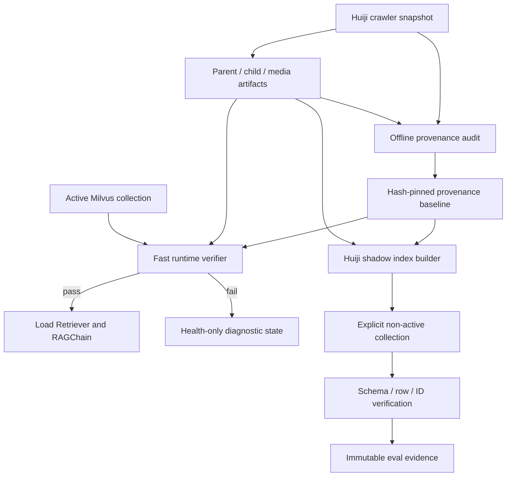

# Huiji RAG 唯一数据源收口设计

日期：2026-07-18  
状态：已获用户书面批准  
优先级：P0 实施，P1/P2 延后  

## 1. 背景

项目最初以 Obsidian vault、`data/processed/documents.jsonl` 和旧资产清单构建 RAG。2026-07-03 起，正式设计已改为只使用灰机 Wiki 爬虫数据 `data/huiji/res1999`，并通过父块、子块、媒体清单、BM25 和 Milvus 提供问答数据。

2026-07-18 的只读审计确认当前活动链路已经使用 Huiji 数据：

- 活动 build 为 `data/processed/huiji/dev`。
- 活动 Milvus collection 为 `reverse1999_rag.text_child_bge_m3_v3`。
- `child_blocks.jsonl` 有 16,010 条记录，活动 collection 有相同的 16,010 个主键和业务字段。
- parent/child 的 24,798 次 `source_refs` 全部可按 title、revision 和 SHA-256 精确反查到灰机 `data_pages.jsonl`。
- 当前 Huiji media manifest 的 15,383 个唯一对象全部存在于 MinIO。
- 最新全链路评测的实际 sources 全部使用 `huiji_hybrid`，没有旧 Markdown 路径或 Obsidian source 标记。

审计同时发现旧链路仍可被误执行：

- `start.ps1` 和 `start.bat` 仍以旧 `documents.jsonl` 作为数据存在性判断。
- `scripts/build_index.py` 仍从 `documents.jsonl` 读取数据，并在写入前清空配置指向的 collection。
- 当前配置已指向活动 v3 collection，因此误执行旧脚本可能破坏活动索引。
- runbook 依赖的 `scripts/build_huiji_index.py` 已缺失，活动索引缺少正式、可重复、默认安全的重建入口。
- 本地旧 artifacts、MinIO 旧对象和 MySQL Wiki supplements 仍存在，但本设计不在 P0 删除它们。

因此，本轮目标不是再次迁移数据，而是把当前正确状态变成可证明、可阻断误操作、可安全重建的系统契约。

## 2. 决策摘要

采用“来源门禁 + shadow 重建”方案：

1. P0 建立 hash-pinned Huiji provenance baseline。
2. P0 在 launcher 和直接后端启动路径执行同一只读门禁。
3. P0 将旧 Obsidian CLI 改为 fail-closed tombstone，但暂不删除代码或数据。
4. P0 恢复 Huiji 索引构建入口，默认且强制只构建非活动 shadow collection。
5. P1 删除旧 RAG 代码、配置和过时文档。
6. P2 在独立备份、inventory 和 operation plan 下清理持久化旧数据。

P0 implementation plan 只能包含 P0 工作。P1/P2 仅在本 spec 登记，不得作为 P0 实施中的顺手清理项。

## 3. 目标

### 3.1 P0 目标

- 当前问答服务只能在 Huiji provenance 门禁通过后加载 RAGChain。
- 旧 Obsidian 数据入口不能再写入活动 Milvus 或 MinIO。
- 来源漂移、artifact 漂移、collection 漂移必须在服务加载前被发现。
- 恢复一个可重复执行的 Huiji shadow collection 构建入口。
- shadow 构建不得自动改配置、激活 collection、删除 collection 或覆盖活动 v3。
- 门禁、构建和验收均输出机器可读、可哈希固定的 evidence。
- 当前活动 artifacts、Milvus、MinIO 和 MySQL 在 P0 实施窗口保持只读。

### 3.2 非目标

- 不删除 `data/raw`、`documents.jsonl` 或 `assets.jsonl`。
- 不删除 MinIO orphan、旧 manifest 对象或 capability probe 对象。
- 不删除或迁移 MySQL 的 `obsidian_character` supplements。
- 不切换活动 collection。
- 不重建或覆盖 `text_child_bge_m3_v3`。
- 不同时修复 M2-M5 的 Planner、回答质量、媒体或性能问题。
- 不把 Wiki supplements 是否保留与 RAG P0 门禁绑定。

## 4. 优先级边界

### 4.1 P0：来源收口与可重建能力

- 旧 Obsidian CLI fail-closed。
- Huiji provenance 深度审计与 baseline。
- 快速运行时门禁。
- launcher 与直接后端启动双入口保护。
- 安全的 Huiji shadow index builder。
- 当前活动状态和 shadow 构建的真实验收。

### 4.2 P1：旧 RAG 代码与配置清理

- 删除 P0 已 tombstone 的旧 RAG CLI 和仅服务旧 RAG 的提取器。
- 删除 RAG 配置中的 Obsidian vault 和旧 processed path 依赖。
- 修正 README、architecture、runbook 和启动说明。
- Wiki Obsidian supplement 适配器在 P1 仍可保留，但必须明确标记为独立、待 P2 处理的展示链路。

### 4.3 P2：持久化数据清理

- 清理本地旧 raw、`documents.jsonl` 和 `assets.jsonl`。
- 精确处理 MinIO 中可证明属于旧 manifest 且无消费者的对象。
- 迁移或删除 MySQL 中的 Obsidian supplements。
- 对其他非当前 manifest 对象先分类，禁止把所有 orphan 作为同一删除集合。
- 所有删除必须基于备份、冻结 inventory、hash-pinned operation plan 和删除后对账。

## 5. 总体架构



深度审计负责证明 raw 到 artifacts 的来源关系。快速门禁负责证明当前启动输入仍等于已审计 baseline。两者不能合并为每次启动都扫描全部原始 JSONL，也不能把快速门禁简化为仅检查文件存在。

## 6. 组件设计

### 6.1 `src/huiji_rag/provenance.py`

这是纯只读验证库，职责包括：

- 定义 provenance baseline 和验证结果的数据模型。
- 对 artifact 执行 SHA-256、size、JSONL row count 和主键指纹计算。
- 对 Milvus 执行 collection 存在性、schema、row count、primary ID fingerprint 和非向量业务字段 fingerprint 检查。
- 校验 Huiji 配置一致性。
- 返回结构化错误码和安全摘要。

该模块不得：

- 创建、删除、insert、upsert 或清空 collection。
- 初始化 MinIO 写客户端。
- 修改配置或 baseline。
- 在错误结果中返回本地绝对路径、凭据或 source content。

### 6.2 `scripts/audit_huiji_provenance.py`

离线深度审计入口，读取：

- `data/huiji/res1999/data_pages.jsonl`
- `data/huiji/res1999/resources_manifest.jsonl`
- 当前 parent、child、media artifacts
- 当前活动 Milvus collection 的只读快照

它必须验证：

- 每个 parent/child 都有非空 `source_refs`。
- source kind 只来自批准的 Huiji 类型。
- 每个 source ref 的 title、revision 和 content SHA-256 精确匹配 raw crawler row。
- 每个媒体 SHA-1、local relative path 和 source URL 存在于 crawler resource manifest。
- BM25 records 与 child artifacts 语义相等，允许有明确记录的运行时派生字段。
- 活动 Milvus 主键和业务字段与 child artifacts 一致。

输出分为两类：

- 唯一 run evidence，写入新的 `eval/huiji_provenance/{run_id}`。
- 候选 baseline，默认使用 create-new 语义，拒绝覆盖现有文件。

生成 baseline 是显式操作。普通启动不能自动更新 baseline，也不能在 mismatch 时“接受当前状态”。

### 6.3 `scripts/verify_huiji_runtime.py`

快速门禁只读取 baseline、当前 artifacts、配置和活动 Milvus。它不重新读取全部 1.1GB 原始 JSONL。

检查顺序：

1. baseline schema 和自身摘要可解析。
2. `huiji.enabled` 必须为 true。
3. `huiji.build_version`、processed root、Huiji text collection 和 vectorstore collection 必须与 baseline 一致。
4. required artifacts 必须存在且位于预期 build root 内。
5. artifact SHA-256、size、row count 和 ID fingerprint 必须一致。
6. Milvus collection、schema、row count、primary ID fingerprint 和非向量业务字段 fingerprint 必须一致。
7. 输出单一结构化结果并设置稳定退出码。

运行时门禁只允许以下结果：

- `pass`：允许加载 RAG。
- `blocked`：保持诊断接口可用，但禁止加载 Retriever/RAGChain。
- `error`：验证器自身异常，同样禁止加载 RAG。

不能在验证异常时降级为无门禁启动。

### 6.4 `scripts/build_huiji_index.py`

恢复 Huiji 索引构建入口。CLI 必须要求显式 `--collection-name`，并在连接 embedding 或 Milvus 写路径前执行：

- provenance baseline 校验。
- 目标名称不等于配置活动 collection。
- 目标名称不等于 baseline 活动 collection。
- 目标 collection 当前不存在。
- 输入 child artifact 的 SHA、row count 和 ID fingerprint 与 baseline 一致。

默认行为是创建新 collection。禁止 `--force`、`--replace`、`--drop-existing` 或等价选项进入 P0。

构建完成后必须验证：

- schema 与批准的 Huiji child schema 一致。
- row count 等于当前 child artifact 动态计数。
- primary ID 集合指纹等于 child artifact 指纹。
- 关键业务字段抽样或全量对账通过。
- collection 保持非活动状态，配置文件未变化。

构建凭据写入唯一 eval run 目录。构建失败时保留失败 evidence，不自动删除目标 collection；是否清理失败 shadow 由后续独立操作决定。

### 6.5 `config/provenance/huiji-dev.v1.json`

baseline 至少包含：

- schema version。
- source mode，固定为 `huiji_crawler`。
- build version。
- raw snapshot identity 和深度审计 evidence SHA-256。
- artifact 相对路径、SHA-256、size、row count、ID fingerprint。
- child BM25 与 media BM25 的 semantic corpus fingerprint。
- 活动 Milvus database、collection、schema fingerprint、row count、primary ID fingerprint 和非向量业务字段 fingerprint。
- 生成时间和生成工具版本。

baseline 不得包含：

- 本地绝对路径。
- MinIO、MySQL、LLM 或 embedding 凭据。
- raw source content、prompt 或回答正文。
- 某个固定角色名、角色 ID、技能数、台词数或语言数。

当前观察到的 16,010 行可以写入 baseline 作为该 snapshot 的事实，但生产逻辑和测试期望必须从 baseline/artifact 动态读取，不能把 16,010 写成通用常量。

### 6.6 `backend/main.py`

后端直接启动必须调用与 CLI 相同的 provenance verifier。不能只依赖 launcher，因为开发者可直接运行 uvicorn。

门禁失败时：

- FastAPI 可启动为 health-only 诊断状态。
- `_state.loaded` 保持 false。
- 不构造 vectorstore、Retriever、RAGChain 或媒体 registry。
- `/ask`、`/ask/stream` 和媒体分页返回现有 503 契约。
- `/health` 返回白名单 provenance 状态和错误码。

门禁通过后才进入现有 `_ensure_loaded` 过程。

### 6.7 `start.ps1` 和 `start.bat`

删除旧的 `documents.jsonl` 存在性判断和自动执行 Obsidian 提取/索引逻辑。启动顺序改为：

```text
resolve Python
→ verify_huiji_runtime.py
→ verifier exit 0
→ start backend
→ poll /health
→ start frontends
```

launcher 门禁失败时应打印安全错误码和 evidence 位置，不自动运行任何 builder。

### 6.8 旧 Obsidian CLI tombstone

以下入口在 P0 保留文件但拒绝执行：

- `scripts/extract_data.py`
- `scripts/build_index.py`
- `scripts/build_assets.py`

要求：

- `main()` 第一条业务行为是抛出明确的 legacy-disabled 错误或返回非零退出码。
- 在失败前不能读取 vault、创建 Milvus/MinIO 客户端或修改文件。
- 消息指向 Huiji runbook 和新 builder。
- 不提供环境变量绕过开关。

库级旧函数暂不在 P0 删除，防止把范围扩大到无关调用方；P1 再做引用清理。

## 7. 错误契约

允许公开的稳定错误码包括：

- `baseline_missing`
- `baseline_invalid`
- `source_mode_mismatch`
- `build_version_mismatch`
- `collection_config_mismatch`
- `artifact_missing`
- `artifact_hash_mismatch`
- `artifact_count_mismatch`
- `artifact_id_mismatch`
- `milvus_collection_missing`
- `milvus_schema_mismatch`
- `milvus_row_count_mismatch`
- `milvus_id_mismatch`
- `milvus_content_mismatch`
- `verification_internal_error`

诊断可以包含预期值和实际摘要，但不得包含凭据、绝对路径、source content 或 Milvus row text。

多项失败时，验证器应完成所有不会扩大成本或风险的检查并返回排序稳定的错误列表。连接 Milvus 失败后不伪造后续 Milvus mismatch。

## 8. P0 需求

### 8.1 来源与 baseline

- `SOURCE-GATE-P0-01`：生产 source mode 必须固定为 `huiji_crawler`。
- `SOURCE-GATE-P0-02`：baseline 必须 hash-pin 当前 parent、child、media、child/media BM25 和活动 Milvus 契约，包括不含 embedding 的业务字段内容指纹。
- `SOURCE-GATE-P0-03`：baseline 只能由完整离线深度审计生成，不能由快速启动门禁生成或更新。
- `SOURCE-GATE-P0-04`：深度审计必须逐条验证 source refs 和媒体 manifest 反向引用，任何 missing 或 hash mismatch 都阻断 baseline 生成。
- `SOURCE-GATE-P0-05`：baseline 和 evidence 不得包含本地绝对路径、凭据或真实回答正文。

### 8.2 运行时门禁

- `RUNTIME-GATE-P0-01`：launcher 和直接 uvicorn 启动均必须执行同一 verifier。
- `RUNTIME-GATE-P0-02`：artifact 或 Milvus 任一受保护字段漂移时不得加载 RAGChain。
- `RUNTIME-GATE-P0-03`：验证器异常必须 fail closed，不能降级为跳过门禁。
- `RUNTIME-GATE-P0-04`：门禁失败时 health 诊断可用，问答与媒体接口不可用。
- `RUNTIME-GATE-P0-05`：快速门禁不得扫描全部 raw crawler content，避免把正常启动变成长时间离线审计。
- `RUNTIME-GATE-P0-06`：门禁不得写 Milvus、MinIO、MySQL 或 processed artifacts。

### 8.3 旧入口封锁

- `LEGACY-BLOCK-P0-01`：三个旧 Obsidian CLI 必须在任何 mutation client 初始化前停止。
- `LEGACY-BLOCK-P0-02`：启动脚本不得再以 `documents.jsonl` 为数据就绪条件。
- `LEGACY-BLOCK-P0-03`：P0 不删除旧代码和数据，不提供隐式 fallback 或绕过开关。

### 8.4 Shadow 构建

- `SHADOW-BUILD-P0-01`：目标 collection 名必须显式提供。
- `SHADOW-BUILD-P0-02`：目标不得等于任何活动 collection 名。
- `SHADOW-BUILD-P0-03`：目标已存在时必须停止，不删除、不清空、不覆盖。
- `SHADOW-BUILD-P0-04`：输入 artifact 未通过 provenance 时不得调用 embedding 或 Milvus mutation。
- `SHADOW-BUILD-P0-05`：构建后 schema、row count、ID fingerprint 和非向量业务字段 fingerprint 必须与当前 child artifact 一致。
- `SHADOW-BUILD-P0-06`：构建不得修改活动配置或自动激活 shadow collection。
- `SHADOW-BUILD-P0-07`：成功和失败均输出唯一、hash-pinned evidence；测试 entity 和期望不得写死真实角色。

## 9. 测试设计

### 9.1 单元测试

- baseline schema、canonical serialization 和摘要。
- artifact SHA、size、row count 和 ID fingerprint。
- 路径 containment 和相对路径规则。
- config/build/collection mismatch。
- Milvus schema、row、ID 和非向量业务字段 mismatch。
- stable error ordering 和 sanitizer。
- 深度审计 source ref exact match、missing、hash mismatch 和非法 source kind。
- media SHA-1/path/URL match。

### 9.2 CLI 安全测试

- 三个 legacy CLI 返回非零。
- monkeypatch vault reader、Milvus client、MinIO client 和文件写入函数为 raise，证明 tombstone 在这些调用前停止。
- shadow builder 拒绝活动名和已存在目标。
- provenance 失败时 embedding 调用计数为 0、Milvus mutation 调用计数为 0。
- builder 不修改 `config/settings.yaml`。

### 9.3 后端与 launcher 测试

- baseline pass 时加载现有 RAG。
- baseline blocked/error 时 health-only，ask/stream/media 返回 503。
- `/health` 不泄露路径和敏感字段。
- PowerShell 与 Batch 不再引用 `documents.jsonl`、`extract_data.py` 或旧 `build_index.py`。
- 直接调用 `_ensure_loaded` 不能绕过 verifier。

### 9.4 真实验收

1. 对当前环境运行深度审计并生成唯一 evidence。
2. 使用该 evidence 生成候选 baseline，人工核对后安装到配置目录。
3. 快速门禁对当前活动状态返回 pass。
4. 使用临时 artifact 副本制造 hash/count 漂移，门禁返回 blocked。
5. 使用只读 fake 或隔离 collection snapshot 制造 Milvus mismatch，门禁返回 blocked。
6. 创建唯一命名的真实 shadow collection 并完成全量向量化。
7. 验证 shadow schema、动态 row count、全部 primary IDs、ID fingerprint 和非向量业务字段 fingerprint。
8. 动态抽取多 entity type 查询，sources 的 retrieval stage 均为 `huiji_hybrid`，不存在旧 Markdown/UTTU/Obsidian source。
9. 比较实施前后活动 v3、MinIO、MySQL 和正式 artifacts 快照，必须相等。
10. 保留并登记 shadow collection，不激活、不删除。

真实 shadow 构建允许新增一个非活动 Milvus collection，这是 P0 唯一批准的业务基础设施写入。它不能修改活动 v3，也不能写 MinIO、MySQL 或 artifacts。

## 10. P0 硬验收标准

- `SOURCE-GATE-P0-01..05` 全部通过。
- `RUNTIME-GATE-P0-01..06` 全部通过。
- `LEGACY-BLOCK-P0-01..03` 全部通过。
- `SHADOW-BUILD-P0-01..07` 全部通过。
- 当前活动后端加载的 doc count 与 baseline 动态值一致。
- 当前活动 collection 与 child artifact 的主键集合完全一致。
- shadow collection 与 child artifact 的主键集合及非向量业务字段完全一致。
- 旧 CLI mutation client 初始化次数为 0。
- 实施前后活动 Milvus、MinIO、MySQL 和正式 artifacts 无漂移。
- 最终 evidence 中没有本地绝对路径、凭据或固定角色特例。

任何硬门禁失败都必须停止 P0 完成声明。不能用“当前服务还能回答”替代 provenance 验收。

## 11. 性能约束

- 快速门禁可以读取并哈希当前 artifacts，并查询 Milvus 主键、schema 和构建时写入的非向量业务字段；不得读取 embedding 向量。
- 快速门禁不得下载 MinIO 对象或扫描全部 crawler content。
- 深度审计允许较长运行时间，但必须逐阶段报告进度和结果计数。
- shadow 构建保留现有 embedding 重试和批次节流，不因赶进度放松 provenance 前置门禁。
- 新增门禁耗时必须在 evidence 中单独记录，不能混入 retrieval P95。

## 12. 安全与回滚

P0 实施前记录：

- 活动 v3 schema、row count 和 primary ID fingerprint。
- 当前 artifacts SHA/size。
- MinIO inventory 摘要。
- MySQL 受保护表摘要。

代码回滚只需恢复 launcher/backend 门禁调用和 tombstone CLI，但除非门禁本身被证明错误，不得通过回滚重新启用旧 Obsidian 自动构建。

shadow 构建失败时：

- 活动 v3 保持不变。
- 配置保持不变。
- 失败 shadow 保留并登记。
- 在查明失败原因前不重试覆盖同名 collection。

## 13. 文档影响

P0 只更新与安全执行直接相关的文档：

- Huiji runbook 增加 provenance verifier 和 shadow builder 命令。
- README 顶部明确当前唯一 RAG 数据源和旧命令禁用状态。
- architecture 标记旧 Obsidian 架构为历史。
- 不在 P0 大规模删除历史 plans/specs。

P1 再完成全面的旧文档与配置收口。

## 14. 已知残留与后续处理

截至审计时仍存在：

- 752 条旧 `documents.jsonl` 文档及对应 raw 镜像。
- 2,359 条旧 `assets.jsonl` 记录。
- MinIO 中 1,291 个可与旧 asset manifest 对应、但不在当前 Huiji manifest 中的对象。
- 其他 1,494 个不在当前 Huiji 或旧 asset manifest 中的对象，需要继续分类。
- MySQL 中 104 个 `obsidian_character` supplement 页面和 1,029 个 supplement blocks。
- 本地 Obsidian vault 路径已经不存在。

这些数字是 2026-07-18 审计 snapshot，不得写入生产删除逻辑。P2 必须重新采集 current inventory 后生成 operation plan。

## 15. 实施顺序

1. P0 provenance 模型与单元测试。
2. P0 深度审计和 baseline 生成。
3. P0 快速门禁 CLI。
4. P0 backend 与 launcher 双入口集成。
5. P0 legacy CLI tombstone。
6. P0 shadow builder。
7. P0 机械测试、真实 shadow 构建和独立复审。
8. P1 旧 RAG 代码、配置和文档清理。
9. P2 持久化数据清理。

P1/P2 必须分别经过新的 spec、plan 和用户批准，不能由 P0 plan 自动进入。
