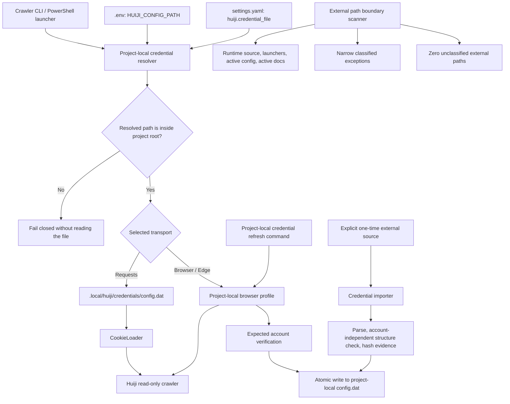

# 项目本地运行边界与灰机凭据解耦设计

日期：2026-07-19  
状态：设计已获用户批准，待书面规格审阅  
优先级：P0 实施，P1/P2 延后

## 1. 背景与目标

`1999Search` 的正式灰机 Wiki 爬虫源码、抓取产物和处理链路均位于项目目录内，但 Requests transport 当前仍默认读取：

```text
D:\1999WIKI_ROBOT\huijiwiki_bot_gui_v0.3.46\config.dat
```

该文件提供灰机 Wiki 和 Cloudflare Cookie。旧目录中的 GUI 程序、DLL、源码备份、分析工具和备份目录不是正式爬虫运行依赖；`D:\1999WIKI_ROBOT\.env` 当前不存在，现行爬取入口也不消费 `CookieLoader.load_credentials()`。

项目活动配置还保留了 `D:\Obsidian_depot\Reverse1999`。虽然 Obsidian RAG CLI 已 fail-closed，活动配置中的外部绝对路径仍会削弱迁移、打包和故障恢复的确定性。

本设计的 P0 目标是：

- 正式运行、凭据刷新、测试和文档操作不再依赖 `D:\1999WIKI_ROBOT`。
- 正式运行使用的项目自有数据、配置、凭据、状态和输出均解析到 `1999Search` 项目根目录内；系统可执行文件按外部系统依赖单独分类。
- 敏感 Cookie 保持项目本地但不进入 Git 或普通源码包。
- Requests、Browser 和 Edge transport 在旧 GUI 删除后仍有完整可用的认证路径。
- 生产源码、启动脚本和活动配置中的外部绝对路径均被发现、分类并受到自动门禁约束。

## 2. 非目标

- 不删除 `D:\1999WIKI_ROBOT` 或其中任何源文件、备份、GUI 程序和凭据。
- 不删除历史 specs、plans、审计证据或日志中的绝对路径记录。
- 不把 Cookie、API Key、数据库密码写入 `config/settings.yaml`、`.env.example`、日志或测试快照。
- 不把真实 `.env` 或 `.local` 凭据纳入 Git。
- 不恢复 Obsidian RAG 数据源，不改变 Huiji crawler-only 的唯一数据源约束。
- 不修改 RAG 检索、Milvus、MinIO、MySQL 或前端业务链路。
- 不把本机 Edge/Chrome、Conda、Docker 和网络服务端点复制进项目目录；这类依赖只做分类和显式配置。
- 不在 P0 引入操作系统密钥环、集中式 secrets manager 或自动轮换服务。

## 3. 总体架构



核心边界是“外部文件可作为一次性导入源，但不能成为正式运行输入”。导入完成后，即使 `D:\1999WIKI_ROBOT` 不存在，所有 transport 仍必须可运行或可在项目内恢复认证。

## 4. 项目内配置与凭据模块

### 4.1 模块职责

该模块负责定义非敏感配置、环境覆盖、凭据文件位置、路径约束和 Requests transport 的 Cookie 加载。建议目录结构为：

```text
1999Search/
├─ .env
├─ .env.example
├─ .local/
│  └─ huiji/credentials/config.dat
└─ config/settings.yaml
```

`config/settings.yaml` 只保存项目相对路径；`.env` 可提供部署级覆盖；`config.dat` 保存结构化 Cookie。真实 `.env` 和 `.local` 均为私有运行状态。

### 4.2 P0 当前必须满足

- **CRED-P0-01：** `config/settings.yaml` 必须声明项目相对的 `huiji.credential_file`，默认值为 `.local/huiji/credentials/config.dat`。
- **CRED-P0-02：** `HUIJI_CONFIG_PATH` 可覆盖 settings 值；CLI `--config` 可覆盖环境变量。最终优先级必须固定为 `--config > HUIJI_CONFIG_PATH > settings.yaml > 内建项目相对默认值`。
- **CRED-P0-03：** 不论配置值是相对路径还是绝对路径，解析后的真实目标都必须位于 `Path(__file__).resolve()` 所确定的项目根目录内。路径穿越、符号链接或 junction 越界、外部绝对路径必须在读取前 fail-closed。
- **CRED-P0-04：** Requests transport 缺少、不可读或无法解析凭据时必须返回明确的非零退出码和脱敏错误；Browser/Edge transport 不得因 Requests 凭据缺失而失败。
- **CRED-P0-05：** `.gitignore` 必须覆盖 `.local/`；`.env.example` 只能登记变量名、空值或项目相对示例，不能包含真实 Cookie。
- **CRED-P0-06：** 日志、异常、运行摘要和 `CrawlConfig.to_json()` 不得包含 Cookie 值、完整 Cookie header 或凭据文件内容。允许输出项目相对凭据路径、Cookie 名称、数量和过期时间摘要。
- **CRED-P0-07：** `CookieLoader` 的正式接口必须以明确的 `config_path` 为输入，不得根据 `robot_root` 推断旧 GUI 目录结构，也不得隐式读取旧项目 `.env`。

### 4.3 P1 可部分支持

- **CRED-P1-01：** 将旧 pickle/GUI 格式一次性转换为带 schema version 的 JSON 凭据格式，并在稳态运行中移除 pickle 解析。
- **CRED-P1-02：** 为私有部署包提供显式 `--include-private-runtime` 打包选项；普通源码包仍排除真实凭据。

### 4.4 P2 未来演进

- **CRED-P2-01：** 使用 Windows Credential Manager、系统密钥环或集中式 secrets manager 保存 Cookie。
- **CRED-P2-02：** 引入凭据版本、自动轮换和多部署节点分发。

### 4.5 关键契约与限制

- `settings.yaml` 是受版本控制的非敏感配置，不得承载秘密。
- `.env` 是本地明文秘密文件，不等同于密钥管理服务；备份和分发必须单独控制。
- “路径位于项目内”必须按解析后的真实路径判断，不能只做字符串前缀比较。
- Browser/Edge profile 必须继续使用项目内目录，不能回退到用户自定义的外部旧项目目录。

## 5. 凭据迁移与刷新模块

### 5.1 模块职责

迁移模块负责把现有外部凭据安全引入项目。刷新模块负责在 Cookie 过期后通过当前项目已有的 Browser/Edge 登录链路生成新的项目内凭据，消除对旧 GUI 的持续依赖。

### 5.2 P0 当前必须满足

- **MIG-P0-01：** 提供一次性导入命令。源文件可由用户显式指定为项目外路径；目标必须固定为当前项目的解析后凭据路径，不能由源目录反向推断。
- **MIG-P0-02：** 导入必须在写入前记录源文件 size 和 SHA-256、验证 Cookie 结构可解析且非空，并在写入后重新读取目标，确认目标 size、SHA-256 与源文件相等且 Cookie 名称集合一致。导入不得修改或删除源文件。
- **MIG-P0-03：** 目标已存在且内容不同时必须停止并要求显式 `--replace`；不得静默覆盖。`--replace` 仍必须原子写入并保留失败前的有效目标。
- **MIG-P0-04：** 导入输出只能包含源/目标路径、hash、size、Cookie 名称和数量，不得输出 Cookie 值。
- **REFRESH-P0-01：** 提供项目内 Browser/Edge 凭据刷新入口，使用项目内浏览器 profile，完成灰机页面登录或 Cloudflare 验证后校验 `expected_user`。
- **REFRESH-P0-02：** 只有账号校验通过后才允许写入凭据；账号不符、匿名会话、Cloudflare 阻断或 Cookie 集为空时必须保持原凭据不变。
- **REFRESH-P0-03：** 刷新写入必须采用同目录临时文件、flush/close 后原子替换，并在替换后重新解析验证。任何失败不得留下半写文件。
- **REFRESH-P0-04：** Requests 模式遇到过期凭据时，错误信息必须指向项目内刷新命令或建议直接使用 Browser/Edge transport，不得提示返回旧 GUI。

### 5.3 P1 可部分支持

- **REFRESH-P1-01：** Requests 模式可在交互终端中显式询问后调用 Browser/Edge 刷新；默认不得自动打开浏览器或改写凭据。
- **REFRESH-P1-02：** 输出只含 hash、Cookie 名称和过期时间的机器可读刷新证据。

### 5.4 P2 未来演进

- **REFRESH-P2-01：** Cookie 临近过期告警和计划性轮换。
- **REFRESH-P2-02：** 多账号 profile 与账号选择。

### 5.5 关键契约与限制

- 一次性导入器是唯一允许读取项目外凭据文件的 P0 组件；它不得含任何硬编码旧路径。
- 刷新器只能访问 `res1999.huijiwiki.com` 的登录/API Cookie，不得导出其他域 Cookie。
- 导入和刷新都必须复用同一凭据写入与验证函数，避免两套格式产生漂移。
- 账号校验使用现有 `expected_user` 契约，默认仍为 `POTATO BOT`，但验收不得依赖某一份 Cookie 的固定 hash 或固定过期时间。

## 6. 爬虫运行边界模块

### 6.1 模块职责

该模块负责清除旧 `robot_root` 抽象，将爬虫运行配置统一为项目根、项目内输出、项目内凭据和显式系统程序依赖。

### 6.2 P0 当前必须满足

- **BOUND-P0-01：** `scripts/crawl_huiji_res1999.py`、`crawl_huiji_res1999.ps1`、`CrawlConfig` 和 `CookieLoader` 不得包含 `D:\1999WIKI_ROBOT` 或 `robot_root` 运行时回退。
- **BOUND-P0-02：** `--robot-root` 和 PowerShell `$RobotRoot` 必须从正式启动接口删除；`--config` 继续存在但受 `CRED-P0-03` 项目边界检查。
- **BOUND-P0-03：** `huiji.raw_root`、`huiji.processed_root`、`huiji.provenance_baseline`、爬虫输出、状态库、Browser profile 和 Edge profile 的默认路径必须位于项目内；配置或显式覆盖如解析到项目外必须 fail-closed。
- **BOUND-P0-04：** `config/settings.yaml` 中停用的 Obsidian 兼容路径必须改为项目相对的 `data/legacy/obsidian`，配置加载后解析为项目内路径；旧 Obsidian CLI 必须继续 fail-closed。
- **BOUND-P0-05：** README、Huiji runbook 和启动脚本的活动说明不得再把旧 Robot GUI 或外部 Obsidian vault 描述为运行前置条件。
- **BOUND-P0-06：** 在隔离验收中使 `D:\1999WIKI_ROBOT` 不可访问后，Browser/Edge transport 必须能完成 dry-run；Requests transport 在项目内凭据有效时必须能完成相同 dry-run。验收过程不得删除旧目录。

### 6.3 P1 可部分支持

- **BOUND-P1-01：** 删除仅为兼容测试保留的 Obsidian 配置 dataclass 和库接口，不再保留 `data/legacy/obsidian` 占位路径。
- **BOUND-P1-02：** 对 Conda/Python、Docker 和浏览器程序增加统一的可执行文件发现与环境变量覆盖接口。

### 6.4 P2 未来演进

- **BOUND-P2-01：** 生成完全可重定位的离线部署包和依赖清单。
- **BOUND-P2-02：** 在容器中运行爬虫和浏览器认证辅助服务。

### 6.5 关键契约与限制

- Huiji crawler-only 数据来源约束保持不变；本模块只处理文件系统和认证边界。
- 系统安装的 Edge/Chrome 是外部系统依赖，不是项目数据目录依赖。它必须被分类，但不要求复制到项目。
- 网络 URL、MinIO/Milvus/MySQL endpoint 和本地端口不是文件系统绝对路径，不受本设计的项目根约束。

## 7. 外部路径审计与防回归模块

### 7.1 模块职责

该模块负责对当前文件系统快照执行路径 inventory，将命中项分类为运行时项目数据依赖、系统程序、网络端点、诊断哨兵、测试样例、历史记录或生成产物，并对生产运行范围建立自动门禁。

### 7.2 P0 当前必须满足

- **AUDIT-P0-01：** 提供只读路径审计命令，至少扫描 `backend/`、`config/`、`infra/`、`scripts/`、`src/`、前端源码、根启动器、README 和活动 runbook；排除 `.git/`、`.local/`、`data/`、数据库/向量存储 volume、前端 `dist/`、日志和二进制文件。
- **AUDIT-P0-02：** 审计必须识别 Windows drive absolute path、UNC path、`file://` local path，以及活动 YAML/JSON 中声明的文件系统路径。HTTP(S) URL 不得被误报为本地文件路径。
- **AUDIT-P0-03：** 允许例外必须登记在窄范围 allowlist 中，至少包含文件、精确值或精确行语义、类别和原因。禁止用整个目录、任意盘符或宽泛正则掩盖命中。
- **AUDIT-P0-04：** 当前允许类别仅包括系统可执行文件发现路径和诊断脚本的本地路径泄露哨兵。项目数据、凭据、构建输入和运行输出不得通过 allowlist 保留外部路径。
- **AUDIT-P0-05：** 审计结果必须输出 canonical JSON，包含扫描根、排除项、命中位置、分类、allowlist 依据和未分类计数；输出不得读取或记录 `.env`、`.local` 内容。
- **AUDIT-P0-06：** P0 验收要求生产运行范围 `unclassified_external_path_count == 0`，并要求 `D:\1999WIKI_ROBOT` 和 `D:\Obsidian_depot\Reverse1999` 在该范围内零命中。
- **AUDIT-P0-07：** CI/本地测试必须调用同一审计实现，防止以后重新提交外部项目数据路径。审计工具自身、测试路径攻击样例和历史文档不进入生产零命中统计，但必须在完整 inventory 中标注排除原因。

### 7.3 P1 可部分支持

- **AUDIT-P1-01：** 对 Python AST、PowerShell AST 和结构化 YAML 分别解析路径语义，减少纯文本扫描误报。
- **AUDIT-P1-02：** 构建可迁移源码包并在临时目录解包后执行 smoke test，证明包路径无关。

### 7.4 P2 未来演进

- **AUDIT-P2-01：** 在 CI 中覆盖 Linux 路径、容器 volume 和符号链接逃逸测试。
- **AUDIT-P2-02：** 生成 SBOM、运行时依赖清单和部署策略证明。

### 7.5 关键契约与限制

- 历史 specs/plans 中的路径是事件证据，不应为满足零命中而改写历史。
- 测试中的 `D:\private`、`D:\assets` 等可能是安全测试输入，不得机械删除。
- allowlist 是受审查的例外，不是跳过扫描的机制；每个条目必须能对应到当前实际命中，陈旧条目也应使门禁失败。

## 8. 配置与数据流

### 8.1 Requests transport

```text
project root
  -> load project .env
  -> resolve --config / HUIJI_CONFIG_PATH / settings
  -> enforce resolved-path containment
  -> read project-local config.dat
  -> parse cookies without logging values
  -> verify expected account
  -> run read-only crawl
```

### 8.2 Browser/Edge transport

```text
project root
  -> resolve project-local browser profile and output
  -> launch/connect approved system browser
  -> interactive login / Cloudflare verification
  -> verify expected account
  -> run read-only crawl
```

Browser/Edge 不读取 Requests `config.dat`，因此凭据缺失不得阻止它们用于恢复认证。

### 8.3 一次性迁移

```text
explicit external source
  -> source hash/size
  -> safe structure validation
  -> atomic project-local write
  -> target hash/size/structure verification
  -> source retained unchanged
```

## 9. 错误处理原则

- 项目路径越界：在任何文件读取、目录创建或浏览器启动前停止。
- 凭据缺失：Requests fail-closed；Browser/Edge 继续可用。
- 凭据冲突：默认停止，不覆盖；显式 replace 才能进入原子替换。
- Cookie 泄露风险：错误只含字段名、路径和结构信息，不含值。
- 账号不符：停止爬取和刷新，不改写现有凭据。
- 路径审计出现未分类项：停止 P0 验收，先分类和查明来源；不得用宽泛 allowlist 消除红灯。
- 历史或生成文件命中：登记为 excluded，并保留其路径和排除原因，不改变生产门禁结果。

## 10. 测试与验收方向

### 10.1 单元与契约测试

- 配置优先级和项目根 containment，包括 `..`、外部绝对路径、symlink/junction 逃逸。
- Requests 缺失/损坏凭据错误，以及 Browser/Edge 不读取该凭据。
- 迁移同 hash 幂等、不同 hash 停止、显式 replace、失败原文件保持。
- 刷新账号正确/错误、空 Cookie、原子替换失败和脱敏输出。
- 外部路径扫描的真阳性、URL 非误报、窄 allowlist 和陈旧 allowlist。
- 旧 `robot_root` 和两个已知外部项目路径在生产范围零命中。

### 10.2 真实数据验收

- 使用当前外部 `config.dat` 做一次显式导入，记录源/目标 hash、size 和 Cookie 名称集合；不记录 Cookie 值。
- 临时屏蔽或重命名外部旧目录后执行项目内 Requests dry-run，证明没有隐式回退。
- 在项目内 Browser 或 Edge profile 上执行账号验证和 dry-run；刷新命令写入测试目标后验证 Requests 可加载。
- 执行完整路径 inventory，确认所有生产范围命中均已消除或按窄规则分类，未分类计数为零。
- 验证 `.env`、`.local` 和 Cookie 值未进入审计 JSON、测试输出或 Git 可见文件。

真实验收不得写死当前 Cookie hash、Cookie 数量、过期时间或某个本机浏览器安装位置。

## 11. 文档影响

P0 更新：

- README：删除 Obsidian vault 和旧 Robot GUI 作为前置条件的说明。
- Huiji crawler runbook：增加项目内导入、刷新、Requests/Browser/Edge 认证路径和错误恢复命令。
- `.env.example`：增加 `HUIJI_CONFIG_PATH` 相对路径示例。
- `.gitignore`：登记 `.local/`。
- 路径审计报告：记录生产命中、允许的系统依赖和被排除的历史/测试命中。

历史 specs、plans 和已有审计证据不回写，只在新审计报告中解释其非运行时性质。

## 12. 与旧方案的关系

保留：

- 现有只读 Huiji crawler、`expected_user` 校验和三种 transport。
- 现有 `config.dat` 解析兼容能力，直至 P1 canonical JSON 迁移。
- Browser/Edge 的项目内 profile 机制。
- crawler-only provenance 与旧 Obsidian CLI fail-closed 门禁。

废弃：

- `D:\1999WIKI_ROBOT` 默认路径和旧 GUI 目录结构推断。
- `robot_root` 作为正式爬虫配置概念。
- 从旧项目 `.env` 加载凭据的隐式约定。
- Cookie 过期后返回旧 GUI 刷新的运维流程。
- 活动配置中的外部 Obsidian vault 路径。

## 13. P0 完成判定

只有同时满足以下条件才能声明本设计的 P0 已完成：

1. `CRED-P0-01` 至 `CRED-P0-07` 全部通过。
2. `MIG-P0-01` 至 `MIG-P0-04` 全部通过。
3. `REFRESH-P0-01` 至 `REFRESH-P0-04` 全部通过。
4. `BOUND-P0-01` 至 `BOUND-P0-06` 全部通过。
5. `AUDIT-P0-01` 至 `AUDIT-P0-07` 全部通过。
6. 至少一次真实凭据导入、一次项目内 Requests dry-run、一次 Browser/Edge 账号验证和一次完整路径 inventory 有脱敏证据。
7. 外部旧目录在真实验收期间不可见或不可访问，爬虫仍能按 transport 契约运行。
8. 普通源码包和 Git 可见文件不包含真实 `.env`、`.local` 或 Cookie 值。

任一 P0 条目只有占位实现、只通过 mock 测试或依赖旧目录仍存在，均判定为未完成。
