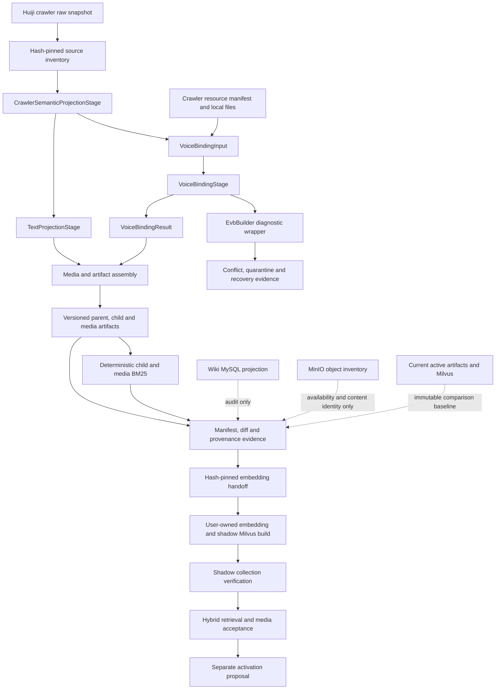

# Huiji Crawler Corpus Builder And Semantic Retrieval Design

日期：2026-07-20  
状态：待用户审阅  
适用范围：Huiji crawler-only RAG 语料重建、语义媒体接入、shadow 向量化交接与激活前验收

## 1. 背景与目标

当前 RAG 运行时已经收束为 `huiji_crawler`，旧 Obsidian 读取、索引和媒体 fallback 已移除；当前 active artifacts、BM25、Milvus、MinIO 和 MySQL 状态均有可验证基线。现有问答仍存在以下结构性缺口：

- 早期 `build_huiji_corpus` 能力曾实际存在，但在文件损失后的恢复过程中没有回到工作树；后续 EventName 语音绑定恢复又在同名模块中建立了仅负责 EVB 隔离构建的 `EvbBuilder`。
- 当前 active artifacts 停留在较早的 crawler 投影，无法从同一 raw snapshot 通用重现。
- 角色 `collection` 与 `culture_dossier` 被映射到错误的 RAG section，导致“单品/藏品”返回文化故事。
- Wiki 已有 collection item 与 Udimo 的显式 crawler 关系和媒体角色，但当前 RAG artifacts、查询规划和媒体 registry 尚未消费这些语义。
- 现有语音绑定具备冲突隔离和证据门禁，不应在恢复全量 builder 时被复制、弱化或覆盖。

本设计目标是恢复一个**唯一的生产语料构建入口**，将 EVB 的确定性绑定能力整合为共享 stage，并完成 crawler-only artifact、BM25、语义媒体、检索策略、向量化交接和激活前验收的 P0 闭环。

本设计不把 MySQL、MinIO inventory、旧 artifacts 或 `.pyc` 当作第二语料来源；它们仅可用于独立对账、媒体可用性校验和恢复取证。

Wiki 与 RAG 对同一 crawler snapshot 共享事实契约，但不共享存储真源。Builder 产出的 media v3 是一行一绑定的 canonical artifact；Wiki 可以把它规范化导入资源表和绑定表，但不得要求 Builder 再维护第二份资源真源。Wiki 完成 v2/v3 双读、数据库迁移、API/前端 binding identity 兼容并提交 hash-pinned compatibility receipt 之前，RAG 可以实现 Builder 和生成隔离 candidate，不能切换 active pointer。

### 1.1 当前语料保真基线

2026-07-20 的全量只读审计已建立当前 active tuple 的逐记录保真基线。该基线记录的是本次快照观测值，不是生产代码常量：

- active artifacts 包含 8,246 个 parent、16,010 个 child、15,758 条媒体绑定和 10 条显式 excluded record；parent/child/media 结构闭环无缺口。
- 24,798 个 source ref 全部为 `data_page`，覆盖 7,456 个唯一 `Data:*` crawler title；raw title、revision/content SHA 与 active 引用无缺失或冲突。
- child BM25 与 16,010 个 child、media BM25 与 15,758 条媒体绑定均保持逐行顺序和完整语义 payload 一致。
- MySQL 的 7,456 个页面和 17,527 条媒体链接与当前 crawler Wiki 投影逐行多重集一致，其中 15,758 条为旧 RAG 媒体绑定，剩余为 crawler 语义媒体增量；来源字段无 Obsidian 引用。
- `reverse1999-assets` 与 `a-bucket` 当前 key/size/ETag 状态相对上一份全 SHA-1/SHA-256 inventory 无漂移；active RAG 和 Wiki 声明的 object key 均存在，声明 SHA-1 无冲突。
- active media 中 15,758 条绑定只对应 15,383 个唯一资源 ID。375 组共享资源记录为不同绑定，其中 7 组跨实体；这些关系仍须经 EVB/owner 证据判断是保留还是纠正，但不能按资源 ID 当作重复行直接删除。这是旧 schema 将资源身份兼作绑定身份造成的建模冲突。
- MySQL snapshot 元数据仍标为 `legacy/dev`，原因是当前缺少 `active_build.v1.json` pointer；页面 `source_title`、`sourceRefs` 和 crawler projection 字段实际均来自 `Data:*` crawler records。候选链路必须修正元数据契约，但不能据此改写或丢弃当前正文。

权威证据为 `eval/huiji_corpus_fidelity/20260720T073917Z/corpus-preservation-baseline.v2.json`。其 SHA-256 为 `8df26d9a6cd1014c82d1fdd1fa858f1b9411cb4b365101b0a12020d608db10aa`；运行时复核与 Wiki crawler-only dry-run 使用同一目录下的独立证据。早期 `active-corpus-fidelity.v1.json` 保留用于审计追踪，但其中 mojibake 和 media BM25 两项统计口径已由 v2 明确取代。

## 2. 总体架构



核心依赖方向为：

```text
contracts <- deterministic stages <- builders/facades <- CLI
```

stage 不依赖 CLI、运行时 retriever、MySQL repository 或 active Milvus。`HuijiCorpusBuilder` 是唯一完整生产 artifact builder；`EvbBuilder` 是共享 `VoiceBindingStage` 之上的诊断包装器，不再拥有第二套语音绑定算法。

关键技术边界保持为 Python typed dataclass/contracts、canonical JSON/JSONL、本地 BM25、Milvus shadow collection、MinIO S3 object identity 和只读 MySQL 对账。构建过程不调用 LLM，不把 embedding 放入 corpus builder，也不使用 Git history 作为内容权威。

## 3. 恢复证据与来源权威模块

### 3.1 模块职责

该模块负责确定可使用的源码证据和 raw crawler 输入边界，生成可复核 source inventory，并防止恢复材料直接污染当前工作树或成为运行时输入。

输入包括项目内历史设计、现有 artifacts、可证明来源的旧源码副本，以及配置声明的 crawler raw files。输出为恢复差异记录和 hash-pinned source inventory。

### 3.2 P0 当前必须满足

- `RECOVERY-P0-01`：任何找到的旧 builder、CLI 或测试源码必须先恢复到项目内隔离目录并计算 SHA-256；未经审计不得覆盖当前源码。
- `RECOVERY-P0-02`：`D:\1999Wiki_Backup` 全目录视为外部只读存储。查询必须使用不会创建仓库锁的只读方式；不得在其中创建 staging、恢复目标、证据或临时文件。
- `SOURCE-P0-01`：完整语料构建只允许读取配置锁定的 `data_pages.jsonl`、`resources_manifest.jsonl`、`pages.jsonl` 和 `wikitext.jsonl`，并记录文件 SHA-256、size、row count 与 canonical inventory hash。
- `SOURCE-P0-02`：构建输入不得包含 Obsidian、旧 `documents.jsonl`、旧 `assets.jsonl`、MySQL 页面正文、MinIO 对象枚举文本或 `.pyc` 反编译结果。
- `SOURCE-P0-03`：MySQL 仅用于对同一 crawler snapshot 的独立语义投影验收；MinIO 仅用于验证 artifact 中已声明 object key 的存在性和内容身份。
- `SOURCE-P0-04`：同一 source inventory、构建配置和代码版本必须生成相同顺序、相同 ID、相同内容哈希的 parent、child、media 和 BM25 语义文件。
- `SOURCE-P0-05`：开始实现前必须验证当前保真基线及其 sidecar；候选构建的 old/new diff 必须引用该基线 SHA-256。若 active artifact、Milvus、MySQL 或两个 MinIO bucket 在实现期间发生未解释漂移，停止候选验收并重新采集基线，禁止继续沿用旧数字。

### 3.3 P1 可部分支持

- `SOURCE-P1-01`：支持在两个 crawler snapshot 之间生成增量变化报告，但仍执行完整隔离构建，不实现原地增量改写。

### 3.4 P2 未来演进

- `SOURCE-P2-01`：远程构建节点、分布式 crawler snapshot registry 和构建任务 UI。

### 3.5 关键契约与限制

- 旧源码只能作为实现参考，不能绕过当前 crawler-only、provenance、EVB 冲突和 shadow-only 约束。
- source inventory 发现缺文件、重复 source identity、非法路径逃逸或输入漂移时，构建状态为 `blocked`。
- 构建期间不写 crawler raw root，不修改 Wiki MySQL，不上传或删除 MinIO 对象。

## 4. Builder 编排与 EVB 整合模块

### 4.1 模块职责

该模块提供一个完整生产 builder 和一个独立诊断入口：

- `HuijiCorpusBuilder` 编排 source inventory、语义投影、文本、语音、媒体、BM25、manifest、diff 和 provenance。
- `VoiceBindingStage` 是唯一语音绑定实现，负责 expected filename、语言规范化、event identity、child ownership、SHA 冲突和绑定状态。
- `EvbBuilder` 负责校验 baseline/preflight、调用 `VoiceBindingStage` 并输出冲突、quarantine 和恢复证据；它不直接生成另一套生产 corpus。

### 4.2 P0 当前必须满足

- `BUILD-P0-01`：仓库必须只有一个能够生成完整 parent/child/media/BM25 artifact set 的公开生产 builder：`HuijiCorpusBuilder`。
- `BUILD-P0-02`：生产构建请求使用独立的 `CorpusBuildRequest`/`CorpusBuildResult`；EVB 保留兼容入口，但不得与 corpus request/result 混用或依赖隐式全局配置。
- `BUILD-P0-03`：语音共享边界必须是稳定的 `VoiceBindingInput`/`VoiceBindingResult`。两个 builder 只能通过该契约复用语音能力，不能互相读取私有中间文件。
- `BUILD-P0-04`：`EvbBuilder` 的 baseline、preflight bundle、quarantine、conflict expansion 和 hash-pinned evidence 能力必须保留；其绑定算法必须委托给 `VoiceBindingStage`。
- `BUILD-P0-05`：新 build version 必须经过安全 ID 校验，不能为当前 active build，不能复用已存在的 build root，不能覆盖 `dev` 或任何历史构建目录。
- `BUILD-P0-06`：builder 仅写隔离的新 build root。它不得修改配置中的 active pointer、provenance baseline、Milvus collection、MySQL 或 MinIO。
- `BUILD-P0-07`：`CorpusBuildResult` 只能使用 `blocked`、`diagnostic_only` 或 `ready_for_embedding`。`ready_for_activation_review` 属于后续 shadow/full-chain verifier 的生命周期状态，不能由 builder 自行宣告。存在未解决冲突、source drift 或保护面漂移时不得使用 ready 状态。
- `BUILD-P0-08`：恢复后的 CLI 必须输出 build root、各 artifact 行数、hash、excluded/quarantine 计数、状态和下一门禁，不得自动继续向量化或激活。
- `BUILD-P0-09`：所有 builder orchestration 和 stage 必须集中在单一 `src.huiji_rag.build` 命名空间；`src.huiji_rag.builder` 只允许作为兼容 facade。除 `build_huiji_corpus.py` 和诊断用 `build_huiji_evb.py` 外不得出现第三个构建 CLI。

### 4.3 P1 可部分支持

- `BUILD-P1-01`：为独立 stage 提供只读 dry-run 和单 stage 诊断入口，但所有生产 artifacts 仍必须由完整 pipeline 统一组装。

### 4.4 P2 未来演进

- `BUILD-P2-01`：并行 stage 调度、断点续建、远程缓存和构建任务服务。

### 4.5 关键契约与限制

所有 corpus 输出位于：

```text
data/processed/huiji/<build_version>/
```

该目录必须在构建前不存在。`src.huiji_rag.build` 对外只导出 corpus request/result、`HuijiCorpusBuilder`、voice stage contracts 和 EVB compatibility facade；stage 内部 helper 不构成公共 API。

`VoiceBindingResult` 至少包含：

```text
exact bindings
quarantined bindings
status and quality flags by source occurrence
conflict causes and expansion closure
input and output fingerprints
counts by language, event and owner
```

corpus builder 只能将 `exact` 绑定写入 runtime media artifact。quarantined/fatal occurrence 只能进入内部证据，不能通过分页去重或 top-k 裁剪隐藏。

## 5. Crawler 语义投影模块

### 5.1 模块职责

该模块从 raw crawler records 生成 RAG 中立的实体、section、owner relation 和媒体语义。RAG 与 Wiki 保持存储和运行时解耦，但必须对同一 crawler fixture 的共享事实产生一致结果。

### 5.2 P0 当前必须满足

- `PROJECTION-P0-01`：角色 collection records 必须生成 `collection` section；culture dossier records 必须生成 `culture_dossier` section，禁止通过交换 retriever policy 掩盖构建期映射错误。
- `PROJECTION-P0-02`：每个 collection child 使用 crawler 稳定 token 构造 ID，保留名称、英文名、估值、描述、ordinal、source ref 和可选 media IDs。
- `PROJECTION-P0-03`：有明确 crawler 角色关系的 Udimo item 必须生成角色所属的 `udimo` child 和 owner relation；独立 item 页面不得仅凭标题包含“尤提姆”被猜测为角色 Udimo。
- `PROJECTION-P0-04`：collection、culture_dossier 和 Udimo 的文本记录不得因媒体缺失而丢弃。无图必须表现为有效文本 child 加空 media relation，并进入缺媒体诊断。
- `PROJECTION-P0-05`：parent/child ID 必须由 entity type、entity ID、canonical section 和稳定 source token 生成；显示名称、语言或当前排序变化不得改变 owner identity。
- `PROJECTION-P0-06`：RAG 与 Wiki 对共享 crawler fixture 的 entity ID、collection/culture 分类、Udimo owner、媒体 object key 和无图语义必须通过契约一致性测试；RAG 不得调用 Wiki repository 或读取 MySQL 来满足该测试。
- `PROJECTION-P0-07`：旧/新 artifacts 必须生成 ID、section、owner、source ref 和内容哈希差异报告，所有 section 迁移均可追踪到 raw source record。
- `PROJECTION-P0-08`：完整构建必须覆盖 crawler 中现有受支持的 character、story、item、psychube 等实体及已有 profile、dossier、skill、voice、media 等 section。相对 active artifacts 的任何覆盖下降必须有逐记录 source-backed 原因，不能因新增 collection/Udimo 而丢失旧内容。
- `PROJECTION-P0-09`：无法形成有效实体或 section 的 crawler record 必须进入带 reason code、source identity 和 content hash 的 excluded evidence，禁止静默跳过。
- `PROJECTION-P0-10`：active 中每个 parent 和 child 必须在候选 diff 中恰好归入 `preserved_exact`、`preserved_rekeyed`、`corrected_semantics` 或 `removed_with_source_reason`。`preserved_rekeyed` 必须给出一对一 old/new ID 映射；`corrected_semantics` 只能用于有 raw record 证明的 section/owner 修正；`removed_with_source_reason` 必须引用 source drift 或动态质量规则证据。`unexplained_missing` 必须为零。
- `PROJECTION-P0-11`：对 source identity、canonical section 和 owner 未发生预期变化的记录，候选必须保留现有规范化文本、source refs、业务字段和相对顺序；仅 schema 新增字段或 canonical serialization 变化不能被报告为内容变化。
- `PROJECTION-P0-12`：excluded 集合必须由通用质量规则动态派生并与 active excluded 逐记录对账。当前缺 entity ID 和 placeholder name 的记录继续显式排除，但实现和测试不得写死当前数量、ID 或名称。

### 5.3 P1 可部分支持

- `PROJECTION-P1-01`：将 inheritance 和 portray 生成为独立可召回 section，并保留等级、效果和原始顺序。
- `PROJECTION-P1-02`：扩展 character profile 的可读字段映射，禁止仅输出未解释的职业、属性或伤害类型数字 ID。
- `PROJECTION-P1-03`：评估独立 item icon 的可证明关系；没有显式 crawler identity 时保持无媒体，不采用名称近似匹配。

### 5.4 P2 未来演进

- `PROJECTION-P2-01`：psychube 全量实体投影、跨实体关系图和多版本内容差异查询。

### 5.5 关键契约与限制

角色 P0 canonical section vocabulary 为：

```text
profile
dossier
skills
collection
culture_dossier
udimo
voice
media
```

P1 才增加 `inheritance` 和 `portray`。独立 story/item/psychube 实体保留各自现有 canonical section，不得被角色 section 规则重命名。

ID grammar 为：

```text
parent_id = <entity_type>:<entity_id>/<canonical_section>
child_id  = <parent_id>/<stable_source_token>
```

`stable_source_token` 必须来自 crawler 的稳定 ID/event identity；只有缺少稳定 ID 时才允许使用规范化 source identity hash，并在 manifest 中记录降级原因。

当前观察到的 collection/Udimo 数量只用于诊断，不是验收常量。验收集合必须从本次 hash-pinned crawler snapshot 动态派生，不得写死某个角色、固定图片数量或固定语言变体数量。

## 6. 媒体与语音 Artifact 模块

### 6.1 模块职责

该模块把文本 child 与 crawler resource identity 组装为 runtime media artifact，并将存储/渲染类型与检索/展示语义分离。

### 6.2 P0 当前必须满足

- `MEDIA-P0-01`：media schema 必须同时保留粗粒度 `asset_type` 和语义 `media_role`。`asset_type` 表示 image/portrait/voice/video/skill 等渲染类别，`media_role` 表示 collection_item、udimo、roster_avatar、stage_portrait 等用途。
- `MEDIA-P0-02`：collection image 只能绑定到对应 collection child；Udimo image 只能绑定到显式 Udimo child/owner。运行时不得按文件名或相似名称重新猜测关系。
- `MEDIA-P0-03`：runtime media row 必须包含稳定 `resource_id`、稳定 `binding_id`、owner IDs、child/parent IDs、object key、HTTP URL、MIME、source identity、SHA-1、SHA-256、size、availability、sort order、binding status 和 quality flags。仅构建期需要的 local path 只能存在于内部 binding evidence。
- `MEDIA-P0-04`：所有浏览器可见 URL 必须是安全 HTTP(S) MinIO URL，runtime artifact 和 API 不得暴露 `D:\`、`C:\` 或 local relative path。
- `MEDIA-P0-05`：同 key 同内容可复用现有 MinIO 对象；同 key 不同 SHA/size 立即停止，查明原因并扩大到关联 owner、manifest、prefix 和 consumer 的检查范围。未查明前不得生成上传、覆盖或激活计划。
- `MEDIA-P0-06`：本轮 builder 不上传、不删除 MinIO 对象。引用缺失对象时可完成诊断 artifact，但 build 不得进入 `ready_for_embedding`。
- `MEDIA-P0-07`：media v3 必须分离稳定 `resource_id` 与稳定 `binding_id`。同一 SHA/object key 可被多个 owner、parent、child 或 event 合法引用；每条旧媒体绑定都必须独立保留和对账，禁止按 `media_id`、SHA 或 object key 去重后只保留一条关系。
- `MEDIA-P0-08`：候选 diff 必须分别报告资源新增/移除、绑定新增/移除、owner 迁移和仅排序变化。共享资源从旧单 ID 迁移到双 ID 时必须输出完整 old row -> resource/binding 映射，且 `unexplained_binding_loss` 为零。
- `MEDIA-P0-09`：`runtime/media_assets.v3.jsonl` 必须是一行一绑定的唯一 canonical media artifact；同一 `resource_id` 可重复出现。不得同时生成一份由 Builder 独立维护的 canonical resource JSONL。Wiki 导入器负责把该绑定流规范化为 `wiki_media_resources` 与 `wiki_media_bindings`。
- `MEDIA-P0-10`：v3 必须保留 crawler 已明确给出的 `owner_entity_id`、`owner_page_id`、`section`、`media_role`、`variant`、`skin_id` 和 `source_binding_token`。`variant`、`skin_id` 在来源未标注时可为空字符串，但不得从文件名、数组位置或近似名称猜测。
- `MEDIA-P0-11`：v3 的 `resource_id`、`binding_id` 和兼容 `media_id` 必须严格按第 6.5 节算法生成。`media_id` 仅作为 v2 兼容资源别名，允许在多个绑定行重复；任何去重、列表 key、分页 cursor、媒体选择或 Wiki 映射都不得继续把它当作绑定身份。
- `VOICE-P0-01`：每条语音 event/台词建立稳定 child identity，语言版本作为同一台词下的媒体 variants；分页按台词进行，每条台词内切换语言。
- `VOICE-P0-02`：语言数量、台词数量和皮肤版本不得写死；构建和验收均从 source/binding result 动态派生。
- `VOICE-P0-03`：cross-child SHA、same-SHA different-event/text 或未知新冲突首次出现时必须停止 ready gate，输出原因、重叠 occurrence 和扩大检查结果。完成全量闭包诊断后，若无 fatal、原因已明确且 runtime 投影严格排除全部 quarantined occurrence，可在新 build version 中继续；fatal 或未知原因仍必须阻断。

### 6.3 P1 可部分支持

- `MEDIA-P1-01`：按 roster_avatar、stage_live2d、stage_portrait 和 skin_background 提供更细语义筛选，但不得改变 P0 collection/Udimo 绑定。

### 6.4 P2 未来演进

- `MEDIA-P2-01`：皮肤级媒体和语音筛选、衍生缩略图/CDN 以及媒体管理界面。

### 6.5 关键契约与限制

- `media_role` 缺失只允许出现在已安装的旧 schema。新 schema 中该字段为必填。
- 旧 schema 兼容不能把普通 portrait/image 当成 collection_item 或 Udimo fallback。
- `resource_id` 表示物理内容身份；`binding_id` 表示该资源与 owner/page/section/child/语义位置的关系身份。二者都不能使用数组位置或显示名称。
- ETag、文件名和 URL 不能替代内容哈希。

media v3 的 schema 标识固定为：

```text
row artifact_schema_version = evb.media-asset/v3
schema document schema_version = evb.media-assets/v3
manifest schema_version = evb.media-artifact-manifest/v3
```

历史 v2 写入器实际使用 `evb.media-artifact-manifest/v2`，部分 Wiki 旧 reader 曾校验另一字符串 `evb.media-assets-manifest/v2`。兼容层可以对 hash-pinned v2 artifact 显式处理这两个历史值，但 v3 只能接受上面的唯一标识，禁止继续双拼写。

`runtime/media_assets.v3.jsonl` 每行字段及 canonical 顺序固定如下；schema document 必须同时声明类型、必填性、枚举和 ID pattern：

```text
artifact_schema_version  string, const evb.media-asset/v3
binding_id               string, binding:sha256:<64 lowercase hex>
resource_id              string, resource:sha256:<64 lowercase hex>
media_id                 string, media:sha1:<40 lowercase hex>, deprecated compatibility alias
entity_id                string, legacy unscoped entity ID
entity_name              string
owner_entity_id          string, globally scoped owner identity
owner_page_id            string, canonical crawler page identity
parent_id                string
child_id                 string
section                  string, canonical section vocabulary
asset_type               string, renderer/storage class
media_role               string, semantic use
variant                  string, empty when source does not label a variant
skin_id                  string, empty when source does not label a skin
event_name               string, empty for non-voice bindings
language                 string, empty for non-language bindings
source_binding_token     string, stable crawler relation token
source_refs              array<object>, non-empty canonical crawler evidence
mime                     string
filename                 string
title                    string
source_url               string
url                      string, public HTTP(S) MinIO URL
object_key               string
is_available             boolean
is_common                boolean
attach_policy            string
search_text              string
content_hash             string, compatibility alias of content_sha256
panel_group              string
sort_order               integer >= 0
duration_ms              integer >= 0
width                    integer >= 0
height                   integer >= 0
quality_flags            array<string>, sorted unique
sha1                     string, 40 lowercase hex
source_sha1              string, 40 lowercase hex
content_sha256           string, 64 lowercase hex
size                     integer >= 0
binding_status           string, exact or not_applicable in runtime artifact
```

`local_relpath` 只允许出现在 `diagnostic/binding_inventory.v3.jsonl`，不得进入 runtime v3。`source_refs` 中每个引用至少包含 `source_kind`、`source_title`、`source_row_id` 和 `source_content_sha256`；有 revision ID 时必须保留。

ID 算法固定为：

```text
resource_id = "resource:sha256:" + lowercase(content_sha256)
media_id    = "media:sha1:" + lowercase(sha1)

binding_identity = canonical_json_array([
  "evb.media-binding/v1",
  owner_entity_id,
  owner_page_id,
  parent_id,
  child_id,
  section,
  media_role,
  variant_or_empty,
  skin_id_or_empty,
  event_name_or_empty,
  language_or_empty,
  source_binding_token,
  resource_id
])
binding_id = "binding:sha256:" + sha256(binding_identity_utf8)
```

canonical JSON 使用 UTF-8、无 BOM、无额外空白，并按上述数组位置编码；不得把 `sort_order`、URL、文件名、显示名称或 timestamp 放入 identity。`source_binding_token` 优先使用 crawler 稳定 record/event/relation ID；仅在没有稳定 ID 时使用规范化 source identity 的 SHA-256，并在 manifest 的 `identity_fallbacks` 中逐条记录原因。

## 7. Artifact、BM25 与 Provenance 模块

### 7.1 模块职责

该模块负责 canonical serialization、排序、BM25 派生、manifest、差异报告、embedding handoff 和 build readiness 证据。

### 7.2 P0 当前必须满足

- `ARTIFACT-P0-01`：新 build 必须生成 parent blocks、child blocks、runtime media、内部 binding evidence、excluded/quarantine、child BM25、media BM25、build manifest、build report 和 old/new diff。
- `ARTIFACT-P0-02`：JSON/JSONL 使用 canonical UTF-8 序列化和稳定排序；volatile timestamp 只能进入 receipt/report，不得改变语义 artifact fingerprint。
- `ARTIFACT-P0-03`：BM25 records 必须由本次 child/media artifact 直接派生，ID 集合、row count 和 semantic corpus hash 必须一致，不允许复用旧 BM25。
- `ARTIFACT-P0-04`：manifest 必须记录 source inventory、代码/配置指纹、schema versions、artifact SHA-256、row counts、ID-set hashes、section/media-role 分布、conflict counts 和 protected-state baseline references。代码指纹由实际参与构建的源码文件内容计算，不依赖不可靠的 Git history 或 commit ID。
- `ARTIFACT-P0-05`：build diff 必须区分新增、移除、内容变化、section 迁移、owner 迁移、media role 变化和仅排序变化；不得把合法迁移压成总数差异。
- `FIDELITY-P0-01`：候选必须输出机器可读 fidelity ledger，逐行覆盖 active parent、child、media binding、excluded 和 BM25 record；每个 active identity 只能出现一次，并携带 old/new semantic hash、分类、reason code 和 source evidence。
- `FIDELITY-P0-02`：保真优先级依次为：未受影响记录内容等值保留；预期 ID/schema 迁移可逆映射；有 raw 依据的语义纠正；crawler 新内容只增不覆盖。任何无法落入上述类别的差异都使 build 为 `blocked`。
- `FIDELITY-P0-03`：候选相对 active 的允许变化白名单仅包括经 raw record 证明的 collection/culture_dossier section 修正、Udimo/语义媒体新增、EVB 规则已解释的绑定纠正、双 ID schema 迁移以及 source inventory 本身发生的已记录变化；实现者不得通过扩大白名单掩盖未知差异。
- `FIDELITY-P0-04`：candidate parent/child/entity/source-title 集合必须与本次 crawler 权威集合和独立 MySQL 投影全量对账；媒体使用多重集而非简单 set 对账。当前快照总数只能出现在 evidence 中，验收程序必须动态计算 expected 集合。
- `FIDELITY-P0-05`：child 与 media BM25 必须和候选 artifact 逐行同序一致；共享 media resource 造成的重复 ID 不得通过 map/set 折叠后比较。BM25 差异计算使用 binding identity 或行序号加 canonical payload。
- `PROVENANCE-P0-01`：candidate build 必须使用独立 candidate provenance，不能覆盖已安装 baseline。active runtime verifier 在整个 builder 实现窗口内必须继续验证旧 active tuple。
- `PROVENANCE-P0-02`：只有 source、artifact、BM25、media availability、EVB conflicts 和 protected-state gates 全部通过时，build 才能进入 `ready_for_embedding`。

### 7.3 P1 可部分支持

- `ARTIFACT-P1-01`：生成面向人工审阅的 section/media coverage 报告，但 canonical JSON evidence 仍是机器验收权威。

### 7.4 P2 未来演进

- `ARTIFACT-P2-01`：内容寻址 artifact registry、远程构建缓存和自动保留策略。

### 7.5 关键契约与限制

build root 创建后不可原地重跑或修补。失败构建保留为诊断证据；修复后必须使用新 build version 和新 root。

新候选固定写入 `data/processed/huiji/<build_version>/`，其中 `<build_version>` 必须通过安全 ID 校验。canonical 路径固定为：

```text
build_manifest.json
build_report.json
parent_blocks.jsonl
child_blocks.jsonl
excluded_entities.jsonl
runtime/media_assets.v3.jsonl
runtime/media_assets.v3.schema.json
runtime/media_assets.v3.manifest.json
indexes/child_text_bm25.json
indexes/media_binding_bm25.v3.json
diagnostic/binding_inventory.v3.jsonl
diagnostic/voice_binding_inventory.v1.jsonl
diagnostic/quarantine.v1.jsonl
diagnostic/conflicts.v1.jsonl
diagnostic/fidelity_ledger.v1.jsonl
diagnostic/build_diff.v1.json
handoff/embedding_handoff.v1.json
```

v3 build 不得再写 root-level `media_assets.jsonl` 作为第二 canonical media 文件。`handoff/embedding_handoff.v1.json` 仅在所有 ready gates 通过时创建；blocked/diagnostic build 必须在 `build_report.json` 记录未创建原因。`build_manifest.json` 必须 pin 每个实际输出且按当前状态必需的文件之相对路径、SHA-256、row count 和 schema；缺失必需文件、未声明文件或 manifest 引用不存在的文件均使 candidate 为 `blocked`。

新候选使用显式 schema family：

```text
huiji.corpus-build/v2
huiji.parent-blocks/v2
huiji.child-blocks/v2
evb.media-asset/v3
evb.media-assets/v3
evb.media-artifact-manifest/v3
```

media v3 是对 EVB media v2 的显式新 reader 分支，不允许按字段存在性猜测版本。未来删除或重解释 v3 字段必须发布新的 schema version。

## 8. 查询规划、Packet Policy 与媒体 Registry 模块

### 8.1 模块职责

该模块让新 artifacts 真正进入问答链，而不是只生成未消费字段。规划器识别用户语义，packet policy 保证对应 section 覆盖，media registry 按 owner、child 和 media role 挂载资源。

### 8.2 P0 当前必须满足

- `RETRIEVAL-P0-01`：查询规划器必须将“单品、藏品、收藏品”归入 `item` intent 并输出 `collection` section hint；“尤提姆”必须输出独立 `udimo` intent 和 `udimo` section hint。
- `RETRIEVAL-P0-02`：组合查询继续输出并消费 primary + secondary intents；collection、Udimo、skill、voice 等被同时请求时，每个 intent 在预算裁剪前获得最低 section coverage。
- `RETRIEVAL-P0-03`：packet policy 必须直接引用新 artifact schema 的 canonical sections，collection 不得依赖旧错误 `culture` section，culture_dossier 不得依赖旧错误 `item` section。
- `RETRIEVAL-P0-04`：media registry 必须按 owner、source binding、asset_type 和 media_role 联合过滤。“藏品图片”只能返回 collection_item，“尤提姆图片”只能返回 Udimo；无匹配时返回无专属媒体，不回退普通立绘。
- `RETRIEVAL-P0-05`：语音沿用按台词分页、台词内语言 variants 的现有 contract。媒体分页预算与文本 source K 分离，禁止通过固定大幅增加文本 K 获取全部语音。
- `RETRIEVAL-P0-06`：旧 active schema 在候选构建与 shadow 验收期间必须继续工作。新 build 的 schema capability 来自已验证 manifest；没有 schema version 的旧 active build 只能通过 installed provenance baseline 中的显式 legacy capability mapping 识别，不能根据字段是否存在进行启发式猜测。
- `RETRIEVAL-P0-07`：新检索代码、新 artifacts 和新 Milvus 必须作为同一候选 tuple 验收；禁止只切换其中一项形成混合版本。

### 8.3 P1 可部分支持

- `RETRIEVAL-P1-01`：增加 inheritance/portray section hint、packet coverage 和明确问法，不再把它们只路由到三条主动技能。
- `RETRIEVAL-P1-02`：支持 roster/stage/skin-background 等角色图片语义筛选。

### 8.4 P2 未来演进

- `RETRIEVAL-P2-01`：皮肤级 voice/media filter、复杂跨实体关系查询和自适应 rerank 学习。

### 8.5 关键契约与限制

- owner gate 必须先于 media role filter，独立 item 不能越权满足角色 Udimo 请求。
- 新 intent 不得削弱已有 multi-intent、conversation memory、citation、streaming 和 voice cursor contract。
- role-specific 查询没有专属资源时，允许返回有依据的文本说明，但不能返回语义错误的图片。

## 9. 向量化交接、Shadow 验证与激活模块

### 9.1 模块职责

该模块定义 builder 完成后的交接和验收顺序。重新 embedding 由用户执行；项目代码负责生成不可歧义的输入和在执行后验证结果。

### 9.2 P0 当前必须满足

- `VECTOR-P0-01`：`ready_for_embedding` build 必须输出 hash-pinned handoff manifest，包含 child artifact 路径/哈希、row count、ordered ID-set hash、embedding 配置指纹、禁止目标和新 shadow collection 要求。
- `VECTOR-P0-02`：向量化命令只能创建未存在、非 active、非历史受保护名称的 shadow collection；不得 drop、clear、overwrite 或 append 到 active collection。
- `VECTOR-P0-03`：用户执行 embedding 后，验证器必须比较 handoff 与 shadow 的 schema、row count、ID-set、内容指纹和目标名称。任何差异停止后续验收。
- `VECTOR-P0-04`：shadow 验证通过后必须运行 candidate artifacts + candidate BM25 + candidate Milvus + candidate retrieval policy 的完整隔离链路，不得复用 active artifacts 混测。
- `ACTIVATION-P0-01`：激活前必须重新采集 active build、active Milvus、MySQL、`reverse1999-assets` 和 `a-bucket` 指纹并与实现前基线对比；非预期漂移停止激活。
- `ACTIVATION-P0-02`：本轮只生成独立、hash-pinned activation proposal；只有完整 previous pointer 和 Wiki rollback receipt 均存在时才生成完整 rollback tuple。未经用户单独批准不得修改 active config、installed provenance baseline 或 current collection。
- `ACTIVATION-P0-03`：Wiki 必须先提交 `huiji.wiki-media-v3-compatibility-receipt/v1`，证明 importer、MySQL migration、API 和前端同时兼容已安装 v2 与冻结 v3 contract，且测试期间未导入 candidate。receipt 的 schema/fixture SHA-256 必须与 candidate 完全一致；缺失或不一致时 proposal 必须为 blocked。
- `ACTIVATION-P0-04`：active pointer 路径和 schema 继续固定为 `data/processed/huiji/active_build.v1.json` 与 `evb.active-build/v1`。v3 只扩展 `artifact_schema_version` 允许值为 `evb.media-asset/v3`，不增加隐式路径推断。pointer 的 `build_manifest_sha256` 必须 pin 包含 v3 路径和哈希的完整 build manifest。
- `ACTIVATION-P0-05`：若当前 active pointer 不存在，candidate 不得借激活流程隐式创建 generation 0。必须先由独立、用户批准的 bootstrap 验证当前 legacy build/collection 并建立可回滚 previous tuple；在此之前 activation proposal 的 blocker 必须包含 `active_pointer_not_bootstrapped`。
- `ACTIVATION-P0-06`：proposal evidence 固定写入 `data/processed/huiji/activation/proposals/<proposal_id>/activation_proposal.v1.json` 与 `protected_state_inventory.v1.json`；完整 rollback evidence 固定为同目录 `rollback_tuple.v1.json`。这些文件 create-new、hash-pinned、不可覆盖；`proposal_id` 使用与 build version 相同的安全 ID grammar。
- `ACTIVATION-P0-07`：rollback tuple 必须包含完整 previous pointer bytes SHA-256、previous activation tuple、旧 build/collection/provenance 引用、Wiki pre-import rollback receipt 的路径与 SHA-256，以及两个 MinIO bucket 的只读 inventory 引用。任一引用缺失时不得创建伪造或不完整的 rollback tuple，proposal 必须记录确定性 blocker 并保持 `allowed_for_activation_review=false`。

### 9.3 P1 可部分支持

- `VECTOR-P1-01`：在 shadow A/B 验收中增加基于历史问题集的质量分层报告，但不自动决定激活。

### 9.4 P2 未来演进

- `ACTIVATION-P2-01`：具备 CAS、健康确认和自动回滚的在线原子激活控制器。

### 9.5 关键契约与限制

用户负责运行 embedding 不等于跳过验收。只有用户执行结果被 handoff verifier 接受，系统才可进入 `ready_for_activation_review`。

跨线 compatibility fixture 固定在：

```text
tests/fixtures/contracts/huiji_media_v3/media_assets.v3.schema.json
tests/fixtures/contracts/huiji_media_v3/media_assets.v3.jsonl
tests/fixtures/contracts/huiji_media_v3/expected_resources.json
tests/fixtures/contracts/huiji_media_v3/expected_bindings.json
```

fixture 必须至少覆盖：同一 `resource_id` 的多个 `binding_id`、跨 owner 复用、voice 同台词多语言、空 `variant/skin_id`、collection item、Udimo 和 v2 compatibility alias 重复。Wiki compatibility receipt 固定输出到 `eval/huiji_wiki_v3_compatibility/<run_id>/wiki_media_v3_compatibility_receipt.v1.json`，并 pin 四个 fixture 文件的 SHA-256。

activation proposal schema 固定为 `huiji.activation-proposal/v1`，至少包含 expected previous pointer SHA/tuple、完整 next tuple、candidate build/collection/evidence 哈希、Wiki compatibility receipt 路径/哈希、protected-state inventory 路径/哈希、`allowed_for_activation_review` 和 blocker 列表。rollback tuple schema 固定为 `huiji.rollback-tuple/v1`，必须能在不读取 candidate 可变状态的情况下恢复 previous RAG tuple，并把 Wiki rollback 交给其 receipt 指定的事务化恢复入口。

实际 pointer 切换、Wiki 正式导入、health 验证与失败回滚属于后续单独批准的 activation plan。本设计中的 Builder plan 只生成 candidate、handoff、proposal 和 rollback evidence，不执行该事务。

## 10. 跨模块数据流与状态机

```text
source inventory passed
  -> projection built
  -> voice binding exact/conflicts classified
  -> artifacts and BM25 generated
  -> semantic diff and MinIO availability reconciled
  -> ready_for_embedding
  -> user embedding into new shadow collection
  -> shadow fingerprint verified
  -> isolated full-chain acceptance
  -> Wiki v2/v3 compatibility receipt verified
  -> active pointer bootstrap verified
  -> ready_for_activation_review proposal only
  -> separate user-approved activation
```

任一阶段失败均保留已经生成的只读证据，但不得跳过失败阶段继续提升状态。状态只能单向推进；修复输入或代码后使用新 build version 重新开始。

## 11. 错误处理原则

- source 文件缺失、hash drift、非法路径、非 crawler 来源标记：停止构建。
- 恢复源码与当前 contract 冲突：保留差异，不直接覆盖；以当前安全边界和新测试为准。
- EVB 冲突：首次发现时立即停止 ready gate，查明原因并扩大检查范围；闭包完成且无 fatal 后，仅允许以零 quarantined runtime row 的新候选继续，不靠分页去重、候选裁剪或 quarantine 总数掩盖。
- collection/culture/Udimo owner 无法证明：保留 source diagnostic，不猜测归属。
- 本地媒体缺失或远端对象缺失：文本可保留，build 不得进入 embedding handoff。
- MinIO 同 key 内容冲突：停止并扩大检查范围，不生成上传或覆盖计划。
- artifact/BM25/manifest 不一致：candidate blocked，不能由 verifier 自动修补。
- shadow collection 与 handoff 不一致：保留 shadow 诊断，不重试覆盖同名 collection。
- active 保护面漂移：停止激活审阅并定位变更来源。

## 12. 测试与验收方向

### 12.1 单元与契约测试

- source allowlist、路径 containment、canonical inventory 和禁止旧来源测试；
- projection 对 collection/culture_dossier/Udimo owner 的结构化 fixture 测试；
- RAG/Wiki 对同一 crawler fixture 的共享事实契约测试；
- VoiceBindingStage 与 EvbBuilder 使用相同输入得到相同 binding fingerprint；
- conflict expansion、quarantine 排除和 unknown conflict fail-closed 测试；
- media_role、owner、child、object identity 和 URL 安全测试；
- canonical serialization、重复构建 byte equality、BM25 ID/corpus parity 测试；
- active -> candidate fidelity ledger 的全量分类、可逆 rekey、零 unexplained missing/binding loss 测试；
- 共享资源跨多个 binding/owner 的多重集保留测试，禁止按资源 ID 折叠；
- v1 active schema 与新 candidate schema 的显式 capability 测试；
- query planner、multi-intent packet coverage、role-specific media 和 voice pagination 回归测试；
- shadow-only 写保护和 handoff verifier 测试。

### 12.2 真实数据验收

- 从本次 source inventory 动态生成 entity、section、media role、语言和有图/无图分层样本；
- 至少覆盖 collection 数量的不同分布、明确 Udimo/无 Udimo、collection 有图/无图、不同语言变体以及独立 item entity；
- 对每个样本追踪 raw record -> projection -> child -> media -> BM25 -> shadow Milvus -> final source/media；
- 验证 collection/culture_dossier 全库映射方向，不只抽查单个角色；
- 对新旧 artifacts 输出可机读差异，并人工抽查动态选择的高变化记录；
- 对 active 的每个 parent、child、media binding 和 excluded record 做全量 ledger 对账，证明 `unexplained_missing=0` 与 `unexplained_binding_loss=0`；
- 在用户完成向量化后运行真实 hybrid retrieval 和最终回答链，覆盖纯文本、图片、语音和多意图请求；
- 前后比对 active Milvus、MySQL、两个 MinIO bucket 和旧 build 指纹。

### 12.3 P0 验收硬规则

- 不写死角色名、固定台词数、固定语言变体数、固定 collection/Udimo 数量或当前 snapshot 总数。
- 单元测试通过不能替代真实 crawler、MinIO、shadow Milvus 和最终问答链验收。
- 任一 P0 只提供接口或占位时，整体状态不得标记完成。
- active 保真不能只比较 row count 或 ID set；必须比较逐记录语义 hash、source refs、owner/section 和媒体 binding 多重集。
- 全量测试必须通过；已知 Windows Torch DLL import probe 只能作为独立环境残留记录，不能掩盖本轮测试失败。

## 13. 与现有方案和模块的关系

### 13.1 保留

- `HuijiCrawlerDataSource`、现有 ParentBlock/ChildBlock 基础字段和 crawler-only provenance 原则；
- EVB 的 exact binding、conflict expansion、quarantine、baseline/preflight 和 hash-pinned evidence；
- `build_huiji_shadow_collection()` 与 `scripts/build_huiji_index.py` 的 shadow-only 写保护；
- multi-intent、短期会话记忆、引用、SSE 和按台词语音分页；
- Wiki 的 crawler-only MySQL 投影和 MinIO object identity。

### 13.2 重构或替代

- 当前仅含 EVB orchestration 的 builder 公开面重构为统一 build package/facade；
- `EvbBuilder` 从独立构建算法降为共享 VoiceBindingStage 的诊断包装器；
- 恢复 `build_huiji_corpus` CLI，但其实现必须符合本设计，而不是照搬未经审计的旧源码；
- 旧 collection/culture section 映射由新 candidate schema 纠正；旧 active artifacts 保留到独立激活完成。

### 13.3 明确废弃

- 从 `.pyc`、旧 Obsidian 文件、MySQL 正文或 MinIO 文件名反推 corpus；
- 在同一个巨型 builder 类中混合 source parsing、EVB 取证、artifact assembly、Milvus 写入和 active 切换；
- 两套独立语音绑定算法；
- 通过增大文本 K、分页去重或普通图片 fallback 掩盖构建期语义错误。

## 14. Deferred / Out Of Scope

以下内容不进入本轮 P0 plan：

- P1 inheritance/portray 完整召回与更丰富 profile 映射；
- P1 roster/stage/skin-background 细粒度图片筛选；
- P2 皮肤级语音和媒体过滤；
- P2 psychube 全量扩充；
- P2 residual MinIO orphan 清理；
- P2 Windows Torch DLL 环境治理；
- 自动执行用户负责的 embedding；
- 未经单独批准的 active 激活或旧 collection 删除；
- Wiki MySQL schema、importer、API 或 React 的 v2/v3 兼容实现与正式 candidate 导入；
- 在 Wiki compatibility receipt 或可回滚 previous pointer 不存在时绕过跨线门禁；
- 对 `D:\1999Wiki_Backup` 的任何写入、恢复目标创建或仓库维护操作。

## 15. 完成判定

本设计的 P0 只有在以下条件全部满足时才可宣称完成：

1. 唯一 `HuijiCorpusBuilder` 和共享 `VoiceBindingStage` 已落地，`EvbBuilder` 作为薄诊断包装器保留全部安全门禁。
2. crawler-only 新 build 可重复生成完整 parent/child/media/BM25/provenance，且不修改 active 状态。
3. collection、culture_dossier、Udimo 和对应媒体关系在全库动态验收中正确，未使用角色特例或固定数量封堵。
4. fidelity ledger 覆盖每个旧 parent、child、media binding、excluded 和 BM25 record；未受影响内容等值保留，所有 rekey/语义修正可追踪，`unexplained_missing=0` 且 `unexplained_binding_loss=0`。
5. 查询规划、packet policy 和 media registry 已实际消费新 section/media_role，并保留现有多意图与语音分页行为。
6. embedding handoff 已 hash-pinned；用户完成 shadow 向量化后，shadow verifier 和隔离全链路验收通过。
7. active artifacts、active Milvus、MySQL、`reverse1999-assets` 和 `a-bucket` 在实现及 shadow 验收期间无非预期漂移。
8. 只生成 activation proposal；仅在 previous pointer 与 Wiki rollback receipt 完整时生成 rollback tuple，且未在缺少用户单独批准时切换 active tuple。
9. media v3 schema、路径、双 ID 算法和共享 fixture 与 Wiki compatibility receipt 完全一致；同资源多绑定未被折叠。
10. Wiki compatibility receipt 和已验证 previous pointer 任一缺失时，proposal 保持 blocked，不能声明可激活。
11. 每个 P0 编号都有自动测试、真实数据证据、失败表现和可复核 SHA-256；P1/P2 未被误报为完成。
