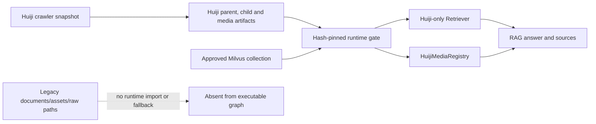

# Huiji RAG P1 Legacy Removal Design

Date: 2026-07-20  
Status: user-approved design boundary  
Historical priority: P1 in the 2026-07-18 source-hardening design  
Current-spec priority: P0, because this document promotes the approved P1 scope into an executable task

## 1. Background And Goal

The P0 source gate already proves that the active RAG service is backed by the Huiji crawler snapshot, Huiji processed artifacts and the configured Milvus collection. It also blocks the three legacy Obsidian commands before they can mutate data.

The old implementation surface still exists, however:

- `Retriever` can still load `data/processed/documents.jsonl` and enter a legacy search path.
- `RAGChain` still has an `AssetRegistry` fallback backed by `assets.jsonl`.
- `src/rag/vectorstore.py` still contains the destructive legacy `documents.jsonl` build path.
- the disabled `extract_data.py`, `build_index.py` and `build_assets.py` entry points remain in the repository.
- `PathsCfg` still exposes legacy raw and processed roots.
- README and architecture documentation still describe Obsidian as an active product capability.

The goal of this design is to remove those paths rather than keep relying on tombstones. After this work, the executable RAG code has one source mode: `huiji_crawler`.

This design does not delete persistent legacy data. That is handled by the separate P2 cleanup design after this code change proves that no consumer remains.

## 2. Architecture

The runtime gate remains the authority for artifact and collection integrity. Removing fallback code must not weaken, bypass or duplicate that gate.

## 3. Runtime Source Authority

### 3.1 Responsibility

Runtime construction must consume only the configured Huiji artifacts and active Huiji Milvus collection. Missing or invalid Huiji state is a blocked service state, not a reason to search old documents.

### 3.2 Current P0 Requirements

- `RUNTIME-SOURCE-P0-01`: production configuration must require `huiji.enabled=true` and `huiji.source_mode=huiji_crawler` before constructing RAG components.
- `RUNTIME-SOURCE-P0-02`: `Retriever` must not read `documents.jsonl`, detect entities from legacy documents, or execute a legacy document-result adapter.
- `RUNTIME-SOURCE-P0-03`: failure to load Huiji child artifacts must be explicit and fail closed; it must not result in dense-only or legacy fallback retrieval.
- `RUNTIME-SOURCE-P0-04`: `RAGChain` must always use `HuijiMediaRegistry`; it must not select `AssetRegistry` based on a feature flag.
- `RUNTIME-SOURCE-P0-05`: direct backend startup and launcher startup must continue to run the installed provenance verifier before loading RAG.

### 3.3 Deferred Evolution

Future source modes require a new source contract, provenance baseline and explicit design. A generic source plugin interface is not introduced merely to preserve the removed fallback.

### 3.4 Constraints

- No automatic artifact build or Milvus rebuild may occur during normal startup.
- No code path may treat an empty Huiji artifact as authorization to use another corpus.
- Existing conversation memory, multi-intent retrieval, citation and voice pagination behavior must remain intact.

## 4. Legacy Code And Configuration Removal

### 4.1 Responsibility

Repository structure and configuration must no longer advertise or expose a runnable Obsidian RAG pipeline.

### 4.2 Current P0 Requirements

- `LEGACY-CODE-P0-01`: delete the three tombstoned legacy CLI files. Their absence replaces the temporary exit-code contract.
- `LEGACY-CODE-P0-02`: delete `AssetRegistry` and its legacy `AssetRecord` model after all runtime imports and tests are migrated.
- `LEGACY-CODE-P0-03`: remove the legacy document loader, Markdown chunk builder, destructive collection clearing and `build_vectorstore()` path while preserving the Huiji runtime adapter and shadow-only builder.
- `LEGACY-CODE-P0-04`: remove `data_raw` and `data_processed` from runtime configuration after production references are zero.
- `LEGACY-CODE-P0-05`: remove empty or old-RAG-only extraction package files; generic text display normalization may remain only if it has a current non-source consumer.
- `LEGACY-CODE-P0-06`: production Python and launcher code must have zero references to `documents.jsonl`, `assets.jsonl`, the removed CLI names or an Obsidian source root.

### 4.3 Retained Components

- `MilvusVectorstore` remains the runtime adapter used to query the active Huiji collection.
- `build_huiji_shadow_collection()` and `scripts/build_huiji_index.py` remain the only approved vector build entry point.
- `src/utils/text_cleaner.py` may remain because `/categories` uses it for display snippets, but its contract and documentation must be source-neutral.
- Historical evidence under `eval/**` is immutable and is not rewritten to remove old terminology.

### 4.4 Constraints

- Removing legacy functions must not remove fields required by the active Huiji Milvus schema.
- Test fixtures may contain the word `obsidian` when proving rejection, but no test may require an executable legacy fallback.
- This phase performs no deletion from local data, MinIO, MySQL or Milvus.

## 5. Documentation And Operator Contract

### 5.1 Responsibility

Current documentation must tell an operator how the system actually starts, verifies and rebuilds. Historical architecture must not appear as a valid command sequence.

### 5.2 Current P0 Requirements

- `DOCS-P0-01`: README must describe Huiji crawler as the sole source and remove obsolete extraction/index commands and Obsidian product claims.
- `DOCS-P0-02`: architecture documentation must show the active Huiji data flow and may mention Obsidian only as retired history.
- `DOCS-P0-03`: the runbook must state that the old files are removed, not merely disabled, and must retain shadow-only rebuild rules.
- `DOCS-P0-04`: current start instructions must not depend on legacy file existence or suggest restoring the old pipeline as rollback.

## 6. Error Handling

- Missing Huiji artifacts, unsupported source mode or provenance mismatch keeps the backend in its existing health-only blocked state.
- A direct library caller constructing a retriever with invalid Huiji state receives a deterministic initialization error.
- No exception path may silently enter legacy vector search or return old media.
- Documentation and static-policy failures block completion but do not mutate persistent stores.

## 7. Verification Strategy

### 7.1 Unit And Static Tests

- prove retriever construction fails closed when Huiji artifacts are unavailable;
- prove chain construction only selects `HuijiMediaRegistry`;
- prove shadow building and active collection protection still pass;
- scan production code and current docs for forbidden legacy references;
- update configuration tests to prove legacy path fields are absent.

### 7.2 Real-State Acceptance

- run the installed runtime verifier against the active baseline;
- capture active Milvus collection metadata before and after and require equality;
- capture current MinIO and MySQL counts before and after and require equality;
- run a deterministic Huiji retrieval sample and require only `huiji_hybrid` sources;
- run the complete Python test suite.

## 8. Non-Goals

- deleting `data/raw`, `documents.jsonl`, `assets.jsonl` or any remote object in either `reverse1999-assets` or Milvus-owned `a-bucket`;
- changing MinIO credentials, port bindings or bucket policies;
- deleting stopped Docker containers or Milvus collections;
- adding collection-item, Udimo, roster-avatar or skin-background retrieval;
- regenerating Huiji artifacts, BM25 indexes or embeddings.

## 9. Completion Criteria

P1 is complete only when every P0 requirement above has implementation, focused tests and real-state evidence; all persistent stores are unchanged; and the repository has no executable route back to the old corpus.
