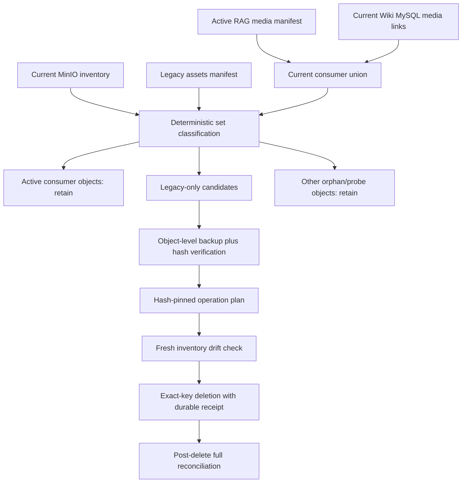

# Huiji RAG P2 Persistent Data Cleanup Design

Date: 2026-07-20  
Status: user-approved deletion boundary  
Historical priority: P2 in the 2026-07-18 source-hardening design  
Current-spec priority: P0, because this document promotes the approved cleanup into a separately gated operation

## 1. Background And Goal

After the P1 code removal, the old local RAG corpus and its MinIO objects no longer have a valid consumer. Persistent deletion is still unsafe without a new inventory because Wiki has recently added crawler-backed collection-item, Udimo, avatar and skin bindings, and MinIO changed after the previous inventory.

The 2026-07-20 read-only observation found:

- local candidates: `data/raw` with 752 files, `data/processed/documents.jsonl` and `data/processed/assets.jsonl`;
- active RAG media: 15,383 unique object keys;
- current Wiki media: 16,481 unique object keys, including 1,098 not present in the current RAG media artifact;
- current business bucket: 19,154 objects;
- old asset manifest: 2,359 rows resolving to 1,291 unique object keys, all present, no overlap with the active RAG/Wiki consumer union;
- derived other non-consumer objects: approximately 1,382, which are not authorized for deletion;
- current MinIO data lives under `infra/milvus/volumes/minio-2025-09-07-cutover`, which is not covered by the latest observed restic snapshot;
- MySQL crawler-only migration already removed supplement tables and private Wiki objects.

These are snapshot observations, not production constants. The operation must derive every set again immediately before backup and deletion.

## 2. Cleanup Architecture

No bucket, prefix, directory or database-wide deletion is allowed. Every mutation is an exact member of a reviewed, hash-pinned operation plan.

## 3. Inventory And Classification

### 3.1 Responsibility

The cleanup controller must build a complete, current view of remote objects and every approved consumer before it proposes deletion.

### 3.2 Current P0 Requirements

- `CLEAN-INVENTORY-P0-01`: capture every object in the target bucket with object key, size, ETag, version ID when enabled, SHA-1/SHA-256 metadata when present and operation metadata when present.
- `CLEAN-INVENTORY-P0-02`: hash-pin the active RAG media manifest, installed provenance baseline, current Wiki media-link export and legacy asset manifest.
- `CLEAN-INVENTORY-P0-03`: compute the deletion set dynamically as `remote AND legacy_manifest AND NOT active_rag AND NOT current_wiki`.
- `CLEAN-INVENTORY-P0-04`: classify all remaining remote objects without deleting them. Capability probes, unknown orphans and Milvus-owned `a-bucket` objects are retained.
- `CLEAN-INVENTORY-P0-05`: all active consumer keys must exist remotely. Any missing active key or key/hash conflict blocks plan generation.
- `CLEAN-INVENTORY-P0-06`: the operation plan must record set fingerprints and counts but must not treat the observed 1,291 or 1,382 counts as universal constants.

### 3.3 Conflict Rule

If the same object key has different expected content, the operation stops immediately. The cause must be investigated, and the check scope must expand to related manifest rows, prefixes and consumers to determine whether the problem is systemic. No upload or deletion plan is generated while a mismatch remains.

## 4. Backup And Restore

### 4.1 Local Legacy Data

- `CLEAN-BACKUP-P0-01`: select and hash-pin a restic snapshot that contains every local candidate.
- `CLEAN-BACKUP-P0-02`: run `restic check` and restore the complete candidate set into an isolated test directory.
- `CLEAN-BACKUP-P0-03`: compare restored file count, relative paths, sizes and SHA-256 values with the live candidates before authorizing local deletion.

### 4.2 MinIO Legacy Objects

- `CLEAN-BACKUP-P0-04`: because the current MinIO bind directory is not covered by the observed restic paths, download every exact deletion candidate to an external quarantine root while preserving bucket/key structure.
- `CLEAN-BACKUP-P0-05`: verify downloaded SHA-1, SHA-256 and size against the streamed remote content and record ETag/version ID separately; ETag is not treated as a content hash.
- `CLEAN-BACKUP-P0-06`: back up the quarantine root into restic, restore it into a second isolated directory and verify the full candidate fingerprint before deletion.
- `CLEAN-BACKUP-P0-07`: a restore operation must use conditional create and must never overwrite a newly created object with the same key. A mismatch stops restoration and triggers investigation.

## 5. Operation Plan And Mutation

### 5.1 Plan Contract

The canonical operation plan contains:

- schema version and unique operation ID;
- source inventory hashes and capture timestamps;
- active consumer union fingerprint;
- exact local paths and exact remote keys selected for deletion;
- per-object key, size, SHA-1, SHA-256, ETag and version ID;
- backup receipt and restic snapshot hashes;
- retained-class counts and fingerprints;
- preconditions, expected postconditions and rollback references.

The plan file is canonical JSON and is invoked with an explicit expected SHA-256. It cannot be edited or regenerated after apply begins.

### 5.2 Current P0 Requirements

- `CLEAN-PLAN-P0-01`: plan generation is impossible until all inventory and backup gates pass.
- `CLEAN-PLAN-P0-02`: immediately before apply, recapture current inventory and require equality for every protected and candidate key.
- `CLEAN-APPLY-P0-01`: delete local candidates only by exact approved path and remote candidates only by exact approved key/version.
- `CLEAN-APPLY-P0-02`: write an append-only receipt after each completed remote deletion so interruption yields a recoverable partial state.
- `CLEAN-APPLY-P0-03`: do not delete MySQL rows when the crawler-only audit already proves supplement tables and references are absent; record this as a verified no-op.
- `CLEAN-APPLY-P0-04`: do not delete from `a-bucket`, any Milvus collection, capability probes, stopped containers or the residual orphan set.
- `CLEAN-APPLY-P0-05`: partial failure stops further mutation, records the completed subset and blocks completion. Restoration uses a separately hash-pinned restore action rather than an unverified overwrite loop.

## 6. Post-Delete Reconciliation

- `CLEAN-VERIFY-P0-01`: every planned local path is absent and every planned remote key is absent.
- `CLEAN-VERIFY-P0-02`: every active RAG and current Wiki object remains present with unchanged content identity.
- `CLEAN-VERIFY-P0-03`: retained orphan/probe fingerprints remain unchanged.
- `CLEAN-VERIFY-P0-04`: the installed Huiji runtime verifier passes and the active Milvus collection fingerprint is unchanged.
- `CLEAN-VERIFY-P0-05`: Wiki MySQL page/media counts and crawler-only source checks remain unchanged.
- `CLEAN-VERIFY-P0-06`: final evidence links pre-inventory, backup, operation plan, append-only receipt, post-inventory and requirement matrix by SHA-256.

## 7. Error Handling

- Inventory drift before apply invalidates the plan; recapture from the beginning.
- Content mismatch blocks both deletion and automated upload.
- Backup or restore-test failure blocks deletion.
- A partial delete is not called success. The controller stops, preserves evidence and reports exactly which keys changed.
- Missing credentials or store unavailability is a blocker, not authorization to skip a store.

## 8. Retained Data And Non-Goals

The following are explicitly retained:

- other MinIO orphan objects not proven to belong exclusively to the old manifest;
- `_evb_capability_probe` objects;
- `a-bucket` and all Milvus internal objects;
- `text_child_bge_m3_v2`, the P0 shadow collection and active v3;
- stopped legacy Docker containers and their old data directories;
- crawler raw data and all Huiji processed artifacts;
- current Wiki MySQL data and crawler-backed media.

This design does not change MinIO credentials or ports and does not add new RAG content.

## 9. Completion Criteria

Cleanup is complete only when exact backup restoration has been proven, a hash-pinned plan has been applied without drift, all protected consumers reconcile unchanged, only the approved legacy set is absent, and the final evidence is independently machine-checkable.
