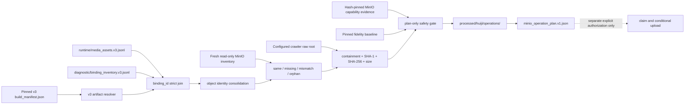

# Huiji v3 MinIO 一次性 Operation Plan 适配设计

日期：2026-07-21  
状态：设计已确认，待书面审阅通过后生成执行 Plan  
适用范围：crawler-only media v3 candidate 的只读 MinIO 对账与一次性增量补齐计划生成

## 1. 背景与目标

Huiji crawler-only Builder 已能生成 `evb.media-asset/v3` candidate。当前 Candidate E 的保真账本和语音冲突闭包均通过，但其 runtime 媒体仍引用 MinIO 中缺失的对象，因此状态保持为 `blocked`，没有生成 embedding handoff。

现有 strict MinIO 工具已经具备以下安全能力：

- hash-pinned baseline、build manifest、preflight bundle 和 before inventory；
- 本地文件 SHA-1、SHA-256、size 与 object key 复核；
- `If-None-Match: *` 条件创建；
- application operation ID 审计关联；
- operation plan 一次认领、写后回读和 after-inventory 验证。

但现有 request 提取器只理解历史 EVB v2：它从 v2 runtime row 直接读取 `local_relpath`，仅处理 `voice`，并把 operation plan 固定写入 candidate/build root 下的 `operations`。media v3 则明确将 `local_relpath` 放在 `diagnostic/binding_inventory.v3.jsonl`，runtime canonical artifact 中不允许出现本地路径；同时 v3 candidate 的 manifest closure 禁止在构建完成后向 candidate root 添加未声明文件。

本设计补齐 v3 到 strict MinIO operation plan 的只读适配层，目标是：

1. 从 manifest-pinned v3 runtime 与 binding inventory 确定性派生物理对象请求；
2. 以 fresh read-only MinIO inventory 将对象分类为 `same_hash`、`missing_remote`、`hash_mismatch` 和 `orphan_remote`；
3. 在 candidate root 之外生成 create-new、hash-pinned、一次性 operation plan；
4. 本轮不认领 plan、不上传、不删除、不修改 active pointer、MySQL、Milvus 或 candidate。

当前快照观测到 `3,443` 个唯一 `missing_remote` 对象，其中 `voice=3,436`、`skill=7`。这些数字只属于本次 evidence，不是代码常量，也不是未来 candidate 的固定验收值。

## 2. 总体架构



依赖方向固定为：

```text
v3 immutable candidate + crawler raw + read-only evidence
    -> v3 request adapter
    -> existing strict MinIO planner
    -> immutable one-time operation plan
```

适配器不得调用 Builder 重新生成 artifact，不得从 MinIO 反推媒体绑定，也不得把 operation 文件写回 candidate root。strict uploader 的 mutation 路径不属于本轮执行范围。

## 3. v3 Artifact 解析与绑定模块

### 3.1 模块职责

该模块负责从已由外部 SHA-256 锁定的 `build_manifest.json` 中定位 v3 runtime 与 diagnostic binding inventory，验证两者属于同一 immutable candidate，并通过 `binding_id` 恢复 strict uploader 所需的本地证据。

输入：

- candidate `build_manifest.json` 及调用方提供的 expected SHA-256；
- manifest 内声明的 `runtime/media_assets.v3.jsonl`；
- manifest 内声明的 `diagnostic/binding_inventory.v3.jsonl`；
- 配置锁定的 crawler raw root；
- fresh `ObjectInventory`。

输出：

- 按 `(bucket, object_key)` 规范排序且物理对象唯一的 `StrictObjectRequest` 集合；
- 对账分类和动态统计，供 plan gate 验收；
- 任何不一致时的确定性阻断错误，不输出部分请求集合。

### 3.2 P0 当前必须满足

- `V3ADAPTER-P0-01`：manifest dispatch 必须显式区分 legacy EVB v2 与 corpus media v3。v2 行为保持兼容；v3 只接受 `huiji.corpus-build/v2` build manifest、`evb.media-asset/v3` runtime schema 和 `huiji.media-binding-inventory/v3` diagnostic schema，不允许通过文件名猜测 schema。
- `V3ADAPTER-P0-02`：v3 resolver 必须从 build manifest 的 `artifacts` 列表定位两个 artifact，验证相对路径不逃逸 candidate root，且逐项验证 declared schema、SHA-256、size 和 row count。重复 artifact path、重复目标 schema、缺失声明、未通过哈希或行数验证时立即阻断。
- `V3ADAPTER-P0-03`：runtime 与 binding inventory 必须分别保证 `binding_id` 唯一，并进行严格一对一全量连接。任一侧存在 extra、missing、duplicate binding，或连接后的 `resource_id`、object key、SHA-1、SHA-256、size、owner/parent/child identity 不一致时立即阻断。
- `V3ADAPTER-P0-04`：`local_relpath` 只能来自 binding inventory。它必须是相对路径，不含 `..`，解析后位于配置锁定的 crawler raw root 内；不得从 `url`、`source_url`、`filename`、object key 或 source title 推导本地路径。
- `V3ADAPTER-P0-05`：runtime 中出现 `quarantined`、`fatal`、未知 `binding_status`，或 candidate blocker 除已解释的 MinIO availability blocker 外仍包含 source drift、fidelity loss、unknown/fatal conflict 时，不得生成 operation plan。diagnostic 中已解释且已从 runtime 排除的 quarantine 可以保留为证据，其 binding/object 不得进入上传对象集合。
- `V3ADAPTER-P0-06`：本次 operation authority 必须显式 pin 可上传的 `asset_type/media_role` 集合。当前批准集合为 `voice/voice` 与 `skill/skill`；fresh 对账出现其他缺失类型、未知 role 或 role/type 不一致时停止，不自动扩大计划。

### 3.3 P1 可部分支持

- `V3ADAPTER-P1-01`：后续可在独立审阅后为其他明确媒体类型增加 operation authority；最低边界是新增显式 allowlist、object-key 规则、MIME/suffix 验证和真实样本测试，不能使用通配符放行。

### 3.4 P2 未来演进

- `V3ADAPTER-P2-01`：未来可将 artifact resolver 抽象为多 schema registry；本轮不引入插件式 resolver，也不改变 media v3 canonical schema。

### 3.5 关键契约与限制

`binding_id` 是 runtime 与 diagnostic evidence 的唯一连接键。`resource_id`、SHA、URL、文件名、object key 都不能替代 binding identity。

同一物理对象可被多个 binding 合法复用。连接完成后按 object key 合并时，所有贡献 binding 必须对以下物理身份完全一致：

```text
bucket
object_key
resource_id
sha1
content_sha256
size
asset_type
mime
suffix
```

`resource_id` 必须等于 `resource:sha256:<content_sha256>`，兼容 `media_id` 必须等于 `media:sha1:<sha1>`；文件名 suffix、object-key suffix 和批准矩阵中的 suffix 必须一致。

当前 operation authority 矩阵固定为：

| asset_type | media_role | binding_status | MIME | suffix |
| --- | --- | --- | --- | --- |
| `voice` | `voice` | `exact` | `audio/mpeg` | `.mp3` |
| `skill` | `skill` | `not_applicable` | `image/png` | `.png` |

同 key 的 binding identity 可以不同，但物理身份只要有一项不同即为冲突，不得任取其一。对于 `missing_remote`，多个不同 `local_relpath` 指向同一物理对象时，所有不同路径都必须通过 containment、SHA-1、SHA-256 和 size 验证；request 使用规范化后字典序最小的路径作为确定性 `source_path`。`same_hash` 仍需完成结构与远端内容身份对账，但不为生成本次 plan 重读本地文件字节。

允许的 candidate blocker 语法只包括：

```text
media_unavailable:<non-negative binding count>
minio_object_missing:<approved object key>
```

`media_unavailable` 数量必须等于 runtime 中 fresh 对账为 unavailable 的 binding 数；所有 `minio_object_missing` 去重后的 object-key 集合必须等于 fresh reconciliation 的唯一 missing 集合。出现其他 blocker、缺少 blocker、额外 blocker 或计数不闭合时均停止。

## 4. MinIO 对账与本地字节门禁模块

### 4.1 模块职责

该模块把 v3 声明的唯一物理对象与 fresh read-only MinIO inventory 对账，并只为经批准类型的 `missing_remote` 生成 strict request。它不访问业务写接口，也不删除 orphan。

### 4.2 P0 当前必须满足

- `RECONCILE-P0-01`：plan 生成前必须重新采集当前 bucket/prefix 的只读 inventory，并记录 object key、size、SHA-1、SHA-256、ETag、version ID、application audit ID 和 bucket policy summary。inventory 文件 SHA-256、内部 inventory SHA-256 和 object-state SHA-256 都必须可验证。
- `RECONCILE-P0-02`：每个 candidate 物理对象必须动态分类。远端同 key 且 SHA-1/SHA-256/size 一致为 `same_hash`；本地声明存在而远端缺失为 `missing_remote`；同 key 内容身份不同为 `hash_mismatch`；远端存在而 candidate 未声明为 `orphan_remote`。
- `RECONCILE-P0-03`：`hash_mismatch > 0` 时立即停止并扩大到关联 binding、owner、source row、candidate artifact 和 prefix 的检查范围；不得生成 plan。`orphan_remote` 只进入诊断统计，继续保留，不删除、不覆盖、不进入 plan。
- `RECONCILE-P0-04`：operation plan 的对象集合必须恰好等于本次 fresh 对账中、属于批准 type/role 的唯一 `missing_remote` 集合。`same_hash`、`hash_mismatch`、`orphan_remote`、quarantine/fatal 和未批准类型均不得进入 plan。
- `RECONCILE-P0-05`：对每个待计划对象，必须在写 plan 前读取本地字节并验证 SHA-1、SHA-256、size、suffix 和 `reverse1999/<asset_type>/<sha1-prefix>/<sha1><suffix>` object-key 规则。所有对象必须先完成验证，任一失败时不写部分 plan。
- `RECONCILE-P0-06`：snapshot 数量不得写入实现常量。工具必须输出动态的 binding count、unique object count、按 type/role 计数、ordered missing object-key SHA-256 和 canonical planned-object-set SHA-256。
- `RECONCILE-P0-07`：如果 fresh inventory 相对已批准 reconciliation evidence 出现 object-state 漂移，或动态 missing object-key hash 与批准值不同，停止并生成新的只读诊断；不得静默按新集合生成 plan。

### 4.3 P1 可部分支持

- `RECONCILE-P1-01`：后续可将 inventory drift 分类为已批准 additive change 和外部无关 change；本轮任何 object-state 漂移都按 P0 fail-closed 处理。

### 4.4 P2 未来演进

- `RECONCILE-P2-01`：MinIO orphan 生命周期管理、归档和删除继续属于独立治理任务，不进入本设计。

### 4.5 关键契约与限制

`is_available` 是 candidate 构建时观测值，不是当前 MinIO 权威。fresh inventory 是本次 plan 的远端状态权威，但二者必须可解释地一致；不一致视为 drift，不得直接修补 candidate。

binding-level 缺失数量与 unique object-level 缺失数量可以不同。operation plan 始终以唯一 `(bucket, object_key)` 为单位，不能把共享 binding 重复上传，也不能通过 binding 去重丢失 artifact 关系。

## 5. Capability 与 Preflight Evidence 模块

### 5.1 模块职责

该模块证明目标 MinIO authority 支持原子条件创建和应用审计，并把 capability、candidate、baseline、fresh inventory 与 reconciliation 绑定到同一 operation plan。

### 5.2 P0 当前必须满足

- `PREFLIGHT-P0-01`：capability evidence 必须是 hash-pinned `evb.minio-capability/v1`，且明确证明 `server_atomic_if_none_match=proven`、`application_audit_correlation=proven`，authority 中 endpoint、bucket、prefix 与当前配置完全一致。
- `PREFLIGHT-P0-02`：operation preflight bundle 必须 create-new，并至少 pin capability sidecar 与本次 reconciliation evidence；sidecar path 必须相对 bundle root、不可逃逸、不可重复，且每个 sidecar 在 plan 创建和未来 upload prepare 阶段均重新验证 SHA-256。
- `PREFLIGHT-P0-03`：operation plan 必须直接 pin fidelity baseline、candidate build manifest、preflight bundle 和 fresh before inventory 的路径与 SHA-256，并记录 before inventory object-state SHA-256。任一 evidence 不可读、哈希不匹配或 authority 不一致时不得创建 plan。
- `PREFLIGHT-P0-04`：plan generation 只能使用 read-only inventory 文件和本地 artifact/raw 文件。它不得调用 MinIO `PUT`、`DELETE`、覆盖、claim 或业务对象 probe；capability probe 使用已经保留并登记的隔离 test key evidence，不在本轮重复写业务 bucket 对象。

### 5.3 P1 可部分支持

- `PREFLIGHT-P1-01`：未来可以增加 capability evidence 有效期策略；本轮通过 server identity、authority、SDK capability 和 fresh inventory 联合验证，不引入仅按时间过期的隐式判断。

### 5.4 P2 未来演进

- `PREFLIGHT-P2-01`：未来可使用公开 S3 conditional-put API 替代 SDK private `_execute`；替换前必须重复隔离 capability probe 和审计关联验收。

### 5.5 关键契约与限制

复制 capability sidecar 到 operation evidence root 时必须保持字节完全一致并记录来源路径和源文件 SHA-256，不得编辑、重写或伪造 passing evidence。

preflight bundle 不是第二份 candidate manifest。candidate artifact 路径、schema、hash 和 row count 仍以 candidate build manifest 为唯一权威。

## 6. Operation Namespace 与一次性计划模块

### 6.1 模块职责

该模块在不破坏 immutable candidate manifest closure 的前提下，为 v3 remediation 保存 plan 及其后续一次性使用证据。

### 6.2 P0 当前必须满足

- `OPERATION-P0-01`：v3 operation authority 固定为 `data/processed/huiji/operations/<operation_id>/minio_operation_plan.v1.json`。`operation_id` 使用与 build version 相同的安全 ID grammar；路径 resolve 后必须位于配置锁定的 processed root 内。
- `OPERATION-P0-02`：legacy `<build_version>/operations/minio_operation_plan.v1.json` authority 继续支持。新增 global namespace 不得放宽为 processed root 下任意 `operations` 或任意文件名。
- `OPERATION-P0-03`：operation plan 与 preflight evidence 均使用 create-new 语义，不得覆盖既有文件。v3 candidate root 内不得增加、删除或修改任何文件，candidate manifest SHA-256 在 plan 生成前后必须相同。
- `OPERATION-P0-04`：本轮只允许生成 `minio_operation_plan.v1.json`。完成时 `used_by_operation_id` 必须为空，且不得存在 `minio_operation_plan.use.v1.json`、`minio_write_report.v1.json` 或任何 upload/readback evidence。
- `OPERATION-P0-05`：plan 中每个对象的 disposition 必须为 `conditional_create`。计划不得包含 `same_hash_skip`，因为当前一次性补齐计划只授权 exact missing set；后续 claim 时仍必须重新采集 current inventory 并验证 before object-state 完全未漂移。
- `OPERATION-P0-06`：实际 plan claim、MinIO upload、Candidate F 重建、embedding、shadow Milvus 和 active activation 都需要后续独立授权。本设计及其首轮执行不得把“plan 已生成”解释为写入许可或 candidate ready。

### 6.3 P1 可部分支持

- `OPERATION-P1-01`：后续可为多次批准的独立 remediation operation 复用 global namespace；每次仍需新的 operation ID、fresh inventory、reconciliation 和用户写入授权。

### 6.4 P2 未来演进

- `OPERATION-P2-01`：自动上传、自动重建 candidate、自动向量化和自动激活不进入本设计。

### 6.5 关键契约与限制

global operation root 是 evidence/operation authority，不是 artifact root。它允许在后续获批执行时创建固定 sibling use marker 和 write report，但不能修改 plan 本体。

plan 的 canonical object set 由完整 `PlannedObject` payload 计算，ordered missing object-key hash 作为独立集合验收。两个 hash 用途不同，必须同时记录，不能互相替代。

## 7. 跨模块数据流与状态机

```text
candidate manifest SHA verified
  -> v3 runtime and binding inventory pins verified
  -> binding_id one-to-one join completed
  -> physical object identities consolidated
  -> fresh read-only inventory captured
  -> same/missing/mismatch/orphan reconciliation completed
  -> zero hash mismatch and zero unapproved missing type
  -> all missing local bytes verified
  -> capability and reconciliation bundle pinned
  -> create-new global operation plan generated
  -> STOP: awaiting separate explicit upload authorization
```

Candidate 生命周期在本轮结束时仍为：

```text
blocked_by_minio_media_availability
```

只有后续获批上传完成、after inventory 验证通过并生成新的 immutable candidate 后，新的 candidate 才可能进入 `ready_for_embedding`。不得原地修改 Candidate E 的 blocker、manifest、runtime availability 或 build report。

## 8. 错误处理原则

- artifact pin、schema、row count 或 join 失败：停止，不生成 plan，不修补 candidate。
- runtime 出现 quarantine/fatal/unknown status：停止，扩大检查范围；diagnostic-only quarantine 不进入 runtime 或 plan。
- 同 object key 物理身份冲突：停止，列出全部 binding、owner、source refs 和 local paths。
- MinIO `hash_mismatch`：停止并扩大检查，不生成覆盖计划。
- fresh inventory 漂移：停止，重新采集 reconciliation evidence，旧批准集合失效。
- local path 逃逸、缺失或字节哈希不一致：停止；所有 request 必须在 plan 文件创建前完成验证。
- unknown type/role：停止，不通过默认 MIME、suffix 或 object-key 猜测放行。
- plan authority path 非法或目标已存在：停止，不选择备用任意路径，不覆盖。
- orphan remote：只诊断保留，不阻断本次纯增量补齐，也不进入 plan。

## 9. 测试与验收方向

### 9.1 自动化测试

P0 测试必须覆盖：

- legacy v2 request extraction 行为不变；
- v3 manifest dispatch、artifact path containment、hash/size/row-count 验证；
- runtime 与 inventory 的 one-to-one `binding_id` join；
- 同一 resource 多 binding 的合法合并，以及同 key 不同物理身份的阻断；
- 多 local path 全量字节验证和确定性 source selection；
- `same_hash`、`missing_remote`、`hash_mismatch`、`orphan_remote` 四类对账；
- quarantine/fatal runtime、unknown type/role、未批准 blocker 的 fail-closed；
- global v3 authority path 与 legacy authority path 均精确接受，其他路径拒绝；
- plan-only 执行不调用 MinIO mutation、不创建 claim marker 或 write report；
- operation plan 中对象唯一、规范排序、全为 `conditional_create`。

### 9.2 真实数据验收

当前获批 evidence tuple 为：

```text
Candidate E build manifest
  path: data/processed/huiji/crawler-v3-20260720t210135z/build_manifest.json
  sha256: fc9af6198f7a32910af258499614817bfe895a7320addc1e3f1dc98e9b971924

Fidelity baseline
  path: eval/huiji_corpus_fidelity/20260720T073917Z/corpus-preservation-baseline.v2.json
  sha256: 8df26d9a6cd1014c82d1fdd1fa858f1b9411cb4b365101b0a12020d608db10aa

Capability evidence
  path: data/processed/huiji/evidence/minio-migration-20260712/minio_capability.v1.json
  sha256: c51e709311a92c8c50a8a8844927b73992f686495c8798516236d4988920901f

Approved reconciliation
  path: eval/huiji_corpus_builder/20260720t211224z-current-minio/analysis/candidate-e-current-minio-reconciliation.v1.json
  sha256: b0855db6463e7f4968ae4255d4e739239ca4fa153290693a7657bf52c5ec2e5a
  before object-state sha256: f0af3adcc4b57d4ca024d92fd36fffd3e049d14e8841461317f792ef89d77128
  ordered missing object-key sha256: 614dd1a83effe7f39a77c3453593e7021113a64f0e5e5f58c38fafa19919e9f6
```

执行时必须再次采集 fresh inventory。只有 fresh object-state 与批准 evidence 相同、重新派生的 missing key hash 相同，才允许生成 plan。

本次真实数据预期值为：

```text
same_hash unique objects: 15,689
missing_remote unique objects: 3,443
  voice: 3,436
  skill: 7
hash_mismatch: 0
orphan_remote: 2,174 (diagnostic retain only)
```

这些是对当前 frozen tuple 的验收证据。测试实现必须从 artifact 和 inventory 动态计算，再与本次批准 evidence 比较；不得把数字写入 production adapter。

### 9.3 保护面验收

plan 生成前后必须证明：

- Candidate E manifest 文件 SHA-256 不变，candidate 文件集合不变；
- MinIO object-state SHA-256 不变；
- active pointer/config/provenance 不变；
- active Milvus collection 不变，未创建 shadow collection；
- Wiki MySQL 未导入 candidate；
- operation root 中不存在 claim marker、write report 或 upload evidence；
- `D:\1999Wiki_Backup` 未被读取为内容权威且没有任何写入。

## 10. 与旧方案的关系

### 10.1 保留

- `StrictMinioUploader` 的 local-byte validation、conditional create、audit、one-time claim、readback 和 after-inventory 契约；
- legacy EVB v2 manifest/request extraction；
- legacy `<build>/operations/minio_operation_plan.v1.json` authority；
- MinIO orphan diagnostic-retain 原则；
- Builder 不直接上传、不直接向量化、不切 active 的边界。

### 10.2 扩展

- request extractor 增加显式 v3 adapter，通过 `binding_id` 连接 runtime 与 binding inventory；
- authority path 增加 `processed_root/operations/<operation_id>/...` 的精确分支；
- operation preflight 增加 v3 reconciliation 和批准 missing-key set 的校验。

### 10.3 明确不采用

- 将 `local_relpath` 写回 runtime v3；
- 在 immutable candidate root 内补写 operation 文件；
- 按 URL、文件名、SHA 或 object key 连接媒体 binding；
- 通过增大 K、分页去重或 runtime fallback 掩盖缺失对象；
- 把 3,443、3,436、7 或任一角色样本数量写死为通用逻辑；
- plan 生成后自动 claim、上传、重建 candidate、向量化或激活；
- 删除 2,174 个当前 orphan remote 对象。

## 11. 完成判定

本设计的 P0 只在以下条件全部满足时完成：

1. 所有 `V3ADAPTER-P0-*`、`RECONCILE-P0-*`、`PREFLIGHT-P0-*` 和 `OPERATION-P0-*` 均有实现、自动测试和真实数据验收。
2. 真实数据重新派生的 exact missing object set 与批准 reconciliation 完全一致。
3. create-new operation plan 已生成并通过内部 hash、evidence pin、authority path 和 object-set 验证。
4. operation plan 未被认领，MinIO 未发生写入，candidate 与所有 active 保护面无漂移。
5. 实际上传仍明确标记为待单独授权，Candidate E 仍保持 immutable blocked 状态。

任一 P0 仅有接口、占位、mock 通过或人工推断时，整体不得标记完成。
