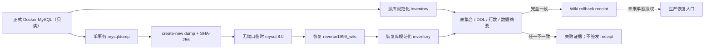

# Huiji Wiki Pre-Import Rollback Receipt 设计

日期：2026-07-21  
状态：设计已批准  
适用范围：Candidate F 正式导入 Wiki MySQL 前的逻辑备份、隔离恢复演练与可回滚证据

## 1. 背景与目标

Crawler-only Candidate F 已通过 Builder、shadow Milvus 和隔离全链路验收，但 activation proposal 仍被 `wiki_rollback_receipt_missing` 与 `active_pointer_not_bootstrapped` 阻塞。Wiki media v3 compatibility receipt 已通过；当前缺少的是一份能够证明现有正式 Wiki MySQL 可恢复的 pre-import rollback receipt。

本设计只处理 Wiki 前置回滚保障。它必须：

1. 从本项目 Docker MySQL `reverse1999-main-mysql/reverse1999_wiki` 生成单事务逻辑备份；
2. 在独立、无主机端口映射的临时 `mysql:8.0` 容器中真实恢复；
3. 对源库和恢复库执行逐表结构、精确行数和确定性数据摘要比较；
4. 只有全部闭合时才签发 hash-pinned `huiji.wiki-rollback-receipt/v1`；
5. 提供默认 dry-run、强授权的生产恢复入口，但本轮不得对正式库执行恢复；
6. 不导入 Candidate F，不创建 v3 双表，不修改 RAG active pointer、Milvus、MinIO 或 crawler artifacts。

当前正式库观测为 legacy/dev，包含 `wiki_pages`、`wiki_media_links` 等七张表。该数量和当前行数只属于执行前观测，不得写成实现常量。

本轮输入 authority 固定为：

| 输入 | 规范路径 | 当前 SHA-256 / 状态 |
|---|---|---|
| Candidate F manifest | `data/processed/huiji/crawler-v3-20260721t051246z/build_manifest.json` | `293410a1da4909e6b07e3f755ba0b4ba10b7008152330d5e2f98bcf93a573b5f` |
| Wiki media v3 compatibility receipt | `eval/huiji_wiki_v3_compatibility/20260720T162923Z/wiki_media_v3_compatibility_receipt.v1.json` | `b0c82cbaa77303819ee93f600c2f4518152984580bb36d636e0d5063a67ec56d` |
| 当前 activation proposal | `data/processed/huiji/activation/proposals/candidate-f-review-20260721t071308z/activation_proposal.v1.json` | `ce5e6966b80f0b9f1c2300e95866a7d0b9b8d9e108333311f0f92a8d27af1536` |
| active pointer | `data/processed/huiji/activation/active_build.v1.json` | 当前不存在；任务结束时仍必须不存在 |

任一 authority 文件在执行前漂移时，必须回到设计/审核阶段确认新输入，不能由脚本自动接受。

## 2. 总体架构



依赖方向固定为：

```text
current Wiki MySQL + repository restore tool
    -> immutable logical dump
    -> isolated restore verification
    -> immutable rollback receipt
    -> RAG activation proposal reference
```

回执不是 Candidate F 导入许可，也不是 active 切换许可。

## 3. Authority 与凭据模块

**职责**：锁定唯一源库、运行身份、路径根和凭据边界，避免回滚工具误连其他 MySQL 或把敏感信息写入证据。

**输入**：项目 Compose、运行中容器元数据、项目 MySQL 配置与 `receipt_id`。

**输出**：规范化 source authority、镜像/版本 pin、允许的只读操作集和受约束输出根。

**边界**：本模块不生成 dump、不启动恢复容器、不访问 MinIO/Milvus，也不修改正式 MySQL。

### 3.1 P0 当前必须满足

- `AUTH-P0-01`：可交付 RAG 的正式 passing receipt，其源 authority 只允许本项目 Compose 中的 `reverse1999-main-mysql` 和数据库 `reverse1999_wiki`。容器 ID、镜像 ID、MySQL server version、Compose 文件路径与 SHA-256 必须进入回执。
- `AUTH-P0-02`：`receipt_id` 必须匹配 `^[a-z0-9][a-z0-9_-]{0,63}$`。所有输出路径 resolve 后必须位于配置锁定的 backup/eval root 内，禁止 `..`、绝对路径注入和任意文件名。
- `AUTH-P0-03`：凭据只能从现有进程配置或容器内部环境读取到内存，不得作为 CLI 参数要求用户明文输入，不得打印、写入 dump、日志、failure evidence 或 receipt。
- `AUTH-P0-04`：正式源库连接只允许执行 `SELECT`、`SHOW`、`mysqldump --single-transaction` 和只读元数据查询。脚本不得向正式容器执行 `CREATE`、`DROP`、`ALTER`、`INSERT`、`UPDATE`、`DELETE`、`LOCK TABLES` 或 restore。
- `AUTH-P0-05`：临时恢复容器必须使用与正式容器同一镜像 ID，禁止主机端口映射；使用 `--rm` 和临时数据存储，且在成功、失败和中断路径中均执行清理。
- `AUTH-P0-06`：只有回滚工具在本次运行中亲自创建、名称匹配固定测试前缀、无网络且无端口的临时容器，才可作为 `--apply` 集成测试前置 emergency backup 的 test-only source。该路径不能由通用 CLI authority 参数开启，生成物必须使用 `test_only: true` 和不同 schema，且不得写入正式 receipt 路径或交付 RAG。

### 3.2 P1 可选能力

本轮没有 Authority P1 实现项；不同源库或远程备份 authority 必须另行设计，不能由 CLI 自由参数化。

### 3.3 P2 未来演进

- `AUTH-P2-01`：未来迁移 MySQL 镜像版本时，可在独立兼容性任务中允许不同镜像恢复，但必须增加双版本恢复证据。本轮不允许跨版本推断。

## 4. Dump 与 Inventory 模块

**职责**：为正式 Wiki MySQL 生成不可覆盖的逻辑备份，并用可复算、无歧义的 inventory 描述备份前后的数据库状态。

**输入**：只读 source authority、数据库 schema 元数据和表数据。

**输出**：二进制原样 dump、源库前后 inventory、逐表 DDL/行数/数据摘要。

**边界**：不复制 Docker volume，不依赖近似行数，不把已观测的表名或行数写成常量。

### 4.1 P0 Dump 契约

- `DUMP-P0-01`：逻辑备份必须使用 `mysqldump`，目标仅为 `reverse1999_wiki`，并至少启用 `--single-transaction`、`--skip-lock-tables`、`--quick`、`--routines`、`--triggers`、`--events`、`--hex-blob`、`--set-gtid-purged=OFF`、`--no-tablespaces`、`--default-character-set=utf8mb4` 和 `--skip-comments`。
- `DUMP-P0-02`：dump 必须以 create-new 二进制流写入：

  ```text
  backups/wiki-mysql/pre-import/<receipt_id>/reverse1999_wiki.sql
  ```

  禁止 PowerShell 文本重编码、覆盖既有文件或复制 MySQL volume。
- `DUMP-P0-03`：记录 dump SHA-256、字节数、命令选项、数据库名、生成时间和源容器身份；不得在 receipt 中记录 dump 内容或凭据。
- `DUMP-P0-04`：dump 生成前后必须分别采集源库 inventory。两次 inventory 不一致时视为并发漂移，停止且不签发 receipt。

### 4.2 P0 规范化 Inventory

- `INVENTORY-P0-01`：inventory 必须动态枚举 `information_schema.TABLES` 中的全部 base table，记录 engine、列定义、主键列和精确 `COUNT(*)`；不得依赖近似 `TABLE_ROWS`。
- `INVENTORY-P0-02`：本轮每张表必须存在主键。数据摘要按主键列升序流式读取，列顺序使用 `ORDINAL_POSITION`。每个单元格必须使用无歧义的类型化长度前缀编码：`NULL` 单独编码；非空值记录 MySQL 类型族、字节长度和 `HEX(CAST(value AS BINARY))`，行边界也必须带长度前缀。摘要以增量 SHA-256 计算，禁止依赖 CLI 可碰撞的普通 TSV/`NULL` 文本。无主键、重复表名、无法稳定排序、类型无法规范化或读取失败时停止。
- `INVENTORY-P0-03`：DDL 摘要使用同版本 MySQL 的 `SHOW CREATE TABLE` 规范输出计算 SHA-256。源库和恢复库必须逐表比较 DDL SHA-256、精确行数和数据 SHA-256。
- `INVENTORY-P0-04`：整体 inventory SHA-256 只覆盖规范排序后的表名、engine、列/主键描述、DDL SHA-256、精确行数和数据 SHA-256，不包含时间、容器名或临时路径。
- `INVENTORY-P0-05`：`wiki_import_snapshots` 的 singleton 行必须单独解析进 receipt，记录 source mode、build version、artifact schema、manifest SHA-256 和 snapshot SHA-256；字段缺失或多行时停止。

### 4.3 P1/P2 边界

本轮不实现增量 dump、远程备份或跨版本 DDL 兼容。它们属于独立演进任务，不得降低本轮“同镜像完整恢复、逐表完全一致”的 P0 门槛。

## 5. 隔离恢复模块

**职责**：在与正式容器同镜像、无主机端口的临时 MySQL 中真实恢复 dump，并证明恢复结果与源库 inventory 完全一致。

**输入**：已校验 dump、source inventory、source image ID 和临时凭据。

**输出**：restored inventory、逐项比较结果、清理结果或不可冒充 passing receipt 的失败证据。

**边界**：只允许操作本次创建的临时容器及其匿名临时存储，不对正式容器执行 restore。

### 5.1 P0 当前必须满足

- `RESTORE-VERIFY-P0-01`：临时容器名称由固定前缀和 `receipt_id` 组成；启动前同名容器存在则停止，不得删除未知既有容器。
- `RESTORE-VERIFY-P0-02`：临时容器不发布任何端口。所有 readiness、restore 和 inventory 命令只通过 `docker exec` 进入容器。
- `RESTORE-VERIFY-P0-03`：恢复前创建空数据库，随后从已完成 SHA-256 验证的 dump 字节流通过 stdin 恢复。不得从未经回执目录约束的路径读取 dump。
- `RESTORE-VERIFY-P0-04`：恢复完成后生成完整 inventory，并要求表集合、逐表 DDL SHA-256、精确行数、数据 SHA-256 和整体 inventory SHA-256 与源库完全一致。
- `RESTORE-VERIFY-P0-05`：临时容器在 `finally` 中停止并移除。清理后必须验证容器不存在、无命名 volume 残留且未发布端口。
- `RESTORE-VERIFY-P0-06`：任一恢复或比较失败时，进程非零退出，只允许生成 `verification_failure.v1.json`；禁止生成或保留名字可被误认为 passing receipt 的文件。

### 5.2 P1/P2 边界

本轮不提供长期驻留的验证数据库、可复用命名 volume 或主机端口；这些能力会扩大误操作面，不进入当前设计。

## 6. Receipt 模块

**职责**：把 dump、源库、隔离恢复、恢复入口和受保护状态组织成可机械复核、可由 RAG pin 的单一通过凭据。

**输入**：已闭合的 dump/restore 证据、Candidate F manifest pin、active pointer 状态和 restore entrypoint pin。

**输出**：唯一 passing receipt，或失败证据；二者文件名和 schema 不得混用。

**边界**：receipt 只证明旧 Wiki MySQL 可恢复，不授权 Candidate F 导入、active bootstrap 或 activation。

### 6.1 固定输出

Passing receipt 固定输出到：

```text
eval/huiji_wiki_rollback/<receipt_id>/wiki_pre_import_rollback_receipt.v1.json
```

文件使用 create-new 语义。回执 schema 固定为 `huiji.wiki-rollback-receipt/v1`，`status` 固定为 `passed`。

### 6.2 P0 当前必须满足

- `RECEIPT-P0-01`：回执至少包含 `receipt_id`、schema/status、创建时间、source authority、installed snapshot、dump pin、source/restored inventory pin、restore verification、restore entrypoint pin、protected-state compare 和 `receipt_sha256`。
- `RECEIPT-P0-02`：所有路径以项目根为 authority 使用规范相对路径；每个外部文件都必须同时记录 SHA-256 和 size。路径解析不得逃逸项目根。
- `RECEIPT-P0-03`：`receipt_sha256` 使用不含自身字段的 canonical JSON 计算；最终文件必须是 UTF-8、LF、排序键、尾随单换行。重新加载时同时验证文件字节、内部 hash 和所有 sidecar pin。
- `RECEIPT-P0-04`：回执必须 pin `scripts/restore_wiki_mysql_from_receipt.py` 的 SHA-256，并声明实际恢复所需的 `--apply`、expected receipt SHA-256、目标 authority 和精确确认文本。
- `RECEIPT-P0-05`：签发前后必须证明 Candidate F manifest SHA-256、active pointer 存在性/字节 SHA、正式源库 inventory 不变；实现依赖图与运行记录必须证明本任务未调用 MinIO、Milvus 或 Wiki importer，不能把其他线程可能发生的外部变化误记为本任务证明。
- `RECEIPT-P0-06`：RAG 只能消费最终 passing receipt 的路径与文件 SHA-256。failure evidence、dump 文件或未完成目录不能替代 receipt。

### 6.3 P1/P2 边界

本轮不把 receipt 注册为全局自动回滚服务，也不允许 receipt 生成后自动触发任何跨线路动作。

## 7. 生产恢复入口

**职责**：提供可审计、默认无副作用的恢复入口，使回滚能力不依赖临时手工命令。

**输入**：passing receipt、expected receipt SHA-256、固定目标 authority 和显式人工授权。

**输出**：默认 dry-run 报告；未来获单独授权时才可生成 emergency receipt 并执行恢复。

**边界**：本轮只在隔离临时容器验证 apply 路径，绝不对正式 `reverse1999-main-mysql` 执行 mutation。

### 7.1 P0 当前必须实现但不得对正式库执行

- `RESTORE-ENTRY-P0-01`：`scripts/restore_wiki_mysql_from_receipt.py` 默认只输出 dry-run，不连接 mutation authority。
- `RESTORE-ENTRY-P0-02`：实际恢复必须同时提供 `--apply`、`--expected-receipt-sha256`、目标容器、目标数据库和精确确认文本；目标数据库只允许 `reverse1999_wiki`。
- `RESTORE-ENTRY-P0-03`：任何 mutation client/command 创建前，必须重新验证 receipt canonical bytes、内部 hash、dump pin、restore entrypoint hash、目标容器镜像和数据库 authority。
- `RESTORE-ENTRY-P0-04`：实际恢复前必须调用同一备份/隔离恢复模块，为当前目标库生成新的 emergency rollback receipt。emergency receipt 未 passing 时不得继续。
- `RESTORE-ENTRY-P0-05`：生产恢复操作固定为：停止 Wiki 写入口、drop/recreate 目标数据库、restore dump、重建 inventory、与 receipt source inventory 比较、重启 8000 并验证 Wiki health。任一步失败必须保留 emergency receipt 和失败证据，不得宣称恢复完成。
- `RESTORE-ENTRY-P0-06`：本轮验收只允许对临时容器执行 `--apply` 集成测试；正式 `reverse1999-main-mysql` 上只执行 dry-run。

### 7.2 P1 未来演进

- `RESTORE-ENTRY-P1-01`：最终联合 activation 可把恢复入口接入自动逆序回滚，但仍需单独 activation authorization，不能由 receipt 生成流程自动触发。

## 8. 受保护状态与错误处理

- 源库 snapshot 漂移：停止，保留 failure evidence，重新开始新的 receipt operation。
- dump 文件已存在或输出目录冲突：停止，不覆盖、不自动换随机目录。
- 临时容器名冲突：停止，不删除既有容器。
- dump、DDL、行数或数据摘要不一致：停止，不签发 passing receipt。
- 凭据出现在 stdout/stderr 或 evidence payload：P0 失败，删除未签发的敏感 evidence，并报告泄漏位置；不得把密钥内容回显给用户。
- Candidate F manifest、active pointer 或正式库 inventory 漂移：停止，不生成 receipt。
- 临时容器清理失败：即使数据比较通过也不得签发 receipt，必须先人工处理残留。
- 本轮禁止执行 Candidate F importer、media v3 schema apply、RAG bootstrap、Milvus collection 切换、MinIO mutation 或 active activation。

## 9. 测试与真实验收

### 9.1 自动化测试

P0 测试必须覆盖：

- safe receipt ID、固定 authority 路径和路径逃逸拒绝；
- mysqldump 必选参数、二进制 create-new 输出和凭据不落盘；
- 动态表枚举、主键排序、精确行数、DDL/data/inventory digest；
- dump 前后源 inventory 漂移阻断；
- 临时容器无端口、同镜像、ready timeout 和全路径清理；
- restore 成功、DDL 不同、少行、多行、数据变化和额外表的阻断；
- passing receipt canonical hash、sidecar pins 和重新加载验证；
- failure evidence 不能被 RAG receipt loader 误用；
- restore entrypoint 默认 dry-run、缺少任一授权参数拒绝、正式容器测试不执行 mutation；
- 生产 restore 前 emergency receipt 失败即阻断。

### 9.2 真实数据验收

真实执行必须完成：

1. 正式 `reverse1999_wiki` 单事务 dump；
2. 同镜像、无端口临时容器完整恢复；
3. 动态枚举的全部表逐表 DDL、精确行数和数据摘要闭合；
4. installed snapshot 与源库一致；
5. 临时容器和临时存储清理完成；
6. passing receipt 与 dump 均为 create-new、hash-pinned；
7. Candidate F、active pointer、正式 MySQL、MinIO 和 Milvus 均未变化；
8. 将 receipt 路径与 SHA-256 交付 RAG，不执行后续 RAG bootstrap。

## 10. 与其他线路的交接

本任务完成后，Wiki 只交付：

```text
wiki_pre_import_rollback_receipt_path
wiki_pre_import_rollback_receipt_sha256
```

RAG 线程随后负责：

1. 在单独批准下 bootstrap 当前 legacy active pointer；
2. 使用 Wiki rollback receipt 重新生成 activation proposal；
3. 生成完整 `rollback_tuple.v1.json`；
4. 仍不执行正式 activation，等待 Wiki Candidate F 隔离导入验收和联合 Activation Plan。

## 11. Deferred / Out of Scope

- Candidate F 正式或隔离导入；
- v3 双表 migration apply；
- active pointer bootstrap；
- active Milvus collection 切换；
- MinIO 上传、删除或 orphan 清理；
- 旧 Wiki 表、dump 或旧 collection 清理；
- 自动 activation 和自动生产回滚。

## 12. 完成判定

本设计 P0 只有在以下条件全部成立时完成：

1. 所有 `AUTH-P0-*`、`DUMP-P0-*`、`INVENTORY-P0-*`、`RESTORE-VERIFY-P0-*`、`RECEIPT-P0-*` 和 `RESTORE-ENTRY-P0-*` 均有实现、自动测试和对应验收证据；
2. 真实 dump 在同镜像临时容器中恢复成功，全部表的 DDL、精确行数和数据摘要完全一致；
3. passing receipt、dump、restore entrypoint 和 sidecar 均通过 SHA-256 复核；
4. 正式 MySQL 只读状态、Candidate F、active pointer、MinIO 和 Milvus 未发生变化；
5. 正式恢复入口未执行，后续 RAG bootstrap 和 activation 仍等待单独任务。

只有接口、mock、dump 文件存在或近似行数相同，均不能标记本任务完成。
