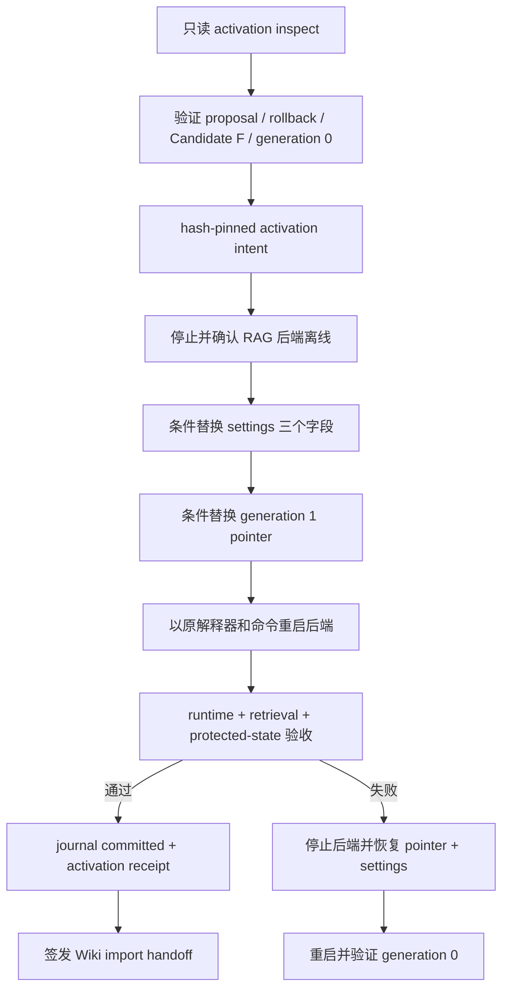

# Huiji RAG Candidate F Activation 设计

日期：2026-07-22  
状态：待用户审阅  
适用范围：把已通过审阅的 Candidate F 从隔离 shadow 运行态切换为 generation 1 active RAG，并在成功后向 Wiki 线路签发正式导入 handoff。

## 1. 背景与目标

当前正式 RAG 已建立 generation-0 authority：

```text
active pointer: data/processed/huiji/active_build.v1.json
pointer SHA-256: 95e682a6d3ae3000bc98dc3c616e7aaefea157d9c42128d15c5f764262862723
active tuple: generation=0 / build=dev / collection=text_child_bge_m3_v3
```

Candidate F 已完成 crawler-only 构建、shadow 向量化、隔离全链路、Wiki v3 compatibility、generation-0 bootstrap 和 rollback tuple。最终审阅 proposal 为：

```text
path=data/processed/huiji/activation/proposals/candidate-f-review-20260722c/activation_proposal.v1.json
file_sha256=fdeed5cddc1769805479d22aed49f88494d544736d6ce9ab64282a0679fb9fb8
allowed_for_activation_review=true
blockers=[]
next_gate=separate_user_approved_candidate_f_activation
```

用户已经批准受控 activation 方案。本设计必须：

1. 在 RAG 后端停写窗口内，把 Candidate F artifacts、Milvus collection 和配置切为一个一致的 generation 1 tuple；
2. 以 append-only journal 和条件替换处理 `settings.yaml` 与 pointer 不能跨文件原子提交的问题；
3. 失败时自动恢复 generation-0 pointer、原 settings 和旧后端运行态；
4. 证明 MySQL、MinIO、Wiki 数据、旧 Milvus collection 和 Candidate F collection 均未发生未授权修改；
5. 成功后签发 hash-pinned activation receipt，Wiki 线路只能在该 receipt 通过后正式导入 v3。

本设计不执行 Wiki MySQL 导入，不删除旧 collection，不重建向量，不修改 MinIO 对象。

## 2. 已批准方案与备选方案

采用方案：**停止 RAG 后端，事务化切换 settings + pointer，再重启验收；失败自动回滚两者。**

未采用方案：

- 让 pointer 绕过配置成为唯一 collection authority：会扩大 Retriever、vectorstore、runtime verifier 和运维配置的行为变化；
- 引入 Milvus alias：需要新增 alias 创建、切换、冲突和回滚生命周期，并改变当前物理 collection 契约；
- 把 Candidate F 覆盖写入旧 collection：破坏旧 collection 的直接回滚能力，不可接受。

## 3. 总体架构



模块边界：

```text
proposal/rollback validators
    -> activation inspector
    -> immutable intent + candidate collection manifest
    -> backend process controller
    -> settings/pointer transaction writer
    -> pointer-aware runtime verifier
    -> post-activation verifier
    -> activation receipt / Wiki handoff
```

Builder、Wiki importer、Retriever 和普通启动脚本不拥有 activation 写权限。

## 4. Activation Authority 模块

### 4.1 模块职责

在任何停机或配置写入前，冻结项目根、proposal、rollback tuple、generation-0 pointer、settings、Candidate F artifacts、shadow Milvus、Wiki receipts 和 protected state。

### 4.2 P0 当前必须满足

- `ACT-AUTH-P0-01`：activation ID 使用固定 grammar，事务根固定为 `data/processed/huiji/activation/transactions/{activation_id}/`，inspect 只能 create-new。
- `ACT-AUTH-P0-02`：只接受 proposal `candidate-f-review-20260722c` 的文件 SHA-256 `fdeed5cddc1769805479d22aed49f88494d544736d6ce9ab64282a0679fb9fb8`；必须满足 `allowed_for_activation_review=true`、`blockers=[]`、`rollback_tuple_created=true` 和固定 next gate。
- `ACT-AUTH-P0-03`：rollback tuple 必须 hash-pinned，并完整验证 previous pointer、settings、generation-0 collection manifest、deployment inventory、Milvus fingerprint、Wiki rollback receipt、restore entrypoint 和两个 MinIO scope。
- `ACT-AUTH-P0-04`：当前 pointer 必须仍精确等于 proposal 的 `expected_previous_pointer_sha256`，generation/build/collection 必须仍为 `0/dev/text_child_bge_m3_v3`。
- `ACT-AUTH-P0-05`：Candidate F build manifest 必须仍为 SHA-256 `293410a1da4909e6b07e3f755ba0b4ba10b7008152330d5e2f98bcf93a573b5f`，state 必须为 `ready_for_embedding`，全部 v3 artifact hash/size/schema/row count 必须重新验证。
- `ACT-AUTH-P0-06`：shadow evidence、full-chain evidence、Wiki compatibility receipt、Wiki rollback receipt 和 bootstrap receipt 必须按 proposal 引用逐项复核，不能只信任 proposal 内布尔值。
- `ACT-AUTH-P0-07`：实时 shadow collection 必须是 `reverse1999_rag/text_child_bge_m3_shadow_crawler_v3_20260721t051246z`，其 schema、row count、primary IDs 和 business fields 必须与 shadow/full-chain evidence 一致。
- `ACT-AUTH-P0-08`：inspect 必须重新采集 MySQL、两个 MinIO scope、active Milvus、shadow Milvus和受保护 artifacts；未知漂移立即阻断，不扩大 allowlist。

### 4.3 P1 可部分支持

- `ACT-AUTH-P1-01`：后续可允许同一 Candidate 的新 proposal ID，但必须重新签发全部 protected evidence；本轮只接受固定 proposal。

### 4.4 P2 未来演进

- `ACT-AUTH-P2-01`：远程审批服务、多人签名和定时 activation 不进入本轮。

## 5. Candidate Collection Manifest 模块

### 5.1 模块职责

生成 generation 1 runtime 可直接验证的 `evb.collection-manifest/v1`，把 Candidate F artifacts、embedding identity 与实时 Milvus 指纹绑定成一个不可变 tuple。

### 5.2 P0 当前必须满足

- `ACT-MANIFEST-P0-01`：manifest pin Candidate build manifest、parent、child、media v3、child BM25、media binding BM25 的规范路径、SHA-256、size、schema 和 row count。
- `ACT-MANIFEST-P0-02`：manifest pin shadow collection 的 database、collection、schema SHA-256、row count、primary field、primary IDs SHA-256 和 business fields SHA-256。
- `ACT-MANIFEST-P0-03`：embedding model 固定为 `BAAI/bge-m3`，config fingerprint 固定为 `17787be97e63ea53e3298748adf546ebc17d5456669481349eb8bb088b336099`；不得记录 API key。
- `ACT-MANIFEST-P0-04`：manifest pin Candidate build manifest、embedding handoff、shadow evidence和 full-chain evidence，任一引用漂移即阻断。
- `ACT-MANIFEST-P0-05`：manifest 使用 canonical UTF-8 JSON、排序键、LF 和尾随单换行，并有 sibling SHA-256 sidecar。
- `ACT-MANIFEST-P0-06`：generation 1 runtime reader 必须验证 pointer、collection manifest、Candidate build manifest、全部 runtime artifact 和实时 Milvus identity；无效时 fail closed。

### 5.3 P1/P2 边界

- `ACT-MANIFEST-P1-01`：可为后续 generation 复用通用 manifest builder，但本轮不得弱化 Candidate F 固定 authority。
- `ACT-MANIFEST-P2-01`：远程 manifest registry 与签名不进入本轮。

## 6. Settings 与 Pointer 事务模块

### 6.1 模块职责

在后端确认离线后，把 settings 和 pointer 从完整 generation-0 tuple 转换为完整 generation-1 tuple。跨文件一致性由停写窗口、hash-chain journal、条件替换和 recover/rollback 保证，而不是伪称文件系统支持多文件原子提交。

### 6.2 Settings 固定变更

`config/settings.yaml` 只允许以下三个 scalar 改变：

```text
vectorstore.collection_name:
  text_child_bge_m3_v3
  -> text_child_bge_m3_shadow_crawler_v3_20260721t051246z

huiji.text_collection_name:
  text_child_bge_m3_v3
  -> text_child_bge_m3_shadow_crawler_v3_20260721t051246z

huiji.build_version:
  dev
  -> crawler-v3-20260721t051246z
```

使用 `ruamel.yaml` round-trip parser 生成 candidate settings；除这三个值外，解析后的结构和原始注释、顺序、换行必须保持。inspect 在事务根 create-new 保存 `settings.before.yaml` 和 `settings.candidate.yaml`，分别记录 SHA-256；不得把环境变量或进程凭据写入文件。

### 6.3 Generation 1 Pointer

pointer 继续使用 `evb.active-build/v1` 全字段契约：

```text
generation=1
activation_epoch=1
build_version=crawler-v3-20260721t051246z
previous_build_version=dev
build_manifest_sha256=293410a1da4909e6b07e3f755ba0b4ba10b7008152330d5e2f98bcf93a573b5f
milvus_collection_name=text_child_bge_m3_shadow_crawler_v3_20260721t051246z
collection_schema_fingerprint=db9e13b98d7a1cf4116ba6647a16eb0e7daff0a77c558f66c9db2597038a6bc4
artifact_schema_version=evb.media-asset/v3
embedding_model_id=BAAI/bge-m3
embedding_config_fingerprint=17787be97e63ea53e3298748adf546ebc17d5456669481349eb8bb088b336099
activation_id={本次 activation ID}
```

`collection_manifest_sha256` 和 `deployment_inventory_sha256` 必须指向同一事务根内的 create-new evidence。

### 6.4 P0 当前必须满足

- `ACT-TXN-P0-01`：apply 要求 intent 路径、expected intent SHA-256、expected proposal/rollback/pointer/settings SHA-256 和精确确认文本；缺任一项不得构造 writer。
- `ACT-TXN-P0-02`：使用独立 OS advisory lock；generation-0 bootstrap lock 与 activation lock 不能同时被持有。
- `ACT-TXN-P0-03`：journal 状态固定为 `prepared -> backend_stopped -> settings_written -> pointer_written -> backend_started -> verified -> committed`，失败分支为 `verification_failed -> compensating -> rolled_back` 或 `conflict`。
- `ACT-TXN-P0-04`：停止后端前记录监听 PID、可执行文件、命令行和端口；仅允许控制 `127.0.0.1:8000` 上命令为 `python -m uvicorn backend.main:app` 的进程。身份不符即停止。
- `ACT-TXN-P0-05`：停止后端后必须确认 PID 退出且 8000 不再监听。短期会话内存按已批准的非持久化契约清空；Wiki API 与 RAG 共用该后端，因此同处停机窗口。Milvus、MinIO、MySQL 数据服务和前端进程不停止，Wiki 线路不执行导入。
- `ACT-TXN-P0-06`：settings 和 pointer 均先在各自目录写入同卷临时文件并 fsync；替换前再次核对目标当前 SHA。目标不等于冻结 before SHA 时进入 conflict，不覆盖外部状态。
- `ACT-TXN-P0-07`：写入顺序固定为 settings 后 pointer；因为后端离线，任何中间状态不得提供请求。journal 每一步落盘并 fsync。
- `ACT-TXN-P0-08`：重启必须使用 inspect 捕获并白名单验证的原解释器、工作目录、host、port 和 uvicorn app，不通过 shell 拼接命令，不显示环境变量。
- `ACT-TXN-P0-09`：进程中断只能由同 activation ID 和 intent SHA 执行 recover。recover 按 journal 与两个目标文件实际 SHA 决定续做、回滚或 conflict，不猜测“最新事务”。
- `ACT-TXN-P0-10`：提交后不得自动删除 generation-0 evidence、legacy artifacts、旧 Milvus collection、Candidate collection 或 rollback tuple。

### 6.5 P1/P2 边界

- `ACT-TXN-P1-01`：未来可增加请求 drain 和 active lease 等待；本轮使用明确后端停机窗口，不声称无中断。
- `ACT-TXN-P2-01`：Milvus alias、蓝绿多后端、跨主机锁和零停机切换不进入本轮。

## 7. Pointer-aware Runtime Verifier 模块

### 7.1 模块职责

保持 generation 0 的 installed provenance 验证，同时让 generation 1 从 pointer 固定的 Candidate collection manifest 验证 active tuple。legacy provenance 文件仍是 generation-0 authority，不被覆盖或改写。

### 7.2 P0 当前必须满足

- `ACT-RUNTIME-P0-01`：pointer 缺失时只允许现有 legacy fallback；generation 0 使用 bootstrap manifest + installed provenance；generation 1 使用 Candidate collection manifest。三条路径明确分支，不互相猜测。
- `ACT-RUNTIME-P0-02`：generation 1 verifier 必须要求 settings 的 build 和两个 collection 字段与 pointer 完全一致。
- `ACT-RUNTIME-P0-03`：generation 1 verifier 逐文件验证 Candidate runtime artifacts 和 BM25，并验证实时 Milvus 指纹；不得读取 legacy provenance 作为 Candidate 数据基线。
- `ACT-RUNTIME-P0-04`：`config/provenance/huiji-dev.v1.json` 在 activation 前后字节不变；它只用于 rollback 后 generation 0 验证。
- `ACT-RUNTIME-P0-05`：RAG runtime、backend startup gate、Wiki snapshot reader 和离线 verifier 使用同一 strict pointer validator；invalid pointer 不回退。
- `ACT-RUNTIME-P0-06`：Retriever、EntityLexicon、media registry 和 voice pagination 必须从同一个 resolved snapshot 获得 Candidate build/collection/artifacts，禁止混用 dev 文件与 Candidate collection。

### 7.3 P1/P2 边界

- `ACT-RUNTIME-P1-01`：后续可把 legacy provenance 统一迁移到 collection manifest registry；本轮保留 generation 0 原路径。
- `ACT-RUNTIME-P2-01`：在线多 generation 并行读取不进入本轮。

## 8. Backend Process Controller 模块

### 8.1 模块职责

提供仅供 activation CLI 使用的 Windows 本地进程控制，确保双文件切换期间没有 RAG 请求读取中间状态。

### 8.2 P0 当前必须满足

- `ACT-PROC-P0-01`：inspect 只读识别监听 PID 和 command line，不发送停止信号；apply 才能停止已冻结且身份一致的 PID。
- `ACT-PROC-P0-02`：controller 只停止已冻结的 FastAPI PID，不停止前端、Milvus、MinIO、MySQL、etcd 或其他 Python 进程；共用 FastAPI 的 Wiki API 会随该 PID 暂停，但不得调用 Wiki importer 或修改 Wiki MySQL。
- `ACT-PROC-P0-03`：停止和启动均有明确超时；超时进入 failure/conflict，不继续写配置或伪造健康通过。
- `ACT-PROC-P0-04`：新后端必须在隐藏窗口启动，记录新 PID，但 evidence 只记录解释器路径/hash和参数，不记录环境变量值。
- `ACT-PROC-P0-05`：若 apply 启动的新 PID 在验收失败，controller 只能停止这个 PID；不得按进程名批量终止。
- `ACT-PROC-P0-06`：成功后新后端继续运行，activation CLI 退出不终止它。

### 8.3 P1/P2 边界

- `ACT-PROC-P1-01`：可增加本地维护页或 drain API；不作为本轮成功条件。
- `ACT-PROC-P2-01`：Windows Service、systemd、容器编排和负载均衡摘流不进入本轮。

## 9. 验证、补偿与 Receipt 模块

### 9.1 成功验收

Candidate 后端启动后必须依次通过：

1. strict pointer、settings 和 collection manifest 验证；
2. runtime verifier；
3. `/health` 返回 `status=ok`、`provenance_status=pass`、`vectorstore_loaded=true`、`doc_count=14630`；
4. representative read-only retrieval smoke 使用 Candidate F collection 且返回 crawler-only sources；
5. voice pagination cursor build identity 为 Candidate F；
6. Wiki health 继续 ready，但未执行正式 v3 import；
7. MySQL 与两个 MinIO scope零变化；
8. generation-0 collection 和 Candidate collection 指纹均与切换前一致；
9. settings 只有批准的三个字段变化，legacy provenance 和 Candidate artifacts 不变。

### 9.2 P0 当前必须满足

- `ACT-VERIFY-P0-01`：成功 receipt 包含 intent、proposal、rollback tuple、before/after pointer、before/after settings、collection manifest、journal、process identity、health、retrieval smoke 和 protected compare 的 hash-pinned refs。
- `ACT-VERIFY-P0-02`：P0 matrix 必须逐项记录本 Spec 的全部 P0 ID；静态计数不能替代真实 evidence。
- `ACT-VERIFY-P0-03`：任一 post-write 门禁失败时，先停止本次启动的新后端，再按条件 SHA 恢复 generation-0 pointer 和 `settings.before.yaml`。
- `ACT-VERIFY-P0-04`：补偿后必须重启旧后端并通过 generation-0 runtime、health和 retrieval smoke；只有旧链路恢复后 journal 才能 `rolled_back`。
- `ACT-VERIFY-P0-05`：若任一目标文件不等于本 operation 的预期 before/after SHA，进入 `conflict`，不覆盖或删除未知状态，并保持后端停止以避免混合 tuple 对外服务。
- `ACT-VERIFY-P0-06`：passing receipt、rollback receipt 和 failure/conflict evidence 互斥；只有 `committed` journal 能签发 passing receipt。
- `ACT-VERIFY-P0-07`：最终 protected compare 只允许本 activation 的 hash-pinned evidence、settings 三字段变更和 active pointer 替换；业务存储差异为零。

### 9.3 P1/P2 边界

- `ACT-VERIFY-P1-01`：后续可增加持续观察窗口和性能阈值；本轮至少执行真实 health 与代表性检索。
- `ACT-VERIFY-P2-01`：自动流量回滚和长期 SLO controller 不进入本轮。

## 10. Wiki Handoff 模块

### 10.1 模块职责

RAG activation 成功后向 Wiki 线路提供不可变的正式导入 authority；activation 本身不调用 Wiki importer。

### 10.2 P0 当前必须满足

- `ACT-WIKI-P0-01`：只有 passing activation receipt 才生成 `wiki_import_handoff.v1.json`；failure、rolled_back 或 conflict 均不得生成。
- `ACT-WIKI-P0-02`：handoff pin active pointer、Candidate build manifest、media v3 manifest、Wiki compatibility receipt、Wiki pre-import rollback receipt 和 activation receipt。
- `ACT-WIKI-P0-03`：handoff 明确 active generation/build/collection 和 `wiki_import_allowed=true`，并声明 Wiki 仍需执行自己的事务化 MySQL 导入及 rollback gate。
- `ACT-WIKI-P0-04`：RAG 不修改 Wiki MySQL 表，不调用 import/restore，不把 Wiki 导入成功预写进 activation receipt。
- `ACT-WIKI-P0-05`：Wiki 导入失败时，先由 Wiki 使用其 rollback receipt 恢复 MySQL；是否回滚 RAG generation 1 必须作为独立决定，不能由 Wiki importer直接改 pointer/settings。

### 10.3 P1/P2 边界

- `ACT-WIKI-P1-01`：可增加 Wiki 完成后的双向 acknowledgement receipt；不阻塞本次 handoff 签发。
- `ACT-WIKI-P2-01`：跨系统两阶段提交不进入本轮。

## 11. 跨模块数据流与文件布局

```text
data/processed/huiji/activation/transactions/{activation_id}/
  activation_intent.v1.json
  activation_intent.v1.json.sha256
  collection_manifest.v1.json
  collection_manifest.v1.json.sha256
  deployment_inventory.v1.json
  deployment_inventory.v1.json.sha256
  settings.before.yaml
  settings.before.yaml.sha256
  settings.candidate.yaml
  settings.candidate.yaml.sha256
  protected_state.before.v1.json
  protected_state.before.v1.json.sha256
  activation_journal.v1.jsonl
  activation_journal.v1.jsonl.sha256
  protected_state.after.v1.json
  protected_state.after.v1.json.sha256
  activation_receipt.v1.json
  activation_receipt.v1.json.sha256
  wiki_import_handoff.v1.json
  wiki_import_handoff.v1.json.sha256
  activation_failure.v1.json
  activation_failure.v1.json.sha256
```

passing receipt 与 failure/conflict evidence 互斥。事务文件全部 create-new；settings 与 canonical pointer 是仅有的条件替换目标。

## 12. 错误处理原则

- authority、hash、schema、path、proposal、rollback 或 receipt 不一致：停在 inspect，不停后端。
- backend PID/command/port 不符合白名单：停止，不控制该进程。
- backend 无法停止：停止，不写 settings/pointer。
- settings 写入成功但 pointer 未写入：保持后端离线，由 recover 续做或回滚。
- pointer 写入成功但后端无法启动：自动回滚 pointer/settings 并恢复旧后端。
- Candidate health/retrieval/protected compare 失败：自动回滚。
- 发现未知 settings/pointer SHA：进入 conflict，不覆盖；后端保持离线。
- 回滚后 generation-0 验证失败：保持后端离线，保留全部 evidence，扩大诊断范围。
- 凭据出现在日志或 evidence：本次失败，报告位置但不回显内容。

## 13. 测试与真实验收方向

自动化测试必须覆盖：

- proposal/rollback/Candidate/collection manifest 全部 hash 和 tuple 验证；
- ruamel round-trip settings 只改变三个字段；
- generation 1 pointer strict schema 和 generation 0 回归；
- pointer-aware verifier 的 legacy/generation-0/generation-1 三分支；
- backend PID 白名单、停止超时、启动超时和仅终止本次 PID；
- journal 全状态、每个 crash point 的 recover、settings-only/pointer-only 中间状态；
- 条件替换冲突不覆盖；
- post-write 任一门禁失败自动回滚；
- rollback 后旧 runtime/health/retrieval 恢复；
- passing/failure/conflict evidence 互斥；
- Wiki handoff 只在 committed 后生成；
- mutation spies 证明没有 Milvus insert/delete/drop、MinIO write/delete、MySQL DDL/DML 或 Wiki import/restore。

真实验收必须：

1. 先完成只读 inspect 和 hash-pinned intent；
2. 记录停机前 generation-0 health、retrieval 和 protected state；
3. 执行一次受控停机与 generation 1 切换；
4. 通过第 9.1 节全部验收；
5. 证明旧 collection、Candidate collection、MySQL、MinIO、Wiki 和 artifacts 无未授权变化；
6. 执行 committed recover 的幂等复核；
7. 生成 activation receipt 与 Wiki handoff；
8. 停止，不执行 Wiki 正式导入。

## 14. 与既有方案的关系

- 继承 generation-0 Spec 的 strict pointer、manifest、journal、CAS/条件写和 protected-state 原则。
- 消费 `candidate-f-review-20260722c` proposal 与 rollback tuple，不覆盖或重写它们。
- 保留 Wiki media v3 compatibility 和 pre-import rollback authority。
- 保留旧 `dev` artifacts、legacy provenance 和 `text_child_bge_m3_v3` 用于直接回滚。
- 修订 generation-0 Spec 的 out-of-scope 边界：本设计只实现其已批准的下一阶段，不改变 bootstrap 历史证据。

## 15. Deferred / Out of Scope

- Wiki v3 正式 MySQL 导入和页面验收；
- 重新向量化、collection rename/alias/drop/delete；
- MinIO 上传、删除、迁移或 orphan 清理；
- 修改 `D:\1999Wiki_Backup`；
- 零停机、多后端 ack、自动流量回滚；
- 持久化短期会话内存；
- Wiki importer直接控制 RAG rollback。

## 16. 完成判定

本设计只有在以下条件全部成立时完成：

1. 所有 `ACT-*-P0-*` 均有实现、自动测试和真实 evidence；
2. active pointer、settings、Candidate artifacts 和 active Milvus 组成完整 generation 1 tuple；
3. 新后端 runtime、health、retrieval 和 voice pagination 全部通过；
4. MySQL、MinIO、Wiki、旧/Candidate Milvus 和不可变 artifacts 无未授权变化；
5. journal 为 `committed`，activation receipt 与 Wiki handoff 均 hash-pinned；
6. generation-0 rollback 仍可执行且旧 collection 未删除；
7. Wiki v3 正式导入仍未执行。

仅修改 settings、仅替换 pointer、仅启动后端、仅通过单测或仅生成 handoff，均不能单独宣称 Candidate F activation 完成。
