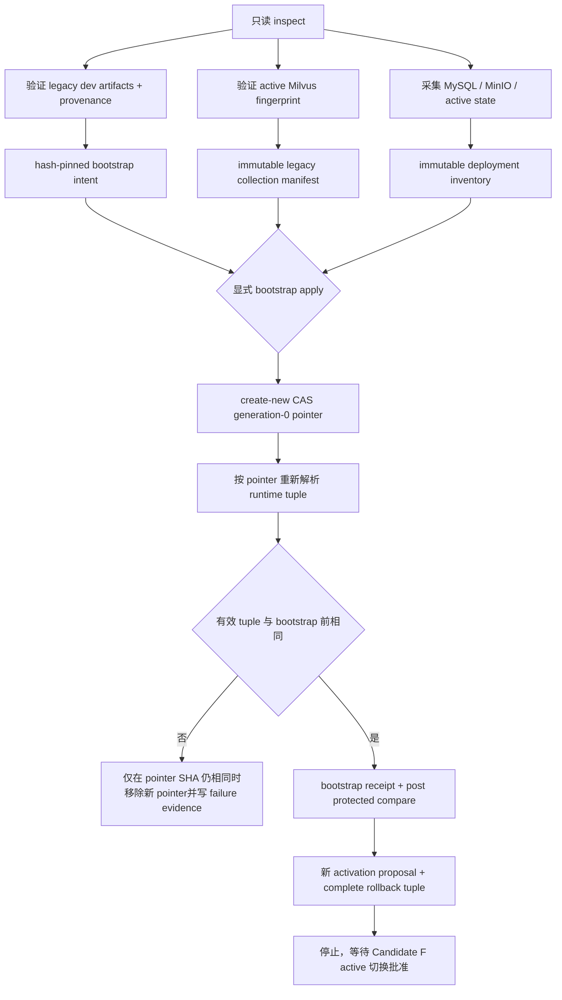

# Huiji RAG Generation-0 Bootstrap 设计

日期：2026-07-22  
状态：待用户审阅  
适用范围：在不切换 Candidate F、不改变有效 RAG 数据 tuple 的前提下，为当前 legacy `dev` 运行态建立可回滚的 generation-0 active pointer，并重新生成 activation proposal 与 rollback tuple。

## 1. 背景与目标

Candidate F 已完成 crawler-only Builder、可复现性、shadow Milvus、隔离全链路和保护面验收。Wiki 已交付正式 pre-import rollback receipt：

```text
path=eval/huiji_wiki_rollback/legacy-dev-pre-candidate-f-20260721b/wiki_pre_import_rollback_receipt.v1.json
file_sha256=e245865dd4d790b1b85574ff80d526ca663391578e7afdfa1d096e1977d031c6
```

RAG 已严格验证该 Receipt 的 canonical bytes、内部 self-hash、全部 sidecar、33/33 P0 matrix、MySQL dump 和 restore entrypoint，并生成新的 proposal：

```text
data/processed/huiji/activation/proposals/candidate-f-review-20260722b/activation_proposal.v1.json
sha256=08ef70fcb75010fd7e9b0b77c3f8e7ae14f307b6aad3bf724ecd647b48b5728c
blockers=[active_pointer_not_bootstrapped]
```

当前唯一缺口是 canonical active pointer 尚不存在。按照既有 `ACTIVATION-P0-05`，Candidate F 激活流程不得隐式创建 generation 0，也不得把“pointer 不存在”伪装成完整 previous tuple。

本设计必须完成：

1. 独立验证当前 legacy `dev + text_child_bge_m3_v3` 的完整文件、Milvus、embedding 和配置身份；
2. 生成不可变 legacy collection manifest 与 deployment inventory；
3. 以 create-new CAS 语义创建 generation-0 pointer；
4. 证明 pointer 创建前后有效 RAG 数据 tuple 等价；
5. 重新生成包含完整 previous tuple、Wiki Receipt 和保护面引用的 rollback tuple；
6. 生成 `allowed_for_activation_review=true` 的新 proposal；
7. 停在 Candidate F active 切换之前，继续等待用户单独批准。

本设计不是 Candidate F activation 设计。它不修改 active collection、active artifacts、settings、installed provenance、MySQL、MinIO 或 Wiki 业务数据。

## 2. 当前 Authority 与已知漂移

执行时必须重新采集，以下值只是当前已验证 authority，不得用代码常量替代动态检查：

| Authority | 当前值 |
|---|---|
| Canonical pointer | `data/processed/huiji/active_build.v1.json`，当前不存在 |
| Configured build | `dev` |
| Configured Milvus | `reverse1999_rag/text_child_bge_m3_v3` |
| Legacy build manifest | `data/processed/huiji/dev/build_manifest.json`, SHA-256 `ad886077e2aff90350480c9925686693121af9c643796131c361fde6efeed231` |
| Installed provenance | `config/provenance/huiji-dev.v1.json`, SHA-256 `dafd3a7b309fc96fe784945d4b5f143f3e8aec2e93a6856151e3a52fb4e8e6a4` |
| Active Milvus rows | `16010` |
| Active Milvus schema SHA-256 | `db9e13b98d7a1cf4116ba6647a16eb0e7daff0a77c558f66c9db2597038a6bc4` |
| Active primary IDs SHA-256 | `35767849daf684742b66453a953837c85f93a9e8744d9c10516de7e3651ccb35` |
| Active business fields SHA-256 | `89dd551acb78f7bd3b55f7b3f284c85e8253d6f02dfb2bd8b4671d35e1c5208b` |
| Embedding model | `BAAI/bge-m3` |
| Embedding config SHA-256 | `17787be97e63ea53e3298748adf546ebc17d5456669481349eb8bb088b336099` |

Wiki rollback 文档和 Receipt 的历史诊断字段使用了：

```text
data/processed/huiji/activation/active_build.v1.json
```

该路径不是 RAG authority。RAG runtime、Builder Spec 与当前配置共同确定的唯一 canonical 路径是：

```text
data/processed/huiji/active_build.v1.json
```

Wiki Receipt 只作为 MySQL 回滚 authority 使用；其中“错误路径当时不存在”的事实不授权 RAG 在该错误路径创建、读取或兼容 pointer。

## 3. 总体架构



模块依赖固定为：

```text
legacy runtime/provenance readers
    -> bootstrap inspector
    -> immutable intent/collection/deployment evidence
    -> pointer CAS writer
    -> post-bootstrap verifier
    -> activation proposal/rollback tuple builder
```

Builder、Retriever 和 Wiki importer 不拥有 pointer 写权限。bootstrap writer 是独立 activation 模块，不得放入 `HuijiCorpusBuilder` 或 `EvbBuilder`。

## 4. Authority 与输入冻结模块

**职责**：在任何 pointer 写入前固定唯一项目根、canonical pointer、legacy build、active Milvus、配置、provenance、Wiki Receipt 与保护面。

**输入**：当前配置、legacy artifacts、installed provenance、Milvus、已通过的 protected-state evidence、Wiki rollback Receipt。

**输出**：hash-pinned `bootstrap_intent.v1.json`，不创建 pointer。

### 4.1 P0 当前必须满足

- `BOOT-AUTH-P0-01`：`bootstrap_id` 必须匹配 `^[a-z0-9][a-z0-9_-]{0,63}$`；输出根固定为 `data/processed/huiji/activation/bootstrap/{bootstrap_id}/`，必须由 inspect 在原本不存在时 create-new 且位于项目根内。apply/recover 只能消费该 inspect 根，并只能 create-new 写入契约规定的后续文件。
- `BOOT-AUTH-P0-02`：canonical pointer 只能是 `data/processed/huiji/active_build.v1.json`。错误历史路径、环境变量覆盖、CLI 任意路径和 symlink/junction 逃逸必须拒绝。
- `BOOT-AUTH-P0-03`：inspect 必须证明 canonical pointer 不存在、没有未终态 activation/bootstrap journal、configured build 为 `dev`，且 `vectorstore.collection_name == huiji.text_collection_name == text_child_bge_m3_v3`。
- `BOOT-AUTH-P0-04`：必须调用 installed runtime verifier，逐文件复核 parent、child、media、child BM25、media BM25 与 `config/provenance/huiji-dev.v1.json`；不能仅信任旧 `build_manifest.json` 的计数。
- `BOOT-AUTH-P0-05`：必须调用正式 Wiki `validate_passing_receipt()`，复核 Receipt 文件 SHA-256、`status=passed`、`test_only=false`、内部 hash、dump、全部 sidecar、33/33 matrix 和 restore entrypoint。generic JSON `status` 检查不能替代该验证器。
- `BOOT-AUTH-P0-06`：inspect 必须重新采集 active Milvus、MySQL 与两个 MinIO scope；只允许在 before inventory 中逐项记录了规范路径、SHA-256、size 和来源证据的 Candidate F/G、既有 proposal 与 shadow additions。任一原文件改变、未知对象变化或业务库漂移均阻断 bootstrap。

### 4.2 P1 可选能力

- `BOOT-AUTH-P1-01`：未来可支持对已存在且完全匹配的 generation-0 pointer 执行只读 `inspect-existing`，但本轮 apply 仍必须拒绝覆盖。

### 4.3 P2 未来演进

- `BOOT-AUTH-P2-01`：远程 controller、分布式锁和多实例 authority discovery 不进入本轮。

## 5. Legacy Collection Manifest 模块

**职责**：补足旧 `dev/build_manifest.json` 不包含 artifact hashes、embedding identity 和完整 Milvus fingerprint 的缺口，避免创建 pointer 后降低现有 provenance 校验强度。

**输入**：installed provenance、legacy artifact 实际字节、active Milvus fingerprint、embedding 配置与旧 build manifest。

**输出**：`evb.collection-manifest/v1`，固定写入 bootstrap evidence 根：

```text
data/processed/huiji/activation/bootstrap/{bootstrap_id}/collection_manifest.v1.json
```

generation-0 resolver 通过 pointer 的 `activation_id` 推导该路径；不得扫描“最新目录”。

### 5.1 P0 当前必须满足

- `BOOT-MANIFEST-P0-01`：manifest 必须 pin legacy build manifest、installed provenance 及五份 runtime artifact 的规范相对路径、SHA-256 和 size；每个值必须与磁盘重新计算结果一致。
- `BOOT-MANIFEST-P0-02`：manifest 必须记录 Milvus database、collection、schema SHA-256、row count、primary field、primary ID count/hash 和 business fields SHA-256，并与 installed provenance 及实时 collection 三方一致。
- `BOOT-MANIFEST-P0-03`：manifest 必须记录 embedding provider、model ID 和不含密钥的 config fingerprint。API key、endpoint token 或环境变量值不得进入 manifest、日志或异常。
- `BOOT-MANIFEST-P0-04`：manifest 必须使用 canonical UTF-8、LF、排序键和尾随单换行。内容身份字段不含采集时间；时间只进入 intent/receipt。
- `BOOT-MANIFEST-P0-05`：manifest schema 固定为 `evb.collection-manifest/v1`，`artifact_schema_version=evb.media-asset/v1_legacy`，`build_version=dev`。legacy manifest 不得声称 v2/v3 capability。
- `BOOT-MANIFEST-P0-06`：runtime 进入 generation-0 pointer 分支时必须验证该 manifest SHA-256、provenance SHA-256、五份 artifact hashes 与实时/已验证 collection identity；不得退化为“文件存在即可”。

### 5.2 P1/P2 边界

- `BOOT-MANIFEST-P1-01`：后续 Candidate F activation 可把现有 shadow evidence 转换为同 schema 的 v3 collection manifest；本轮只冻结接口，不生成 Candidate F active manifest。
- `BOOT-MANIFEST-P2-01`：manifest registry、远程签名和硬件密钥签名属于未来能力。

## 6. Generation-0 Pointer 契约模块

**职责**：冻结唯一 pointer schema、字段和 generation-0 语义，使 RAG 与 Wiki reader 不再各自维护宽松或冲突的字段集。

### 6.1 Pointer 固定字段

新写入的 `evb.active-build/v1` 只允许以下字段。表中的动态值不是自由输入，必须从本次 inspect 生成并由 apply 重新验证的 evidence 取得：

| 字段 | generation-0 约束 |
|---|---|
| `schema_version` | 精确等于 `evb.active-build/v1` |
| `generation` | 整数 `0`，布尔值不合格 |
| `build_version` | 精确等于 `dev` |
| `previous_build_version` | JSON `null` |
| `build_manifest_sha256` | 精确等于当前 `dev/build_manifest.json` 的 `ad886077e2aff90350480c9925686693121af9c643796131c361fde6efeed231`；执行时必须重算并一致 |
| `milvus_collection_name` | 精确等于 `text_child_bge_m3_v3` |
| `collection_schema_fingerprint` | 精确等于实时 active collection 的 `db9e13b98d7a1cf4116ba6647a16eb0e7daff0a77c558f66c9db2597038a6bc4`；执行时必须重算并一致 |
| `collection_manifest_sha256` | 本次 `collection_manifest.v1.json` canonical bytes 的 64 位小写 SHA-256 |
| `embedding_model_id` | 精确等于 `BAAI/bge-m3` |
| `embedding_config_fingerprint` | 精确等于 `17787be97e63ea53e3298748adf546ebc17d5456669481349eb8bb088b336099`；执行时必须从无密钥配置重算并一致 |
| `artifact_schema_version` | 精确等于 `evb.media-asset/v1_legacy` |
| `deployment_inventory_sha256` | 本次 `deployment_inventory.v1.json` canonical bytes 的 64 位小写 SHA-256 |
| `activation_epoch` | 整数 `0`，布尔值不合格 |
| `activation_id` | 精确等于本次 `bootstrap_id`，并满足第 4 节 ID grammar |
| `activated_at_utc` | 带 `Z` 的规范 RFC3339 UTC 时间，由 apply 在 pointer bytes 冻结时生成 |

`activation_id` 同时唯一定位 `data/processed/huiji/activation/bootstrap/{bootstrap_id}/collection_manifest.v1.json` 和同目录的 `deployment_inventory.v1.json`；reader 不扫描目录，也不接受 pointer 内路径覆盖。

`collection_name`、camelCase aliases、任意路径字段和未知扩展字段不得由本轮 writer 产生。当前 RAG reader 中的 `collection_name` 宽松字段必须统一为 `milvus_collection_name`；Wiki reader 复用同一个纯 pointer contract validator。

### 6.2 P0 当前必须满足

- `BOOT-POINTER-P0-01`：RAG 提供一个无 I/O 副作用的 shared pointer validator，严格检查字段集合、类型、ID grammar、SHA-256、RFC3339 UTC、generation/epoch 与 artifact capability；RAG 和 Wiki reader 均调用该 validator。
- `BOOT-POINTER-P0-02`：generation 0 只能表示当前 legacy `dev`，必须满足 `generation=activation_epoch=0`、`previous_build_version=null` 和 `artifact_schema_version=evb.media-asset/v1_legacy`。
- `BOOT-POINTER-P0-03`：`build_manifest_sha256` pin 旧 build manifest；`collection_manifest_sha256` pin 第 5 节完整 manifest。两者用途不得互换。
- `BOOT-POINTER-P0-04`：`milvus_collection_name` 必须同时等于配置、installed provenance、collection manifest 和实时 collection；不得依赖配置 fallback 补空字段。
- `BOOT-POINTER-P0-05`：`deployment_inventory_sha256` 必须 pin 同一 bootstrap 根中的 `deployment_inventory.v1.json`，包含项目配置 hash、运行服务身份、active collection、legacy snapshot tuple 和 protected-state refs。
- `BOOT-POINTER-P0-06`：pointer bytes 使用 canonical JSON。读取方必须拒绝缺字段、额外字段、大小写 SHA、重复键、非整数 generation/epoch、未知 schema/capability 和 manifest/path mismatch。
- `BOOT-POINTER-P0-07`：pointer 创建后，pointer 缺失 fallback 对该进程之后的新 snapshot resolution 永久禁用；pointer 无效时 fail closed，不能静默回退 `dev`。
- `BOOT-POINTER-P0-08`：现有已加载请求可以完成原 tuple；bootstrap 不重启服务、不切路由。新建 runtime snapshot 必须从 generation-0 pointer 得到与原 legacy 相同的有效业务 tuple。

### 6.3 P1/P2 边界

- `BOOT-POINTER-P1-01`：未来 schema migration 可增加显式版本，不允许在 `v1` 中悄悄接受新字段。
- `BOOT-POINTER-P2-01`：多节点签名 pointer 和远程 consensus 不进入本轮。

## 7. Bootstrap Apply 与原子性模块

**职责**：在显式授权、状态无漂移和 pointer 仍不存在时，一次性创建 generation-0 pointer；失败时不覆盖未知状态。

### 7.1 P0 当前必须满足

- `BOOT-APPLY-P0-01`：CLI 分为 `inspect` 与 `apply`。`inspect` 只生成 intent/manifest/inventory；`apply` 必须提供 intent 路径、expected intent SHA-256、expected pointer absence 和精确确认文本 `BOOTSTRAP HUIJI LEGACY DEV GENERATION 0`。
- `BOOT-APPLY-P0-02`：apply 在任何 writer 构造前重新验证 intent、collection manifest、deployment inventory、Wiki Receipt、settings、provenance、legacy artifacts、Milvus 和 protected state。intent 后发生任一漂移即停止。
- `BOOT-APPLY-P0-03`：使用固定 lock 文件上的 OS 级独占 advisory lock。文件存在本身不代表持锁；进程退出后锁必须由 OS 释放。无法取得锁时只诊断当前 owner 并停止，不删除外部 lock 文件。lock 内容记录 operation ID、PID 与开始时间，但不得包含凭据。
- `BOOT-APPLY-P0-04`：pointer 使用同目录完整写入并 fsync 的临时文件，再通过同卷 hard-link create-new CAS 建立目标名。目标已存在或文件系统不支持无覆盖 CAS 时停止，不得退化为 `replace` 或覆盖写。
- `BOOT-APPLY-P0-05`：pointer 写入前不得修改 settings、installed provenance、legacy artifacts、Milvus、MinIO、MySQL、Wiki 表或服务进程。
- `BOOT-APPLY-P0-06`：pointer 创建后立即从新 reader 解析 generation-0 snapshot，复核 pointer/manifest/provenance/collection，并运行 installed runtime verifier 和代表性 read-only retrieval smoke。
- `BOOT-APPLY-P0-07`：若 post-write 验证失败，只能在目标 pointer SHA-256 仍等于本次刚写入字节、generation 仍为 0、journal 最新状态允许补偿且尚无 `committed` 事件时移除该 pointer；否则停止并追加 `conflict` 事件，不得删除或覆盖外部状态。
- `BOOT-APPLY-P0-08`：成功、失败和中断路径都必须清理本次临时文件并释放本进程的 advisory lock；journal 与诊断 evidence 保留。未知 lock owner、未知 pointer 和不完整外部 transaction 保留供恢复命令判定。
- `BOOT-APPLY-P0-09`：apply 必须维护 append-only `bootstrap_journal.v1.jsonl`。每个 canonical event 包含严格递增 sequence、前一事件 SHA-256、intent SHA-256、expected pointer SHA-256、状态和 UTC 时间；状态只允许 `prepared -> pointer_written -> verified -> committed`，或从未终态进入 `verification_failed -> compensating -> rolled_back` / `conflict`。
- `BOOT-APPLY-P0-10`：进程中断后只能以同一 `bootstrap_id`、同一 intent SHA-256 和同一 expected pointer SHA-256 执行 `recover`。若 pointer 与 journal 一致则续做验证和 Receipt；若 pointer 缺失且 journal 尚未记录 `pointer_written`，可续做 CAS；其余组合进入 `conflict`。存在未终态 journal 时禁止新 bootstrap 和 activation proposal。

### 7.2 P1/P2 边界

- `BOOT-APPLY-P1-01`：Windows NTFS 以外文件系统可在未来增加经过证明的原子 create-new backend；本轮无证明即阻断。
- `BOOT-APPLY-P2-01`：跨主机分布式 CAS 不进入本轮。

## 8. 前后等价与保护面验收模块

**职责**：证明 bootstrap 只改变 authority 表达，不改变当前提供服务的数据。

### 8.1 有效 tuple 定义

`effective_runtime_tuple_sha256` 不包含 `source_mode`、pointer SHA 或 receipt 时间，只覆盖：

```text
artifact capability
artifact schema version
build version
parent/child/media/child-BM25/media-BM25 SHA-256
Milvus database + collection + schema + row count + primary IDs + business fields
embedding model ID + embedding config fingerprint
```

bootstrap 前由 installed provenance 构造，bootstrap 后由 pointer + collection manifest 构造。两者必须字节级相等。

### 8.2 P0 当前必须满足

- `BOOT-VERIFY-P0-01`：pre/post `effective_runtime_tuple_sha256` 必须相等；不能因 `source_mode` 从 `installed_legacy` 变为 `active_pointer` 而放宽业务等价检查。
- `BOOT-VERIFY-P0-02`：active Milvus row count、schema、primary IDs 和 business fields 必须前后相等；shadow collection 仅只读存在，不参与 generation-0 tuple。
- `BOOT-VERIFY-P0-03`：MySQL 所有表摘要与两个 MinIO scope 必须前后完全相等；这些业务存储不接受 bootstrap 差异。项目文件保护面对比只允许本次 hash-pinned bootstrap evidence、canonical pointer，以及 before inventory 已逐项解释并固定的既有 additions。
- `BOOT-VERIFY-P0-04`：`config/settings.yaml`、`config/provenance/huiji-dev.v1.json` 和五份 legacy artifacts 的文件 SHA-256 必须前后相等。
- `BOOT-VERIFY-P0-05`：RAG health/runtime verifier 保持 passing；新 snapshot 的 build、collection、artifact hashes 与旧 snapshot一致。
- `BOOT-VERIFY-P0-06`：现有 Wiki MySQL 页面继续可读。旧 legacy Wiki import snapshot 因 pointer 出现而变为 stale 是预期状态，不触发导入，也不能被误报为页面数据损坏。
- `BOOT-VERIFY-P0-07`：成功后生成 hash-pinned `bootstrap_receipt.v1.json`，包含 intent、pointer bytes/SHA、collection manifest、deployment inventory、pre/post tuple、protected compare、测试和补偿状态；失败只生成不同 schema 的 failure evidence。

### 8.3 P1/P2 边界

- `BOOT-VERIFY-P1-01`：未来可增加线上请求 epoch ack；本轮没有路由切换，不伪造多实例 commit ack。
- `BOOT-VERIFY-P2-01`：持续流量镜像与自动性能回归属于 Candidate activation 阶段。

## 9. Proposal 与 Rollback Tuple 模块

**职责**：消费成功 bootstrap receipt 和正式 Wiki rollback Receipt，生成可供后续 activation 审阅的完整 previous tuple；仍不执行 active 切换。

### 9.1 P0 当前必须满足

- `BOOT-PROPOSAL-P0-01`：proposal builder 必须严格验证 bootstrap receipt schema/status/file SHA、pointer SHA、effective tuple 和 protected compare；只检查“参数存在”不合格。
- `BOOT-PROPOSAL-P0-02`：proposal builder 必须调用 Wiki `validate_passing_receipt()`，并明确要求本次交付的 `20260721b` 文件 SHA；不得消费废弃的 `20260721a`。
- `BOOT-PROPOSAL-P0-03`：新 proposal 使用唯一 create-new ID，引用 Candidate F manifest、shadow、full-chain、Wiki compatibility、Wiki rollback、bootstrap receipt 和 7 月 22 日后的 fresh protected-state evidence。
- `BOOT-PROPOSAL-P0-04`：rollback tuple 必须包含 previous pointer 的规范路径、完整 bytes SHA-256 和 payload，以及 previous build manifest、collection manifest、installed provenance、settings、deployment inventory和 active Milvus fingerprint引用。
- `BOOT-PROPOSAL-P0-05`：rollback tuple 必须包含 Wiki rollback Receipt、restore entrypoint pin和两个 MinIO scope 的只读 inventory refs；不得复制 dump 内容或凭据。
- `BOOT-PROPOSAL-P0-06`：只有全部引用存在且 hash/status/tuple 一致时，proposal 才能 `allowed_for_activation_review=true` 且 `rollback_tuple_created=true`；缺任一项时输出确定性 blocker，不生成残缺 tuple。
- `BOOT-PROPOSAL-P0-07`：成功 proposal 的 `next_gate` 固定为 `separate_user_approved_candidate_f_activation`。生成 proposal/rollback tuple 不修改 pointer、settings、provenance、Milvus、MySQL、MinIO 或 Wiki。

### 9.2 P1/P2 边界

- `BOOT-PROPOSAL-P1-01`：后续 activation transaction 可消费该 rollback tuple，但必须在单独 Spec、Plan 和用户批准下实现。
- `BOOT-PROPOSAL-P2-01`：自动批准、定时切换和无人值守回滚不进入本轮。

## 10. 数据流与文件布局

```text
data/processed/huiji/activation/bootstrap/{bootstrap_id}/
  bootstrap_intent.v1.json
  bootstrap_intent.v1.json.sha256
  bootstrap_journal.v1.jsonl
  bootstrap_journal.v1.jsonl.sha256       # 仅终态后生成
  collection_manifest.v1.json
  collection_manifest.v1.json.sha256
  deployment_inventory.v1.json
  deployment_inventory.v1.json.sha256
  protected_state.before.v1.json
  protected_state.before.v1.json.sha256
  protected_state.after.v1.json
  protected_state.after.v1.json.sha256
  bootstrap_receipt.v1.json              # 仅成功时
  bootstrap_receipt.v1.json.sha256
  bootstrap_failure.v1.json              # 仅失败时
  bootstrap_failure.v1.json.sha256

data/processed/huiji/active_build.v1.json # 唯一 generation-0 pointer

data/processed/huiji/activation/proposals/{new_proposal_id}/
  protected_state_inventory.v1.json
  protected_state_inventory.v1.json.sha256
  activation_proposal.v1.json
  activation_proposal.v1.json.sha256
  rollback_tuple.v1.json                  # 仅完整时
  rollback_tuple.v1.json.sha256
```

passing receipt 与 failure evidence 互斥。inspect 前已存在的同 ID 根、已有 pointer 或已有 proposal 均不得覆盖，也不得自动改名重试。inspect 已创建的根是同一 operation 的固定工作区；apply/recover 可在其中新增尚不存在的契约文件，但任何既有文件都只能按 hash 验证，不能重写。

## 11. 错误处理原则

- Receipt、sidecar、dump 或 restore entrypoint pin 不一致：停止，不写 pointer。
- canonical pointer 已存在：停止并只读验证；不覆盖、不删除。
- legacy artifact/provenance/Milvus/config 任一不一致：停止，重新调查 authority。
- unknown MinIO/MySQL drift：停止并扩大到关联 scope，不把变化加入白名单。
- intent 生成后状态漂移：intent 保留诊断，新的尝试使用新 bootstrap ID。
- pointer CAS 冲突：保留外部 pointer，写 conflict evidence。
- apply 进程中断：不启动新 operation；取得 advisory lock 后按 `BOOT-APPLY-P0-10` 恢复或判定 conflict。
- pointer 已正确创建但 Receipt 或 journal 终态尚未落盘：仅允许同一 operation 的 recover 重新验证并完成 evidence；在 `committed` 前禁止生成 proposal，不因证据写入失败擅自回退一个已验证等价的 pointer。
- post-write tuple 不等价：仅按 `BOOT-APPLY-P0-07` 补偿；不能修改业务 store 以“修复”差异。
- bootstrap 成功但 proposal 失败：保留有效 generation-0 pointer；修复 proposal/evidence 后使用新 proposal ID，不回退 pointer。
- 凭据出现在 stdout、日志或 evidence：本轮失败；报告位置但不回显值。

## 12. 测试与真实验收

### 12.1 自动化测试

必须覆盖：

- canonical pointer 路径、错误路径和路径逃逸拒绝；
- full pointer schema、额外/缺失字段、`milvus_collection_name` 与旧 alias 拒绝；
- legacy collection manifest 的 artifact/provenance/Milvus/embedding pin；
- Wiki Receipt 正式 validator、33/33 matrix、test-only/旧 Receipt 拒绝；
- inspect 零 pointer 写入，apply 完整授权；
- OS advisory lock、hash-chain journal、崩溃恢复、hard-link create-new CAS、已存在 pointer、CAS 冲突与补偿条件；
- generation-0 reader fail closed，不回退 configured dev；
- pre/post effective tuple 等价与任一 artifact/collection/config drift 阻断；
- bootstrap receipt 与 failure schema 互斥；
- proposal 只有完整 bootstrap/Wiki/protected evidence 才生成 rollback tuple；
- mutation spies 证明没有 Milvus、MinIO、MySQL、Wiki importer、settings 或 provenance writer 被调用。

### 12.2 真实数据验收

真实 bootstrap 必须：

1. 对当前 `dev + text_child_bge_m3_v3` 重新计算全部 authority；
2. 先生成并人工可审阅的 hash-pinned intent；
3. 在显式 apply 授权下仅创建 generation-0 pointer；
4. 证明 pre/post effective tuple 相等；
5. 证明 active Milvus、shadow、MySQL、MinIO、settings、provenance 和 legacy artifacts 无未授权变化；
6. 生成 passing bootstrap receipt；
7. 生成无 blocker proposal 与完整 rollback tuple；
8. 明确证明 Candidate F 仍未 active，Wiki Candidate F 仍未正式导入。

## 13. 与既有设计的关系

- 保留 `2026-07-11-eventname-voice-binding-recovery-design.md` 的 generation-0、完整 pointer、collection manifest 与 no-fallback 原则。
- 保留 `2026-07-20-huiji-crawler-corpus-builder-semantic-retrieval-design.md` 的 `ACTIVATION-P0-04..07`；本设计补齐其中明确要求的独立 bootstrap。
- 保留 Wiki rollback Receipt 的 MySQL authority；纠正其 active pointer 路径不能作为 RAG authority 的边界。
- 不复活旧 EVB 全量 builder、A/B experiment、RBAC proxy 或分布式 activation controller；这些不属于本轮 bootstrap。
- 当前 proposal `candidate-f-review-20260722b` 继续作为“Receipt blocker 已解除、pointer blocker 尚存在”的诊断证据，不覆盖。

## 14. Deferred / Out of Scope

- Candidate F active pointer 切换；
- settings、installed provenance 或 runtime collection 配置切换；
- Candidate F collection manifest finalization；
- prepare/commit/rollback traffic transaction；
- 服务重启、滚动部署或多实例 ack；
- Wiki v3 正式导入、MySQL 双表切换和页面验收；
- MinIO 上传、删除、迁移或 orphan 清理；
- active/shadow Milvus rebuild、rename、alias、drop 或 delete；
- 自动执行 Wiki production restore；
- 修改 `D:\1999Wiki_Backup`。

## 15. 完成判定

独立 generation-0 bootstrap 只有在以下条件全部成立时完成：

1. 所有 `BOOT-AUTH-P0-*`、`BOOT-MANIFEST-P0-*`、`BOOT-POINTER-P0-*`、`BOOT-APPLY-P0-*`、`BOOT-VERIFY-P0-*` 和 `BOOT-PROPOSAL-P0-*` 均有实现、自动测试和真实证据；
2. generation-0 pointer 是 canonical 路径上的唯一 create-new pointer，且 full schema/hash 可复核；
3. pre/post effective runtime tuple 完全相等；
4. active Milvus、shadow、MySQL、MinIO、settings、provenance、legacy artifacts 和 Wiki 业务数据没有未授权变化；
5. bootstrap receipt、new proposal 和 rollback tuple 均 create-new、hash-pinned 且引用闭合；
6. new proposal 无 blocker，但 Candidate F active 切换仍未执行并等待单独批准。

仅创建 pointer、仅通过单测、仅生成 proposal 或仅证明数据未漂移，均不能单独宣称本设计完成。
